# 1. 基础

在本章中，我将指导你安装本书所需的开发工具。具体来说，我们将安装 `Visual Studio for Mac` 以及 `Xcode`。后者是 Mac 开发者的原生工具集。它提供了 IDE、SDK 以及我们将使用的设备模拟器。如果你已经安装了这些工具，可以直接跳到下一节。

在确保所有工具就绪后，我们将为 iPhone 和 iPad 创建第一个 `Xamarin.iOS` 应用。这个应用如图 1-1 所示，它会显示各种提示并响应用户操作。我还将讨论 `Visual Studio` 提供的可用项目模板。`Xcode` 中也提供了相同的模板，因此 `Xamarin.iOS` 和 `Visual Studio` 让你能够以类似原生开发工具的方式访问 iOS 平台特定的编程接口，同时享有 `C#` 编程语言提供的便捷与流畅性。在本章中，我还将讨论在 `Visual Studio` 中设计用户界面的基本方面，并向你展示如何将事件处理程序与可视控件触发的事件关联起来。

**注意**

在本章中，我不会详细讨论 `Visual Studio for Mac`。我只会讨论此 IDE 的必要元素。你可以在 Alessandro Del Sole 所著的《*Beginning Visual Studio for Mac. Build Cross-Platform Apps with Xamarin and .NET Core*》一书中找到关于 `Visual Studio for Mac` 的全面描述。

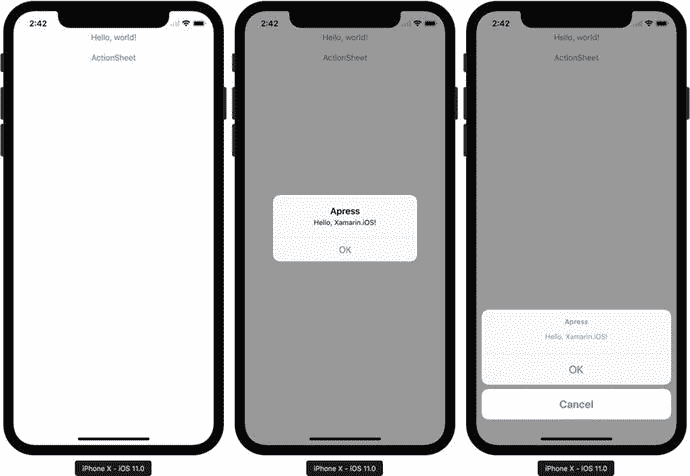

*图 1-1.* 我们将在本章中构建的“Hello, World!”应用。该应用在 iPhone X 模拟器中执行。

## 设置开发环境

要安装 `Visual Studio for Mac`，你需要一台运行 macOS Sierra 10.12 或更高版本的 Mac。在这里，我将使用一台搭载 macOS Sierra 10.16 的 MacBook Pro 或 iMac。确认你满足基本平台要求后，可以从以下网址下载 Visual Studio 安装程序：[`http://bit.ly/vs-mac`](http://bit.ly/vs-mac)。下载安装包后，运行安装程序。会出现一个窗口，如图 1-2 所示。在此窗口中，双击带有向下箭头的图标。随后，你会看到一个对话框，提示你安装程序是从互联网下载的（图 1-3）。点击“打开”按钮继续。

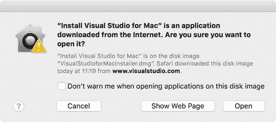

*图 1-3.* 确认对话框

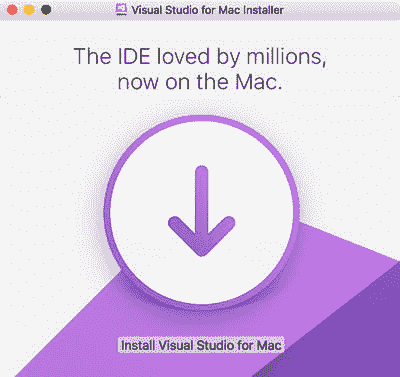

*图 1-2.* Visual Studio for Mac 的安装程序

`Visual Studio 安装程序`现在将验证你的系统配置（图 1-4）。更具体地说，它会查找已安装的组件（如 Mono Framework、Java SDK 等），以验证哪些组件需要下载和安装。完成此操作后，图 1-4 所示窗口的顶部会出现另一个对话框。其标题显示“感谢您下载 Visual Studio。”在此对话框中，你只需按下“继续”按钮。

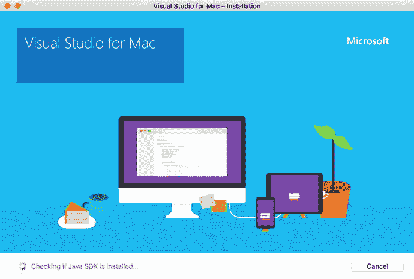

*图 1-4.* Visual Studio 安装程序正在检查操作系统

此时，Visual Studio 安装程序可能会提示你安装 `Xcode`（图 1-5）。仅当你尚未安装 `Xcode` 时才会出现此提示。根据此对话框，你可以在 Visual Studio 安装的同时安装 `Xcode`。请注意，`Xcode` 的安装是可选的，并且取决于你当前的系统配置。我假设你从全新安装的 macOS 开始，因此明确展示如何安装 `Xcode`。

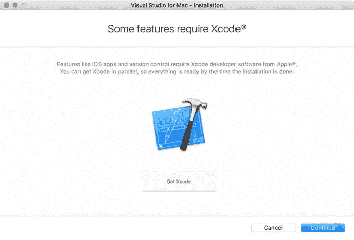

*图 1-5.* 提示安装 Xcode 的对话框

要安装 `Xcode`，你可以按下图 1-5 中所示的“获取 Xcode”按钮。这会引导你到一个网站，在那里点击“在 Mac App Store 中查看”或“安装 App”按钮。它将打开 App Store 中的 Xcode 页面，你只需点击“安装 App”按钮即可（图 1-6）。或者，要安装 `Xcode`，你也可以在本地打开 Mac App Store，然后查找 `Xcode`。无论你选择哪种方法，`Xcode` 及所有相关的开发者工具都将在后台下载并安装。因此，你现在可以回到 Visual Studio 安装程序。

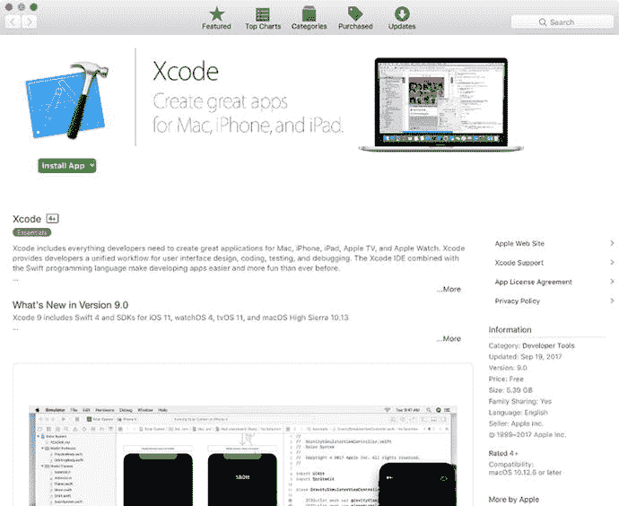

*图 1-6.* Mac App Store 中的 Xcode 页面

Visual Studio 安装程序现在将让你选择要安装的组件（图 1-7）。为了减小安装体积，我取消选中“Android + Xamarin.Forms”条目，仅安装与 iOS 和 macOS 相关的组件。然后，在你点击“安装”按钮后，实际的安装过程开始。

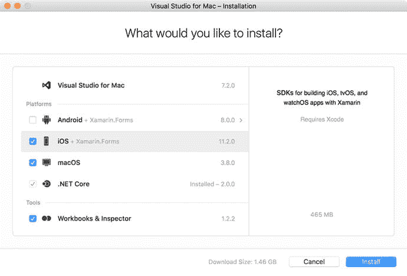

*图 1-7.* 选择要安装的组件

`Visual Studio` 现在将下载并安装组件。这需要一些时间，具体取决于网络速度。你会收到每个安装步骤和总体进度的通知，如图 1-8 所示。此外，如图所示，macOS 在安装过程中可能会多次提示你输入管理员密码。安装完成后，会出现相应的对话框。请注意，要在模拟器中构建和运行应用，你需要等到 `Xcode` 安装完成。

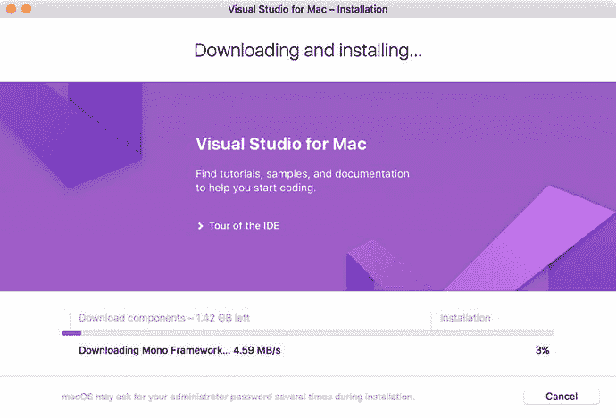

*图 1-8.* 安装 Visual Studio for Mac

## Hello, World! 应用

安装好开发工具后，我们可以开始构建第一个应用。为了快速入门 `Xamarin.iOS` 开发，我将告诉你如何使用“单一视图应用”模板创建项目。然后，我们将为应用添加一个简单的按钮。这个按钮将对点击做出反应，从而显示原生提示。随后，我们将为此提示添加特定的操作。显示提示不仅是入门应用，也是真实应用的典型功能，其中它用于收集用户输入或获取执行不可逆操作的确认。


### 创建项目

要创建项目，请打开 Visual Studio for Mac。此时会显示图 1-9 所示的欢迎屏幕。接着，您可以在菜单栏中选择 `File/New Solution`，或者点击位于“最近使用”标题下方的 `New Project` 按钮。这会激活图 1-10 所示的 `New Project` 窗口。

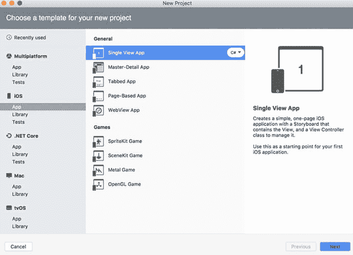

图 1-10. 项目模板选择

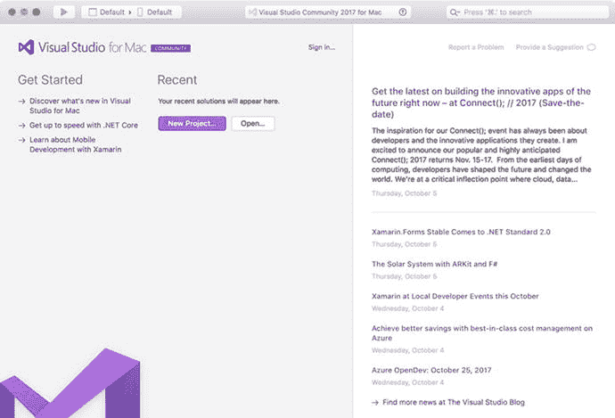

图 1-9. Visual Studio for Mac 的欢迎屏幕

`New Project` 创建器可让您为项目选择模板。要过滤模板列表，仅显示与 iOS 应用直接相关的项目，请点击 `iOS` 选项卡下的 `App` 条目。随后右侧会显示可用的项目模板列表。该列表分为两类：`General` 和 `Games`。在本书中，我们只使用 `General` 组中的项目模板。此类别包含以下模板：

*   `Single View App` — 使用此模板创建包含单个视图的应用；即没有任何导航功能的应用程序，如图 1-1 所示。
*   `Master-Detail App` — 此模板用于创建使用 `Master-Detail` 界面的应用。在这种情况下，列表显示对象的简短描述。当您从此列表（主视图）中选择一个对象时，相应的详细信息将显示在专用区域（详细视图）中。例如，iOS 股票应用（图 1-11）中就使用了 `Master-Detail` 界面。

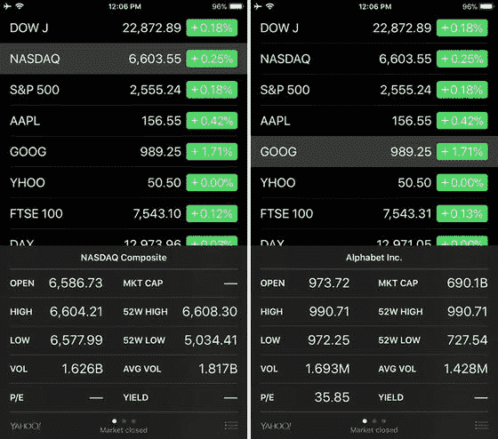

图 1-11. `Master-Detail` iOS 应用的表示视图。对象（公司）列表显示在顶部。当您点击任一对象时，相应的详细信息（股票价值）会显示在底部。

*   `Tabbed App` — 使用此模板创建多选项卡应用程序，您可以在多个选项卡中排列视觉控件。用户通过屏幕底部显示的有标签图标在选项卡之间导航。iOS 时钟应用（图 1-12）中使用了这种导航方式。

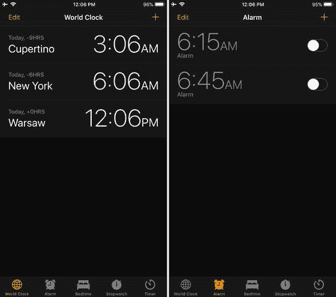

图 1-12. `Tabbed` iOS 应用程序示例。您可以使用视图底部显示的有标签图标在选项卡之间切换。

*   `Page-based App` — 使用此模板创建多视图应用，其中的控件按页面排列。用户通过触摸手势在页面之间滑动。例如，iOS 天气应用（图 1-13）中使用了这种基于页面的导航。

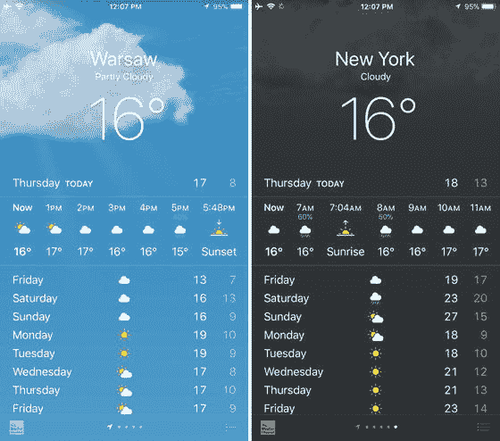

图 1-13. 天气应用利用基于页面的导航来切换天气预报

*   `WebView App` — 使用此模板可快速启动混合应用开发。此项目模板创建一个嵌入了 `WebView` 控件的视图。该控件用于渲染使用 HTML、CSS 和 JavaScript 编写的网站。我将在第 3 章中详细介绍 `WebView`。

为了继续进行，让我们选择 `Single View App` 项目模板，并保留默认的语言选择 `C#`。然后，您将可以指定应用的名称和组织标识符（图 1-14）。我分别将这些值设置为 `HelloWorld` 和 `com.db`。应用配置中的下一组控件可让您指定应用将支持哪些设备。在本例中，我将应用设为通用应用，并选择了 `iPad` 和 `iPhone`。应用配置屏幕中的最后一个控件是 `Target` 下拉列表。您使用此列表选择应用支持的最低 iOS 版本。我将其设置为 `iOS 9.0`。配置完应用后，按下 `Next` 按钮，这会激活图 1-15 所示的视图。

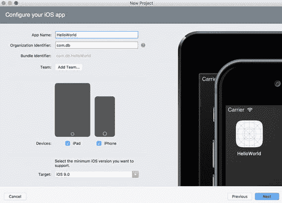

图 1-14. iOS 应用配置

图 1-15 中显示的 `Project Summary` 窗口列出了项目和解决方案名称。您也可以使用此屏幕设置源代码的位置、启用版本控制以及添加自动化的 UI 测试项目。在这里，我保留了默认设置。我将在第 6 章中详细介绍单元测试。那么，继续操作，按下 `Create` 按钮以进一步进行。您将很快看到 Visual Studio 的 `Getting Started` 屏幕（图 1-16）。

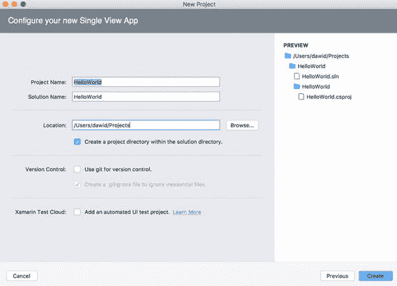

图 1-15. 项目摘要

`Getting Started` 屏幕为您提供了多个选项。具体来说，它允许您开始设计应用的用户界面 (UI)、添加移动后端以及对项目进行单元测试。同时，在此窗口的左侧，您会看到 `Solution Explorer`，其中显示了 `HelloWorld` 应用的结构。具体来说，有一个 `HelloWorld` 解决方案，在其下方您可以找到同名的项目（参见图 1-15）。此项目包含构成应用的文件。这些文件将在下一章中详细讨论。现在，让我们使用 `Storyboard`（或 iOS）设计器为 `HelloWorld` 应用创建一个简单的 UI。

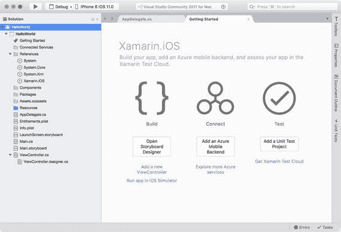

图 1-16. 在 Visual Studio 中打开的 `HelloWorld` 项目

### Storyboard 设计器

要开始创建 UI，您可以点击 `Open Storyboard Designer` 按钮。这将打开 `Main.storyboard` 文件，并激活 Visual Studio 的 `Visual Interface` 或 `Storyboard Designer`（或简称为 `iOS Designer`）。该设计器如图 1-17 所示。此设计器的三个元素应更详细地讨论，如下所示：

*   应用的视觉预览。此元素占据设计器的中央部分，让您无需运行应用即可查看视图在设备上的显示效果。对于多视图应用，视觉预览还将显示用户可导航的视图（选项卡或页面）之间的关系。
*   工具箱，位于右上角，包含一个您可以拖放到视图上的视觉对象列表。
*   `Properties` 窗口，位于工具箱下方。您使用 `Properties` 窗口更改视觉控件的外观并进行配置、定义布局，以及将方法连接到控件触发的事件（如点击或输入）。

请注意，您也可以使用 Visual Studio 中的相应菜单选项来激活上述窗口或面板：`View ➤ Pads`（参见图 1-18）。预览模式中还有一个有用的下拉列表。那就是 `View As` 列表，您可以在视觉预览的顶部窗格中找到它。`View As` 下拉列表允许您选择用于预览的设备类型。如图 1-17 所示，我将此设备设置为 `iPhone 6`。

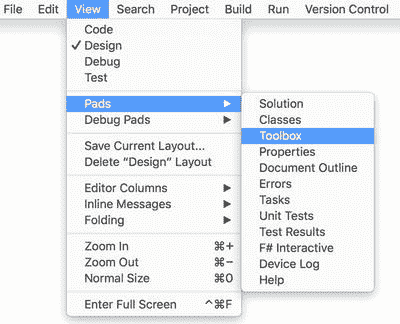

图 1-18. Visual Studio 的视图菜单

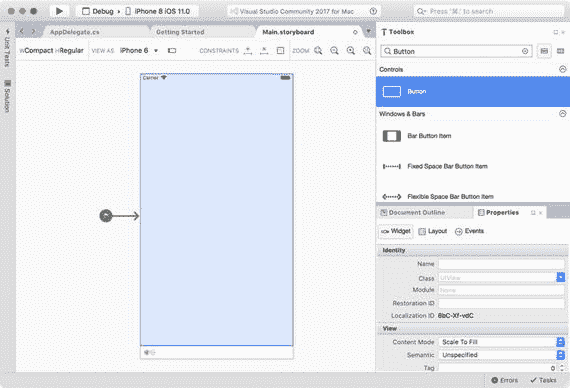

图 1-17. Storyboard 编辑器


### 用户界面

要继续操作，让我们将按钮添加到视图中。你可以通过从工具箱中将按钮控件拖放到视图上来实现。接着，你可以点击已插入的控件，然后使用 `Properties`（属性）窗口修改按钮的可视外观。如图 1-19 所示，`Properties`（属性）窗口的内容被划分为三个选项卡：`Widget`（控件）、`Layout`（布局）和 `Events`（事件）。使用第一个选项卡可以调整标识和可视外观。`Layout`（布局）选项卡允许你指定控件的尺寸以及它与其他控件的排列方式。最后一个选项卡 `Events`（事件）会显示特定控件触发的事件列表，以及这些事件关联的方法（即事件处理程序）。

首先，进入 `Widget`（控件）选项卡，将 `Name`（名称）属性（位于 `Identity`（标识）组）更改为 `ButtonAlert`，并将 `title`（标题）属性（位于 `Button`（按钮）组）更改为 `Hello, World!`。请注意，这些更改会自动在预览窗口中反映出来。具体来说，你会看到按钮标题并不适配控件大小。要调整可视控件的大小，你可以使用 `Properties`（属性）窗口中的 `Layout`（布局）选项卡，也可以在预览窗口中手动调整控件。我选择了第一种方式来调整按钮大小。因此，在 `Layout`（布局）选项卡中，我将按钮宽度设置为 100，其他参数（如 `X`、`Y`、高度和排列）保持不变。更改按钮大小后，内部文本完全可见了。但是，按钮不再位于视图中央。要将其放回中央，可以按下 `Arrange`（排列）部分中 `Position in Parent`（父级中的位置）选项的第一个按钮（见图 1-19 右侧部分）。

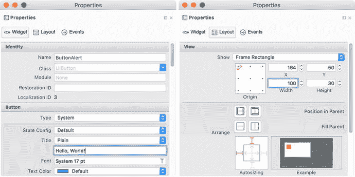

图 1-19.
按钮控件属性的 `Widget`（控件）（左）和 `Layout`（布局）选项卡

调整好按钮后，我们可以创建第一个事件处理程序，它将向用户显示消息。有两种方法可以实现。最简单的方法是在预览模式下双击按钮。这会切换视图以显示 `ViewController.cs` 的内容。此外，还会出现一个标题为“Add event handler”（添加事件处理程序）的小弹出窗口。如图 1-20 所示，你可以使用箭头键指定它在源代码文件中的插入位置，然后 Visual Studio 将插入默认事件处理程序的定义。我将此事件处理程序放在了前一个方法 `DidReceiveMemoryWarning` 的下面。因此，我的 `ViewController.cs` 看起来如代码清单 1-1 所示。

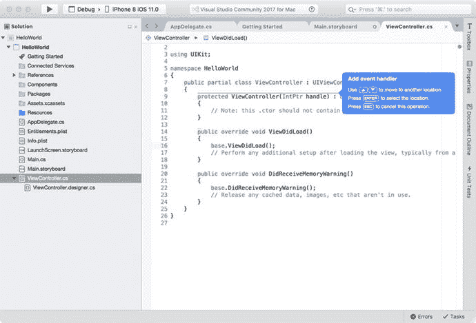

图 1-20.
添加事件处理程序

```
public partial class ViewController : UIViewController
{
// 其他方法如图 1-20 所示。
partial void ButtonAlert_TouchUpInside(UIButton sender)
{
throw new NotImplementedException();
}
}
代码清单 1-1.
一个由 TouchUpInside 事件处理程序补充的默认 ViewController 类
```

如代码清单 1-1 所示，这个新的事件处理程序与 `TouchUpInside` 事件相关联（另见图 1-21）。

添加事件处理程序的另一种方式是通过 `Properties`（属性）窗口的 `Events`（事件）选项卡。你只需输入事件处理程序的名称并按 Enter 键即可。同样重要的是要注意，一旦创建了事件处理程序，它就可以与其他事件相关联。为此，可使用下拉列表，其中会列出所有可用的事件处理程序（图 1-21）。

当你在预览模式下双击一个控件时，Visual Studio 会根据控件类型自动创建事件处理程序。这个事件处理程序被称为“默认事件处理程序”，因为它与特定控件的常见用途相关。对于按钮而言，默认事件处理程序是 `Up Inside`（触按内部）。我将在第 3 章中向你展示更多事件处理程序的示例。

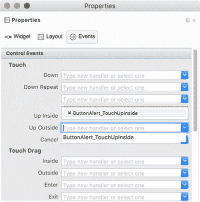

图 1-21.
按钮属性的 `Events`（事件）选项卡。请注意，`ButtonAlert_TouchUpInside` 事件处理程序也可以与 `Up Outside`（外部抬起）事件相关联。


### AlertViewController

现在，我们准备替换上一小节中创建的 `ButtonAlert_TouchUpInside` 事件处理器的默认定义。我们将实现的逻辑会显示一个原生警报窗口，用于呈现 "Hello, Xamarin.iOS!" 消息。要显示这样的警报，首先需要创建并配置一个 `UIAlertViewController` 类的实例，然后通过 `PresentViewController` 方法将其展示给用户。完整的示例见代码清单 1-2。

```
private const string title = "Apress";
private const string message = "Hello, Xamarin.iOS!";
partial void ButtonAlert_TouchUpInside(UIButton sender)
{
var alertController = UIAlertController.Create(
title, message, UIAlertControllerStyle.Alert);
PresentViewController(alertController, false, null);
}
```

*代码清单 1-2. 创建并显示警报窗口*

要创建 `UIAlertController` 类的实例，我使用了它的静态 `Create` 方法。该方法接受三个参数：`title`、`message` 和 `UIAlertControllerStyle`。前两个参数的作用相当明显，它们分别指定警报的标题和消息。最后一个参数 `UIAlertControllerStyle` 是一个枚举，用于定义警报的样式。你可以在 `Alert` 和 `ActionSheet` 之间选择。此处，我将警报样式设置为 `UIAlertControllerStyle.Alert`。在下一小节中，我将创建操作表，因此，我将 `title` 和 `message` 保存在了 `ViewController` 类的对应字段中。

为了显示警报，我使用了 `PresentViewController` 方法，该方法在 `UIViewController` 类中实现，而 `UIViewController` 是 `ViewController` 类的基类，`ViewController` 类与 HelloWorld 应用的默认视图相关联。如代码清单 1-2 所示，`PresentViewController` 方法接受以下三个参数：

- `viewControllerToPresent` 是派生自 `UIViewController` 类的对象，代表要呈现的视图控制器。
- `animated` 指示是否以动画方式呈现视图控制器。
- `completionHandler` 是在动画完成后执行的操作。

你现在可以在设备模拟器中测试上述解决方案。要运行该应用，请点击调试工具栏（图 1-22）中的“播放”按钮。该工具栏位于 Visual Studio 的顶部窗格内。你不仅可以使用目标工具栏来运行应用，还可以设置配置（调试或发布）并选择目标设备。此处，我将目标设备设置为 iOS 11.0 的 iPhone 8，但你可以选择任何其他模拟器。例如，为了创建图 1-1 中的截图，我使用了 iPhone X 模拟器。


*图 1-22. 目标工具栏*

当你按下“播放”按钮时，它会变为“停止”按钮，并且设备模拟器将启动。随后，HelloWorld 应用将被执行（图 1-23），因此你可以点击 "Hello, World!" 按钮。结果，警报将会显示（图 1-23 的右侧部分）。

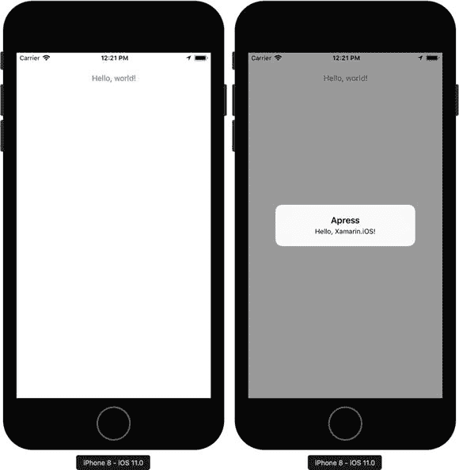

*图 1-23. 在 iPhone 模拟器中运行的 HelloWorld 应用*

你会很快发现，警报窗口会阻塞应用；此时尚无按钮或控件来关闭警报。因此，要中断应用执行，你需要点击调试工具栏中的“停止”按钮，或者在 PC 上双击 SHIFT + COMMAND + H 键盘快捷键，或者在模拟器上双击 Home 按钮。模拟器屏幕会呈现如图 1-24 所示的形态。然后，你可以向上滑动 HelloWorld 应用来结束其进程。

此时，还需要注意，你可以使用设备模拟器来模拟各种用户操作。例如，你可以模拟摇动手势、Touch ID、Apple Pay，或者简单地旋转或重启设备。你可以通过模拟器的“硬件”菜单访问这些选项。

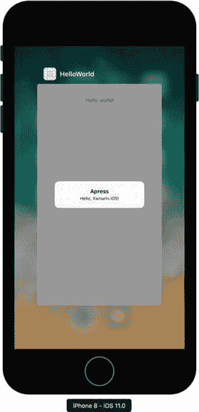

*图 1-24. iPhone 模拟器中的多任务管理*

### 操作

现在，让我们为警报视图添加一个操作。此操作将使用户能够关闭警报窗口，而无需结束整个应用进程。实际上，一个操作会作为警报窗口内的一个按钮出现。当你按下此按钮时，警报窗口将关闭，并且可以执行额外的自定义代码。代码清单 1-3 展示了此类操作的典型用法，其中显示了警报创建的扩展实现。与前文类似，我在事件处理器外部创建了该操作，以便稍后复用。如果你现在重新在模拟器中运行应用，警报将补充上一个“确定”按钮（图 1-25）。

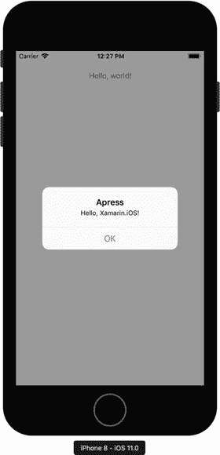

*图 1-25. 带有默认操作的警报*

```
private const string title = "Apress";
private const string message = "Hello, Xamarin.iOS!";
private UIAlertAction okAction =
UIAlertAction.Create("OK", UIAlertActionStyle.Default, null);
partial void ButtonAlert_TouchUpInside(UIButton sender)
{
var alertController = UIAlertController.Create(
title, message, UIAlertControllerStyle.Alert);
alertController.AddAction(okAction);
PresentViewController(alertController, false, null);
}
```

*代码清单 1-3. 向警报添加默认操作*

如代码清单 1-3 所示，要创建操作，你需要使用 `UIAlertAction` 类。具体来说，该类实现了静态的 `Create` 方法，该方法接受三个参数，如下所示：

- `title` — 使用此参数指定操作的标题；即警报中显示的操作标题文字。
- `style` — 定义操作的样式或类型。所有可用的操作类型都以 `UIAlertStyle` 枚举的值表示。该枚举定义了典型的操作，这些操作根据用户输入执行：
    - `Cancel` — 此类型表示应取消给定操作，并且关联的应用状态或数据应保持不变。
    - `Default` — 这是针对应用状态特定变更的默认操作。
    - `Destructive` — 此类型通常用于确认删除特定的应用数据。
- `handler` 允许你定义一组语句，当用户点击操作按钮时将调用这些语句。

在代码清单 1-3 中，我创建了一个标题为“OK”的 `Default` 操作，该操作不调用任何其他逻辑（`handler` 参数为 `null`）。当然，你可以添加更多操作。在下一小节创建操作表时，我们将使用这种可能性。


### 操作表

`Action sheet` 是 iOS 警告框的另一种样式。根据苹果公司的设计指南，操作表应依据当前上下文向用户呈现少数几个选项。具体来说，你应该使用此类对象来获取用户对删除应用数据特定元素的确认。创建操作表的方式与警告框类似，即使用 `UIAlertController` 类。为了明确说明这一点，现在让我们在 HelloWorld 应用中添加另一个按钮，点击该按钮时将显示一个操作表。为此，请在解决方案资源管理器中双击 `Main.storyboard` 进入 Storyboard 编辑器。然后，添加第二个按钮，并将其放置在 `ButtonAlert` 下方。将新按钮的名称和标题分别更改为 `ButtonActionSheet` 和 `ActionSheet`。调整其宽度和位置，然后创建默认事件处理程序（将其放置在 `ButtonAlert_TouchUpInside` 下方）。按照代码清单 1-4 所示修改此处理程序的定义。最后，你可以重新运行应用，将会得到之前在图 1-1 中展示的结果。

```
private UIAlertAction cancelAction =
UIAlertAction.Create("Cancel", UIAlertActionStyle.Cancel, null);
partial void ButtonActionSheet_TouchUpInside(UIButton sender)
{
var actionSheetController = new UIAlertController()
{
Title = title,
Message = message
};
actionSheetController.AddAction(okAction);
actionSheetController.AddAction(cancelAction);
PresentViewController(actionSheetController, true, null);
}
代码清单 1-4.
使用类构造函数创建 UIAlertViewController
```

代码清单 1-4 展示了创建 `UIAlertController` 类实例的另一种方法。我使用了该类的无参数构造函数，然后修改了结果对象的 `Title` 和 `Message` 属性。请注意，这里没有配置警告样式的属性，在此情况下，样式默认被设置为 `UIAlertControllerStyle.ActionSheet`。当然，你仍然可以使用 `UIAlertController` 的 `Create` 方法来创建操作表，但你需要将最后一个参数替换为 `UIAlertControllerStyle.ActionSheet`（请回看代码清单 1-2）。

在前述示例中，我通过两个操作来补充操作表：一个以默认样式创建（`okAction`），另一个以取消样式创建（`cancelAction`）。在图 1-1 中，你可以注意到与这些操作相关联的按钮在外观上的差异。取消按钮与确定按钮相比有所区别。

最后，为了呈现操作表，我使用了与之前相同的方法 `PresentViewController`，但将其第二个参数改为 `true`，这样警告框的呈现将带有动画效果。重新运行应用后，你将得到之前图 1-1 中所示的结果。

## 总结

在本章中，我们准备了一个开发环境，该环境将在后续章节中使用。然后，我们讨论了用于创建 iOS 应用的可用项目模板，并实现了我们的第一个单视图 HelloWorld 应用，该应用展示了各种警告框。在下一章中，我们将利用此处开发的源代码来分析应用结构，并讨论每个 Xamarin.iOS 应用最重要的元素。

