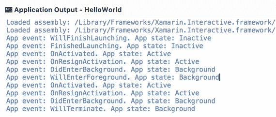
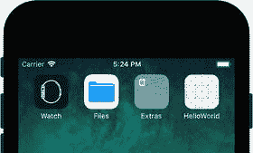

# 2. 应用结构与生命周期

在本章中，你将了解应用最重要的元素及其之间的关系。我们将首先探讨应用入口点以及 Xamarin.iOS 如何与原生 iOS SDK 交互。随后，我们将了解应用和视图生命周期、应用能力的声明以及访问故事板的属性。此外，我们还将分析在苹果平台编程中使用的模型-视图-控制器设计模式。最后，我们将把视图生命周期与 MVC 模式结合起来，以在设备内存中存储数据。

## 入口点

HelloWorld 应用与任何其他 C# 应用一样，从 `Application` 类的静态 `Main` 方法开始执行。无论你是在创建控制台应用、通用 Windows 平台应用、ASP.NET Web 应用程序，还是 .NET Core 或 Xamarin.iOS 应用，这一点都适用。所有这些应用都使用 `Application.Main` 方法作为入口点。然而，此方法的具体实现在这些应用类型之间有所不同。对于 Xamarin.iOS，`Main` 方法的实现是针对 iOS 平台量身定制的。更具体地说，如代码清单 2-1 所示，`Application.Main` 方法调用了 `UIApplication` 类中同名的方法。`UIApplication` 类封装了 Xamarin.iOS 应用的主要处理循环。与所有其他具有图形用户界面的应用一样，此处理循环处理与应用生命周期相关的事件（激活、前后台切换）、由用户触发的事件（如触摸、输入数据、切换视图）或由操作系统触发的事件（系统重启、内存警告）。

重要的是，每个 iOS 应用只创建一个 `UIApplication` 类或其子类的实例。在内部，`UIApplication` 类使用另一个实现了 `UIApplicationDelegate` 接口的类。后者专门用于处理应用生命周期。因此，来自代码清单 2-1 的 `Main` 方法除了接受命令行参数（`args`，即字符串数组）外，还接受另外两个参数：`principalClassName` 和 `delegateClassName`。第一个参数指定了从 `UIApplication` 派生的类的名称。如果你想使用默认的 `UIApplication` 类，则为 `principalClassName` 传递 `null`。第二个参数 `delegateClassName` 允许你指定实现了 `UIApplicationDelegate` 的类的名称。默认情况下，`delegateClassName` 被设置为 `AppDelegate`。你将在本章后面了解这个类，因为它是 HelloWorld 以及任何其他 Xamarin.iOS 项目的一部分。

```
namespace HelloWorld
{
public class Application
{
static void Main(string[] args)
{
UIApplication.Main(args, null, "AppDelegate");
}
}
}
代码清单 2-1.
Xamarin.iOS 应用的入口点
```

为了解释处理循环封装的含义，让我们分析一下 Xamarin.iOS 的源代码，该代码可在此处获得：[`http://bit.ly/xamarin_ios_code`](http://bit.ly/xamarin_ios_code)。这一分析也有助于我们更好地理解 Xamarin.iOS 究竟是什么。具体来说，`UIApplicationClass` 的定义（[`http://bit.ly/UiApplication`](http://bit.ly/UiApplication)）显示，其 `Main` 方法（代码清单 2-2）在获取 principal 和 delegate 类名称的句柄后，调用了 `Main` 方法的另一个版本。后者，如代码清单 2-3 所示，首先调用 `Initialize` 方法。此方法配置了线程同步上下文，用于通过 UI 线程更新控件。然后，`Main` 方法调用了 `UIApplicationMain` 函数，该函数在一个外部的 Objective-C 库中声明。这个库来自 iOS SDK。现在你可以看到，Xamarin.iOS 最简单的定义就是一组 C# 绑定，这些绑定通过 Objective-C 库暴露了原生 iOS SDK。因此，Xamarin.iOS 允许你开发原生应用，并拥有对该平台 SDK 的完全访问权限。正因如此，Xamarin 应用被称为原生移动应用。


```csharp
public static void Main(string[] args, string principalClassName,
string delegateClassName)
{
    IntPtr principal = principalClassName != null ?
        new NSString(principalClassName).Handle : IntPtr.Zero;
    IntPtr delegatec = delegateClassName != null ?
        new NSString(delegateClassName).Handle : IntPtr.Zero;
    Main(args, principal, delegatec);
}
```
**代码清单 2-2.** HelloWorld 应用入口点中调用的 `UIApplication.Main` 方法的定义

```csharp
static void Main(string[] args, IntPtr principal, IntPtr @delegate)
{
    Initialize();
    UIApplicationMain(args.Length, args, principal, @delegate);
}
[DllImport("__Internal")]
extern static int UIApplicationMain(int argc, string[] argv,
    IntPtr principalClassName, IntPtr delegateClassName);
```
**代码清单 2-3.** 对 iOS SDK 中 Objective-C 库实现的 `UIApplicationMain` 方法的实际调用

要从 Objective-C 库中调用函数，需要使用平台调用服务（P/Invoke）。在此机制中，首先使用 `extern` 和 `static` 关键字声明 C# 方法，并用 `DllImportAttribute` 装饰此声明。该属性用于指定要加载的库的物理位置。如果库导出的函数名称与 C# 代码中声明的方法名称不同，可以通过`DllImportAttribute` 选择性地指定该函数名称。完成声明后，通过调用 C# 方法来调用外部函数，方式与代码清单 2-3 完全相同。然而，如代码清单 2-3 所示，C# 方法的 `DllImportAttribute` 并未包含外部库的路径，而是使用了 `__Internal` 字符串。这会指示 P/Invoke 从编译到应用中的静态库加载函数。

不过，我的 C# 代码究竟是如何转化为实际的 iPhone 或 iPad 应用的呢？当我们在 Visual Studio 中通过名为 `mtouch` 的工具编译项目时，这一过程会自动完成。`Mtouch` 是一个命令行程序，它将你的 C# .NET 代码转换为应用包，然后由 iOS 执行。以 HelloWorld 应用为例，我们为模拟器编译后，可以在 HelloWorld 项目的以下子文件夹中找到该应用包：`bin\iPhoneSimulator\Debug\device-builds\iphone9.1-10.3\HelloWorld.app`。打开此文件夹，你会看到许多文件。现在，我们只指出其中相关的几个。首先，应用包包含 `Xamarin.iOS.dll`，它提供了对 iOS SDK 的绑定。其次，还有一个 `mscorlib.dll` 文件，它实现了微软公共对象运行时库（Microsoft Common Object Runtime Library），这是所有微软 .NET 应用的运行时环境。最后，还有其他几个 .NET 库，如 `System.dll`、`System.Core.dll` 和 `System.Xml.dll`。在 HelloWorld 应用项目中引用它们是为了使用 .NET 框架中的基本类型和功能。

现在，我们对 Xamarin.iOS 最重要的幕后方面有了扎实的理解，可以继续学习 `AppDelegate` 类了。

## AppDelegate

为了讨论 `AppDelegate` 类，让我们从 HelloWorld 项目中打开 `AppDelegate.cs` 文件。首先，检查类声明时，你会看到 `AppDelegate` 实现了 `UIApplicationDelegate` 接口。其次，`AppDelegate` 声明使用了 `RegisterAttribute` 进行装饰。该属性在 Xamarin.iOS 中实现，用于向 Objective-C 运行时注册一个类。之所以需要此注册，是因为 `AppDelegate` 类的实例会被传递给 Objective-C 函数 `UIApplicationMain`。第三，`AppDelegate` 实现了一个类型为 `UIWindow` 的属性 `Window`。`UIWindow` 代表 iOS 应用中视图的容器。因此，你可以使用此属性来控制该容器。最后，`AppDelegate` 重写了 `UIApplicationDelegate` 中的许多方法。你可以使用这些方法在应用生命周期中处理特定的应用事件。为了清晰展示这些生命周期的进展，让我们根据代码清单 2-4 修改 `AppDelegate`。

```csharp
using System.Diagnostics;
using Foundation;
using UIKit;

namespace HelloWorld
{
    [Register("AppDelegate")]
    public class AppDelegate : UIApplicationDelegate
    {
        public override UIWindow Window { get; set; }

        public override bool WillFinishLaunching(
            UIApplication application, NSDictionary launchOptions)
        {
            DisplayInfo("WillFinishLaunching", application);
            return true;
        }

        public override bool FinishedLaunching(
            UIApplication application, NSDictionary launchOptions)
        {
            DisplayInfo("FinishedLaunching", application);
            return true;
        }

        public override void OnResignActivation(
            UIApplication application)
        {
            DisplayInfo("OnResignActivation", application);
        }

        public override void DidEnterBackground(
            UIApplication application)
        {
            DisplayInfo("DidEnterBackground", application);
        }

        public override void WillEnterForeground(
            UIApplication application)
        {
            DisplayInfo("WillEnterForeground", application);
        }

        public override void OnActivated(UIApplication application)
        {
            DisplayInfo("OnActivated", application);
        }

        public override void WillTerminate(UIApplication application)
        {
            DisplayInfo("WillTerminate", application);
        }

        private void DisplayInfo(string eventName,
            UIApplication application)
        {
            Debug.WriteLine($"App event: {eventName}."
                + $"App state: {application.ApplicationState}");
        }
    }
}
```
**代码清单 2-4.** `AppDelegate` 类的修改定义

在代码清单 2-4 中，有一个新的公共方法 `WillFinishLaunching` 和一个私有方法 `DisplayInfo`。`WillFinishLaunching` 处理对应的应用事件，而 `DisplayInfo` 的实现用于呈现关于应用事件的信息。因此，该方法在每个应用事件处理程序中被调用，这些处理程序是基类（`UIApplicationDelegate`）中相应事件处理程序的重写版本。注意，我始终将应用事件的名称传递给 `DisplayInfo` 的第一个参数。然后，该方法会在应用输出中打印事件名称以及应用状态。为此，我使用了 `System.Diagnostics.Debug` 类的 `WriteLine` 方法。为了获取应用的状态，我读取了 `UIApplication` 类的对应属性。该类的实例被传递给 `DisplayInfo` 方法的第二个参数。

应用状态由 `UIApplicationState` 枚举的以下值表示：


*   `Active`（活跃）– 应用在前台运行并能响应用户操作。这意味着应用的用户界面（UI）对用户可见，且用户可与应用交互。
*   `Inactive`（非活跃）– 应用在前台运行但无法响应用户操作。在这种情况下，UI 可能仍然可见，但应用不做出响应。例如，当你在手机或模拟器中激活多任务选择时（请参考图 1-24）就可能出现此状态。
*   `Background`（后台）– 应用在后台运行，因此其 UI 不可见。不过，应用可以执行某种后台操作，比如从外部网络服务获取数据。

现在我们来看一下在应用生命周期中，应用程序事件处理程序是在哪个节点被调用的。为此，让我们在模拟器中启动应用，并打开 `Application Output`。默认情况下，此输出窗口是脱离停靠并最小化的，因此要激活此窗口，你需要点击位于 Visual Studio 屏幕右下角的 `Application Output ➤ HelloWorld` 栏（图 2-1）。



图 2-1.

HelloWorld 应用输出，显示应用生命周期

运行应用后，你会看到报告了三个应用事件：`WillFinishLaunching`、`FinishedLaunching` 和 `OnActivated`（图 2-1）。首先，当 `UIApplication` 被创建时，会调用 `WillFinishLaunching` 事件处理程序。随后，应用启动后，会调用另一个方法 `FinishedLaunching`。通常，此方法用于创建应用窗口，并通过设置 `Window` 类的 `RootViewController` 属性来显示视图。不过，HelloWorld 应用是通过模板创建的。在这种情况下，默认视图是在主故事板（main storyboard）中配置的。稍后我会解释，这是通过设置 `document` XML 标签的 `initialViewController` 属性来完成的。请注意，应用在被激活之前是处于非活跃状态的。应用激活由专用事件 `OnActivated` 报告。一旦应用活跃，其 UI 变为可见，你就可以开始点击我们之前创建的按钮了。应用将响应你的请求。

通过比较 `WillFinishLaunching` 和 `FinishedLaunching` 与所有其他与应用生命周期相关的事件处理程序的定义，我们可以看到它们包含一个额外的参数 `launchOptions`。此参数的类型是 `NSDictionary`，包含一组键值对条目。这些条目允许你确定应用是如何启动的，以及传入了哪些启动参数。你可以在此处找到所有可用键的列表以及如何使用它们的示例：[`http://bit.ly/launch_options`](http://bit.ly/launch_options)。

现在来看一下当我们把应用发送到后台时会发生什么。你可以在模拟器中按下以下键盘快捷键来实现：`COMMAND + SHIFT + H`。应用将会消失，你会看到另外两个事件处理程序被调用：`OnResignActivation` 和 `DidEnterBackground`。你可以使用第一个事件来保存应用状态或释放应用在非活跃时不需要的任何资源。在 `OnResignActivation` 之后，会触发 `DidEnterBackground` 应用事件。它会通知你应用状态已变为后台（请参考图 2-1）。

现在，你可以通过点击模拟器中的 HelloWorld 应用图标将其发送到前台（见图 2-2）。此时会触发另外两个应用事件：`WillEnterForeground` 和 `OnActivated`。它们与将应用置于后台时触发的两个应用事件相对应，因此其用途是相反的。即，`WillEnterForeground` 通知你应用即将进入前台，因此你可以使用相应的事件处理程序来恢复应用状态，并准备应用在前台所需的所有资源。随后，应用被激活，并通过 `OnActivated` 事件通知你。



图 2-2.

带有 HelloWorld 应用图标的模拟器主屏幕

最后，我们来看看当你通过多任务关闭应用时会发生什么（你可以像上一章那样，通过双击主屏幕按钮来激活多任务）。在这种情况下，会报告三个事件：`OnResignActivation`、`DidEnterBackground` 和 `WillTerminate`。当你激活多任务时，前两个事件会被触发。所以，到目前为止，一切工作方式与你仅仅将应用置于后台时相同。一旦应用即将终止，会触发一个额外的事件 `WillTerminate`。你可以使用此事件来清理应用在后台工作时使用的任何资源。


