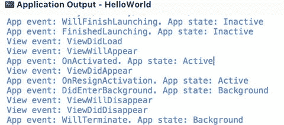
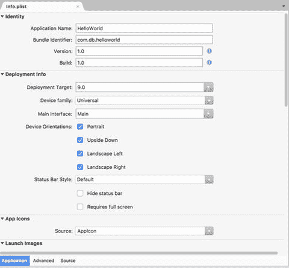
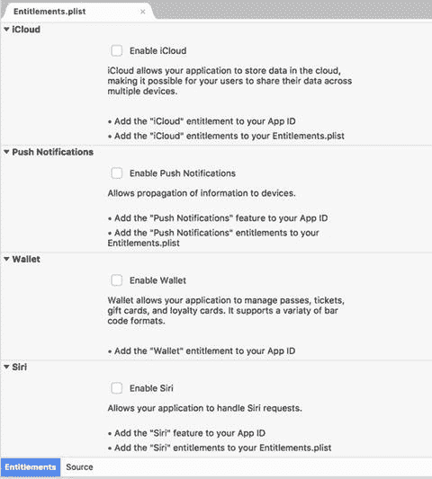

# 视图生命周期

在上一节中，我们学习了应用程序的生命周期。对于单个视图，也存在类似的机制。视图事件由 `UIViewController` 类中实现的相应事件处理程序表示。你在与特定视图（其视图控制器）关联的派生类中重写这些处理程序。视图生命周期的事件处理程序用于准备视图。例如，你首先从设备内存中恢复数据，然后使用这些数据更新控件。这样，在视图呈现给用户之前，控件就已准备好显示数据。

为了演示特定视图事件何时被触发，我修改了 `ViewController` 类的源代码，添加了代码清单 2-5 中的方法。同样，这里有一个私有辅助方法 `DisplayInfo`，用于显示实际视图事件的名称。然后，我在以下五个视图事件处理程序中使用该方法：`ViewDidLoad`、`ViewWillAppear`、`ViewDidAppear`、`ViewWillDisappear` 和 `ViewDidDisappear`。因此，我可以跟踪视图的生命周期。

```
public override void ViewDidLoad()
{
    base.ViewDidLoad();
    DisplayInfo("ViewDidLoad");
}
public override void ViewWillAppear(bool animated)
{
    base.ViewWillAppear(animated);
    DisplayInfo("ViewWillAppear");
}
public override void ViewDidAppear(bool animated)
{
    base.ViewDidAppear(animated);
    DisplayInfo("ViewDidAppear");
}
public override void ViewWillDisappear(bool animated)
{
    base.ViewWillDisappear(animated);
    DisplayInfo("ViewWillDisappear");
}
public override void ViewDidDisappear(bool animated)
{
    base.ViewDidDisappear(animated);
    DisplayInfo("ViewDidDisappear");
}
private void DisplayInfo(string eventName)
{
    Debug.WriteLine($"View event: {eventName}");
}
代码清单 2-5. 处理视图生命周期
```

请注意，为了使用 `Debug` 类，你需要导入 `System.Diagnostics` 命名空间，在文件头部添加以下语句：

```
using System.Diagnostics;
```

在模拟器中重新运行应用程序后，我们将在应用程序输出窗口中看到一系列应用程序和视图事件（图 2-3）。正如我们所预期的，第一个视图事件处理程序 `ViewDidLoad` 在应用程序加载后立即被调用。然后，当视图加载完成后，会触发另外两个事件：`ViewWillAppear` 和 `ViewDidAppear`。你可以使用它们来实现视图在显示给用户之前的准备逻辑。

为了触发其他视图事件，即 `ViewWillDisappear` 和 `ViewDidDisappear`，我使用 iOS 的多任务功能终止了应用程序。因此，`ViewWillDisappear` 和 `ViewDidDisappear` 事件在应用程序进入后台后立即被调用（参见图 2-3 中应用程序输出的底部几行）。



图 2-3. 应用程序输出，显示应用程序和视图生命周期连续步骤中触发的事件

正如我将在本章后面展示的，`ViewWillDisappear` 和 `ViewDidDisappear` 被用于在视图消失时或消失后保存数据。

## 信息属性列表

到目前为止，我们只讨论了包含 C# 代码的文件。然而，HelloWorld 项目还有其他几个 iOS 应用程序所需的文件。其中一个文件就是信息属性列表（`Info.plist`）。该文件定义了应用程序的配置。当你在解决方案资源管理器中双击此文件时，将会看到如图 2-4 所示的编辑器。此编辑器包含以下选项卡，你可以使用它们来配置不同的选项：



图 2-4. Visual Studio 中的信息属性列表编辑器

*   **应用程序** – 使用此选项卡指定以下内容：
    *   **应用标识**：应用程序名称、绑定标识符和版本
    *   **部署信息**：目标 iOS 版本、设备系列（iPhone、iPad 或通用）、定义应用程序用户界面的故事板名称（主界面）、可用的应用程序方向以及配置状态栏外观
    *   **应用图标和启动图片**：用于指定图标集合的名称以及将在应用程序启动时显示的故事板名称——即所谓的启动或闪屏
    *   **iTunes 插图**
    *   **启用 Game Center 和地图集成**以及配置**后台模式**。
*   **高级** – 在此选项卡中，你可以配置应用程序将支持的文件的**文档类型**和**通用类型标识符 (UTI)**。文档类型（如 PDF）用于定义应用程序将支持的文件。另一方面，UTI 指的是自定义文件类型。你还可以使用“高级”选项卡为应用程序定义 URL 方案。
*   **源** – 此选项卡用于为应用程序定义自定义属性。此功能在访问 iOS 的特定功能（如设备的定位服务）时是必需的。

## 授权属性列表

授权属性列表，定义在 `Entitlements.plist` 文件中，指定了应用程序的功能。当你打开此文件时，Visual Studio for Mac 会激活如图 2-5 所示的编辑器。此编辑器有两个选项卡：应用程序和源。第一个选项卡是你可以启用的各种应用程序功能（如 iCloud 集成或推送通知）的图形化表示，而源选项卡则允许你定义自定义功能。



图 2-5. Visual Studio 中的授权属性列表编辑器


