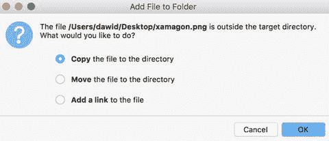
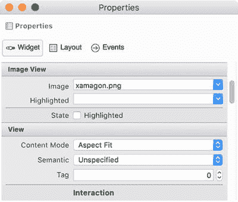
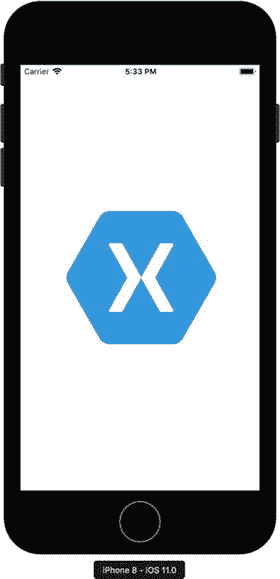

# 启动故事板

我们刚了解到信息属性列表（Information Property List）允许我们指定故事板，用以定义启动屏幕。在 `HelloWorld` 应用中，该故事板保存为 `LaunchScreen.storyboard`。如果在解决方案资源管理器中双击此文件，可视编辑器将会打开。此编辑器与 `Main.storyboard` 的情况完全相同，因此你可以用类似的方式定义启动屏幕。利用这个机会，我们来添加一个图像视图（Image View），它将在应用加载时显示一张图片。要添加图像视图，首先在工具箱中找到此对象，然后将其拖拽到代表设备的矩形上。随后，你可以调整其大小，使其填满整个视图，然后定义要显示的图像。要选择此图像，可使用图像视图的 Image 属性（图 2-6）。默认情况下，此项为空，点击时会弹出文件浏览器。使用此浏览器选取你想要的任何图像。如果该文件位于目标目录之外，则会显示“添加新文件”对话框，如图 2-7 所示。iOS 要求所有资源——应用在运行时加载的静态文件（如图像）——都应存储在 `Resources` 文件夹下。因此，在“添加新文件”对话框中，你需要选择“复制”选项。所选图像文件随后会被复制到 `HelloWorld` 应用的 `Resources` 子文件夹中。接着，该文件的名称将出现在 Image 属性的下拉列表中（图 2-6）。

图 2-7. 添加资源文件

图 2-6. 图像视图的选定属性

图像视图有一个非常重要的属性，即内容模式（Content Mode，请回看图 2-6）。它控制图像如何缩放以适配图像视图的边界。内容模式可以取 `UIKit.UIViewContentMode` 中定义的以下值之一：

* `ScaleToFill` – 图像的宽高比（图像宽度与高度的比值）将被调整以填满图像视图的整个区域。
* `ScaleAspectFit` – 图像将被缩放以适配图像视图，但图像的宽高比得以保留。
* `ScaleAspectFill` – 图像将被缩放，并最终裁剪以适配图像视图。
* `Redraw` – 当图像视图大小改变时，将重新显示内容。
* `Center`、`Top`、`Bottom`、`Left`、`Right`、`TopLeft`、`TopRight`、`BottomLeft`、`BottomRight` – 这些选项定义图像在图像视图中的对齐方式。

在此示例中，我将内容模式设置为 `ScaleAspectFit`。这在图 2-7 中显示为“Aspect Fit”选项。在这种情况下，我的图像的宽高比不会改变，因此当应用启动时，图像会显示在屏幕中央（图 2-8）。

图 2-8. `HelloWorld` 应用的启动屏幕

