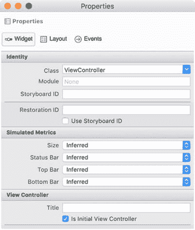
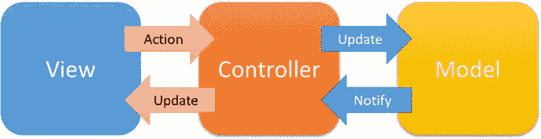
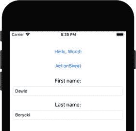
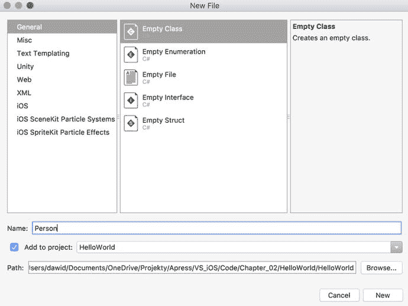

# 故事板的工作原理

故事板代表了 iOS 应用的整个用户界面。在 iOS 中，此用户界面由称为场景（scene）的对象组成。场景是视图控制器及其关联视图的组合。视图控制器负责显示并管理其视图。通常，一个故事板可以有多个场景（多个视图控制器及其关联视图）。这些场景之间的转换被定义为转场（segue）。

我们已经使用故事板定义了简单的视图，并且使用了视图控制器来处理事件（如点击按钮）和视图生命周期管理。在 iOS 应用中，视图控制器扮演着最重要的角色之一，因此我用了这两段文字来将其与视图、场景和转场区分开。

你可能会好奇，如何在 Visual Studio 中通过可视化的方式定义故事板？之所以能做到，是因为故事板是以 XML 格式编写的。这种方法使得故事板具有可移植性和平台独立性。因此，我们可以使用多种工具手动或可视化地编辑故事板。

```
代码清单 2-6. Main.storyboard 的文档标签
```

要查看故事板的实际 XML 定义，请在解决方案资源管理器中右键点击故事板文件（`Main.storyboard`），然后从上下文菜单中选择“打开方式 / 源代码编辑器”。故事板的源代码会显示出来。通过检查此文件的内容，我们可以很容易地注意到它具备典型的 XML 文件层次结构。有一个根节点 `xml`，紧随其后的是 `document` 标签，其声明如代码清单 2-6 所示。我们可以看到此标签有许多属性，这些属性特别指定了文档类型、版本、目标运行时以及初始视图控制器的标识符。在 `HelloWorld` 应用中，我们只有一个视图控制器，所以实际上我们无需考虑这一点。但是，如果一个应用有多个视图控制器，你可以在可视编辑器中选择初始的那个。你进入编辑器，然后打开视图控制器的“属性”窗口。接着，如图 2-9 所示，勾选“是初始视图控制器”复选框。`initialViewController` 属性的值会自动更新。这就是为什么 `HelloWorld` 应用会将 `ViewController` 作为第一个加载的控制器。因此，在应用启动后，其默认视图会呈现出来。



图 2-9. 视图控制器的属性。请注意，“是初始视图控制器”已被勾选，因此与这个视图控制器关联的选定视图将首先出现。


在`document`标签之后，我们可以看到另一个标签`scenes`。它包含一组场景对象，每个场景对象由`scene`标签表示，其`sceneID`属性标识特定场景。然后，在场景对象下，我们可以很容易地识别`viewController`标签。它包含一个子项和`views`，其中包含与视图控制器相关联的视图声明。在 HelloWorld 应用中，视图控制器只有一个视图，该视图包含我们创建的两个按钮的声明。如代码清单 2-7 所示，这些声明位于`subviews`集合中。请注意，按钮使用同名的 XML 标签声明。该标签有多个属性来指定按钮参数。按钮的大小和位置由子标签`rect`控制。按钮标题的颜色由`state`标签控制。还有一个重要的标签`connections`。它包含与特定按钮或其他控件相关联的动作（或事件）。对于每个按钮，我们只有一个动作，该动作响应`TouchUpInside`事件。请注意，此动作通过定义在`viewController`结束标签上方的`connections`集合，进一步与特定按钮或控件关联（代码清单 2-8）。重要的是，该集合中的每个元素都由一个`outlet`表示。在 iOS 术语中，这个`outlet`将控件触发的事件与其事件处理程序连接起来。当我们在 Visual Studio 中从适当的事件列表中选择事件处理程序时，会自动完成此连接。请注意，每个`outlet`的`destination`属性精确对应于`button`标签的`ID`属性（代码清单 2-7）。

```
Listing 2-7.
Subviews Collection
```

```
Listing 2-8.
A Collection of Outlets, Which Wire Control Events with Actions
```

故事板 XML 声明的最后一个有趣的标签是`resources`集合。如代码清单 2-9 所示，该集合包含一个条目，代表我们在启动故事板中使用的图像。

```
Listing 2-9.
Resources Collection
```

## 模型-视图-控制器

到目前为止，我们已经讨论了 HelloWorld 应用的构成元素，这些元素要么构成应用入口点，要么与视图或视图控制相关。然而，iOS 应用通常与数据协同工作。应用需要从内部或外部存储或服务中检索数据，然后将其显示给用户。用户随后可以修改这些数据，应用必须将这些更改反映到与之协作的存储中。这是现代移动应用非常常见的模式，它们构成了某个更大系统的端点。因此，为了简化应用组织并提高其可维护性，iOS 应用是使用模型-视图-控制器（MVC）编程范式或设计模式构建的。MVC 将应用分为三个主要元素：视图、控制器和模型。这些元素之间的一般关系以及数据和信号流如图 2-10 所示。控制器位于中心，因为它扮演着最重要的角色。它显示视图并处理用户操作。这些操作映射到事件处理程序，并用于更新模型，该模型代表应用状态或某些数据集。每当数据被成功更新或由某些外部进程（另一个应用或服务）更改时，模型会通知控制器。控制器使用这些通知来更新其视图。



Figure 2-10.
A general scheme of the Model View Controller programming paradigm

MVC 设计模式通过明确分离每个层次来提高应用的可维护性。因此，每个应用层可以独立开发和测试。这进一步有助于你重用代码并更好地控制开发。

## 持久化数据

在最后这一小节中，我将告诉你如何为 HelloWorld 应用补充一个简单的模型`Person`。这个类将包含两个属性，用于存储人的名和姓。然后，在默认视图中，我将创建两个文本输入字段，用于显示个人数据并允许用户任意更改它们（图 2-11）。数据将存储在设备内存的文件中，以便在应用重启后可以恢复。个人数据将在视图生命周期的`ViewWillDisappear`和`ViewWillAppear`事件中存储和恢复。



Figure 2-11.
A HelloWorld app supplemented by additional controls for editing a person’s data

为了实现上述解决方案，我首先将`Person.cs`文件添加到 HelloWorld 应用中。你可以通过点击 Visual Studio 菜单中的 File ➤ New File 来完成此操作。将出现图 2-12 所示的对话框。在此对话框中，从 General 选项卡中选择 Empty Class 项，然后将类名更改为`Person`。在确保选中“Add to project”复选框后，点击 New 按钮。

然后，我实现了`Person`类（参见配套代码：`Chapter_02/HelloWorld/Person.cs`）。如代码清单 2-10 所示，此类派生自`NSCoding`类。`NSCoding`提供了编码和解码对象的功能，以便归档（存储在文件中）或分发它们。编码意味着对象被转换为与体系结构无关的字节流，该字节流可以进一步存档或传输到另一个进程或远程设备。然后，对存档或接收的数据进行解码，以便将字节流转换回原始对象。在本例中，`Person`类有两个将存储在设备内存中的公共属性：`FirstName`和`LastName`。对于每个属性，我定义了一个键（保存在`firstNameArchiveKey`和`lastNameArchiveKey`中），用于在存档中标识该属性。此存档将是应用临时文件夹（`archiveLocation`字段）中的一个文件。



Figure 2-12.
A New File dialog of Visual Studio

```
public class Person : NSCoding
{
public string FirstName { get; set; } = string.Empty;
public string LastName { get; set; } = string.Empty;
private const string firstNameArchiveKey = "FirstName";
private const string lastNameArchiveKey = "LastName";
private string archiveLocation = Path.Combine(
Path.GetTempPath(), "person");
public Person() { }
// Further definition of the Person class
}
Listing 2-10.
Declaration and Selected Elements of the Person Class
```

为了对字符串属性进行编码和解码，我在`Person`类中定义了两个方法。这两个方法的定义出现在代码清单 2-11 中。让我们看看第一个方法`EncodeString`是如何工作的。该方法调用了`Foundation.NSCoder`类的`Encode`方法。`NSCoder.Encode`有多个重载方法，用于对几种简单类型的变量进行编码。然而，它们都不能对字符串进行编码。因此，我必须使用`System.Text.Encoding`类将字符串转换为字节数组。具体来说，我使用了 UTF8 编码的`GetBytes`方法。然后，我将该方法的结果连同用于标识编码值的键一起传递给`NSCoder.Encode`。`DecodeString`方法以相反的顺序工作。首先，它使用一个编码器来检索先前编码值的字节流。其次，使用`UTF8.GetString`方法将此字节流转换为字符串。


#### `EncodeString` 和 `DecodeString` 辅助方法

```csharp
private void EncodeString(NSCoder encoder,
string property, string propertyKey)
{
var buffer = Encoding.UTF8.GetBytes(property);
encoder.Encode(buffer, propertyKey);
}
private string DecodeString(NSCoder coder,
string propertyKey)
{
var result = string.Empty;
var bytes = coder.DecodeBytes(propertyKey);
if(bytes != null)
{
result = Encoding.UTF8.GetString(bytes);
}
return result;
}
```
*列表 2-11. 对字符串属性进行编码与解码*

前述方法的使用方式如列表 2-12 所示。即在 `Person` 类的构造函数中调用 `DecodeString` 方法。该构造函数被导出为名为 `initWithCoder` 的 Objective-C 初始化器。当你解归档对象时，iOS 运行时系统会自动调用此初始化器。编码对象时也采用类似的方法。在这种情况下，需要重写来自 `NCoding` 类的 `EncodeTo` 方法。当你归档对象时，该方法会被调用。因此，在列表 2-12 中，我使用 `EncodeString` 方法来编码名和姓。

```csharp
[Export("initWithCoder:")]
public Person(NSCoder coder)
{
FirstName = DecodeString(coder, firstNameArchiveKey);
LastName = DecodeString(coder, lastNameArchiveKey);
}
public override void EncodeTo(NSCoder encoder)
{
EncodeString(encoder, FirstName, firstNameArchiveKey);
EncodeString(encoder, LastName, lastNameArchiveKey);
}
```
*列表 2-12. 解码与编码 Person 对象*

要实际归档和解归档一个对象，你可以分别使用 `NSKeyedArchiver` 和 `NSKeyedUnarchiver`。如列表 2-13 所示，要将对象归档到文件中，可以使用 `NSKeyedArchiver` 类实例的 `ArchiveRootObjectToFile` 方法。然后，可以使用 `NSKeyedUnarchiver` 的 `UnarchiveFile` 方法从文件中解归档该对象。

```csharp
public void StoreValues()
{
NSKeyedArchiver.ArchiveRootObjectToFile(
this, archiveLocation);
}
public void RestoreValues()
{
if (NSKeyedUnarchiver.UnarchiveFile(archiveLocation)
is Person retrievedPersonData)
{
FirstName = retrievedPersonData.FirstName;
LastName = retrievedPersonData.LastName;
}
}
```
*列表 2-13. 归档与解归档 Person 对象*

在实现 `Person` 类之后，我为 HelloWorld 应用的默认视图补充了两个文本字段和两个标签。为此，我使用了故事板可视化设计器，将两个 `TextField` 和两个 `Label` 对象拖放到视图中。然后，我将文本字段分别重命名为 `TextFieldFirstName` 和 `TextFieldLastName`。最后，我将标签的标题更改为“名：”和“姓：”，并按照图 2-11 所示摆放控件位置。

下一步，我如下修改 `ViewController` 类。首先，我使用默认的无参构造函数实例化一个 `Person` 类，然后实现两个辅助方法：`DisplayPersonData` 和 `StorePersonData`。这些方法展示在列表 2-14 中。`DisplayPersonData` 从文件中检索一个 person 对象，然后通过将 `Person` 类实例的属性改写为 `TextField` 控件的 `Text` 属性，在视图中显示其姓名。`StorePersonData` 以相反的顺序工作——它将来自文本字段的数据改写为 `Person` 类的属性，然后将它们存储到文件中。

```csharp
private Person person = new Person();
private void DisplayPersonData()
{
person.RestoreValues();
TextFieldFirstName.Text = person.FirstName;
TextFieldLastName.Text = person.LastName;
}
private void StorePersonData()
{
person.FirstName = TextFieldFirstName.Text;
person.LastName = TextFieldLastName.Text;
person.StoreValues();
}
```
*列表 2-14. 存储与恢复 Person 数据*

最后，我需要在视图出现和消失时分别调用 `DisplayPersonData` 和 `StorePersonData`。为此，我使用了相应的视图事件处理程序（列表 2-15）。

```csharp
public override void ViewWillAppear(bool animated)
{
base.ViewWillAppear(animated);
DisplayInfo("ViewWillAppear");
DisplayPersonData();
}
public override void ViewWillDisappear(bool animated)
{
base.ViewWillDisappear(animated);
DisplayInfo("ViewWillDisappear");
StorePersonData();
}
```
*列表 2-15. 利用视图生命周期来显示和存储 Person 数据*

现在，当你运行应用时，你可以在两个文本字段中输入任何值。关闭应用并重新运行后，你会看到这些值会被恢复并再次显示在用户界面中。

## 总结

在本章中，你学习了应用的结构和生命周期。你更深入地了解了应用的入口点、`AppDelegate` 类的作用，以及如何定义应用的属性和功能。我们了解了启动故事板，并描述了主故事板的内部结构。最后，我们深入探讨了模型-视图-控制器设计模式，并将其与视图生命周期结合使用，以在设备内存中持久化数据。

