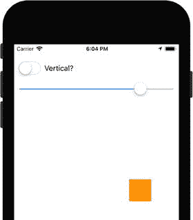
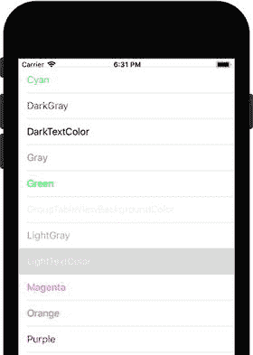
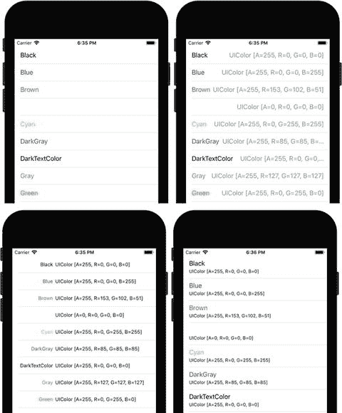
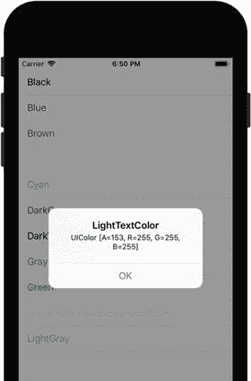
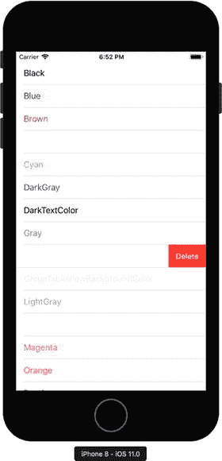
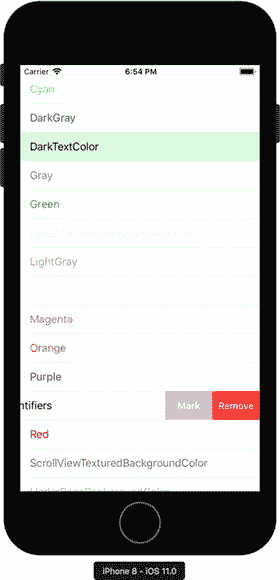
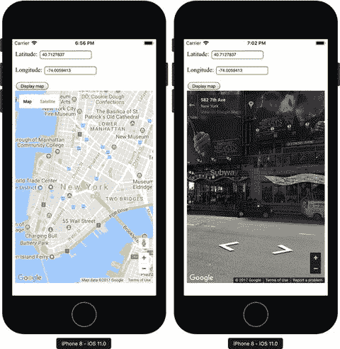
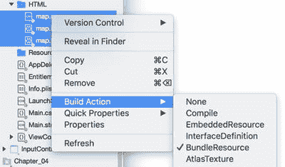
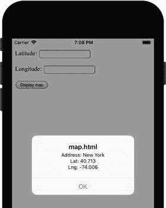

# 3. 视图

在掌握了 iOS 应用结构、可用项目模板和应用生命周期的知识之后，我们可以继续学习如何创建复杂视图。我们将从学习如何使用几个基本控件（如开关和滑块）开始，然后研究高级控件，如表格视图、网页视图和地图视图。具体来说，我们将学习如何使用表格来显示数据集合。Web 视图将用于在 Xamarin.iOS 应用中渲染交互式网页（Google 地图）。最后，我们将使用地图视图来呈现原生的 iOS 地图。在本章中，我们还将学习如何定义自适应视图，这些视图会自动适配不同尺寸的屏幕以及设备方向。

几乎所有 iOS 控件的名称都以 "view" 结尾；例如，Table View（表格视图）或 Map View（地图视图）。因此，为了节省篇幅，我通常会简称为 table 或 map，而不再使用全称。


## 基本控件

我们已经接触过几种基本控件，比如按钮、标签、文本字段和图像。在本节中，我将向你展示另外三种控件：开关、滑块和视图。更具体地说，我将讲解如何利用这些控件创建一个应用程序，如图 3-1 所示。在这个应用中，当你改变滑块值时，橙色的方形视图会发生平移。平移方向取决于开关的状态——如果开关打开，方形会垂直平移；否则水平平移。因此，你还会学到如何动态改变任何控件的位置。



图 3-1.

展示开关和滑块示例用法的应用程序界面

为了实现图 3-1 所示的应用程序，我首先创建了一个新的单视图应用程序（兼容 iOS 9.0 及更高版本的通用应用），并将其命名为 `InputControls`。然后，我为主视图补充了四个控件：开关、标签、滑块和视图（你可以在工具箱中找到所有这些控件）。这些控件按照图 3-1 所示进行排列，其属性配置如下：

*   开关：
    *   名称：`SwitchIsVertical`
*   滑块：
    *   名称：`SliderShift`
*   视图：
    *   名称：`ViewMoveableSquare`
    *   背景：橙色
    *   宽度和高度（布局选项卡）：50

在界面设计完成后，我开始实现逻辑层。为此，我修改了 `ViewController` 类（`ViewController.cs`）的定义。我声明了一个私有成员 `initialSquareCenter`，并实现了四个辅助方法（列表 3-1 和列表 3-2）。列表 3-1 中的两个方法用于存储方块的初始位置，并在用户通过开关改变平移方向时将其复位。为了获取和更新方块的位置，我使用了 `View` 控件的 `Center` 属性。该属性的类型为 `CoreGraphics.CGPoint`，这是一个表示平面中点的结构体。要使用此类型，你需要在 `ViewController.cs` 文件的头部导入 `CoreGraphics` 命名空间：

```
using CoreGraphics;
```

```
private CGPoint initialSquareCenter;
private void StoreSquareCenter()
{
initialSquareCenter = ViewMoveableSquare.Center;
}
private void RecenterSquare()
{
ViewMoveableSquare.Center = initialSquareCenter;
}
列表 3-1.
管理可移动方块（橙色视图）的初始位置
```

另外两个辅助方法，如列表 3-2 所示，用于在实际可行的范围内平移方块。这个范围取决于设备屏幕的宽度（水平平移）或高度（垂直平移）（参见列表 3-2 中的 `AdjustSliderRange` 方法）。我还将这个范围减去方块边长的一半，以确保方块始终在主视图中可见。为了平移方块，我将偏移值（从滑块值获取）加到初始方块位置的 X 或 Y 坐标上。这实际上改变了点的坐标，从而将方块向选定方向平移。如列表 3-2 所示，根据开关控件的状态，我将偏移值加到 `CGPoint`（使用 `initialSquareCenter` 实例化）的 X 或 Y 属性上。如果开关打开（`On` 属性为真），我就改变 Y 坐标。否则，我更新 X 坐标。

```
private void AdjustSliderRange()
{
var margin = ViewMoveableSquare.Frame.Width / 2.0;
var range = SwitchIsVertical.On ? View.Frame.Height : View.Frame.Width;
var maxShiftValue = Convert.ToInt32(range / 2.0 - margin);
SliderShift.MinValue = -maxShiftValue;
SliderShift.MaxValue = maxShiftValue;
SliderShift.Value = 0;
}
private void TranslateSquare()
{
var newCenter = new CGPoint(initialSquareCenter);
if (!SwitchIsVertical.On)
{
newCenter.X += SliderShift.Value;
}
else
{
newCenter.Y += SliderShift.Value;
}
ViewMoveableSquare.Center = newCenter;
}
列表 3-2.
调整滑块范围
```

我在 `ViewDidLoad` 视图事件处理程序（列表 3-3）以及开关和滑块的 `ValueChanged` 事件关联的两个事件处理程序（列表 3-4）中使用了上述辅助方法。我通过控制属性面板的“事件”选项卡创建了这些事件处理程序。`ViewDidLoad` 的默认定义被修改，以便在视图加载时存储方块的初始位置。当用户点击开关控件时，这会用于将方块复位到视图中心。当用户改变滑块值时，会调用列表 3-4 中的第二个事件处理程序。该事件处理程序使用了列表 3-2 中展示的 `TranslateSquare` 方法。因此，当你运行该应用时，你将看到如图 3-1 所示的结果。

```
public override void ViewDidLoad()
{
base.ViewDidLoad();
StoreSquareCenter();
AdjustSliderRange();
}
列表 3-3.
存储实际方块位置并调整滑块范围
```

```
partial void SwitchIsVertical_ValueChanged(UISwitch sender)
{
RecenterSquare();
AdjustSliderRange();
}
partial void SliderShift_ValueChanged(UISlider sender)
{
TranslateSquare();
}
列表 3-4.
方块位置由两个控件控制：开关和滑块
```

## 表格

许多移动应用都致力于显示从网络服务获取的数据。为了以有条理的方式显示这些数据，你通常会使用表视图。在本节中，我将告诉你如何创建一个表格，该表格展示一系列颜色及其名称（图 3-2）。然后，我们将修改表格的数据源，使用户能够删除和标记选中的项目，并能够通过 `UIAlertController` 获取关于颜色的详细信息。完成这个示例后，你将知道如何创建能够通过原生 iOS 界面响应用户请求的表格。



图 3-2.

在表视图中显示的预定义 iOS 颜色列表


### 显示项目

为了演示如何使用表格，我创建了一个新的单视图 iOS 项目，并将其命名为 `ColorsTable`。接着，我添加了一个新文件夹 `Colors`，并在其中创建了三个文件：`Color.cs`、`ColorsHelper.cs` 和 `ColorsTableSource.cs`。每个文件都将存储相应类的定义。我首先实现了 `Color` 类，它是一个用于表示表格中项目的辅助对象。如列表 3-5 所示，`Color` 类有两个公共属性：`Name` 和 `Value`。`Name` 存储颜色的描述，而 `Value` 存储实际的颜色，以 `UIColor` 类的实例表示。在 `UIKit` 命名空间中定义的 `UIColor` 类，拥有多个包含预定义 iOS 颜色的公共静态属性。为了获取这个列表，我实现了一个 `ColorsHelper` 类（`ColorsHelper.cs` 文件），如列表 3-6 所示。

```
using UIKit;
namespace ColorsTable.Colors
{
public class Color
{
public string Name { get; set; }
public UIColor Value { get; set; }
}
}
列表 3-5.
Color 类的定义
```

`ColorsHelper` 类只有一个公共静态方法：`GetColors`。该方法使用 C# 反射机制来读取 `UIColor` 类所有公共静态属性的信息。这些信息以 `PropertyInfo` 对象的集合形式呈现。然后，通过读取 `Name` 成员来获取属性名称，并调用 `PropertyInfo` 类实例的 `GetValue` 方法来获取属性值。接着利用这些值创建 `Color` 类的实例并将其添加到结果集合中。

```
using System.Collections.Generic;
using System.Reflection;
using UIKit;
namespace ColorsTable.Colors
{
public static class ColorsHelper
{
public static List GetColors()
{
var colors = new List();
var uiColorType = typeof(UIColor);
var availableColors = uiColorType.GetProperties(
BindingFlags.Public | BindingFlags.Static);
foreach (var color in availableColors)
{
colors.Add(new Color()
{
Name = color.Name,
Value = color.GetValue(uiColorType) as UIColor
});
}
return colors;
}
}
}
列表 3-6.
使用 C# 反射机制获取的预定义 iOS 颜色列表
```

有了颜色列表后，我现在可以为表格视图实现项目集合。为此，我创建了 `ColorsTableSource` 类，如列表 3-7 所示。`ColorsTableSource` 继承自 `UITableViewSource`，因此必须实现两个方法：`RowsInSection` 和 `GetCell`。第一个方法由运行时用于确定表格当前部分的行数。第二个方法在运行时即将绘制特定行的单元格时被调用。因此，在列表 3-7 中，我使用此方法通过 `UITableViewCell` 准备单元格。该类表示单元格在表格中的视觉外观。有几种预定义的单元格样式可供使用，它们由 `UITableViewCellStyle` 枚举中的以下值表示（见图 3-3）：



图 3-3. 预定义的单元格布局：Default（左上）、Value1（右上）、Value2（左下）和 Subtitle（右下）

*   `Default` – 指定单元格包含一个左对齐的文本标签和一个可选的图像视图。
*   `Value1` – 指定单元格包含两个标签：一个左对齐，另一个右对齐。第一个标签显示通过设置 `UITableView` 类实例的 `TextLabel` 成员的 `Text` 属性所指定的文本。要配置第二个标签显示的字符串，使用 `DetailTextLabel` 的 `Text` 属性。
*   `Value2` – 使用与 `Value1` 类似的布局，但第一个标签右对齐，第二个标签左对齐。
*   `Subtitle` – 在这种情况下，`DetailTextLabel` 位于 `TextLabel` 正下方，且两个标签都左对齐。

为了优化性能，通常使用 `UITableView` 类实例的 `DequeueReusableCell` 方法重用现有单元格。此方法接受单元格标识符，并返回有效的 `UITableViewCell` 实例或 `null`。在后一种情况下，需要调用 `UITableViewCell` 构造函数来创建新单元格。在列表 3-7 中，我使用了默认的单元格样式，并将单元格标识符设置为存储在 `cellId` 常量中的值。在获得 `UITableViewCell` 实例后，我配置其属性，使得主标签显示颜色名称，副标签显示 `UIColor` 类实例的字符串表示形式（类型名称和 ARGB 组件）。此外，我将主标签的前景色更改为当前项目 `Value` 属性所携带的颜色。列表 3-7 中的代码依赖于以下命名空间，这些命名空间需要包含在 `ColorsTableSource.cs` 文件中：

```
using System;
using System.Collections.Generic;
using Foundation;
using UIKit;
```

```
public class ColorsTableSource : UITableViewSource
{
private const string cellId = "ColorCell";
public List Items { get; private set; } = ColorsHelper.GetColors();
public override UITableViewCell GetCell(
UITableView tableView, NSIndexPath indexPath)
{
// 获取要显示的项目
var item = Items[indexPath.Row];
// 在创建新单元格之前尝试重用现有单元格
var cell = tableView.DequeueReusableCell(cellId)
?? new UITableViewCell(UITableViewCellStyle.Default, cellId);
// 配置单元格属性
cell.TextLabel.Text = item.Name;
cell.TextLabel.TextColor = item.Value;
if (cell.DetailTextLabel != null)
{
cell.DetailTextLabel.Text = item.Value.ToString();
}
return cell;
}
public override nint RowsInSection(UITableView tableview, nint section)
{
return Items.Count;
}
}
列表 3-7.
UITableView 的项目集合
```

最后，为了显示表格，我修改了 `ViewController` 类的 `ViewDidLoad` 方法，如列表 3-8 所示。首先，我实例化 `UITableView` 类，使其充满整个视图，然后将其 `Source` 属性设置为 `ColorsTableViewSource` 的实例。最后，我使用 `ViewController` 类的 `Add` 方法将表格添加到视图中。因此，运行应用后，你将得到前面图 3-2 所示的结果。

请注意，在此示例中，我从源代码创建了控件（`UITableView`）。我没有使用可视化设计器来修改故事板。当然，你也可以使用此选项来定义整个视图。在特定情况下，这比使用故事板设计视图更快。同时，你也可以使用故事板创建 `UITableView`。在这种情况下，你可以手动绘制单元格布局，并通过其名称引用底层控件。

要成功编译列表 3-8 中的代码，我们需要在 `ViewController.cs` 文件中包含 `ColorsTable.Colors` 命名空间。现在也是暂停一下、编译应用以确保一切正常、并测试各种单元格样式的好时机。

```
public override void ViewDidLoad()
{
base.ViewDidLoad();
var table = new UITableView(View.Frame)
{
Source = new ColorsTableSource()
};
Add(table);
}
列表 3-8.
创建表格
```


### 选中项目

通常，每当用户在表格中选中某个项目时，你需要向用户显示额外的数据。这里，我将向你展示如何使用警告框来显示颜色的完整信息（`Name` 和 `Value`）。你已经知道如何显示警告框，因此唯一的新内容是在用户选中某一行时，从 `UITableViewSource` 中创建并显示警告框。为了处理此类事件，你需要重写 `UITableViewSource` 的 `RowSelected` 方法。`RowSelected` 方法让你能够访问 `UITableView` 的引用（从而触发事件）以及 `NSIndexPath` 类的实例，你可以使用它获取所选行的索引。与之前类似，我使用该索引来获取选中的项目，然后创建并配置 `UIAlertController`，如代码清单 3-9 所示。

```
public override void RowSelected(UITableView tableView, NSIndexPath indexPath)
{
if (ParentViewController != null)
{
DisplayColorInfo(tableView, indexPath);
}
else
{
base.RowSelected(tableView, indexPath);
}
}
private void DisplayColorInfo(UITableView tableView, NSIndexPath indexPath)
{
var selectedItem = Items[indexPath.Row];
var alertController = UIAlertController.Create(
selectedItem.Name, selectedItem.Value.ToString(),
UIAlertControllerStyle.Alert);
alertController.AddAction(UIAlertAction.Create(
"确定", UIAlertActionStyle.Default, null));
ParentViewController.PresentViewController(
alertController, true,
() => { tableView.DeselectRow(indexPath, true); });
}
代码清单 3-9.
显示选中项目信息
```

为了显示警告框，我调用了 `PresentViewController` 方法。为此，我需要一个 `UIViewController` 或其派生类的实例。这里，我使用了与默认视图关联的 `ViewController`。`ViewController` 类实例通过 `ColorsTableSource` 类的构造函数传递，然后存储在 `ParentViewController` 属性中（见代码清单 3-10）。

```
public UIViewController ParentViewController { get; private set; }
public ColorsTableSource(UIViewController viewController)
{
ParentViewController = viewController;
}
代码清单 3-10.
用于获取和存储 UIViewController 类引用的 ColorsTableSource 额外成员
```

为了使用修改后的 `ColorsTableSource` 定义，我更改了 `ViewDidLoad` 视图事件处理程序，如代码清单 3-11 所示。之后，重新运行应用程序，你可以点击表格中的任意条目。将会出现如图 3-4 所示的警告框。



图 3-4.
颜色信息以警告框形式显示

```
public override void ViewDidLoad()
{
base.ViewDidLoad();
var table = new UITableView(View.Frame)
{
Source = new ColorsTableSource(this)
};
Add(table);
}
代码清单 3-11.
将 ViewController 实例传递给 ColorsTableSource
```

### 删除项目

要启用项目删除功能，请重写 `UITableViewSource` 的 `CommitEditingStyle` 方法。代码清单 3-12 展示了 `ColorsTableSource` 中该方法的示例实现。我首先读取传递给 `CommitEditingStyle` 方法的 `editingStyle` 参数，检查它是否等于 `UITableViewCellEditingStyle.Delete`。如果是，我将从 `Colors` 列表以及表视图中移除选中的项目。后者通过 `UITableView` 类实例的 `DeleteRows` 方法完成。该方法接受两个参数：一个用于标识要删除项目的 `NSIndexPath` 对象数组，以及动画类型。可用的动画类型在 `UITableViewRowAnimation` 枚举中定义如下：

- `Fade` – 指定被删除的行将淡出
- `Right`、`Left`、`Top`、`Bottom` – 分别指定被删除的行滑出到右侧、左侧、顶部或底部
- `Middle` – 指定被删除的行将“飞走”
- `Automatic` – 强制 `UITableView` 根据被删除行的位置自动调整动画样式

在代码清单 3-12 中，我使用了 `Automatic` 动画，但你可以轻松地将其更改为其他任何值，并观察它对行删除效果的影响。运行应用程序后，你可以选择任意项目并向右滑动，你将看到一个红色的“删除”按钮（图 3-5）。点击此按钮后，该项目将从底层列表和表视图中移除。



图 3-5.
UITableView 中的滑动删除功能

```
public override void CommitEditingStyle(
UITableView tableView,
UITableViewCellEditingStyle editingStyle,
NSIndexPath indexPath)
{
if (editingStyle == UITableViewCellEditingStyle.Delete)
{
Items.RemoveAt(indexPath.Row);
tableView.DeleteRows(
new NSIndexPath[] { indexPath },
UITableViewRowAnimation.Automatic);
}
}
代码清单 3-12.
删除一个项目
```

你也可以通过编程方式阻止删除项目。方法是实现 `CanEditRow` 方法。代码清单 3-13 展示了如何阻止删除洋红色。当你重新运行应用程序时，在滑动洋红色对应的项目时，该行将不会出现“删除”按钮。

```
public override bool CanEditRow(UITableView tableView,
NSIndexPath indexPath)
{
var itemToDelete = Items[indexPath.Row];
return itemToDelete.Name != "Magenta";
}
代码清单 3-13.
禁用删除洋红色
```

在更高级的场景中，你可能需要创建多个按钮来处理项目滑动。在这种情况下，你可以通过重写 `UITableViewSource` 的 `EditActionsForRow` 方法来创建 `UITableViewRowAction` 对象的集合。在代码清单 3-14 中，我实现了两个这样的操作。其中一个在外观和功能上类似于之前示例中的“删除”按钮，但具有不同的标签“移除”。另一个按钮将具有灰色背景，并更改所选单元格的背景，如图 3-6 所示。

```
public override UITableViewRowAction[] EditActionsForRow(
UITableView tableView, NSIndexPath indexPath)
{
var removeButton = UITableViewRowAction.Create(
UITableViewRowActionStyle.Destructive,
"移除",
delegate {
Items.RemoveAt(indexPath.Row);
tableView.DeleteRows(
new NSIndexPath[] { indexPath },
UITableViewRowAnimation.Middle);
});
var markItemButton = UITableViewRowAction.Create(
UITableViewRowActionStyle.Normal,
"标记",
delegate
{
tableView.CellAt(indexPath).BackgroundColor =
UIColor.FromRGBA(0, 255, 0, 35);
});
return new UITableViewRowAction[] { removeButton, markItemButton };
}
代码清单 3-14.
创建行操作集合
```

要创建 `UITableViewRowAction`，请使用静态的 `Create` 方法。该方法接受三个参数，如下所示：


- `style`：由 `UITableViewRowActionStyle` 枚举中的以下值之一表示：
  - `Default` – 指定按钮具有默认样式（红色背景）。默认样式等同于 Destructive，意味着按钮操作将从表格中移除该项。
  - `Normal` – 为按钮应用非破坏性样式（灰色背景）
- `Title` – 用于设置按钮标签的字符串
- `handler` – 按钮点击后调用的操作

在清单 3-14 中，我两次使用了 `UITableViewRowAction.Create` 方法。由此得到的两个 `UITableViewRowAction` 类实例用于创建行操作数组。因此，每次滑动 `UITableView` 项时，会出现两个按钮，如图 3-6 所示。请注意，`EditActionsForRow` 的优先级高于 `CommitEditingStyle`。因此，在 `ColorsTableSource` 类中定义 `EditActionsForRow` 后，`CommitEditingStyle` 将被忽略。



**图 3-6.** 带有两个行操作的表格视图

## Web View

`Web View` 是一种视觉控件，用于在应用中渲染网页。`Web View` 在多种场景中使用。例如，你可以用它来显示应用的交互式帮助指南，或渲染来自外部服务器的内容。在本节中，我将向你展示如何构建一个基于 `Web View` 控件的应用，用于显示你选择的地理位置的谷歌地图（图 3-7）。请注意，托管在 `Web View` 渲染的网页上的谷歌地图将是完全可交互的。如图 3-7 所示，你将能够平移地图甚至进入街景模式，因为 `Web View` 可以渲染交互式网页。



**图 3-7.** 显示完全交互式谷歌地图的 `Web View`

为了实现图 3-7 中的应用，我使用 Single View iOS 项目模板并将应用名称设置为 `GoogleMap`。然后，我创建了 `HTML` 子文件夹，并在其中放置了三个文件：`map.css`（清单 3-15）、`map.js`（清单 3-16）和 `map.html`（清单 3-17）。这些文件实现了一个包含两个文本输入框、一个按钮和一张谷歌地图的网页。你使用输入字段输入纬度和经度，用于设置地图的中心。按下按钮时地图会显示。

清单 3-15 中的 `map.css` 代码无需额外注释。这是一个名为 `map` 的 CSS 类的简短定义。该类配置了生成地图的显示模式和尺寸。

```css
.map {
float: left;
width: 100%;
height: 500px;
}
```

清单[3-15] 存储 `map` 类定义的 CSS 文件

清单 3-16 中显示的 JavaScript 函数 `displayMap`（`map.js`）用于在选定的 `div` 元素中显示谷歌地图。这些函数从两个输入字段中获取地图中心的地理坐标。为此，`displayMap` 接受以下三个参数：

- `mapDivId` – 用于显示地图的 `div` 元素的标识符
- `latInputId` 和 `lngInputId` – 分别带有纬度和经度的输入字段的标识符

基于以上值，我配置了一个地图 `options` 对象，该对象指定了地图的缩放级别和中心。随后，我使用 `google.maps.Map` 对象显示地图。

```javascript
function displayMap(mapDivId, latInputId, lngInputId) {
lat = document.getElementById(latInputId).value;
lng = document.getElementById(lngInputId).value;
var mapCenter = new google.maps.LatLng(lat, lng);
var options = {
zoom: 14,
center: mapCenter
};
new google.maps.Map(document.getElementById(mapDivId), options);
}
```

清单[3-16] 用于显示谷歌地图的 JavaScript 函数

最后一个文件 `map.html`（清单 3-17）用于定义网页，包含一组标准的 HTML 声明。在 `head` 元素中，我引用了样式表 `map.css` 和必要的 JavaScript 组件。第一个是谷歌地图 API，另一个是 `map.js`。然后，我声明了两个标签、两个文本输入框、一个按钮以及一个用于渲染地图的 `div` 元素。请注意，按钮的 `onclick` 属性指向 `displayMap` 函数。因此，每次点击该按钮时，会调用清单 3-16 中的函数来显示地图。

```html

Latitude:

Longitude:

Display map

```

清单[3-17] `map.html` 文件的内容

网页准备就绪后，我现在可以使用 `Web View` 来显示它。为此，在 `ViewController` 类中，我首先导入必要的命名空间：

```csharp
using System;
using System.IO;
using CoreGraphics;
using Foundation;
using UIKit;
```

然后，我定义了两个辅助方法，如清单 3-18 所示。第一个方法 `GetFrameWithVerticalMargin` 用于确定显示 `Web View` 的矩形。请注意，在上一节中，表格视图覆盖了状态栏。为了解决这个问题，在清单 3-18 中，我向矩形添加了垂直边距并相应减少了其高度。第二个方法 `LoadMapUrl` 调用 `UIWebView` 类实例的 `LoadRequest` 方法以渲染网页。`LoadRequest` 接受一个 `NSUrlRequest` 类型的参数。该对象使用指向 `map.html` 文件的 `NSUrl` 对象实例化。这样，`UIWebView` 将显示此网页。

```csharp
private CGRect GetFrameWithVerticalMargin(nfloat offset)
{
var rect = View.Frame;
rect.Y = offset;
rect.Height -= offset;
return rect;
}
private void LoadMapUrl(UIWebView webView)
{
var url = Path.Combine(NSBundle.MainBundle.BundlePath,
"HTML/map.html");
webView.LoadRequest(new NSUrlRequest(new NSUrl(url, false)));
}
```

清单[3-18] 用于在 `Web View` 中显示网页的辅助方法

为了在运行时访问 `map.html` 网页，你需要将 `map.css`、`map.js` 和 `map.html` 的生成操作设置为 `BundleResource`，如图 3-8 所示。



**图 3-8.** 为网页配置生成操作

最后，我修改了 `ViewDidLoad` 事件处理程序，如清单 3-19 所示。在其中，我实例化了一个 `Web View` 控件，并使用我的 `GetFrameWithVerticalMargin` 方法为其指定边界。随后，我调用 `LoadMapUrl` 并最终显示 `Web View`。因此，运行应用后，你将看到一个包含文本输入框和按钮的网页。输入地理坐标后，点击按钮，稍后地图便会显示。

```csharp
public override void ViewDidLoad()
{
base.ViewDidLoad();
var webView = new UIWebView(GetFrameWithVerticalMargin(20));
LoadMapUrl(webView);
Add(webView);
}
```

清单[3-19] 创建并显示 `Web View`


### Google Geocoding API

在之前的示例中，我使用了纽约市的地理坐标。如果你想为其他位置显示地图，则需要知道其地理坐标。要查找任意地址的地理坐标，可以使用 Google Geocode 服务。这是一种将地址转换为地理坐标（纬度和经度）的网络服务。要使用地理编码，请在浏览器中键入以下 URL（可以将`New York`替换为其他任意值）：

[`https://maps.googleapis.com/maps/api/geocode/json?address=New+York`](https://maps.googleapis.com/maps/api/geocode/json?address=New+York)

作为响应，Geocoding API 会返回描述你地址的 JSON 文件。该描述是一个键值对数组，其中存储了地址组件或几何信息等多个对象。特别是，地址的位置信息保存在 `location` 键下。在此，该键关联着以下地理坐标——`lat`：`40.7127837` 和 `lng`：`-74.0059413`。我使用这些值生成了图 3-7 的截图。参见代码清单 3-20。

```
{
"results" : [
{
"address_components" : [
{
"long_name" : "New York",
"short_name" : "New York",
"types" : [ "locality", "political" ]
},
{
"long_name" : "New York",
"short_name" : "NY",
"types" : [ "administrative_area_level_1", "political" ]
},
{
"long_name" : "United States",
"short_name" : "US",
"types" : [ "country", "political" ]
}
],
"formatted_address" : "New York, NY, USA",
"geometry" : {
"bounds" : {
"northeast" : {
"lat" : 40.9175771,
"lng" : -73.70027209999999
},
"southwest" : {
"lat" : 40.4773991,
"lng" : -74.25908989999999
}
},
"location" : {
"lat" : 40.7127837,
"lng" : -74.0059413
},
"location_type" : "APPROXIMATE",
"viewport" : {
"northeast" : {
"lat" : 40.9152555,
"lng" : -73.70027209999999
},
"southwest" : {
"lat" : 40.4960439,
"lng" : -74.25573489999999
}
}
},
"place_id" : "ChIJOwg_06VPwokRYv534QaPC8g",
"types" : [ "locality", "political" ]
}
], "status" : "OK";
}
```
代码清单 3-20. Google Geocode 返回的 JSON 响应示例

### 调用 JavaScript 函数

Web View 允许你在 C# 代码中运行 JavaScript。为此，Web View 提供了 `EvaluateJavaScript` 方法。它接受一个参数，即包含要运行的 JavaScript 代码的字符串。为了演示如何使用 `EvaluateJavascript` 方法，我在 `map.js` 文件中添加了另一个函数 `displayGeocoordinate`（代码清单 3-21）。该函数接受一个表示地址的字符串，并显示其从 Google Geocode 服务获取的地理坐标（图 3-9）。为此，我实例化了一个 `google.maps.Geocoder` 对象，然后调用其 `geocode` 方法。该方法向 Google Geocode 服务发送请求，并接受两个参数。第一个参数是参数数组，第二个是回调函数，在请求完成后执行。回调函数会接收另外两个参数，如下所示：

*   `results` – 表示从 Google Geocode 服务返回的 JSON 响应中结果部分的对象（请回顾代码清单 3-20）
*   `status` – 请求的状态

在代码清单 3-21 中，我使用了这两个参数。首先，我读取 `status` 以验证请求是否已被 Google Geocode 成功处理。如果是，则获取 `results` 数组的第一个元素，然后从 `geometry` 对象中取得 `location`。



图 3-9. 通过 Web View 调用的 JavaScript 函数显示警告框

```
function displayGeocoordinate(address) {
var geocoder = new google.maps.Geocoder();
geocoder.geocode({'address': address}, function(results, status) {
if (status === 'OK') {
var geocoordinate = results[0].geometry.location;
alert('Address: ' + address
+ '\nLat: ' + geocoordinate.lat().toFixed(3)
+ '\nLng: ' + geocoordinate.lng().toFixed(3));
}
else {
alert('Geocoder failed: ' + status);
}
});
}
```
代码清单 3-21. 对地址进行地理编码

为了调用 `displayGeocoordinate` 函数，我修改了 `ViewController` 的 `ViewDidLoad` 方法，如代码清单 3-22 所示。我为 Web View 的 `LoadFinished` 事件创建了处理程序。该事件在网页渲染完成后触发。这确保了所有必要的引用都已就绪，从而可以使用 `EvaluateJavascript` 调用 `displayGeocoordinate` 函数。对于地址，我传递了 `New York`，因此重新运行应用后得到如图 3-9 所示的结果。请注意，Web View 会自动重新解释 JavaScript 的 `alert` 函数，使得生成的弹出窗口看起来像使用 `UIAlertController` 创建的窗口。

```
public override void ViewDidLoad()
{
base.ViewDidLoad();
var webView = new UIWebView(GetFrameWithVerticalMargin(20));
LoadMapUrl(webView);
Add(webView);
webView.LoadFinished += (sender, e) =>
{
webView.EvaluateJavascript("displayGeocoordinate('New York');");
};
}
```
代码清单 3-22. 通过 Web View 调用 JavaScript 函数


好的，作为一名高级文档工程师和翻译员，我将严格遵循您提供的注意事项和示例格式，对给定的英文文本进行专业、准确的中文翻译。


