# 地图视图与地理定位

我们在上一节中开发的谷歌地图示例，其目标是展示 Web 视图的强大能力。在 iOS 上，如果你想要显示地图，不一定非要用 Web 视图。相反，你可以使用 iOS SDK 提供的原生地图框架。具体来说，这个框架提供了地图视图，你可以通过 Xamarin.iOS 中 `MapKit` 命名空间下声明的 `MKMapView` 类来访问它。`MKMapView` 让你能够快速地为你的应用添加一个交互式的原生 iOS 地图。在这个地图上，你甚至可以显示用户设备的当前位置、添加适当的标注，甚至显示行车路线。因此，你可以相对快速地为你应用添加高级功能。在本节中，我将告诉你如何使用地图框架以及 `CLLocationManager`（一个用于追踪 iOS 设备地理位置的类）来创建一个能在地图上显示用户位置的应用。更具体地说，这个应用将只有一个视图，其外观如图 3-10 所示。

为了实现这个应用，我首先使用“单视图应用”模板创建一个新项目。我将应用名称设置为其最低目标版本分别设置为 `Map` 和 iOS 9.0。然后，在 `ViewController` 类中，我引入了三个命名空间：`MapKit`、`System.Linq` 和 `CoreLocation`。随后，我声明了私有成员 `map` 和一个辅助函数 `InitMap`（代码清单 3-23）。这个方法用于创建一个 `MKMapView` 类的实例并设置其选定属性。具体来说，我启用了缩放和平移，并将 `ShowsUserLocation` 属性设置为 `true`。这使地图能够显示用户的位置，该位置由一个带有白色边框的蓝色圆点表示（图 3-10）。此外，我使用 `MKMapView` 类实例的相应属性来配置地图类型。所有可用的地图类型都在 `MKMapType` 枚举中定义。你可以在以下几种地图样式之间进行选择：

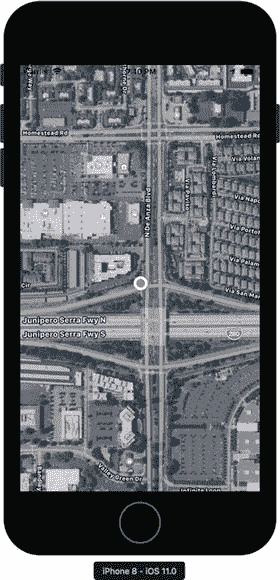

图 3-10. 地图视图的示例用法

- `Standard` – 表示地图使用标准制图样式（类似于图 3-7 左侧部分所示）
- `Satellite` – 地图将使用通过卫星获取的影像进行创建
- `Hybrid` – 标准地图与卫星影像的组合
- `SatelliteFlyover` 和 `HybridFlyovers` – 分别表示地图类型将采用卫星影像或混合影像的“飞越”模式

```
private MKMapView map;
private void InitMap()
{
map = new MKMapView(View.Frame)
{
ZoomEnabled = true,
ScrollEnabled = true,
MapType = MKMapType.HybridFlyover,
ShowsUserLocation = true
};
Add(map);
}
代码清单 3-23. 初始化地图
```

要显示地图，你需要将 `InitMap` 方法添加到 `ViewController` 类的 `ViewDidLoad` 事件处理程序中。如果你这样做了并重新运行应用，你会看到视图被一个地图视图填满。你可以随意平移地图视图。如果你想在模拟器中缩放地图视图，你需要按住 Alt/Option 键。模拟器中会显示两个代表两根手指的圆圈。它们模拟你在进行捏合手势时手指的位置。因此，你现在可以改变圆圈之间的距离来增加或减少地图的缩放级别。

```
private CLLocationManager locationManager;
private void InitLocationManager()
{
locationManager = new CLLocationManager();
// 请求授权
if (UIDevice.CurrentDevice.CheckSystemVersion(8, 0))
{
locationManager.RequestWhenInUseAuthorization();
}
// 处理 LocationsUpdated 事件
locationManager.LocationsUpdated += (sender, e) =>
{
UpdateMap(e);
};
}
代码清单 3-24. 实例化 CLLocationManager
```

现在，让我们继续前进，访问设备的地理位置。为此，我通过另一个私有字段 `locationManager`（类型为 `CLLocationManager`）和一个辅助方法 `InitLocationManager`（代码清单 3-24）来扩展 `ViewController` 类的定义。该方法使用默认的无参构造函数创建了一个 `CLLocationManager` 实例，然后请求用户允许 `Map` 应用在其前台运行时访问其位置。为此，我使用了 `RequestWhenInUseAuthorization`。如果你还想在后台访问设备的位置，那么你需要使用 `RequestAlwaysAuthorization` 方法。无论你选择哪种方法，你都需要在“信息属性列表”中指定相应的属性。你可以在 Info.plist 编辑器的“源”选项卡中进行配置（请参考第 2 章）。然后，点击“添加新条目”链接（列表的最后一个元素）；会出现一个自定义属性字符串。在其旁边，你会找到一个用于激活下拉列表的图标。你使用这个列表来选择“位置使用时的使用说明（前台访问用户位置）”或“位置始终使用说明（后台访问用户位置）”。此处，我使用第一个属性（图 3-11）。然后，在编辑器的“值”列中，输入字符串。此字符串定义了一条将显示给被请求访问位置的用户的消息。无论何时你调用 `RequestWhenInUseAuthorization`（图 3-12）并且你的应用没有访问用户位置的权限时，这个模态窗口都会自动显示。

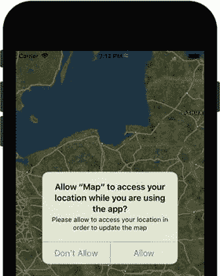

图 3-12. 请求访问用户位置

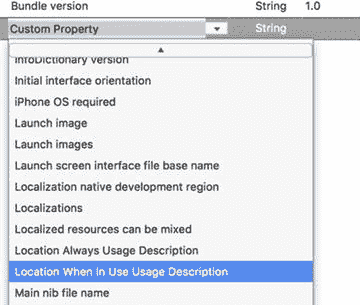

图 3-11. 向信息属性列表添加自定义属性

你只能在 iOS 8.0 及以上版本中请求用户的私密数据。因此，在调用 `RequestWhenInUseAuthorization` 之前，我使用 `UIDevice` 类的静态属性 `CurrentDevice` 的 `CheckSystemVersion` 方法来验证 iOS 版本。

最后，在代码清单 3-24 中，我将 `UpdateMap` 方法与 `CLLocationManager` 类实例的 `LocationsUpdated` 事件处理程序关联起来。`LocationsUpdated` 事件在用户位置发生变化时触发。`UpdateMap` 及其依赖项的定义在代码清单 3-25 中给出。如该清单所示，我首先读取最后已知的位置，并使用它来设置地图中心和配置地图区域。后者是地图上显示的部分，或者定义地图的缩放级别。为了配置地图区域，我首先创建一个 `MKCoordinateSpan` 类的实例。你使用这个类，通过 `MKCoordinateSpan` 类构造函数的相应参数（`latitudeDelta` 和 `longitudeDelta`）来指定纬度和经度方向上的地图距离。这两个参数都以度为单位。1 度大约相当于 69 英里（111 公里）。但是，`latitudeDelta` 的精确值取决于经度跨度。这里，我将两个方向上的跨度都设置为 0.005 度。有了 `MKCoordinateSpan` 的实例，我就可以用它来实例化 `MKCoordinateRegion` 类。它的构造函数接受以下两个参数：

- `center`，类型为 `CLLocationCoordinate2D`，指定地图区域的中点
- `span`，类型为 `MKCoordinateSpan`，决定地图的缩放级别

为了获得 `MKCoordinateRegion` 构造函数所需的 `CLLocationCoordinate2D` 实例，我读取了从 `CLLocationManager` 获取的位置的 `Coordinate` 属性（代码清单 3-25）。


```csharp
private const double spanDelta = 0.005d;
private void UpdateMap(CLLocationsUpdatedEventArgs e)
{
var location = e.Locations.LastOrDefault();
if (location != null)
{
map.CenterCoordinate = location.Coordinate;
SetMapRegion(location.Coordinate);
}
}
private void SetMapRegion(CLLocationCoordinate2D centerCoordinate)
{
var span = new MKCoordinateSpan(spanDelta, spanDelta);
var region = new MKCoordinateRegion(centerCoordinate, span);
map.SetRegion(region, false);
}
```
**列表 3-25.** 更新地图视图以显示用户位置

最后，我将 `InitLocationManager` 方法添加到 `ViewDidLoad` 中（列表 3-26）。然后，我需要强制 `CLLocationManager` 报告用户位置的变化。为此，我在 `ViewDidAppear` 视图事件处理程序中调用 `StartUpdatingLocation` 方法。相应地，当视图消失时，我调用 `StopUpdatingLocation`，以便应用在后台运行时不会访问用户的位置。

现在您可以重新运行应用，很快会看到地图视图显示当前用户位置。要在模拟器中模拟地理位置的改变，您可以使用模拟器 `Debug/Location` 菜单中的几个选项（图 3-13）。使用“城市自行车骑行”、“城市跑步”或“高速公路行驶”选项可以获得最佳效果。

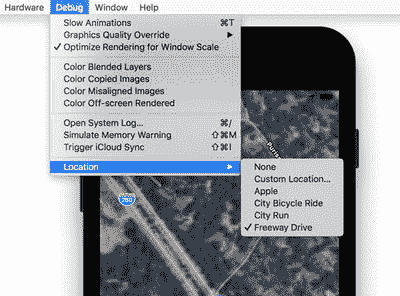

**图 3-13.** 此屏幕截图显示了可用于模拟模拟器地理位置变化的“位置”菜单

```csharp
public override void ViewDidLoad()
{
base.ViewDidLoad();
InitMap();
InitLocationManager();
}
public override void ViewDidAppear(bool animated)
{
locationManager.StartUpdatingLocation();
}
public override void ViewDidDisappear(bool animated)
{
base.ViewDidDisappear(animated);
locationManager.StopUpdatingLocation();
}
```
**列表 3-26.** ViewController 的视图事件处理程序

## 自动布局

创建自适应视图或自动布局是移动开发中最大的挑战之一。当视图调整大小或旋转时，自适应视图的控件必须自动调整大小或重新排列，以适应可用空间。要设计这样的自动布局，您需要利用特定于平台的机制来自动调整视图布局以适应设备的屏幕尺寸。

为了阐述自动布局需要解决的问题，我使用一个直接的例子。为此，我创建一个新的单一视图、通用 iOS 应用，目标平台为 iOS 9.0 及以上版本。我将应用名称设置为 `AutoLayout`，然后进入 iOS 设计器，首先从“视图为”下拉列表中选择 iPhone 6（图 3-14）。接着，我在 `ViewController` 的视图中添加一个标签和一个文本字段。我将标签文本设置为 `First name:`，并将其放在文本字段的正上方。我分别将标签和文本字段的固定宽度设置为 90 px 和 355 px。因此，在 iOS 设计器中，我的布局在 iPhone 6 上看起来很好（图 3-14）。

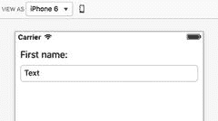

**图 3-14.** iOS 设计器在 iPhone 6 上显示 AutoLayout 应用的预览

当我把 iOS 设计器预览改为 iPhone 5[S] 时，文本字段被裁剪了（见图 3-15 的上半部分）。在屏幕更大的设备上出现了相反的问题；例如，在 iPhone 6 Plus 上，我的文本字段变得太短（图 3-15 的下半部分）。

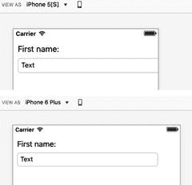

**图 3-15.** AutoLayout 应用在 iPhone 5S 和 iPhone 6 Plus 上的预览揭示了布局问题

上述问题可以通过使用约束来解决。它们定义了一组规则，运行时使用这些规则来自动调整特定视图中控件的大小或位置。例如，您可以定义文本字段与屏幕边界之间的边距，这样文本字段的宽度就会自动改变以适应可用空间。要定义这样的约束，请使用 iOS 设计器，在其中双击文本字段（不要双击控件）。如图 3-16 所示，文本字段周围会出现四个 T 形符号，代表固定间距（控件之间的距离），以及两个双 T 形符号，用于指定固定尺寸（控件的大小）。

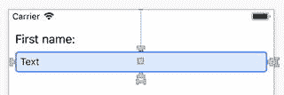

**图 3-16.** T 形和双 T 形图标可用于直观地定义约束

现在，单击并按住文本字段右侧的 T 形符号。右侧会出现一条绿色的虚线（图 3-17）。这条线代表默认边距。您可以拖动 T 形符号来定义约束。我们将它移动到绿色虚线上方，然后如图 3-17 下半部分所示，在虚线颜色变为蓝色后释放鼠标按钮。Visual Studio 会创建第一个约束，并在 View Controller 矩形的底部显示一个黄色警告标志。点击它后，会弹出一条消息，告诉您为 Y 位置添加另一个约束（图 3-18）。为此，只需单击“更新约束”按钮。最后，单击文本字段左侧的 T 形图标，并将其拖到视图左侧的绿色虚线上（类似于您对左边距所做的操作）。现在，文本字段应该有三个约束。要查看约束列表，请使用文本字段属性窗口的“布局”选项卡（图 3-19）。

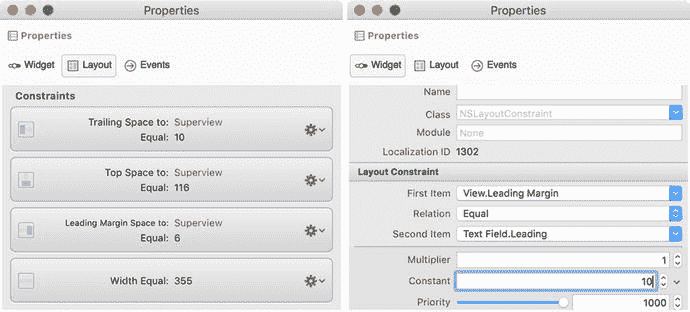

**图 3-19.** 可以使用“属性”窗口编辑约束

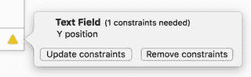


### 图 3-18. 更新约束

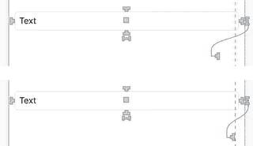

### 图 3-17. 创建间距约束

如图 3-19 所示，约束列表会显示在同名组的下方。在此情况下，我有如下四个约束：

- `Trailing Space to: Superview, equal to: 10` – 指定文本框与父视图之间的右边距
- `Top Space to: Superview, equal to: 116` – 指定文本框与父视图之间的顶部边距
- `Leading Margin Space to: Superview, equal to: 6` – 此约束指定文本框与父视图（即文本框所在的视图）之间的左边距
- `Width equal to 355` – 指定文本框的宽度。此约束用于反映我们在实现之初设置的初始宽度。

请注意，约束组中的每个条目都有一个表示约束的小图标（位于左侧），以及一个设置下拉列表（位于右侧）。你可以使用后者来删除或编辑约束。与编辑模式不同，删除约束无需多加说明。进入编辑模式后（图 3-19 右侧部分），你可以修改约束的乘数和常量。运行时环境会根据数学公式 `[第一个项的属性] = [第二个项的属性] × 乘数 + 常量` 来调整控件大小。你还可以通过 `关系` 下拉列表将此等式改为不等式。该列表包含三个选项：`等于` (=)、`小于或等于` (<=) 和 `大于或等于` (>=)。

现在我可以分别将`前导边距空间`修改为 10 px，并将`顶部空间`修改为 60 px。此外，最后一个约束（`宽度等于 355 px`）在屏幕尺寸变化时会导致冲突，因为布局机制无法满足该约束。因此，我移除了这个约束。所有剩余约束确保文本框具有固定的边距。这样，当屏幕尺寸变化时，文本框的宽度将按如下公式更新：`[文本框宽度] = [视图宽度] – 2 × 10`。我们来验证一下，并将预览切换为较小的设备（iPhone 5[S]）和较大的设备（iPhone 6 Plus）。在这两种情况下，文本框都能像在 iPhone 6 上一样适配视图，因为它采用了自动布局。

## 尺寸类别

尽管 `AutoLayout` 应用的文本框会自适应屏幕宽度，但当你将预览切换到 iPad 或将设备方向从竖屏切换为横屏时，它将会消失。这是因为竖屏和横屏使用了不同的尺寸类别。图 3-20 显示，竖屏模式下的 iPhone 5[S] 使用的是 `wCompacthRegular` 尺寸类别，而横屏模式使用的是 `wCompacthCompact` 尺寸类别。

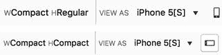

### 图 3-20. iPhone 5S 不同方向的尺寸类别

尺寸类别指定了一组设备及其方向，在这些设备和方向下，可用的视图尺寸具有相似的宽度和高度。宽度 (`w`) 和高度 (`h`) 各有三种不同的类别：

- **任意** – 屏幕宽度或高度为任意值的设备组。这是最通用的组，涵盖所有设备。
- **常规** – 代表常规屏幕尺寸的设备
- **紧凑** – 代表紧凑屏幕的设备

因此，你可以排列出这些类别的 3 × 3 组合，总共产生九种尺寸类别，汇总在表 3-1 中。要查看设备如何归类到尺寸类别，请点击位于 `View As` 下拉列表左侧的类别名称。此时会出现一个小的弹出窗口。该窗口被划分为 3 × 3 的网格。当你在网格中移动指针时，不同的单元格会高亮显示，并描述其尺寸类别。随后，其描述和涵盖的设备会显示在底部（图 3-21）。

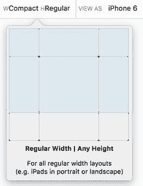

### 图 3-21. 显示尺寸类别及其简短描述的网格

### 表 3-1. iOS 应用的尺寸类别

| 宽度/高度 | 任意 | 常规 | 紧凑 |
| --- | --- | --- | --- |
| 任意 | `wAnyhAny` | `wAnyhR` | `wAnyhC` |
| 常规 | `wRhAny` | `wRhR` | `wRhC` |
| 紧凑 | `wChAny` | `wChR` | `wChC` |

当你使用 iOS 设计器设计视图时，添加的控件会隐式地与当前的尺寸类别相关联。因此，当你更改尺寸类别时，这些控件将不会显示。唯一的例外是 `wAnyhAny` 类别，它与 `View As` 下拉列表中的 `通用` 设备相关联。在这种情况下，你定义的布局在所有设备和方向上都适用。

你可能想知道为什么需要尺寸类别。最简单的答案是，它们让你能够轻松设计自适应视图。例如，我在 `AutoLayout` 应用中使用的布局在竖屏模式下运行完美。标签位于文本框上方，因此用户可以轻松修改文本。但是，当设备方向切换为横屏时，文本框会被调整大小以适应可用宽度，但这看起来不自然。相反，更有效的方法是更改布局，将标签放置在文本框的左侧。这样做可以为其他控件节省垂直空间，并更有效地利用可用空间。

让我们看看如何实现这种控件排列的动态更改。我首先为文本框和标签安装 `wChC` 类别。为此，我使用 `属性` 窗口，其中已安装的尺寸类别列表位于 `高度` 属性正下方（图 3-22）。然后，我点击 `设置` 下拉列表，并从上下文菜单中选择 **紧凑** ➤ **紧凑** 选项。第一个指定宽度组，第二个对应高度组。

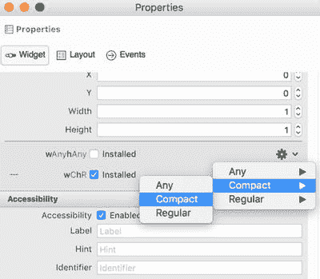

### 图 3-22. 安装 wChC 尺寸类别

安装新尺寸类别后，我可以将预览模式切换到横屏。控件变得可见。然而，文本框的宽度并未改变，因为我之前定义的约束仅适用于 `wChR` 尺寸类别。我需要为 `wChC` 尺寸类别指定新的约束。我还可以任意重新排列控件。因此，我首先将文本框放置在标签旁边。然后，与 `wChR` 尺寸类别类似，我使用 T 形图标在文本框和父视图之间定义三个约束，使得左边距、顶部边距和右边距分别固定为 100、32 和 10 px。添加这些约束的方式与之前类似，唯一不同的是现在需要将左侧的 T 形拖动到文本框。为 `wChC` 尺寸类别定义新约束后，我重新运行 `AutoLayout` 应用，其视图现在取决于屏幕方向（图 3-23）。

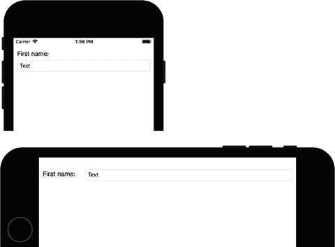

### 图 3-23. AutoLayout 与尺寸类别结合使用，可以设计自适应视图，其中的控件会根据屏幕尺寸和方向调整大小并重新排列：竖屏（上）和横屏（下）


