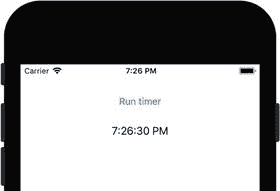

# UI 线程

在许多场景中，你需要从后台线程更新控件的特定属性，以避免阻塞由主线程或 UI 线程控制的用户界面。例如，当用户按下按钮时，你向 Web 服务发送请求并等待响应，然后相应地更新 UI。根据网络速度，这可能需要几秒到几十秒的时间。因此，UI 可能会暂时冻结。为了避免这类锁死，你需要在后台线程中发送和解析请求。

然而，由于每个 Xamarin.iOS 应用都使用 .NET 框架，你需要确保所有对可视控件的更新都在 UI 线程中执行。这是 .NET 线程模型的要求，在该模型中，只有 UI 线程可以访问可视控件。在 .NET 框架应用中，当你尝试从后台线程更新可视控件时，会抛出相应的异常。

让我们在 Xamarin.iOS 应用中研究这个问题。为此，我创建了另一个名为 `BackgroundUpdate` 的应用（使用单视图应用项目模板，目标平台为 iOS 9.0 及以上版本）。然后，我定义了该应用的用户界面，使默认视图包含一个标题为“Run timer”的按钮和一个名为 `LabelTime` 的标签。按钮位于顶部，标签位于其下方。接着，我为按钮创建了一个默认事件处理器，并按照代码清单 3-27 的定义进行了实现。这段代码需要引用 `System.Threading.Tasks` 命名空间。

当用户按下按钮时，我使用 `Task` 类的静态 `Run` 方法在后台线程中执行另一个方法 `UpdateTimer`。该方法将指定的代码块排入线程池以执行。线程池是一组预先创建的后台线程，由运行时创建，目的是在后台执行工作时节省时间。

```
private bool isTimerActive = false;
partial void ButtonRunTimer_TouchUpInside(UIButton sender)
{
if (!isTimerActive)
{
isTimerActive = true;
Task.Run(UpdateTimer);
}
}
代码清单 3-27.
将 UpdateTimer 方法排入线程池
```

如代码清单 3-28 所示，`UpdateTimer` 实现了一个无限循环。在这个循环的每次迭代中，我读取当前时间并将其写入 `LabelTime` 的 `Text` 属性。然后，我通过 `Task.Delay` 将循环执行延迟一秒钟。因此，我期望 `UpdateTimer` 能像一块简单的表一样工作，以一秒的精度显示当前时间。然而，当我在模拟器中运行应用并按下按钮时，虽然 `UpdateTimer` 方法正在运行，但什么也没有发生。应用程序输出显示了原因：UIKit 一致性错误：你正在调用一个只能从 UI 线程调用的 UIKit 方法。这意味着你不能直接从后台线程更新可视控件。相反，你需要在主线程上调用每个这样的操作。为此，你可以使用 `InvokeOnMainThread` 方法，如代码清单 3-29 所示。在 `UpdateTimer` 方法中做出这些更改后，当你重新运行应用时，计时器将正常工作（图 3-24）。

```
private Task UpdateTimer()
{
while (true)
{
try
{
LabelTime.Text = DateTime.Now.ToLongTimeString();
}
catch(Exception e)
{
Console.WriteLine(e.Message);
}
Task.Delay(1000).Wait();
}
}
代码清单 3-28.
从后台线程更新标签的 Text 属性无效
```



图 3-24. BackgroundUpdate 应用的示例结果

```
private Task UpdateTimer()
{
while (true)
{
InvokeOnMainThread(() =>
{
LabelTime.Text = DateTime.Now.ToLongTimeString();
});
Task.Delay(1000).Wait();
}
}
代码清单 3-29.
可视控件的属性只能从主线程更新
```

## 本章小结

在本章中，你学习了如何定义视图。我们首先创建了单视图应用，以掌握一些基本控件（如开关或滑块）的使用。然后，我们转向了更高级的主题，使用表格及其数据源来创建显示多个项目的视图。你还学习了如何使用 Web 视图渲染交互式网页，以及如何使用地图工具包访问和显示用户的位置。随后，我们使用了自动布局，你可以用其来设计自适应应用，这些应用的视图会根据特定设备的尺寸自动调整。在下一章中，我们将继续研究视图。具体来说，我们将创建多视图应用，并学习如何使用各种导航方法在视图之间切换。

