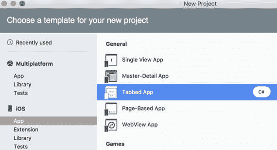
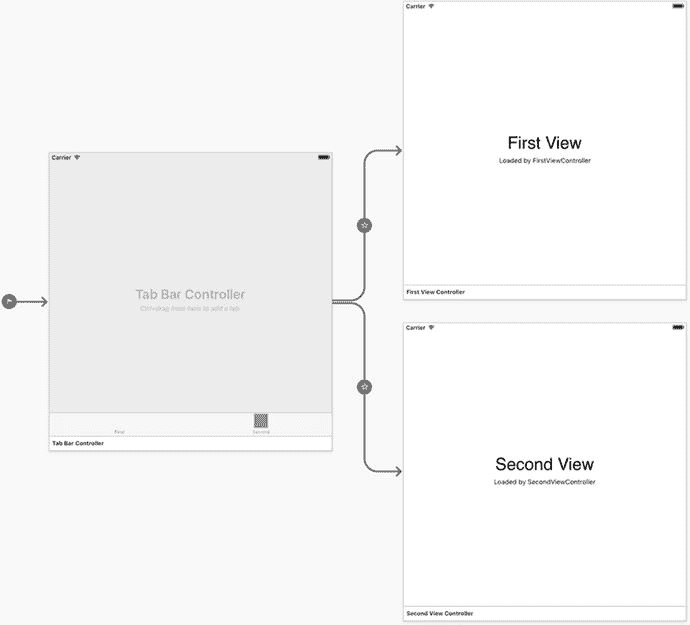
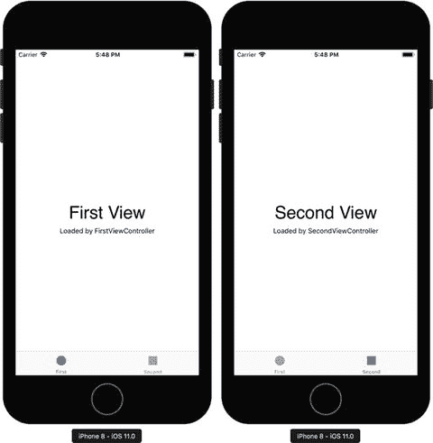
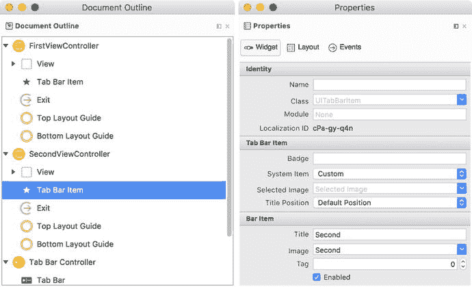
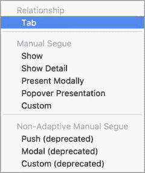
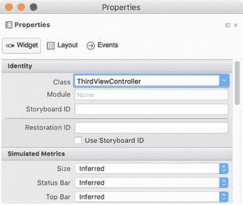
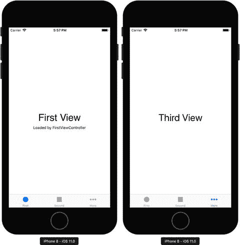
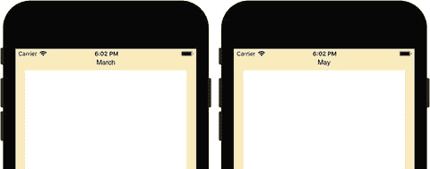
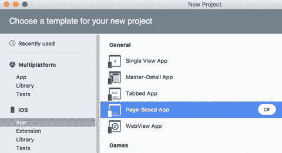
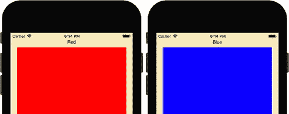

# 选项卡栏

我先从选项卡栏控件开始介绍，该控件可用于创建多选项卡应用。在此应用中，用户通过一个栏在不同视图（选项卡）之间切换。这个栏包含带有图标和可选标签的按钮。当用户按下某个按钮时，对应的选项卡内容便会显现。



**图 4-1.** 在 Visual Studio 中创建选项卡应用

要创建该选项卡应用，我使用了一个专用的项目模板（见图 4-1）。我将应用名称设置为 `Navigation.Tabs`，最低目标版本设置为 iOS 9.0。Visual Studio 会创建一个包含以下视图控制器的项目（见图 4-2）：



**图 4-2.** 基于专用模板创建的选项卡应用的默认结构

*   **选项卡栏控制器** – 管理选项卡界面的控制器。更具体地说，此控制器负责在选项卡之间进行切换。每个选项卡都有独立的视图控制器和对应的视图。
*   **第一个视图控制器和第二个视图控制器** – 与第一个和第二个选项卡关联的视图控制器。请注意，`Navigation.Tabs` 项目还包含两个文件：`FirstViewController.cs` 和 `SecondViewController.cs`，其中存储了同名类的定义。`FirstViewController` 和 `SecondViewController` 都派生自 `UIViewController`，除了受保护的构造函数外，它们还包含了 `ViewDidLoad` 和 `DidReceiveMemoryWarning` 方法的默认实现，这与之前所有单视图应用中使用的 `ViewController` 类的定义类似。

请注意，默认情况下只有两个选项卡，因此当你运行应用时，其外观将如图 4-3 所示。即，选项卡栏有两个元素：“First”和“Second”。你可以点击它们来切换选项卡。每个选项卡都有两个标签，显示视图编号以及实现该视图控制器的关联类的名称。



**图 4-3.** 默认的选项卡应用

要控制选项卡栏中项目的显示外观，你需要使用选项卡栏项目的属性。如图 4-4 左侧部分（文档大纲）所示，每个选项卡都有一个关联的选项卡栏项目。点击它后，所有控件属性都会在属性面板中显示（图 4-4 右侧部分）。具体来说，你可以修改项目标题（“Bar Item”组下的“Title”条目）及其图片（“Title”下方的下拉列表）。你也可以通过“System Item”下拉列表（“Tab Bar Item”组）使用系统图标之一。此列表包含以下选项卡栏图标：书签、通讯录、下载、收藏夹、精选、历史记录、最多、最近、最多查看、最近查看、搜索和最高评分。



**图 4-4.** 选中的选项卡栏项目的属性面板

现在我们已经了解了 `Navigation.Tabs` 项目的结构，让我们看看如何添加另一个选项卡。为此，我按以下步骤操作。首先，在 iOS 设计器中，从工具箱添加视图控制器。然后，使用 CTRL+拖动操作，将此对象与选项卡栏控制器关联。我先按住键盘上的 CTRL 键，同时点击选项卡栏控制器的灰色区域，然后将鼠标光标移动到新的视图控制器上并释放鼠标按钮。此时会出现一个“segue”弹窗，我在其中的“Relationship”组下选择“Tab”（图 4-5）。



**图 4-5.** 创建选项卡关系

iOS 设计器创建了第三个选项卡，我现在可以通过修改新视图控制器的视图来设计它。最后，我创建视图控制器类。为此，我使用视图控制器的属性面板，在“Identity”组下的“Class”条目中键入 `ThirdViewController`（图 4-6）。按下回车键后，Visual Studio 会将 `ThirdViewController.cs` 文件添加到 `Navigation.Tabs` 项目中。



**图 4-6.** 将类与视图控制器关联

在实现 `ThirdViewController` 类之前，我先向项目添加另一个文件 `BaseViewController.cs`，在其中定义所有其他视图控制器的基类（代码清单 4-1）。我之所以使用基类，是因为我希望所有视图控制器在关联视图出现时都能遵循相似的逻辑。即，在应用程序输出中显示与视图关联的类名称。我实现这样的逻辑，是为了向您明确展示在选项卡间切换时会显示不同的视图。因此，您可以使用此选项来编写处理选项卡视图生命周期的自定义逻辑，就像处理所有其他视图一样。

```
using System;
using System.Diagnostics;
using Foundation;
using UIKit;

namespace Navigation.Tabs
{
    public class BaseViewController : UIViewController
    {
        protected BaseViewController(IntPtr handle) : base(handle) { }
        public override void ViewWillAppear(bool animated)
        {
            base.ViewDidLoad();
            Debug.WriteLine(GetType().Name);
        }
    }
}
```

**代码清单 4-1.** 视图即将出现时显示关联类型的名称

有了 `BaseViewController`，我创建了 `ThirdViewController` 类的骨架，如代码清单 4-2 所示，并修改了 `FirstViewController` 和 `SecondViewController` 的声明，使它们派生自 `BaseViewController` 而不是 `UIViewController`（代码清单 4-3）。

```
public partial class ThirdViewController : BaseViewController
{
    public ThirdViewController(IntPtr handle) : base(handle) { }
    public override void ViewDidLoad()
    {
        base.ViewDidLoad();
    }
    public override void DidReceiveMemoryWarning()
    {
        base.DidReceiveMemoryWarning();
    }
}
```

**代码清单 4-2.** `ThirdViewController` 类的骨架

```
public partial class FirstViewController : BaseViewController
public partial class SecondViewController : BaseViewController
```

**代码清单 4-3.** 修改后的 `FirstViewController` 和 `SecondViewController` 声明

上述更改确保当你运行应用并在选项卡之间切换时，你会在应用程序输出中看到类名称。但是，当你激活最后一个选项卡时，它将是空的，并且最后一个选项卡栏项目将显示默认按钮。要更改选项卡栏项目的图标和标题，我使用属性面板（请参阅图 4-4），在其中的“System Item”下拉列表中选择“More”图标。为了在最后一个选项卡上添加标签，我打开 `ThirdViewController.cs` 文件并定义 `AddLabel` 方法。最后，我在 `ViewDidLoad` 视图事件处理程序中调用此方法（代码清单 4-4）。

```
public override void ViewDidLoad()
{
    base.ViewDidLoad();
    AddLabel();
}

private void AddLabel()
{
    // 创建标签
    var label = new UILabel()
    {
        Text = "Third View"
    };
    // 更新字号
    nfloat fontSize = 36.0f;
    label.Font = label.Font.WithSize(fontSize);
    // 测量标签
    var labelSize = UIStringDrawing.StringSize(label.Text, label.Font);
    // 并据此调整框架
    label.Frame = new CGRect(View.Frame.Width / 2 - labelSize.Width / 2,
                             View.Frame.Height / 2 - labelSize.Height / 2,
                             labelSize.Width,
                             labelSize.Height) ;
    Add(label);
}
```

**代码清单 4-4.** 动态创建标签


在`AddLabel`方法中，首先实例化`UILabel`类并设置其`Text`属性为`Third View`。随后，将字体大小设置为 36 像素，并使用`UIStringDrawing`类的静态方法`StringSize`测量生成的标签。该方法返回`CGRect`类的实例，用于设置标签的位置，使其在视图中居中。接着，调用`UIViewController`类的`Add`方法将标签添加到视图。同时，通过修改最后一个选项卡的标签栏项的相应属性，将第三个栏的按钮更改为`More`（参考图 4-3）。因此，重新运行应用后，其外观将如图 4-7 所示。



图 4-7. Navigation.Tabs 应用的最终形态

### Pages

还有另一个项目模板，可用于快速实现多视图应用——即基于页面的应用模板（Page-Based App），如图 4-8 所示。在本节中，将使用此模板创建另一个应用`Navigation.PageBased`，其目标为 iOS 9.0 及以上版本。使用该模板时，Visual Studio 会创建一个包含十二个页面的应用，每个页面在标签中显示月份名称。运行应用时，其外观将如图 4-9 所示。



图 4-9. 默认的基于页面的应用包含十二个页面，每个页面显示一个月份名称



图 4-8. 新建项目窗口，显示 iOS 项目模板中的“基于页面的应用”

现在来看`Navigation.PageBased`应用是如何工作的。如果打开此项目的 iOS 设计器，会看到它由两个控制器组成：

*   根视图控制器（Root View Controller）——初始视图控制器，提供窗口的内容视图。
*   数据视图控制器（Data View Controller）——在每个页面提供并显示数据（对应的月份名称）的视图控制器。

根视图控制器的逻辑在同名类中实现，并存储在`RootViewController.cs`文件下。`RootViewController`有两个公共成员（列表 4-5）：`ModelController`和`PageViewController`。

```
public UIPageViewController PageViewController { get; private set; }
public ModelController ModelController { get; private set; }
```
列表 4-5. `RootViewController`的公共成员

第一个成员`PageViewController`的类型为`UIPageViewController`，后者代表页面视图控制器。该控制器是`Navigation.PageBased`项目（以及所有其他使用“基于页面的应用”模板创建的项目）的核心部分，负责管理底层页面之间的导航。每个页面都有一个关联的视图控制器，在本例中由`DataViewController`类表示。`PageViewController`在`RootViewController`的`ViewDidLoad`事件处理程序中被实例化（参见配套代码`Chapter_04/Navigation.PageBased/RootViewController.cs`）。

`RootViewController`的第二个公共成员`ModelController`派生自`UIPageViewControllerDataSource`类，并为每个页面实现数据源。更具体地说，`ModelController`有一个`pageData`字段，它是一个字符串集合。该集合包含月份列表，通过`NSDateFormatter`类获得（列表 4-6）。

```
public class ModelController : UIPageViewControllerDataSource
{
    readonly List pageData;
    public ModelController()
    {
        var formatter = new NSDateFormatter();
        pageData = new List(formatter.MonthSymbols);
    }
    // ModelController 定义的其余部分
}
```
列表 4-6. `ModelController`类定义片段

然后，`ModelController`实现了一个`GetViewController`方法，如列表 4-7 所示。`GetViewController`使用`UIStoryboard`类实例的静态方法`InstantiateViewController`创建`DataViewController`的实例。随后，`GetViewController`将适当的月份名称传递给所创建的视图控制器。月份名称存储在`DataViewController`类实例的公共属性`DataObject`中。

```
public DataViewController GetViewController(int index, UIStoryboard storyboard)
{
    if (index >= pageData.Count)
        return null;
    // 创建新的视图控制器并传递合适的数据。
    var dataViewController = (DataViewController)storyboard.
        InstantiateViewController("DataViewController");
    dataViewController.DataObject = pageData[index];
    return dataViewController;
}
```
列表 4-7. `ModelController`类的`GetViewController`方法


`GetViewController`方法在`GetNextViewController`和`GetPreviousViewController`中被使用，这两个方法是基类`UIPageViewControllerDataSource`中对应方法的重写（参见代码清单 4-8）。当用户在标签页之间切换时会调用这两个方法，因此月份名称会通过`DataViewController`显示。

```
public override UIViewController GetNextViewController(
UIPageViewController pageViewController,
UIViewController referenceViewController)
{
int index = IndexOf((DataViewController)referenceViewController);
if (index == -1 || index == pageData.Count - 1)
return null;
return GetViewController(index + 1, referenceViewController.Storyboard);
}
public override UIViewController GetPreviousViewController (
UIPageViewController pageViewController,
UIViewController referenceViewController)
{
int index = IndexOf((DataViewController) referenceceViewController);
if (index == -1 || index == 0)
return null;
return GetViewController(index - 1, referenceViewController.Storyboard);
}
public int IndexOf(DataViewController viewController)
{
return pageData.IndexOf(viewController.DataObject);
}
Listing 4-8.
Implementation of the GetNextViewController and GetPreviousViewController of the UIPageViewControllerDataSource Class
```

如前所述，`DataViewController`类有一个公共成员`DataObject`，它用于传递月份名称。然后，每当视图将要出现时，该值会显示在标识为`dataLabel`的标签中（代码清单 4-9）。

```
public partial class DataViewController : UIViewController
{
public string DataObject
protected DataViewController(IntPtr handle) : base(handle) { }
// Default definitions of the ViewDidLoad
// and DidReceiveMemoryWarning
public override void ViewWillAppear(bool animated)
{
base.ViewWillAppear(animated);
dataLabel.Text = DataObject;
}
}
Listing 4-9.
A Definition of the DataViewController Class
```

在了解了`Navigation.Pages`项目的结构之后，我们来对其进行修改。现在，我将把默认的数据源（月份列表）替换为一个键值对列表。每个键值对将包含一个颜色标题和一个`UIColor`类的实例。颜色标题将显示在标签中，取代月份名称；而`UIColor`实例则用于设置页面的背景色，如图 4-10 所示。



Figure 4-10.

一个经过修改的基于页面的应用，现在显示的是颜色名称而非月份。同时，矩形的背景颜色与标签中显示的颜色名称相对应。

为了实现上述更改，我首先打开 iOS 设计器，然后将数据视图控制器中的白色矩形名称设置为`ViewDataPanel`。接着，我根据代码清单 4-10 修改了`DataViewController`类。

```
using System;
using System.Collections.Generic;
using UIKit;
namespace Navigation.PageBased
{
public partial class DataViewController : UIViewController
{
public KeyValuePair DataObject { get; set; }
protected DataViewController(IntPtr handle) : base(handle) { }
// Default definitions of ViewDidLoad
// and DidReceiveMemoryWarning
public override void ViewWillAppear(bool animated)
{
base.ViewWillAppear(animated);
dataLabel.Text = DataObject.Key;
ViewDataPanel.BackgroundColor = DataObject.Value;
}
}
}
Listing 4-10.
A Modified Definition of the DataViewController Class
```

在代码清单 4-10 中，我将`DataObject`成员的类型从`string`改为`KeyValuePair<string, UIColor>`。然后，在`ViewWillAppear`视图事件处理程序中，我分别从`DataObject`的`Key`和`Value`属性获取颜色名称和值。

最后，我需要更新`ModelController`，在其中修改`pageData`成员的声明和初始化，如代码清单 4-11 所示。我创建了三个`KeyValuePair`对象：

*   键：Red，值：`UIColor.Red`
*   键：Green，值：`UIColor.Green`
*   键：Blue，值：`UIColor.Blue`

因此，当您重新运行应用时，将会看到三个页面可用，每个页面对应一种颜色（红、绿、蓝）。因此，应用的外观将如图 4-10 先前所示。

```
public class ModelController : UIPageViewControllerDataSource
{
readonly List> pageData;
public ModelController()
{
pageData = new List>
{
new KeyValuePair("Red", UIColor.Red),
new KeyValuePair("Green", UIColor.Green),
new KeyValuePair("Blue", UIColor.Blue)
};
}
// The rest of ModelController definition
}
Listing 4-11.
A Modified Data Source for the Page View Controller
```


