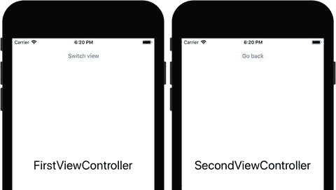
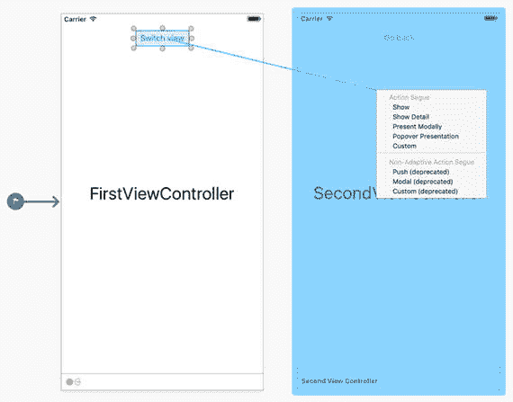
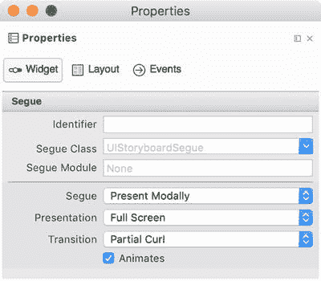
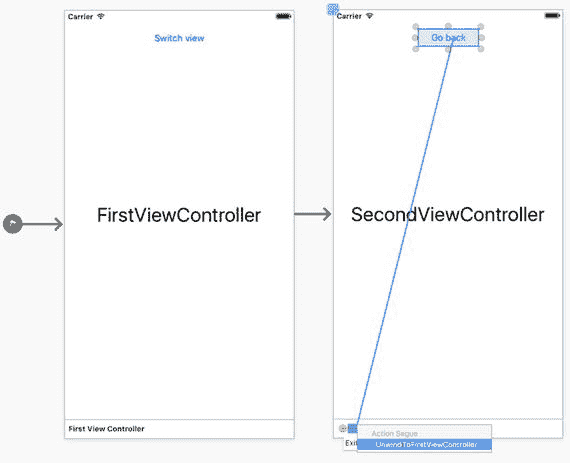
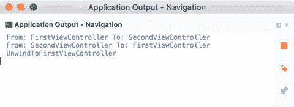

# 视图控制器之间的导航

虽然可以利用选项卡和基于页面的项目模板快速创建多视图 iOS 应用程序，但这些项目模板并非总是适用。在这种情况下，你可以手动在视图控制器之间创建 Segue。当用户按下特定控件时，所选视图控制器将呈现。在本节中，我将展示如何手动创建这样一个名为 `Navigation` 的自定义多视图应用。如图 4-11 所示，该应用将包含两个视图控制器：First View Controller 和 Second View Controller。两者都将有相关联的视图，并带有描述视图控制器的标签。用户将能够使用"Switch view"或"Go back"按钮在视图之间切换，具体取决于当前显示的视图。



图 4-11. 我们将在本节中开发的 Navigation 应用的视图

为了实现 `Navigation` 应用，我使用了目标平台为 iOS 9.0 及以上版本的 Single View App 项目模板。然后，我通过添加一个按钮和一个标签来修改视图，并按图 4-11 左侧所示进行配置。接着，将初始视图控制器的类设置为 `FirstViewController`，再添加另一个视图控制器并将其类设置为 `SecondViewController`。然后，按图 4-11 右侧所示修改第二个视图控制器的视图。最后，删除 `ViewController.cs` 文件，因为它不再需要。

视图控制器准备就绪后，我定义了第一个 Segue。如图 4-12 所示，我从"Switch view"按钮按住 CTRL 键并拖动到第二个视图控制器。释放鼠标左键后，会弹出一个窗口。该弹出窗口允许我选择用于呈现新视图控制器的 Segue。这里有八种 Segue 类型可供选择，但其中三种（Non-Adaptive Action Segue 组）已弃用，因此我不讨论它们。其余 Segue 如下：



图 4-12. 在视图控制器之间创建 Segue

- **Show** – 在源视图控制器的内容之上模态显示所选视图控制器的视图。此 Segue 也可以通过 `UIViewController` 的 `ShowViewController` 方法以编程方式实现。
- **Show Detail** – 此 Segue 对应 `UIViewController.ShowDetailViewController` 方法，仅对 `UISplitViewController` 有效。在此情况下，Show Detail 会用所选视图控制器替换第二个子视图控制器。对于其他视图控制器，Show Detail 的行为与 Show Segue 类似。
- **Present Modally** – 模态呈现视图控制器。基本上，其工作方式与 Show Segue 类似，但你可以修改其呈现和过渡样式。
- **Popover Presentation** – 此 Segue 的效果取决于实际的尺寸类别。对于具有常规宽度的屏幕，目标视图控制器将显示为弹出视图；而在水平紧凑型设备上则全屏模态显示。
- **Custom** – 自定义创建的 Segue。如果其他 Segue 都不适合，你可以使用此类型。

在这里，我选择了 Show Segue，因此重新运行 `Navigation` 应用后，当你点击"Switch view"按钮时，Second View Controller 的视图就会出现。

## 编辑 Segue

你可以通过编辑 Segue 的属性来修改它。所有创建的 Segue 都会出现在 Document Outline 面板中。目前，我们只有一个 Segue，它位于 `FirstViewController` 项下。如图 4-13 所示，你可以使用 Segue 的属性来更改其类型（Show、Show Detail、Present Modally 或 Popover Presentation）。根据 Segue 类型的不同，会出现额外的控件。在我的例子中，我将 Segue 类型更改为 Present Modally，然后 Presentation 和 Transition 下拉列表出现。我使用它们分别将呈现样式和过渡样式设置为 Full Screen 和 Partial Curl。



图 4-13. Segue 的属性

## Unwind Segue

虽然我们创建了 Segue，但由于"Go back"按钮尚未工作，用户无法返回到 First View Controller。为了实现此功能，我们需要创建用于关闭视图控制器的 Unwind Segue。要创建此类 Segue，首先需要定义一个操作，以便视图控制器能够被展开。此方法被定义为 Unwind Segue 的目标。

为了在 `Navigation` 应用中创建 Unwind Segue，我在 `FirstViewController` 类的定义中补充了 `UnwindToFirstViewController` 方法，该方法显示在代码清单 4-12 中，并且我还导入了一个必要的命名空间：`System.Diagnostics`。`UnwindToFirstViewController` 使用 `Action` 属性进行了修饰，因此它可以被 Objective-C 运行时调用。因此，iOS 设计器可以识别它，我们现在可以将此方法用于 Unwind Segue。

```
[Action("UnwindToFirstViewController:")]
public void UnwindToFirstViewController(UIStoryboardSegue segue)
{
    Debug.WriteLine("UnwindToFirstViewController");
}
```

代码清单 4-12. Unwind Segue 的操作

为了将 `UnwindToFirstViewController` 方法与"Go back"按钮关联起来，我打开可视化设计器，然后从"Go back"按钮按住 CTRL 键并拖动到位于 Second View Controller 底部的绿色 Exit 图标（图 4-14）。释放鼠标左键后，会弹出一个窗口。此窗口包含一个可用于 Segue 的兼容操作方法列表。在我的例子中，这个列表只包含一个项：`UnwindToFirstViewController`。因此，选择该项后，我可以重新运行应用，你将看到现在可以在视图控制器之间导航了。



图 4-14. 创建 unwind segue


### 准备 Segues

通常，你需要在视图控制器之间传递数据。例如，你显示一个视图控制器来收集用户输入，当这个视图控制器被关闭后，收集到的数据会在初始的视图控制器中被使用。要在视图控制器之间传递数据，你需要使用 `UIViewController` 类的 `PrepareForSegue` 方法。`PrepareForSegue` 会在 Segue 执行之前被调用。

为了演示 `PrepareForSegue` 类的使用示例，我向 Navigation 项目补充了另一个类 `BaseViewController`，其定义如代码清单 4-13 所示。

```csharp
public class BaseViewController : UIViewController
{
    protected BaseViewController(IntPtr handle) : base(handle) { }

    public override void PrepareForSegue(UIStoryboardSegue segue, NSObject sender)
    {
        base.PrepareForSegue(segue, sender);
        var sourceViewControllerName = segue.SourceViewController.GetType().Name;
        var destinationViewControllerName = segue.DestinationViewController.GetType().Name;
        Debug.WriteLine($"From: {sourceViewControllerName} " +
                        $"To: {destinationViewControllerName}");
    }
}
```

*代码清单 4-13. `PrepareForSegue` 方法输出实现源视图控制器和目标视图控制器的类名*

`BaseViewController` 类继承自 `UIViewController`，有一个默认构造函数，并重写了 `PrepareForSegue` 方法。除了基类功能外，`PrepareForSegue` 方法读取实现源视图控制器和目标视图控制器的两个类的名称，然后将它们显示在应用程序输出中。

此示例演示了如何访问参与 Segue 的视图控制器实例。因此，要实际在视图控制器之间传递数据，你需要为相关类补充公共属性，然后在 `PrepareForSegue` 方法中重写它们。

为了使用代码清单 4-13 中的类，我修改了 `FirstViewController` 和 `SecondViewController` 的声明，使它们继承自 `BaseViewController` 而不是 `UIViewController`（如代码清单 4-3 所示）。因此，当你重新运行应用并在视图之间进行导航时，Navigation 应用的输出应类似于图 4-15 所示。



*图 4-15. 显示 Segue 流程的应用程序输出*

## 本章小结

在本章中，我们学习了如何创建多视图应用，以及如何使用各种方法在视图之间进行导航。我们从 Tabbed App 项目模板开始，研究了如何创建和修改标签页。然后，我们转向 Page-Based App 项目模板。我们深入研究了其相对复杂的结构，然后修改了应用代码以更好地理解基于页面的导航。最后，我们在视图控制器之间创建了自定义的 Segue。在下一章中，我们将学习如何处理 iOS 应用中的触摸手势。

