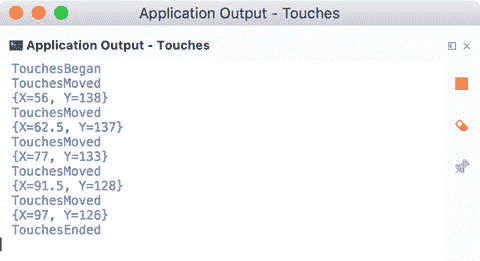

# 5. 触摸

移动设备通过触摸手势进行控制。用户可以使用手势在视图之间切换，或者操作视觉元素来平移、旋转和调整其大小。在本章中，我们将学习如何在 Xamarin.iOS 中处理手势。我们将从对“手势识别器”的简短介绍开始，然后研究如何使用手势进行导航。随后，我们将学习如何以编程方式创建和控制手势识别器及其生成的编程事件。最后，我们将实现一个应用，其中视觉组件的位置、旋转和缩放都将通过手势来控制。因此，学完本章后，你将了解如何对视觉控件执行复杂操作，这对于媒体应用（如照片编辑器或绘图工具）非常有用，这类应用广泛利用手势来调整视觉元素的外观。

## 触摸与手势识别器

每当用户触摸屏幕时，会引发一系列相应的事件。要处理这些事件，通常需要在与视图控制器关联的类中实现以下方法：

- `TouchesBegan`：当用户用一根或多根手指触摸屏幕时调用。
- `TouchesMoved`：当用户改变其手指在屏幕上的位置时调用。
- `TouchesCancelled`：当触摸被取消时调用。
- `TouchesEnded`：当触摸手势完成时调用。

为了展示一个实际示例，我创建了一个名为 `Touches` 的新单一视图应用（通用，目标 iOS 9.0 及以上）。随后，我通过上述方法扩展了 `ViewController` 类的定义，并根据代码清单 5-1 实现了它们（请注意，此代码依赖于以下命名空间：`Foundation`、`System.Diagnostics` 和 `System.Linq`）。`TouchesBegan`、`TouchesCancelled` 和 `TouchesEnded` 的实现不需要任何额外说明。所有这些方法都只是将方法名打印到应用程序输出中。需要稍多一点解释的是 `TouchesMoved` 方法。该函数除了打印 `TouchesMoved` 字符串外，还会遍历事件处理程序接收到的触摸集合。通常，应用用户可以使用不止一根手指来执行手势。每根手指与屏幕的接触都被定义为一个*触摸*。关于每次触摸的信息作为 `NSSet` 的一个实例提供给事件处理程序。该对象表示一个无序的对象集合，在此特定情况下，代表触摸。因此，在代码清单 5-1 中，触摸集首先被转换为 `UITouch` 对象的集合，每个 `UITouch` 对象都是屏幕上触摸或手指移动的抽象表示。然后，我将接触点的位置打印到应用程序输出中。

```csharp
public override void TouchesBegan(NSSet touches, UIEvent evt)
{
    base.TouchesBegan(touches, evt);
    Debug.WriteLine("TouchesBegan");
}

public override void TouchesMoved(NSSet touches, UIEvent evt)
{
    base.TouchesMoved(touches, evt);
    Debug.WriteLine("TouchesMoved");
    foreach (var touch in touches.Cast<UITouch>())
    {
        Debug.WriteLine(touch.GetPreciseLocation(View));
    }
}

public override void TouchesCancelled(NSSet touches, UIEvent evt)
{
    base.TouchesCancelled(touches, evt);
    Debug.WriteLine("TouchesCancelled");
}

public override void TouchesEnded(NSSet touches, UIEvent evt)
{
    base.TouchesEnded(touches, evt);
    Debug.WriteLine("TouchesEnded");
}
```

*代码清单 5-1. 处理触摸的低级信息*

当你在模拟器中运行 `Touches` 应用时，它将生成如图 5-1 所示的输出。如图所示，手势的开始由 `TouchesBegan` 方法指示。随后，会引发一系列 `TouchesMoved` 事件，每个事件报告当前触摸接触点的位置（手指接触屏幕的位置）。最后，触发 `TouchesEnded` 事件，通知你用户已将手指从屏幕上抬起。



*图 5-1. 显示 `Touches` 应用示例输出的屏幕截图*


