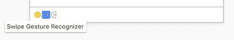
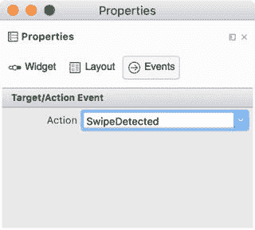
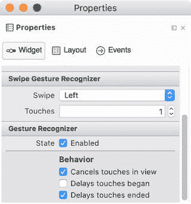
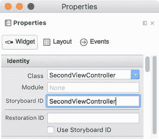
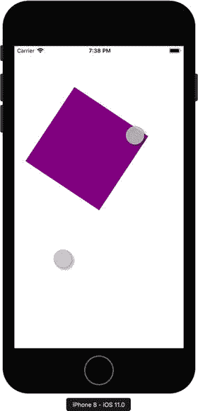
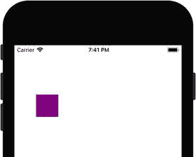

# iOS 中的手势识别器

为了识别或检测特定手势（如滑动、长按、平移、旋转或捏合），你需要分析触摸集合以找出代表特定手势的模式。更具体地说，你需要利用每个接触点的位置来确定触摸的路径。不过，iOS SDK 提供了几个为你完成此任务的类。这些类被定义为手势识别器，由于它们实现了所有必要的计算，因此极大地简化了手势识别。你只需实例化一个合适的手势识别器类，它便会在检测到特定手势时触发相应的事件。与大多数其他 iOS SDK 组件一样，手势识别器被封装在 Xamarin.iOS 的相应对象中。

在接下来的几节中，我将告诉你如何利用手势识别器来执行导航和操作可视化组件。

## 滑动与长按手势识别器

为了演示如何使用手势识别器，我将扩展我们在前一章中开发的导航应用，使用户能够通过滑动和长按手势在视图之间切换。具体来说，长按手势将允许用户从第一个视图导航到第二个视图，而用户则使用滑动手势导航回第一个视图。我将首先使用 iOS 设计器创建滑动手势识别器，然后以编程方式生成长按手势识别器。

为了实现这样的功能，我首先复制配套代码中`Chapter_05` 下的项目文件夹，然后在 Visual Studio 中将项目重命名（通过上下文菜单中的“重命名...”选项），从 Navigation 改为 Navigation.Swipe。接着，我打开 iOS 设计器，从工具箱中将“滑动手势识别器”拖拽到第二个视图控制器上。这个手势识别器的一个小图标会出现在第二个视图控制器的底部（见图 5-2）。



**图 5-2.** 添加到视图控制器的滑动手势识别器

然后，我打开滑动识别器的“属性”面板，进入“事件”选项卡，在“操作”下拉列表中输入 `SwipeDetected`（图 5-3）。按下回车键后，Visual Studio 会创建一个事件处理程序，我按照清单 5-2 对其进行定义。



**图 5-3.** 为滑动手势识别器创建事件处理程序

```
partial void SwipeDetected(UISwipeGestureRecognizer sender)
{
    DismissViewController(true, null);
}
```

**清单 5-2.** 识别到滑动手势时关闭视图控制器

当你重新运行应用时，你可以通过点击“切换视图”按钮导航到第二个视图。一旦第二个视图显示出来，你可以通过右滑手势返回第一个视图。每当检测到这种手势时，识别器就会触发一个相应的事件，此事件由 `SwipeDetected` 处理。如清单 5-2 所示，我使用此方法通过 `UIViewController` 类的 `DismissViewController` 方法导航回。`DismissViewController` 接受两个参数：

*   `animated` – 指定视图之间的过渡是否应带有动画效果
*   `completionHandler` – 允许你指定动画完成时执行的代码

在清单 5-2 中，我启用了动画效果，并为 `DismissViewController` 的第二个参数传递了 `null`，因为我不需要执行任何额外的方法。

手势识别器还具有多个属性，允许你根据特定需求调整它们。例如，你可以修改滑动手势识别器，使其对选定的滑动方向做出响应（见图 5-4）。为此，你需要使用“滑动”下拉列表。此外，你还可以指定滑动所需的手指数量（“触摸次数”数字控件）。



**图 5-4.** 滑动手势识别器的属性

现在，让我们使用长按手势识别器来实现从第一个视图到第二个视图的导航。为此，我按如下步骤操作。首先，我在 `FirstViewController` 类的 `ViewDidLoad` 方法中以编程方式实例化代表识别器的 `UILongPressGestureRecognizer` 类（清单 5-3）。然后，我使用 `AddGestureRecognizer` 方法将生成的实例与视图关联起来。

```
public override void ViewDidLoad()
{
    base.ViewDidLoad();
    var longPressGestureRecognizer =
        new UILongPressGestureRecognizer(PresentSecondViewController);
    View.AddGestureRecognizer(longPressGestureRecognizer);
}
```

**清单 5-3.** 以编程方式创建手势识别器

如清单 5-3 所示，`UILongPressGestureRecognizer` 类的构造函数接受一个指向操作的参数，即 `PresentSecondViewController`，每当识别到手势时就会调用该操作。在前面的案例中，我们通过“属性”面板做了同样的事情（将方法与 Action 事件关联）。所以现在你知道了将操作与手势识别器关联的两种等效方法。

```
private void PresentSecondViewController(
    UILongPressGestureRecognizer sender)
{
    if(sender.State == UIGestureRecognizerState.Began)
    {
        var secondViewController = Storyboard.
            InstantiateViewController("SecondViewController")
            as UIViewController;
        PresentViewController(secondViewController, true, null);
    }
}
```

**清单 5-4.** 呈现视图控制器

`PresentSecondViewController` 的定义出现在清单 5-4 中。此方法有一个参数 `sender`，其类型为 `UILongPressGestureRecognizer`。该参数存储了在此案例中检测到长按手势的识别器实例。在实践中，你可以使用此实例来获取有关手势的更多信息。特别是，你可以检查手势状态，该状态由 `UIGestureRecognizerState` 枚举中的以下项目之一表示：

*   `Began` – 表示手势识别器已识别出一组触摸为特定手势
*   `Changed` – 表示触摸（或手指位置）已发生改变
*   `Possible` – 手势识别器已识别出触摸组，但仍在对它们进行处理以便识别手势
*   `Ended`、`Cancelled`、`Failed` – 分别表示手势已完成、已取消或已失败（未识别）。

在清单 5-4 中，我查找 `Began` 状态，然后使用 `Storyboard` 的 `InstantiateViewController` 方法创建第二个视图控制器。随后，我调用 `PresentViewController` 来导航到第二个视图控制器。为了使用 `Storyboard` 类实例化视图控制器，我需要为视图控制器设置故事板标识符。我通过“属性”面板进行设置，如图 5-5 所示。

如果你现在重新运行应用，你可以在第一个视图中点击并按住鼠标按钮。稍后第二个视图就会出现。如你所见，你现在可以通过手势和按钮在视图之间进行导航。



**图 5-5.** 设置 `SecondViewController` 的故事板标识符


## 使用手势操作控件

现在我将介绍如何使用手势识别器来操作控件。为此，我将开发一款应用，如图 5-6 所示。该应用包含一个控件，即 `UIView` 类的一个实例，代表一个紫色方块。该控件将通过平移手势进行平移，通过旋转手势进行旋转，并通过捏合手势进行缩放。



**图 5-6.** 手势应用的示例视图，我们将通过开发此应用来学习平移、旋转和捏合手势识别器

#### 平移手势识别器

我首先使用单视图应用项目模板创建手势应用。我将此应用设为通用应用，并将最低目标版本设置为 iOS 9.0。接着，在 `ViewController` 类中，我首先导入两个命名空间：`System.Drawing` 和 `CoreGraphics`。然后，我声明一个 `UIView` 类型的私有字段。该字段存储了对紫色矩形的引用。之后，我实现了两个私有方法：`AddSquare` 和 `AddPanGestureRecognizer`（代码清单 5-5）。

```
private UIView square;

private void AddSquare(float squareSideLength, UIColor color)
{
    square = new UIView()
    {
        BackgroundColor = color,
        Frame = new RectangleF(0, 0, squareSideLength, squareSideLength),
        Center = new CGPoint(View.Frame.Width / 2.0, View.Frame.Height / 2.0)
    };
    Add(square);
}

private void AddPanGestureRecognizer()
{
    var panGestureRecognizer =
        new UIPanGestureRecognizer(TranslateSquare);
    View.AddGestureRecognizer(panGestureRecognizer);
}
```

**代码清单 5-5.** `ViewController` 类的私有成员

`AddSquare` 方法用于创建并配置代表紫色方块的 `UIView` 类实例。该方法使用了之前讨论过的功能，因此无需对其做进一步说明。代码清单 5-5 中的第二个方法 `AddPanGestureRecognizer` 首先实例化 `UIPanGestureRecognizer`，然后将其与视图关联。每当此对象识别到平移手势时，它将调用代码清单 5-6 中的 `TranslateSquare` 方法。

```
private void TranslateSquare(UIPanGestureRecognizer sender)
{
    var translation = sender.TranslationInView(View);
    square.Transform = CGAffineTransform.
        MakeTranslation(translation.X, translation.Y);
}
```

**代码清单 5-6.** 平移方块

`TranslateSquare` 通过 `UIPanGestureRecognizer` 类实例的 `TranslationInView` 方法读取使用平移手势产生的平移量。`TranslationInView` 返回一个 `CGPoint` 结构体实例，其 `X` 和 `Y` 属性分别存储相对于水平和垂直方向的平移量。然后，我使用这些值通过修改 `UIView` 的 `Transform` 属性来平移方块，该属性的引用存储在 `square` 字段中。`Transform` 属性的类型为 `CGAffineTransform`，表示特定视觉组件的几何变换。一般来说，这种变换称为仿射变换，描述了视觉控件的平移、旋转和缩放变化。目前我只平移方块，因此我使用 `CGAffineTransform` 结构体的 `MakeTranslation` 静态方法创建平移变换。`MakeTranslation` 方法接受两个参数，分别表示水平方向（第一个参数，`tx`）和垂直方向（第二个参数，`ty`）的平移量。因此，每当识别到平移手势时，方块就会相应地平移。

为了实际使用 `AddSquare` 和 `AddPanGestureRecognizer` 方法，我修改了 `ViewDidLoad` 视图事件处理程序，如代码清单 5-7 所示。现在你可以在模拟器中运行手势应用并使用平移手势——只需在按住鼠标左键的同时移动鼠标光标。你会看到，当你在视图内移动鼠标光标时，方块会随之平移。但是，你很容易注意到，你可以在视图中的任何位置执行平移手势。现在让我们修改应用，使其仅当平移手势在方块上执行时（换句话说，当你虚拟地按住方块时）才平移方块。这需要检测接触位置，下一节将对此进行讨论。



**图 5-7.** 使用平移手势平移方块

```
public override void ViewDidLoad()
{
    base.ViewDidLoad();
    AddSquare(50.0f, UIColor.Purple);
    AddPanGestureRecognizer();
}
```

**代码清单 5-7.** `ViewController` 的 `ViewDidLoad` 方法


#### 检测手势位置

要获取触摸的位置，你可以使用手势识别器类实例的 `LocationInView` 方法。该方法适用于所有手势识别器，因为它是在 `UIGestureRecognizer` 类中实现的，而其他所有手势识别器都继承自此类。你也可以使用 `LocationOfTouch` 方法跟踪执行手势的特定触摸（手指）的位置。这两个方法都返回 `CGPoint` 结构体，其 `X` 和 `Y` 属性存储了手势（或特定手指）在屏幕上的几何位置。

在 Gestures 应用中，我使用 `LocationInView` 方法来检查平移手势是否在紫色方块上执行。如代码清单 5-8 所示，我使用该方法实现了另一个辅助函数 `IsTouchLocationWithinSquare`。后者读取主视图中的触摸位置，然后检查该位置是否在方块内。为此，我使用了 `square.Frame` 属性的 `Contains` 方法。`Contains` 会计算位置（`CGPoint` 结构体）的 `X` 和 `Y` 分量是否在包围紫色方块的矩形（`Frame` 属性）内。如果是，我就可以平移该方块。因此，我修改了 `TranslateSquare` 方法（代码清单 5-6），首先调用 `IsTouchLocationWithinSquare`。然后，如果该方法返回 `true`，我就为方块创建平移变换（代码清单 5-9）。

```
private bool IsTouchLocationWithinSquare(
UIPanGestureRecognizer panGestureRecognizer)
{
var location = panGestureRecognizer.LocationInView(View);
return square.Frame.Contains(location.X, location.Y);
}
代码清单 5-8.
仅当在方块上执行平移手势时，视图才会被平移
```

```
private void TranslateSquare(UIPanGestureRecognizer sender)
{
if (IsTouchLocationWithinSquare(sender))
{
var translation = sender.TranslationInView(View);
square.Transform = CGAffineTransform.
MakeTranslation(translation.X, translation.Y);
}
}
代码清单 5-9.
仅当手势位置在该控件的边界内时，紫色方块才会被平移
```

如果你现在重新运行 Gestures 应用，你会看到只有当你在该控件上方执行平移手势时，方块才会被平移。然而，当你重复这个手势时，你会注意到紫色方块的平移变换始终以屏幕中心为原点。这是因为手势识别器计算的是单次手势期间的位移，并未考虑之前手势所做的任何平移。要精确地平移方块，我们需要累计自应用启动以来执行的所有手势的总平移量。因此，我们需要在连续的平移手势结束后存储平移值，然后将该结果值添加到后续的位移中。为了实现这样的功能，我首先在 `ViewController` 的定义中补充了一个私有字段 `lastTranslation`（类型为 `CGPoint`），然后修改 `TranslateSquare` 方法，以存储手势结束时的平移量（代码清单 5-10）。为了累计单次平移手势期间完成的平移量，我读取了 `square.Transform` 属性的 `x0` 和 `y0` 属性。我将结果值存储在 `lastTranslation` 成员的 `X` 和 `Y` 分量中，并将它们添加到实际的平移变换中。因此，当你重新运行应用时，紫色方块会“记住”它在上次平移手势中的位置。这样，所有后续的平移手势都能正确地平移紫色方块。

```
private CGPoint lastTranslation;
private void TranslateSquare(UIPanGestureRecognizer sender)
{
if (IsTouchLocationWithinSquare(sender))
{
var translation = sender.TranslationInView(View);
square.Transform = CGAffineTransform.MakeTranslation(
translation.X + lastTranslation.X,
translation.Y + lastTranslation.Y);
}
if (sender.State == UIGestureRecognizerState.Ended)
{
lastTranslation.X = square.Transform.x0;
lastTranslation.Y = square.Transform.y0;
}
}
代码清单 5-10.
累计方块的平移量
```

#### 旋转和捏合手势识别器

现在让我们将旋转和捏合手势识别器整合到 Gestures 应用中，这样紫色方块就可以被旋转和缩放。此示例的实现需要几个组件。我将从一个方法开始，该方法将平移、旋转和缩放组合成一个单一的仿射变换。然后，我将告诉你如何以编程方式创建旋转和捏合手势识别器，并启用同时手势识别。


