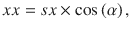
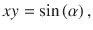
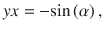
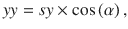

# 总仿射变换

数学上，仿射变换可以表示为`3 × 3`的变换矩阵`T`：

![$$ T=\left[\begin{array}{ccc} xx& xy& 0\\ {} yx& yy& 0\\ {}x0& y0& 1\end{array}\right] $$](A453659_1_En_5_Chapter_Equa.gif)

该矩阵第一列和第二列的每个元素对应于`CGAffineTransform`结构体中相应的字段。因此，通常情况下，你可以通过手动计算矩阵元素的值来实现总仿射变换。例如，如果你想要平移一个对象，你需要将水平和垂直方向的位移值分别写入`x0`和`y0`属性。缩放和旋转则需要稍微多一些数学计算：









其中`sx`和`sy`表示水平和垂直方向的缩放因子，而`α`是旋转角度。

幸运的是，`CGAffineTransform`提供了一些方法来简化这些计算。更具体地说，要创建总仿射变换，我结合使用了`CGAffineTransform`结构体的以下静态方法：

- `MakeIdentity`：创建单位变换。它是仿射变换的一种特殊形式，不会修改视觉控件。`MakeIdentity`将`CGAffineTransform`的`xx`、`xy`、`yx`和`yy`属性设置为`1`，将`x0`和`y0`属性设置为`0`。
- `Translate`：更新`CGAffineTransform`的`x0`和`y0`属性。
- `Rotate`：更新变换矩阵的`xx`、`xy`、`yx`和`yy`元素，而不改变缩放因子。
- `Scale`：改变缩放因子（`sx`和`sy`），并将它们包含在`CGAffineTransform`的`xx`、`xy`、`yx`和`yy`属性中，但不改变旋转角度。

我在清单 5-11 的`UpdateSquareTransform`方法中使用了上述方法。该方法还包含了之前的平移、旋转和缩放值。为此，存储在`lastTranslation`和`lastRotation`字段中的值被加到当前的平移和旋转上，而当前的缩放因子则乘以前一个缩放因子。这是因为缩放操作是乘法的，而平移和旋转是加法的（参见前面的公式）。

```
private nfloat lastRotation;
private nfloat lastScale = 1.0f;
private void UpdateSquareTransform(CGPoint translation,
nfloat rotation, nfloat scale)
{
var transform = CGAffineTransform.MakeIdentity();
// Include previous translation, rotation, and scale
translation.X += lastTranslation.X;
translation.Y += lastTranslation.Y;
rotation += lastRotation;
scale *= lastScale;
// Combine translation, rotation, and scale
transform = CGAffineTransform.Translate(
transform, translation.X, translation.Y);
transform = CGAffineTransform.Rotate(transform, rotation);
transform = CGAffineTransform.Scale(transform, scale, scale);
square.Transform = transform;
}
```

*清单 5-11：紫色正方形的总仿射变换实现*

有了`UpdateSquareTransform`方法，我首先修改了`TranslateSquare`函数，如清单 5-12 所示，然后实现了另外两个方法（清单 5-13），它们之后将由旋转和捏合手势识别器使用。

```
private void TranslateSquare(UIPanGestureRecognizer sender)
{
if (IsTouchLocationWithinSquare(sender))
{
var translation = sender.TranslationInView(View);
//square.Transform = CGAffineTransform.MakeTranslation(
//    translation.X + lastTranslation.X,
//    translation.Y + lastTranslation.Y);
UpdateSquareTransform(translation, 0.0f, 1.0f);
}
if (sender.State == UIGestureRecognizerState.Ended)
{
lastTranslation.X = square.Transform.x0;
lastTranslation.Y = square.Transform.y0;
}
}
```

*清单 5-12：`TranslateSquare`方法的更新定义*

```
private void RotateSquare(UIRotationGestureRecognizer sender)
{
UpdateSquareTransform(new CGPoint(), sender.Rotation, 1.0f);
if (sender.State == UIGestureRecognizerState.Ended)
{
lastRotation += sender.Rotation;
}
}
private void ScaleSquare(UIPinchGestureRecognizer sender)
{
UpdateSquareTransform(new CGPoint(), 0.0f, sender.Scale);
if (sender.State == UIGestureRecognizerState.Ended)
{
lastScale *= sender.Scale ;
}
}
```

*清单 5-13：旋转和缩放紫色正方形（注意水平和垂直方向的缩放因子相等）*

## 旋转和缩放控件

最后，我需要做的就是创建两个额外的手势识别器——一个用于旋转，一个用于捏合。为此，在`ViewController`类中，我实现了`AddRotationAndPinchGestureRecognizers`方法（清单 5-14），然后在`ViewDidLoad`事件处理程序中调用它（清单 5-15）。

```
private void AddRotationAndPinchGestureRecognizers()
{
var rotationGestureRecognizer =
new UIRotationGestureRecognizer(RotateSquare);
var pinchGestureRecognizer =
new UIPinchGestureRecognizer(ScaleSquare);
View.AddGestureRecognizer(pinchGestureRecognizer);
View.AddGestureRecognizer(rotationGestureRecognizer);
}
```

*清单 5-14：创建旋转和捏合手势识别器*

```
public override void ViewDidLoad()
{
base.ViewDidLoad();
AddSquare(50.0f, UIColor.Purple);
AddPanGestureRecognizer();
AddRotationAndPinchGestureRecognizers();
}
```

*清单 5-15：添加对旋转和捏合手势的支持*

重新运行应用程序后，您将看到类似于图 5-6 的结果。请注意，要执行旋转和捏合手势，您需要使用多点触控，在模拟器中可以通过 ALT 键启用。这将激活两个矩形，代表两根手指。然后，按下鼠标左键并旋转手指（旋转手势）或改变它们之间的距离（捏合手势）。您将注意到紫色正方形会根据您的虚拟触摸进行变换。然而，一次只能运行一个手势识别器，这意味着，例如，您不能在旋转正方形的同时执行捏合手势。这是因为默认情况下禁用了这种同时手势识别。我将在接下来告诉您如何启用它。


#### 同时手势识别

要实现同时手势识别，你需要使用手势识别器类的 `ShouldRecognizeSimultaneously` 属性。代码清单 5-16 展示了如何为旋转手势和捏合手势启用同时识别。

```
private UIRotationGestureRecognizer rotationGestureRecognizer;
private UIPinchGestureRecognizer pinchGestureRecognizer;
private void AddRotationAndPinchGestureRecognizers()
{
rotationGestureRecognizer =
new UIRotationGestureRecognizer(RotateSquare);
pinchGestureRecognizer =
new UIPinchGestureRecognizer(ScaleSquare);
rotationGestureRecognizer.ShouldRecognizeSimultaneously
+= GestureRecognizer_ShouldRecognizeSimultaneously;
pinchGestureRecognizer.ShouldRecognizeSimultaneously
+= GestureRecognizer_ShouldRecognizeSimultaneously;
View.AddGestureRecognizer(pinchGestureRecognizer);
View.AddGestureRecognizer(rotationGestureRecognizer);
}
private bool GestureRecognizer_ShouldRecognizeSimultaneously(
UIGestureRecognizer RgestureRecognizer,
UIGestureRecognizer otherGestureRecognizer)
{
return true;
}
代码清单 5-16.
启用同时手势识别
```

现在，旋转手势和捏合手势可以同时处理。因此，你还需要更新 `RotateSquare` 和 `ScaleSquare` 方法，以包含正方形在旋转时可以被重新缩放的情况。为此，在代码清单 5-16 中，两个手势识别器的引用都被存储在 `ViewController` 类的字段中。然后，使用这些引用来更新正方形的旋转和缩放变化，如代码清单 5-17 所示。

```
private void RotateSquare(UIRotationGestureRecognizer sender)
{
//UpdateSquareTransform(new CGPoint(), sender.Rotation, 1.0f);
if (sender.State == UIGestureRecognizerState.Changed)
{
if (pinchGestureRecognizer.State == UIGestureRecognizerState.Changed)
{
UpdateSquareTransform(new CGPoint(),
sender.Rotation, pinchGestureRecognizer.Scale);
}
else
{
UpdateSquareTransform(new CGPoint(), sender.Rotation, 1.0f);
}
}
if (sender.State == UIGestureRecognizerState.Ended)
{
lastRotation += sender.Rotation;
}
}
private void ScaleSquare(UIPinchGestureRecognizer sender)
{
// UpdateSquareTransform(new CGPoint(), 0.0f, sender.Scale);
if (sender.State == UIGestureRecognizerState.Changed)
{
if (rotationGestureRecognizer.State == UIGestureRecognizerState.Changed)
{
UpdateSquareTransform(new CGPoint(),
rotationGestureRecognizer.Rotation, sender.Scale);
}
else
{
UpdateSquareTransform(new CGPoint(), 0.0f, sender.Scale);
}
}
if (sender.State == UIGestureRecognizerState.Ended)
{
lastScale *= sender.Scale;
}
}
代码清单 5-17.
旋转过程中包含缩放变化
```

代码清单 5-17 中的两个方法工作原理相似，因此我只讨论第一个方法 `RotateSquare`。在该方法中，我首先检查旋转手势是否被正确识别。为此，我读取由 `sender` 参数提供的 `UIRotationGestureRecognizer` 类实例的 `State` 属性。随后，我调用 `UpdateSquareTransform`。该方法的参数取决于用户是否在旋转的同时执行捏合手势。如果是，我将从捏合手势识别器获取的缩放变化作为 `UpdateSquareTransform` 的最后一个参数传递。然而，如果用户在旋转期间没有重新缩放紫色正方形，我只需为最后一个参数传递 1。这表示缩放不应改变。最后，我将累积的旋转量存储在 `lastRotation` 成员中。

我鼓励你独立扩展 Gestures 应用，使其不仅能同时识别旋转和捏合手势，还能识别拖动手势。

## 总结

在本章中，我们创建了三个示例应用，它们展示了如何在 Xamarin.iOS 中处理触摸事件。你学习了如何使用手势在视图之间实现导航，以及如何通过各种手势识别器操作视觉控件。在此过程中，你了解了手势状态、同时手势识别以及 `CGAffineTransform` 结构，该结构帮助你通过仿射变换任意变换对象。

