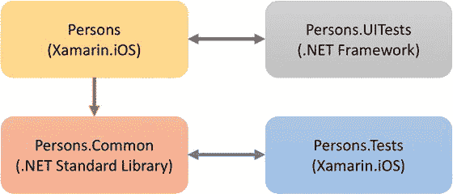
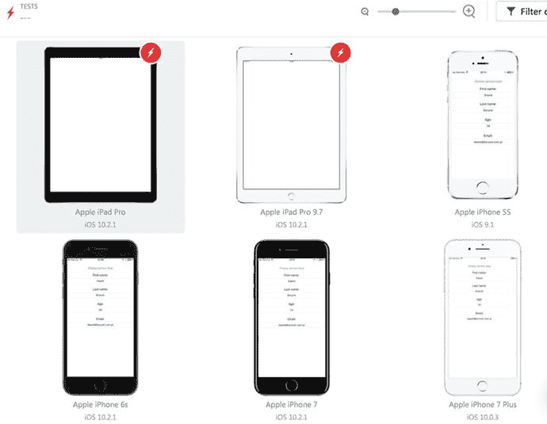
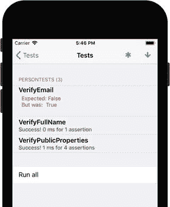
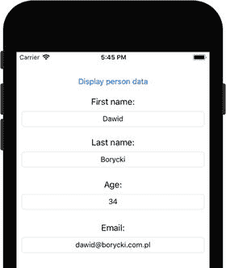

# 6. 单元测试

实现高质量的应用程序是软件工程中最重要且最困难的任务之一，尤其是在移动开发领域。移动应用通常有很多竞争解决方案，因此要使你的应用成功，你需要确保应用在各种移动设备上都能正常运行。这要求你在许多设备上重复执行相同的测试，这可能是一个非常漫长且昂贵的过程。因此，单元测试（或称自动化测试）不仅仅是开发者手中又一个花哨的工具，它更应成为软件工程中的一种习惯。自动化测试可以在代码编译后根据需要多次运行，以确保新功能不会影响其他项目组件。这样一来，你可以轻松跟踪应用程序的开发与维护。自动化测试不仅限于验证逻辑层的功能，还可以用于测试用户界面。更具体地说，自动化 UI 测试会模拟用户操作，与应用的视觉组件（或视图）进行交互，其方式与人类用户完全一致。

图 6-1. 关系图，展示了本章将实现的项目之间的关系。单箭头表示仅引用关系，双箭头表示将被自动测试的项目。

在本章中，我将向你展示如何实现自动化的单元测试和 UI 测试。为此，我将创建几个项目，它们之间的关系如图 6-1 所示。显然，我将创建一个单视图 iOS 应用 Persons。该应用以 Xamarin.iOS 框架为目标，并使用一个模型类 `Person`。`Person` 类将在一个独立的、可复用的 .NET 标准库项目 Persons.Common 中实现。Persons 应用的 UI 如图 6-2 所示。其中包含一个按钮、四个标签和四个文本框。当你点击按钮时，一个默认人物的数据（名、姓、电子邮件和年龄）将显示在文本框中。

为了验证此功能，我将拥有两个测试项目：Persons.Tests 和 Persons.UITests。第一个项目 Persons.Tests 是一个标准的 Xamarin.iOS 应用，它实现了图 6-3 所示的测试运行器。该项目将用于测试 `Person` 类。具体来说，我将检查公共属性设置器和公共方法。第二个测试项目 Persons.UITests 是一个 .NET 框架类库，它将由 Xamarin UI 测试框架调用，用于验证 Persons 应用的 UI。具体来说，我将实现一个测试，该测试将模拟点击一个按钮，然后检查文本框是否包含预期的值。最后，我将展示如何在 Xamarin 测试云 (XTC) 中运行 UI 测试。XTC 为你提供了基于云的访问权限，可访问一个包含各种屏幕尺寸和操作系统的物理设备群。因此，你可以自动测试你的应用，以确保它与所有目标设备兼容。XTC 拥有基于 Web 的界面，甚至可以让你可视化你的应用在你选择运行 UI 测试的设备上的显示效果（图 6-4）。

图 6-4. 一份示例报告，显示了在 Xamarin 测试云中多个物理设备上执行的 UI 测试结果

图 6-3. 单元测试运行器

图 6-2. Persons 应用的用户界面

