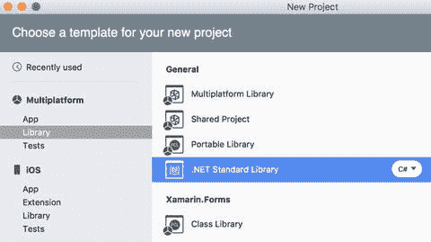

# 创建待测试模型

我首先开始实现一个 `Persons.Common` 共享库，该库是通过 .NET 标准库项目模板创建的（图 6-5）。在此项目中，我新建一个名为 `Models` 的文件夹，并在其中保存一个 `Person.cs` 文件，其中包含代码清单 6-1 中给出的 `Person` 类定义。此类有四个公共属性，其中三个为 `string` 类型，分别存储名字、姓氏和电子邮件地址。最后一个属性 `Age` 是整型（`int`），用于存储指定人员的年龄。此外，`Person` 类还定义了两个公共方法。第一个方法 `FullName()` 返回由名字和姓氏组合而成的字符串。第二个方法 `IsEmailValid()` 实现了对电子邮件地址非常简单的验证：仅检查给定字符串是否包含 `@` 符号。当然，这种算法对有效验证电子邮件地址来说过于原始，但它将成为我们某个单元测试的目标——发现此问题。



*图 6-5. 创建共享库*

```
public class Person
{
    public string FirstName { get; set; }
    public string LastName { get; set; }
    public string Email { get; set; }
    public int Age { get; set; }
    public string FullName()
    {
        return $"{FirstName} {LastName}";
    }
    public static bool IsEmailValid(string email)
    {
        return email.Contains("@");
    }
}
```

*代码清单 6-1. 待测试模型的定义*

