# 实现单元测试

有了待测试的模型，我们就可以实现实际的单元测试来验证其功能。为此，我使用单元测试应用项目模板创建了另一个名为 `Persons.Tests` 的项目。该模板在“新建项目”对话框中的位置如图 6-6 所示。然后，我像配置任何其他 iOS 应用一样配置此单元测试应用（参见图 6-7）。具体来说，我将其设为通用应用，以兼容 iPhone 和 iPad，然后将目标版本设置为 iOS 9.0。最后，我选择项目位置并创建该项目。

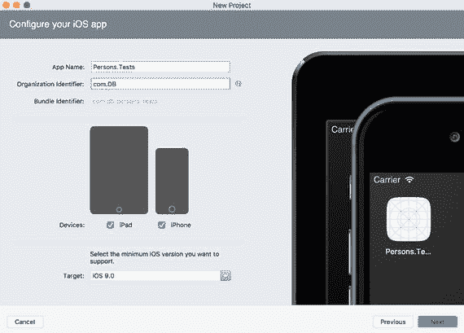

*图 6-7. 配置 `Persons.Tests` 单元测试应用*

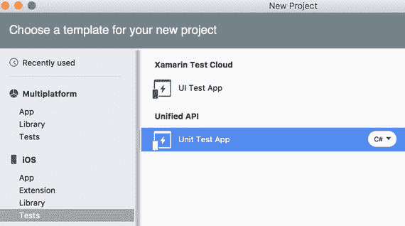

*图 6-6. 创建单元测试应用项目*

创建单元测试应用后，您会发现其结构与典型的 iOS 应用相同。具体来说，如代码清单 6-2 所示，该应用有一个标准的 `Main` 方法，该方法通过 `UnitTestAppDelegate` 类启动应用的 UI。

```
public class Application
{
    static void Main(string[] args)
    {
        UIApplication.Main(args, null, "UnitTestAppDelegate");
    }
}
```

*代码清单 6-2. 单元测试应用的入口点*

代码清单 6-3 展示了 `UnitTestAppDelegate` 类的定义。与“标准”`AppDelegate` 类一样，`UnitTestAppDelegate` 派生自 `UIApplicationDelegate`。但是，与之前使用过的典型 `AppDelegate` 不同，`UnitTestAppDelegate` 显式实现了 `FinishedLaunching` 应用事件处理程序。这是因为 `Persons.Tests` 应用没有主故事板来设置初始视图控制器，而是通过编程方式实现——实例化 `UIWindow` 对象，设置其 `RootViewController` 属性，并通过调用 `UIWindow` 类实例的 `MakeKeyAndVisible` 方法使窗口可见。我们看到，根视图控制器是使用 `TouchRunner` 类创建的。该类由 NUnit 测试框架提供，并提供了用于执行单元测试的 UI（请参考图 6-3）。

```
[Register("UnitTestAppDelegate")]
public partial class UnitTestAppDelegate : UIApplicationDelegate
{
    UIWindow window;
    TouchRunner runner;

    public override bool FinishedLaunching(
        UIApplication app, NSDictionary options)
    {
        // create a new window instance based on the screen size
        window = new UIWindow(UIScreen.MainScreen.Bounds);
        runner = new TouchRunner(window);
        // register every test included in the main application/assembly
        runner.Add(System.Reflection.Assembly.GetExecutingAssembly());
        window.RootViewController = new UINavigationController(
            runner.GetViewController());
        // make the window visible
        window.MakeKeyAndVisible();
        return true;
    }
}
```

*代码清单 6-3. `UnitTestAppDelegate` 的完整定义*

在测试模型之前，我们需要配置引用。请注意，`Person` 类定义在与 `Persons.Tests` 不同的项目中，因此后者必须引用 `Persons.Common` 库。要配置此引用，您需要使用引用管理器（图 6-8）。要打开此窗口，请转到解决方案资源管理器，导航到 `Persons.Tests` 项目，然后使用“引用”节点上下文菜单中的“编辑引用...”选项。进入引用管理器后，转到“项目”选项卡并选择 `Persons.Common` 项目，如图 6-8 所示。现在，`Person` 类就可以在 `Persons.Tests` 中使用了。

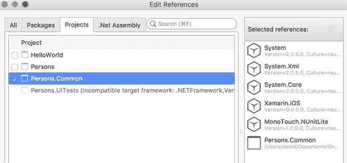

*图 6-8. 显示 `Persons.Tests` 项目的引用管理器*


为了实现对实际单元测试的编写，我在`Persons.Tests`项目中添加了一个新文件`PersonTests.cs`。为了创建该文件，我使用了新建文件对话框，并从 iOS 标签页中选择了“单元测试”对象（图 6-9）。`PersonTests.cs`文件的默认内容展示了如何创建实际执行单元测试的测试类和测试方法。更具体地说，测试类必须使用`TestFixtureAttribute`进行装饰（见清单 6-4）。该属性指示测试框架在此类中查找测试方法。请注意，`PersonTests`类是公开的，否则 NUnit 测试框架将无法识别它。

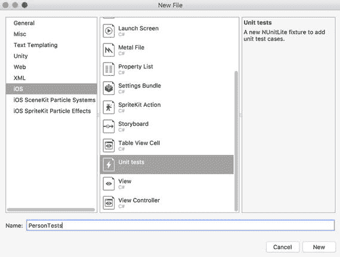

图 6-9. 添加单元测试文件

```
[TestFixture]
public class PersonTests
```
清单 6-4. `PersonTests`类的声明

`PersonTests.cs`文件中给出的默认测试并没有实现任何有用的功能，但它们确实展示了如何定义一个测试方法。也就是说，这样的方法必须是测试类的一个公开函数。此外，一个测试方法不返回任何值，并且需要使用`TestAttribute`进行装饰。任何符合这些要求的方法都会被`TouchRunner`看到并显示在其 UI 中。

为了定义实际的测试，我首先导入了两个额外的命名空间：`Persons.Common.Models`和`System.Text.RegularExpressions`，然后将`PersonTests`类的默认定义替换为三个测试方法：`VerifyPublicProperties`、`VerifyFullName`和`VerifyEmail`。第一个测试方法`VerifyPublicProperties`出现在清单 6-5 中。此方法以及任何其他测试方法的通用结构都包含三个界限清晰的代码块：准备（arrange）、执行（act）和断言（assert）。在后续的清单中，每个代码块都用适当的注释进行了标记。在准备块中，你通常为测试准备输入数据。因此，在清单 6-5 中，我声明了四个常量，这些常量随后在执行块中用于调用被测试的逻辑。在这里，我验证了`Person`类的公共属性设置器。因此，我使用默认构造函数实例化了该类，然后将其公共属性的值设置为先前声明的常量。接着，在断言块中，我验证`Person`类实例的公共属性是否确实具有预期的值。

为了验证被测试的值，你需要使用`NUnit.Framework.Assert`类的静态方法。如果你之前使用过 Windows 版 Visual Studio，你可能已经知道来自`Microsoft.VisualStudio.TestPlatform.UnitTestFramework`包的`Assert`类。这两个类的工作方式相似，并暴露了类似的功能。具体来说，我在清单 6-5 中使用的`AreEqual`方法会比较两个变量，并且只要这些变量的值不同，就会引发一个`NUnit.Framework.AssertionException`类型的异常。此外，你还可以定义当此断言被触发时显示的消息。在清单 6-5 中，我独立验证了`Person`类实例的每个公共属性，因此每个断言都有不同的消息。

```
[Test]
public void VerifyPublicProperties()
{
// Arrange
const string expectedFirstName = "Dawid";
const string expectedLastName = "Borycki";
const string expectedEmail = "dawid@borycki.com.pl";
const int expectedAge = 34;
// Act
var person = new Person()
{
FirstName = expectedFirstName,
LastName = expectedLastName,
Email = expectedEmail,
Age = expectedAge
};
// Assert
Assert.AreEqual(expectedFirstName, person.FirstName,
"Incorrect first name");
Assert.AreEqual(expectedLastName, person.LastName,
"Incorrect last name");
Assert.AreEqual(expectedEmail, person.Email,
"Incorrect e-mail");
Assert.AreEqual(expectedAge, person.Age,
"Incorrect age");
}
```
清单 6-5. 验证公共属性设置器的测试方法定义

第二个测试方法`VerifyFullName`验证了`Person`类实例的`FullName`方法。基本上，`VerifyFullName`的工作方式类似于`VerifyPublicProperties`。也就是说，在`VerifyFullName`方法中，我首先在准备块中声明预期的值。然后，我使用这些值来实例化一个`Person`类（执行块）。最后，我调用`FullName`方法并检查其结果是否与预期结果一致。

你可能会想，为什么在已经知道`Person`类定义的情况下，还要实现如此相对简单的测试方法。通常，作为单元测试人员，你并没有这种特权。相反，你必须编写能够全面覆盖类定义的测试方法，但通常你并不拥有源代码的访问权限。因此，一般来说，你是从简单的测试方法开始，验证类的基本功能，然后逐步增加测试的复杂度。通过这样做，你能够确保该类从一开始就得到了恰当的测试。

这种方法也用于测试驱动开发（TDD）。在 TDD 中，你先实现类的框架，然后编写相应的单元测试。在这个初始阶段，由于缺乏实际的类实现，所有测试都应该失败。随后，你开始实现这个类，并迭代地运行单元测试，以确保你的实现是有效的。你持续这个过程，直到所有测试都通过。当你在修改和扩展应用程序时，TDD 也很有益。在对代码进行任何更改后，你都会运行单元测试，以确保它不会影响已实现的功能。

```
[Test]
public void VerifyFullName()
{
// Arrange
const string expectedFirstName = "Dawid";
const string expectedLastName = "Borycki";
string expectedFullName = $"{expectedFirstName} {expectedLastName}";
// Act
var person = new Person()
{
FirstName = expectedFirstName,
LastName = expectedLastName
};
// Assert
Assert.AreEqual(expectedFullName, person.FullName());
}
```
清单 6-6. 验证`Person`类实例的`FullName`方法

`PersonTests`类的最后一个测试方法`VerifyEmail`出现在清单 6-7 中。该方法旨在验证`Person`类的静态方法`IsEmailValid`。遵循我之前的说法，`VerifyEmail`的实现更为复杂。具体来说，在准备块中，我首先声明一个待检查的电子邮件地址。在这个例子中，这个电子邮件地址是无效的，因为它不包含域名。然后，在执行块中，我使用正则表达式对电子邮件字符串进行验证。这是在一个私有辅助方法`PersonsTests.EmailCheck`中实现的。由于此方法不符合测试方法的要求，它不会被测试运行器识别。


`EmailCheck`函数使用了 .NET Framework 中的`Regex`类。该类用于执行正则表达式操作。特别地，我使用了`IsMatch`静态方法来检查正则表达式模式是否与给定字符串匹配。在列表 6-7 中使用的模式可匹配任何包含字母和数字组合后跟`@`符号及域名的字符串。然后将此匹配结果与`Person.IsEmailValid`方法返回的值进行比较。由于后者使用了一种非常简单的电子邮件地址验证方式，因此该测试应失败。要验证这一点，我们需要运行已实现的测试方法。

```
[Test]
public void VerifyEmail()
{
// Arrange
const string email = "dawid@";
// Act
var isValid = EmailCheck(email);
// Assert
Assert.AreEqual(isValid, Person.IsEmailValid(email));
}
private bool EmailCheck(string email)
{
const string emailPattern = "[A-Z0-9a-z._%+-]+@[A-Za-z0-9.-]+\\.[A-Za-z]{2,}";
return Regex.IsMatch(email, emailPattern);
}
列表 6-7.
验证电子邮件地址
```

## 运行单元测试

要运行单元测试，需将`Persons.Tests`应用设置为启动项目。为此，请使用解决方案资源管理器，右键单击`Persons.Tests`节点，然后从上下文菜单中选择“设为启动项目”选项（图 6-10）。接着通过“运行”菜单或按“调试目标”面板中的“播放”按钮来运行应用。片刻后，`Persons.Tests`应用或测试运行器将在模拟器中启动，外观类似于图 6-11。

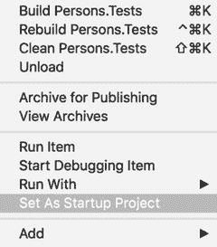

图 6-10. 将`Persons.Tests`设置为启动项目

测试运行器将显示它所识别的测试方法的任何信息。现在，你可以通过单击“全部运行”按钮来运行所有这些单元测试，或者可以选择`Persons.Tests.exe`，然后选择`PersonsTests`。测试方法列表将出现，如图 6-3 所示。你可以通过单击相应的条目单独运行每个测试，或通过单击“全部运行”按钮一次性运行所有测试。片刻后，每个测试方法的结果将显示出来。我们看到只有一个测试方法（`VerifyEmail`）失败。

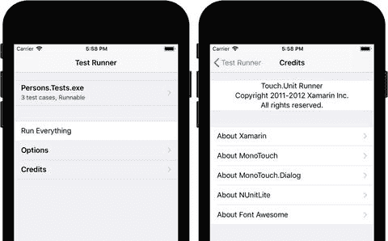

图 6-11. 测试运行器

## 用户界面测试

验证`Person`类后，我们可以继续使用它来实现 Persons 应用。随后，我们将使用 Xamarin UI Tests 框架和 Xamarin Test Cloud（XTC）测试其 UI。

#### 创建应用

我使用单视图 iOS 应用模板（支持 iOS 9.0 及更高版本）创建了 Persons 应用。然后，我定义此应用的 UI，如图 6-2 所示。即，我创建了一个按钮、四个标签和四个文本字段。现在，我将每个文本字段的名称和辅助功能标识符（图 6-12）分别设置为`TextFieldFirstName`、`TextFieldLastName`、`TextFieldEmail`和`TextFieldAge`。名称将用于在 C# 代码中设置每个`TextField`的文本属性，而辅助功能标识符将用于在 UI 测试中查找控件。随后，我双击按钮以创建`TouchUpInside`事件处理程序，并暂时将该方法留空。最后，我编辑引用，使得 Persons 应用引用`Person.Common`库。

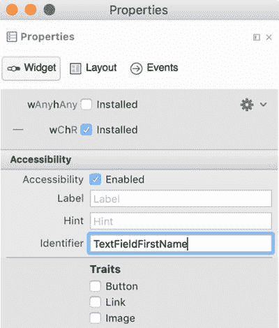

图 6-12. 配置辅助功能标识符

#### Xamarin Test Cloud 代理

要使测试运行器能够与 Persons 应用交互，你需要使用 Xamarin Test Cloud 代理，将其作为 NuGet 包安装。要安装它，你可以进入解决方案资源管理器，然后从 Persons/Packages 节点的上下文菜单中选择“添加包…”选项，或使用菜单“项目 ➤ 添加 NuGet 包…”。无论选择哪种方法，都会出现“添加包”对话框。在此对话框中，进入搜索框并输入`Xamarin Test Cloud Agent`。匹配的包列表将显示在左侧，如图 6-13 所示。然后选择列表中的第一个元素，并单击“添加包”按钮。

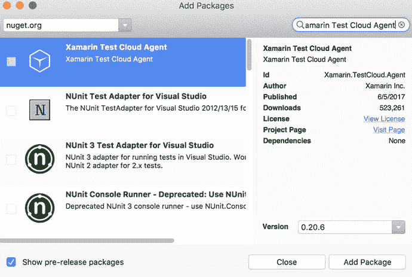

图 6-13. 安装 Xamarin Test Cloud Agent NuGet 包

片刻后，NuGet 包将被添加到 Persons 项目中。然后，你只需通过在`FinishedLaunching`事件处理程序中添加以下语句（列表 6-8）`Xamarin.Calabash.Start()`来启用它。此事件处理程序定义在 Persons 项目的`AppDelegate.cs`文件中。由于启用了 Xamarin Test Cloud 代理的应用无法提交到商店，列表 6-8 中的相应语句被 C# 预处理指令包围，并且仅在定义了`ENABLE_TEST_CLOUD`符号时执行。在安装 Xamarin Test Cloud Agent NuGet 包后，测试应用的调试配置中默认会执行此操作。要查看此设置，请转到 Persons 项目的选项，然后打开“生成/编译器”选项卡。`ENABLE_TEST_CLOUD`将列在“定义符号”文本框中。如果将配置更改为“发布”，则该符号未定义。

```
public override bool FinishedLaunching(
UIApplication application, NSDictionary launchOptions)
{
#if ENABLE_TEST_CLOUD
Xamarin.Calabash.Start();
#endif
return true;
}
列表 6-8.
设置 Xamarin Test Cloud 代理
```

Xamarin Test Cloud 代理在启用时，会监听来自测试运行器的请求。此代理接受以编程方式生成的手势（如点击和滑动），并允许测试运行器与视觉控件交互；例如，从文本字段读取文本。重要的是，测试运行器还可以使用 Xamarin Test Cloud 代理截取应用屏幕截图，以验证布局在各种设备上是否正确，以及在设备旋转时所有必要控件是否可见且位于预期位置。


#### 创建 UI 测试

为了创建测试运行器，该运行器将向 Xamarin Test Cloud Agent 发送请求以测试 Persons 应用的 UI，我添加了一个新项目 `Persons.UITests`，该项目是使用 Visual Studio 中的 UI 测试应用项目模板创建的（图 6-14）。

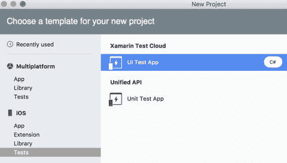
**图 6-14.** 新建项目对话框中的 UI 测试应用项目模板

创建 `Persons.UITests` 后，我们可以注意到，与 `Persons.Tests` 不同，该项目没有 iOS 应用的典型结构。此外，通过比较这两个项目，我们发现它们针对不同的框架并编译到不同的目标。要查看这一点，请转到解决方案资源管理器，从每个项目的上下文菜单中选择“选项”，然后转到“生成/常规”选项卡 ➤ “目标框架”并编译顶部显示的目标（见图 6-15）。

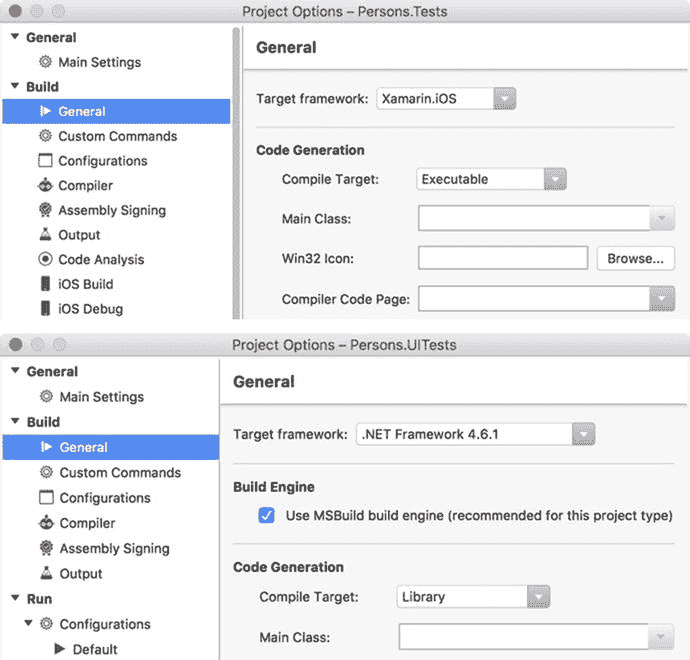
**图 6-15.** `Persons.Tests`（上方）和 `Persons.UITests` 项目的生成选项的常规选项

如图 6-15 所示，`Persons.Tests` 是 Xamarin.iOS 可执行应用程序，并像其他任何 iOS 应用一样直接在设备或模拟器上运行。在这种情况下，您可以使用测试运行器的 UI 来调用测试方法（请回头参考图 6-3）。另一方面，`Persons.UITests` 是 .NET Framework 类库。由于它未编译为可执行文件，因此是间接运行的。在 `Persons.UITests` 中实现的每个测试方法都由 `Xamarin.UITest` 框架调用。要使用单元测试面板关联将由该框架执行的应用，请转到“视图” ➤ “面板” ➤ “单元测试”。将会出现一个如图 6-16 所示的窗口。

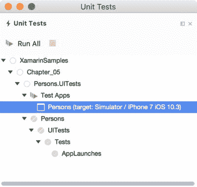
**图 6-16.** 单元测试面板

在单元测试面板中，您首先选择要测试的应用。为此，右键单击“测试应用”节点，然后选择“添加应用项目”选项以浏览 Persons 项目。之后，您可以通过按“全部运行”按钮或双击单元测试面板中 Persons ➤ UITests ➤ Tests 节点下出现的任何测试方法来运行 UI 测试，前提是该应用之前已部署到模拟器。默认的 UI 测试应用项目只有一个测试方法 `AppLaunches`。如果现在执行此方法，您将看到 UI 测试框架将另一个应用 DeviceAgent 部署到您的模拟器。`DeviceAgent` 使用 iOS 提供的 UI 自动化 API 来模拟单元测试中以编程方式定义的手势和操作，并将它们发送到被测试的应用。因此，实际上，`DeviceAgent` 充当了一个虚拟用户，在测试方法的指令下模拟用户操作。`DeviceAgent` 还收集这些操作的结果并将其传递回测试方法。

要实现测试方法，您可以采用类似于实现单元测试的方式。更具体地说，每个测试类都由 `TestFixtureAttribute` 标记，而每个测试方法必须是公共的并且由 `TestAttribute` 修饰。清单 6-9 展示了此类结构在 `Tests` 类中的使用方式——这是一个随 `Persons.UITests` 项目创建的默认测试类。

```csharp
[TestFixture]
public class Tests
{
    iOSApp app;
    [SetUp]
    public void BeforeEachTest()
    {
        app = ConfigureApp.iOS.StartApp();
    }
    [Test]
    public void AppLaunches()
    {
        app.Screenshot("First screen.");
    }
}
```
**清单 6-9.** UI 测试类的默认定义

通过分析清单 6-9，我们可以轻松地注意到与我们之前实现的单元测试相关的两个新元素。首先，还有一个方法 `BeforeEachTest`。此方法标有 `SetUpAttribute`。后者指示测试运行器在每个测试方法之前调用一个选定的函数。在这里，`BeforeEachTest` 创建一个派生自 `iOSApp` 接口的对象。该接口定义了用于与被测应用交互的方法和属性。

要创建 `iOSApp` 对象，您可使用静态类 `ConfigureApp`。此类有两个属性：类型为 `AndroidAppConfigurator` 的 `Android` 和类型为 `iOSAppConfigurator` 的 `iOS`。对于 iOS 应用，我们只对第二个感兴趣，它用于配置测试参数（如设备标识符、应用包等）。然后，我们使用 `StartApp` 方法运行测试。`iOSApp` 类的实例随后被用来以编程方式操作 UI，其方式与用户操作完全相同。

为了为 Persons 应用准备第一个 UI 测试，我首先通过清单 6-10 中的一个静态方法来扩展 `Person` 类（`Persons.Common` 项目）的定义。此方法创建一个 `Person` 对象的实例，然后将公共属性配置为默认值。稍后我将在 UI 测试和 Person 应用中使用 `Person.Default` 方法。

```csharp
public static Person Default()
{
    return new Person
    {
        FirstName = "Dawid",
        LastName = "Borycki",
        Age = 34,
        Email = "dawid@borycki.com.pl",
    };
}
```
**清单 6-10.** Person 类的额外静态方法

接下来，在 `Tests` 类（`Persons.UITests`）中，我根据清单 6-11 实现了 `VerifyDisplayDataButton` 测试方法。`VerifyDisplayDataButton` 虚拟地点击 Persons 应用视图中的一个按钮，并验证每个文本字段中的文本是否与默认人员数据对应。

要以虚拟方式点击控件，您可以使用 `iOSApp` 类实例的 `Tap` 方法。此方法有两个重载版本：一个接受 C# `Func` 委托作为参数，另一个接受字符串参数。在第一种情况下，您创建 lambda 表达式，该表达式返回 `AppQuery` 类的实例。`AppQuery` 类提供了许多用于查找 UI 元素的方法。在第二种情况下，您传递一个字符串，测试运行器使用该字符串通过检查 UI 元素的辅助功能标识符或辅助功能标签来查找它们。在这里，为了找到一个按钮，我使用了一个 lambda 表达式，它是用 `AppQuery.Button` 方法构建的。此方法匹配视图上的第一个按钮。

接下来，我使用辅助方法 `GetTextFieldText` 从文本字段读取文本，该方法通过文本字段的辅助功能标识符来查找它们。为此，我构建了一个 `AppQuery`，在其中传递一个表示控件辅助功能标识符的字符串参数。获取文本字段中的文本后，我将其与预期值进行比较，如果它们不同，则使用 `Assert` 类的静态方法引发相应的断言。

好的，作为高级文档工程师和翻译员，我将严格遵循您的注意事项和示例格式，将给定的英文文本翻译成中文。


```csharp
[Test]
public void VerifyDisplayDataButton()
{
    // Arrange
    var defaultPerson = Person.Default();
    // Act
    app.Tap(b => b.Button());
    var actualFirstName = GetTextFieldText("TextFieldFirstName");
    var actualLastName = GetTextFieldText("TextFieldLastName");
    var actualEmail = GetTextFieldText("TextFieldEmail");
    var actualAge = GetTextFieldText("TextFieldAge");
    // Assert
    Assert.AreEqual(defaultPerson.FirstName, actualFirstName);
    Assert.AreEqual(defaultPerson.LastName, actualLastName);
    Assert.AreEqual(defaultPerson.Email, actualEmail);
    Assert.AreEqual(defaultPerson.Age.ToString(), actualAge);
}
private string GetTextFieldText(string textFieldAccessibilityId)
{
    var result = string.Empty;
    if(app.Query(c => c.Id(textFieldAccessibilityId)).FirstOrDefault()
        is AppResult matchedTextField)
    {
        result = matchedTextField.Text;
    }
    return result;
}
```
清单 6-11. UI 测试

现在，我们可以通过在“单元测试”面板中双击 `VerifyDisplayDataButton` 测试方法来执行它。测试运行器会执行 `DeviceAgent`，随后该代理会运行 Person 应用并虚拟地点击一个按钮。由于对应的事件处理器是空的，所以没有任何文本字段会包含预期值，测试将会失败，这显示在“测试结果”窗口中（图 6-17）。`Assert.AreEqual` 方法会抛出一个异常，指出预期字符串 (`"Dawid"`) 与实际字符串 (`string.Empty`) 不同。

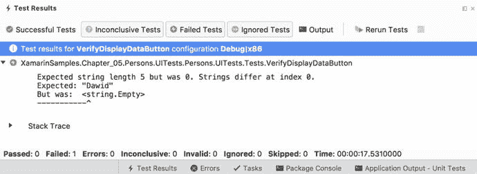

图 6-17. 测试结果窗口

现在，我们可以根据清单 6-12 (`ViewController.cs`)，在 Person 应用中为按钮的 `TouchUpInside` 事件实现处理器，然后重新构建 Person 应用，并重新运行 UI 测试以确认我们实现的正确性。通过这样做，我们有效地执行了 TDD 方法的一个迭代。也就是说，我们首先编写了一个测试方法并运行它来验证应用尚未实现预期功能。然后，我们为应用补充了正确的逻辑，并重新运行测试方法来确认它。一旦测试方法实现完毕，你就可以在每次更改相关源代码时执行它们，以确保你不会引入回归错误或丢失已实现的功能。因此，这种自动化测试有助于开发高质量的应用。

```csharp
partial void ButtonDisplayPersonData_TouchUpInside(UIButton sender)
{
    var defaultPerson = Person.Default();
    TextFieldFirstName.Text = defaultPerson.FirstName;
    TextFieldLastName.Text = defaultPerson.LastName;
    TextFieldAge.Text = defaultPerson.Age.ToString();
    TextFieldEmail.Text = defaultPerson.Email;
}
```
清单 6-12. 用于显示默认 Person 数据的事件处理器的最终定义

## Xamarin Test Cloud

到目前为止，我们编写的所有测试都是在本地模拟器中运行的。然而，Xamarin UI 测试框架也可以用于在物理设备上运行测试。通常，你将待测应用部署到设备上，然后在该设备上运行 UI 测试。因此，如果你需要在多种设备上执行相同的测试，你需要依次进行，这会消耗额外的时间。此外，你需要实际拥有所有安装了不同操作系统版本的设备。因此，对 iOS 应用进行全面的测试可能非常昂贵，尤其是对于个人开发者而言。为了解决这些问题，Xamarin 提供了一个物理设备农场，即 Xamarin Test Cloud。`XTC` 是一项基于云的服务，你可以直接从 Visual Studio 将应用及其 UI 测试上传到该服务中，然后根据需要在其提供的任意数量的设备上运行测试。测试结果随后会以清晰的报告形式呈现给你，如图 6-4 所示。虽然将应用提交到 `XTC` 很简单，但它要求你为应用创建一个预置描述文件，因为应用包是在物理设备上执行的。因此，我将通过解释如何创建预置描述文件来开始本小节，然后我将向你展示如何将应用提交到 `XTC`、选择设备并执行测试。要完成本部分，你需要先在 `XTC` 中创建一个试用账户：[`https://testcloud.xamarin.com/register`](https://testcloud.xamarin.com/register)。

#### 预置描述文件

要创建预置描述文件，你需要 `Xcode`、一个 Apple ID，以及一个连接到你的开发用 Mac 的物理 iOS 设备。然后，按以下步骤操作：

1. 打开 `Xcode`，点击“Accounts”标签页。在“Preferences”下，选择“Apple ID”作为账户类型，然后输入你的 Apple ID 凭据（图 6-18）。你的账户随后会出现在窗口的左侧，如图所示。

   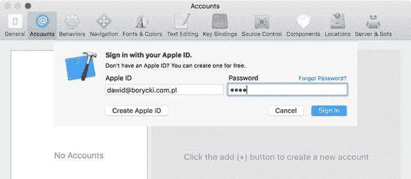

   图 6-18. 使用 Apple ID 登录 `Xcode`

2. 选择你的账户，然后点击位于“Accounts”标签页右下角的“Manage Certificates…”按钮（图 6-19）。这会激活“Signing Certificates”窗口。

   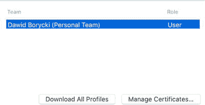

   图 6-19. 与 Apple ID 关联的团队列表

3. 在“Signing Certificates”窗口中，按下 `+` 按钮并选择“iOS Development”（图 6-20）。证书创建完成后，按下“Done”按钮，然后按下“Download All”或“Manual Profiles”按钮。现在你可以关闭 `Xcode` 的偏好设置了。

   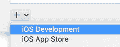

   图 6-20. 创建签名证书

有了用于 iOS 开发的签名证书，我们需要将其与 Persons 应用关联起来。这需要使用 `Xcode` 和连接到 Mac 的物理 iOS 设备来完成。在 `Xcode` 中，现在通过转到“File”➤ “New”➤ “Project…”来创建一个新的 iOS 应用。会出现一个类似图 6-21 所示的窗口。在此窗口中，选择“Single View Application”，然后点击“Next”按钮。

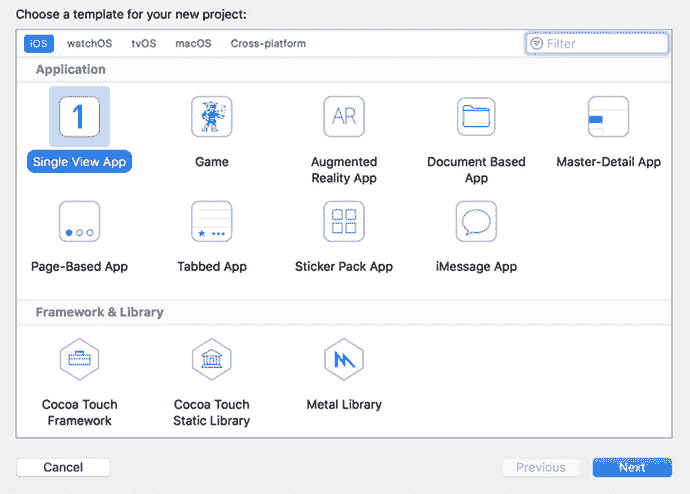

图 6-21. `Xcode` 中的新建项目对话框

选择项目模板后，会出现另一个窗口“Choose options for your new project”。该窗口如图 6-22 所示，允许你指定应用的“Product Name”和“Organization Name”。确保这些值与你的 Xamarin.iOS Person 应用中 `Info.plist` 的相应配置相匹配。也就是说，在我的例子中，“Product Name”设置为 `Persons`，而“Organization Name”设置为 `com.db`。你可以将其他选项保留为默认值，然后点击“Next”按钮并为你的项目选择一个位置。`Xcode` 随后会创建一个空应用并显示其配置（图 6-23）。在此窗口中，你需要确保“Provisioning Profile”和“Signing Certificate”（“Signing”部分）已设置好。如果没有，你需要连接物理 iOS 设备，然后点击“Signing”部分底部出现的“Try Again”按钮。

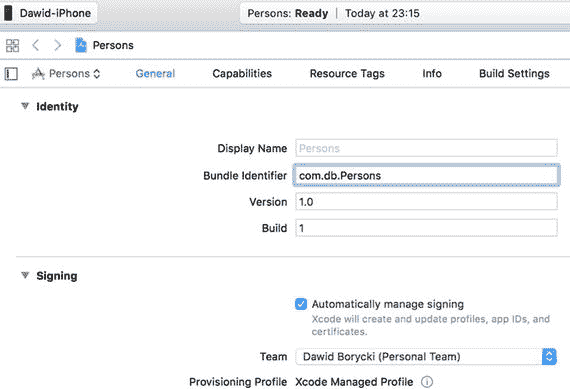

图 6-23. Persons `Xcode` 应用的标识和签名部分

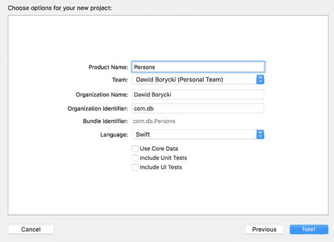

图 6-22. 配置项目选项

获得预置描述文件后，回到 Visual Studio 并打开 Persons 项目的选项（图 6-24）。然后，转到“Build”标签页下的“iOS Bundle Signing”，并执行以下操作：

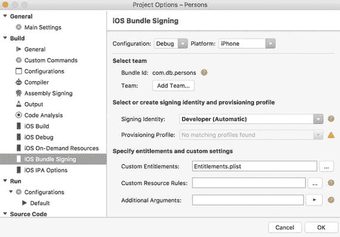

图 6-24. Visual Studio 中 Xamarin.iOS Persons 应用的 iOS Bundle Signing 部分

* 从“Platform”下拉列表中选择“iPhone”。
* 将“Signing Identity”设置为“Developer (Automatic)”。
* 从“Provisioning Profile”下拉列表中选择“Automatic”。

现在，Visual Studio 可以生成应用包，并将其部署到 `XTC` 上。


