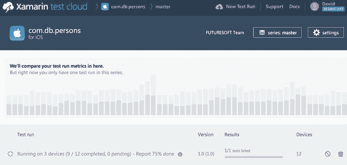
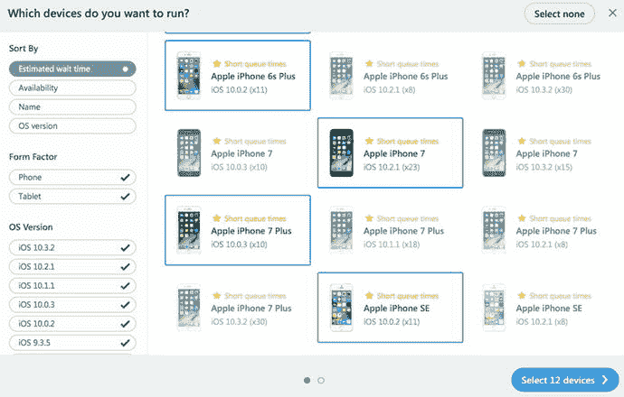
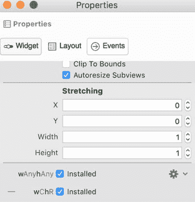

# 在 XTC 中运行测试

要在 XTC 中运行测试，你最终需要降级 `Persons.UITest` 中的 `NUnit` NuGet 包。在我撰写本章时，XTC 支持 NUnit 2.6.4 版本。降级此包最简单的方法是，在解决方案资源管理器中，使用包上下文菜单的“删除”选项将其卸载。然后，使用“添加包”窗口重新安装一个包，并从包管理器右下角的下拉列表中选择 NUnit 版本（图 6-13）。

在确保 NUnit 版本与 XTC 兼容后，转到单元测试面板，右键单击选中的 UI 测试，然后选择“在测试云中运行”。应用程序将自动提交到 XTC，稍后你将自动重定向到 XTC 网站。然后，你可以选择应在哪些设备上执行测试。如图 6-25 所示，我选择了 12 台设备，其中 5 台是 iPad。其余的是随机选择的 iPhone。在选定设备列表后，你需要选择测试系列（主版本、生产版或测试版）和系统语言，然后按下“完成”按钮。测试过程将启动，其当前状态将显示在 XTC 网站上（图 6-26）。

图 6-26. 测试进度

图 6-25. XTC 设备选择

测试完成后，你可以使用前面图 6-24 中所示的测试报告来查看每台设备的测试结果。就我而言，我发现 `VerifyDisplayDataButton` 测试方法在所有 iPad 上都失败了。根据应用程序截图，没有显示任何控件。我随后在 iPad 模拟器中重新运行 Persons 应用来本地检查。确实，没有一个控件显示出来。不过，使用第 3 章中描述的布局策略很容易解决这个问题。至少，为了强制控件在更大的屏幕上显示，必须勾选 `wAnyhAny` 控件属性的“已安装”复选框，如图 6-27 所示。现在你可以重新运行测试，或者在 iPad 模拟器中运行 Persons 应用。

图 6-27. 为任意屏幕尺寸的设备启用控件可见性

## 本章小结

在本章中，我们探讨了 Xamarin.iOS 应用的自动测试方法。我们首先创建了 C# 代码的单元测试，然后实现了自动化 UI 测试。后者在本地模拟器中运行，并在来自 Xamarin 测试云的多个物理 iOS 设备上运行。你可以使用所介绍的所有方法来确保你的应用在要求苛刻的移动市场上具有高质量。我们将使用在这里学到的单元测试方法来开发一个客户端应用，该应用可以消费并更新来自 Web 服务的数据。

