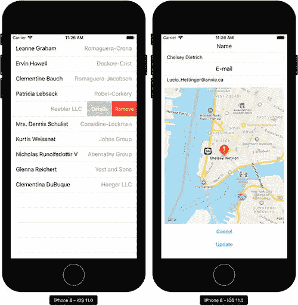

# 使用 RESTful Web 服务

通常，iOS 应用是更大系统的一个移动端点。移动应用使用 RESTful 或 REST 架构从远程 Web 服务器检索一些数据，例如天气预报、新闻或银行对账单，然后将这些数据显示给用户。用户可以在本地更改或更新部分数据，然后将其传输到服务器。移动客户端也可以向 Web 服务器发送请求；例如，执行转账。在本章中，我们将学习如何使用 Xamarin.iOS 实现这样一个移动客户端。

我们将使用 `JSONPlaceholder` ([`jsonplaceholder.typicode.com/`](https://jsonplaceholder.typicode.com/)) 作为 REST Web 服务。它提供了几个资源，你可以用它们来测试你的移动或 Web 应用。在这里，我将使用 Users 资源。它包含一个包含十个对象的集合，每个对象代表一个假想的 `user` 对象，以 JSON 格式存储。要查看此列表，你可以在 Web 浏览器中输入以下 URL：[`jsonplaceholder.typicode.com/users`](https://jsonplaceholder.typicode.com/users)。你很快会看到每个用户都由清单 7-1 中所示的 JSON 对象表示。此对象包含几个简单类型的属性，例如标识符、姓名、用户名、电子邮件、电话和网站。还有两个复杂类型的属性：address 和 company，它们包含了关于用户地址和相关公司的详细信息。

如图 7-1 所示，我在 `Users.MobileClient` 应用中使用这些数据，在 `UITableView` 中显示用户列表。每个表格行将包含用户名和公司名。当你滑动列表中的每个条目时，会出现两个行操作：Remove 和 Details。第一个操作将允许你从 Users 资源中删除特定项目。第二个操作将激活另一个视图，该视图在 `UIMapView` 上显示用户的位置以及两个文本字段。这些字段将使你能够更改用户的姓名及其电子邮件地址。为了实现这样的功能，我利用并整合了我们在前几章中学到的许多主题。

尽管 JSONPlaceholder API 不允许你实际更新或删除 Web 服务中的项目，但我们仍然可以使用它来模拟与此类 Web 服务的真实交互，并更新本地数据存储。



图 7-1. `Users.MobileClient` 应用

```
{
"id": 5,
"name": "Chelsey Dietrich",
"username": "Kamren",
"email": "Lucio_Hettinger@annie.ca",
"address": {
"street": "Skiles Walks",
"suite": "Suite 351",
"city": "Roscoeview",
"zipcode": "33263",
"geo": {
"lat": "-31.8129",
"lng": "62.5342"
}
},
"phone": "(254)954-1289",
"website": "demarco.info",
"company": {
"name": "Keebler LLC",
"catchPhrase": "User-centric fault-tolerant solution",
"bs": "revolutionize end-to-end systems"
}
}
```

清单 7-1. 来自 JSONPlaceholder 的用户对象的 JSON 表示


