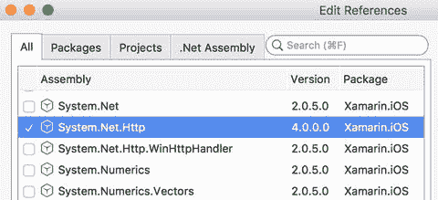
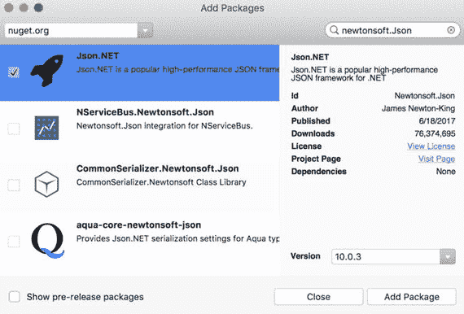
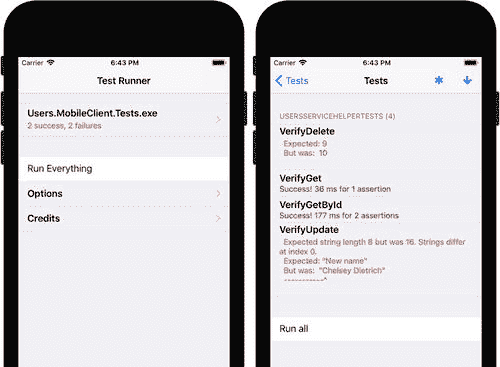

# REST 服务客户端

为了实现 `Users.MobileClient` 应用，我首先使用单视图应用模板创建了一个新的 iOS 项目。然后，我添加了两个依赖项，用于通过 HTTP 与 REST API 进行通信：

*   `System.Net.Http`，提供了 `HttpClient` 类的实现，我使用它与 REST API 通信。
*   `Newtonsoft.Json` 或 `Json.NET` NuGet 包，实现了用于序列化和反序列化 JSON 对象的几个类和方法。更具体地说，使用这个包，你可以几乎自动地将从 Web 服务接收到的响应映射到 C# 对象或此类对象的集合。

为了引用 `System.Net.Http` 程序集，我右键单击 `Users.MobileClient` 应用的“References”节点并选择“Edit References”，这会打开图 7-2 所示的窗口。随后，在“All”选项卡上，我勾选了“`System.Net.Http`”。



图 7-2. 添加对 `System.Net.Http` 的引用

我使用“Add Packages”窗口安装 `Newtonsoft.Json` NuGet 包，在窗口中输入 `Newtonsoft.Json`（图 7-3）。然后，我选中包列表中的第一个条目，并点击“Add Package”按钮。

项目及其所有依赖项准备就绪后，在 `Users.MobileClient` 项目下，我创建了新文件夹 `Helpers`，在其中添加了一个文件 `UsersServiceHelper.cs`，该文件存储了同名的静态类。这个 `UsersServiceHelper` 类用于向 REST API 发送请求。如代码清单 7-2 所示，`UsersServiceHelper` 实现了一个静态构造函数，用于创建 `HttpClient` 类实例。为此，我使用了 `HttpClient` 的无参构造函数，并将其 `BaseAddress` 属性设置为 REST API 的 URL（JSONPlaceholder 中的 Users 资源）。完成后，你就可以使用 `HttpClient` 类实例中的相应方法开始向 REST API 发送请求。这些方法实现了相应的 REST 动词。例如，要删除用户，你可以使用 `DeleteAsync` 方法（代码清单 7-3）。



图 7-3. 安装 `Newtonsoft.Json`（又名 `Json.NET`）NuGet 包

```
private static readonly HttpClient httpClient;
static UsersServiceHelper()
{
httpClient = new HttpClient()
{
BaseAddress = new Uri("http://jsonplaceholder.typicode.com/users/")
};
}
```

代码清单 7-2. `UsersServiceHelper` 类的一个构造函数

`HttpClient` 类中每个实现 HTTP 请求的特定方法都会返回一个 `HttpResponseMessage` 类型的对象。顾名思义，后者是 Web 服务器响应的抽象表示。因此，为了检查请求的状态并获取从服务器返回的数据，你需要读取 `HttpResponseMessage` 的属性。在代码清单 7-3 中，我展示了如何通过访问 `StatusCode` 属性来检查 HTTP 状态码。该属性是 `HttpStatusCode` 枚举类型，包含了所有可能的 HTTP 状态码。为了获取从 Web 服务接收的实际数据，你需要使用 `HttpContent` 类型的 `Content` 属性。这个类代表 HTTP 消息的正文，并提供了几种方法，使你能够将正文读取并转换为特定格式：字符串（`ReadAsStringAsync` 方法）、字节数组（`ReadAsByteArray` 方法）或流（`ReadAsStreamAsync` 方法）。

```
public static async Task Delete(int userId)
{
var response = await httpClient.DeleteAsync($"{userId}");
CheckStatusCode(response.StatusCode);
}
private static void CheckStatusCode(HttpStatusCode statusCode)
{
if(statusCode != HttpStatusCode.OK)
{
throw new Exception($"Unexpected status code: {statusCode}");
}
}
```

代码清单 7-3. 删除用户

在代码清单 7-4 中，展示了 `UsersServiceHelper` 类的 `Get` 方法，我使用了 `ReadAsStringAsync` 方法，因为从 Web 服务返回的数据是 JSON 格式的（代码清单 7-4）。得到该字符串后，我使用 `JsonConvert` 类的 `DeserializeObject` 静态方法将其反序列化为 `User` .NET 对象的集合。`JsonConvert` 类来自 `Newtonsoft.Json`，是用于在 JSON 和 .NET 对象之间进行转换的主类。

```
public static async Task<List<User>> Get()
{
var response = await httpClient.GetAsync(string.Empty);
CheckStatusCode(response.StatusCode);
var jsonString = await response.Content.ReadAsStringAsync();
return JsonConvert.DeserializeObject<List<User>>(jsonString);
}
```

代码清单 7-4. 从 REST API 检索用户列表

请注意，为了正确转换 .NET 和 C# 对象，你需要实现属性与 JSON 对象中相应键对应的 C# 类。为了方便起见，你可以使用可用的在线服务之一，这些服务基于 JSON 对象生成 C# 类。在这里，我使用了 [`https://jsonutils.com`](https://jsonutils.com) 网站，将代码清单 7-1 中的 JSON 对象粘贴到 JSON 文本或 URL 文本区域中，选择 C# 语言，并勾选“Pascal Case”。点击“Submit”按钮后，网站会生成四个类：`Geo`、`Address`、`Company` 和 `Example`。我将后者重命名为 `User`，然后将所有这些类存储在我添加到 `Users.MobileClient` 项目的 `Models` 文件夹下的单独文件中。

如代码清单 7-5 所示，`User` 类的定义包含八个自动实现的公共属性，这些属性直接对应 JSON 对象的键（代码清单 7-1）。复杂类型（`Address` 和 `Company`）的属性由同名的类表示。它们的结构类似于 `User` 类。即，它们包含适当的自动实现的公共属性。因此，此处不再列出。你可以在随附的代码中找到它们（`Chapter_07/Users.MobileClient/Models`）。

```
public class User
{
public int Id { get; set; }
public string Name { get; set; }
public string Username { get; set; }
public string Email { get; set; }
public Address Address { get; set; }
public string Phone { get; set; }
public string Website { get; set; }
public Company Company { get; set; }
}
```

代码清单 7-5. `User` 类的定义

我对这些自动生成的类所做的唯一修改是通过另一个方法 `ToCLLocationCoordinate2D`（代码清单 7-6）扩展了 `Geo` 类，该方法将 `Geo` 类的实例转换为 `CLLocationCoordinate2D`。稍后我将使用此方法在本机地图上显示用户的位置。

```
using CoreLocation;
namespace Users.MobileClient.Models
{
public class Geo
{
public double Lat { get; set; }
public double Lng { get; set; }
public CLLocationCoordinate2D ToCLLocationCoordinate2D()
{
return new CLLocationCoordinate2D(Lat, Lng);
}
}
}
```

代码清单 7-6. `Geo` 类的定义通过一个公共方法进行了扩展


### 更新数据

你已经知道如何通过 REST API 删除和检索对象列表。你还可以分别使用 `HttpClient` 类的 `PutAsync` 和 `PostAsync` 方法来更新用户或添加新用户。在这两种情况下，操作步骤相似，因此我将只讨论一种更新用户数据的方法。清单 7-7 包含了 `UsersServiceClientHelper` 类的 `Update` 方法。该方法接受一个参数，即 `User` 类的实例，其中包含已更新的用户数据。这些数据通过 `PutAsync` 方法发送到 REST API。

在将更新后的数据发送到 Web 服务器之前，你需要将 C# 对象转换或序列化为 JSON 对象。你可以通过使用 `JsonConvert` 类的 `SerializeObject` 静态方法来做到这一点。然后，发送待更新用户的标识符和序列化后的对象。你还需要设置传输数据的格式：字符串、字节数组或流。为此，你可以分别使用 `StringContent`、`ByteArrayContent` 或 `StreamContent` 类。在清单 7-7 中，我将展示如何使用第一个类，我使用 `JsonConvert.SerializeObject` 方法返回的字符串实例化它。然后，我将清单 7-7 中的方法放入 `UsersServiceHelper` 类中。

```
public static async Task Update(User user)
{
var userJson = JsonConvert.SerializeObject(user);
var response = await httpClient.PutAsync($"{user.Id}",
new StringContent(userJson));
CheckStatusCode(response.StatusCode);
}
清单 7-7.
更新用户数据
```

### 获取特定用户

要获取单个用户，你需要使用用户标识符补充 `GET` 请求。这可以通过类似于清单 7-7 中 `Update` 方法的方式来完成。在清单 7-8 中，我展示了一个重载的 `UsersServiceClientHelper.Get` 方法的完整示例，该方法旨在接收由标识符区分的单个用户。其工作方式类似于清单 7-4 中的 `Get` 方法，但仅检索代表给定 ID 用户的单个 `User` 类实例。

```
public static async Task Get(int userId)
{
var response = await httpClient.GetAsync($"{userId}");
CheckStatusCode(response.StatusCode);
var jsonString = await response.Content.ReadAsStringAsync();
return JsonConvert.DeserializeObject(jsonString);
}
清单 7-8.
按 ID 检索用户
```

## 测试 REST 客户端

现在，我们已经实现了 REST 客户端类，可以验证其功能了。由于我们已经知道如何编写单元测试，我们可以自动测试客户端类。为了创建 `UsersServiceClientHelper` 的单元测试，我从一个新的单元测试应用模板开始，并将其名称更改为 `Users.MobileClient.Tests`。然后，我编辑引用，使 `Users.MobileClient.Tests` 引用 `Users.MobileClient` 项目。接着，在测试应用下，我添加一个新文件 `UsersServiceHelperTests.cs`，并在其中导入以下命名空间：`System.Linq`、`System.Threading.Tasks`、`NUnit.Framework` 和 `Users.MobileClient.Helpers`。然后，我声明 `UsersServiceHelperTests` 类，如清单 7-9 所示。

```
[TestFixture]
public class UsersServiceHelperTests
清单 7-9.
UsersServiceHelper 的测试类
```

为了定义 `UsersServiceHelperTests` 类，我首先创建两个私有成员，如清单 7-10 所示。第一个成员 `UserId` 是一个字段，存储我将用于验证 `Get` 和 `Update` 方法的默认用户标识符。第二个成员是一个私有函数 `GetUserCount`，用于计算从 REST API 接收到的用户集合中的元素数量。

```
private const int UserId = 5;
private async Task GetUserCount()
{
return (await UsersServiceHelper.Get()).Count();
}
清单 7-10.
UsersServiceHelperTests 的私有成员
```

基于上述私有成员，我编写第一个测试方法 `VerifyGet`，用于验证 REST API 返回的元素数量（清单 7-11）。从 JSONPlaceholder 网站得知，Users 资源有十个元素。因此，在 `VerifyGet` 方法中，我将这个预期值与清单 7-10 中的 `GetUserCount` 辅助方法返回的值进行比较。

```
[Test]
public async void VerifyGet()
{
// 安排
const int expectedDataCount = 10;
// 执行并断言
Assert.AreEqual(expectedDataCount, await GetUserCount());
}
清单 7-11.
通过验证返回元素数量来测试 Get 方法
```

接下来，我实现另一个测试方法 `VerifyGetById`，如清单 7-12 所示。该函数检查从 REST API 检索到的用户的两个选定公共属性是否具有预期值。这里，我只检查标识符为 `5` 的用户的 `Name` 和 `Email` 属性。

```
[Test]
public async void VerifyGetById()
{
// 安排
const string expectedName = "Chelsey Dietrich";
const string expectedEmail = "Lucio_Hettinger@annie.ca";
// 执行
var user = await UsersServiceHelper.Get(UserId);
// 断言
Assert.AreEqual(expectedName, user.Name);
Assert.AreEqual(expectedEmail, user.Email);
}
清单 7-12.
验证从 REST API 检索到的用户对象的选定属性
```

在为 `UsersServiceHelper` 的 `Get` 函数编写了测试方法后，我再实现另外两个测试，如清单 7-13 和 7-14 所示。第一个测试方法 `VerifyDelete` 检查删除一个项目后 Users 资源中的元素数量是否减少。为此，我首先读取用户数量并将其存储在 `currentDataCount` 变量中。然后，我删除 ID 为 `5` 的用户并再次获取用户数量。最后，我检查实际用户数量是否确实减少了。

```
[Test]
public async void VerifyDelete()
{
// 安排
var currentDataCount = await GetUserCount();
var expectedDataCount = currentDataCount - 1;
// 执行
await UsersServiceHelper.Delete(UserId);
var actualDataCount = await GetUserCount();
// 断言
Assert.AreEqual(expectedDataCount, actualDataCount);
}
清单 7-13.
检查 Delete 方法是否减少了 Web 服务中的用户数量
```


第二种方法`VerifyUpdate`用于检查`UsersServiceHelper.Update`方法是否更改了 Web 服务中选定用户对象的属性。因此，我首先获取 ID 为`5`的用户，然后将其`Name`属性更改为存储在`expectedName`常量中的值。接着，我调用`UsersServiceHelper.Update`方法，请求 Web 服务更新选定的用户，然后重新检索该对象的数据。基于该用户，我读取其`Name`属性，以验证它是否按预期被更改。如果不符合预期，将触发适当的断言。

```csharp
[Test]
public async void VerifyUpdate()
{
    // Arrange
    const string expectedName = "New name";
    var user = await UsersServiceHelper.Get(UserId);
    // Act
    // Update name of the user and then get the user again from the API
    user.Name = expectedName;
    await UsersServiceHelper.Update(user);
    user = await UsersServiceHelper.Get(UserId);
    // Assert
    // Check if the name of user was indeed updated
    Assert.AreEqual(expectedName, user.Name);
}
```
（代码清单 7-14：通过检查 API 是否确实更改了用户姓名来验证 Update 方法）

基于以上测试方法，我在模拟器中运行`Users.MobileService.Tests`应用程序，然后执行全部四个测试。图 7-4 展示了测试应用的运行界面及单元测试结果。可以看到，只有`VerifyGet`和`VerifyGetById`这两个测试方法成功。这是因为发送至 JSONPlaceholder REST API 的`DELETE`和`PUT`HTTP 请求是被模拟的。该服务仅返回 HTTP 状态码 OK，但并未修改底层数据。因此，该功能在我们即将编写的移动客户端中也将无法工作。不过，我们仍可以在本地修改数据，并假设它在 Web 服务中已正确更新。



图 7-4：测试`UsersServiceHelper`类

## Users 仓库

通信层准备就绪后，我们现在可以在`Users.MobileClient`应用程序中使用它。如图 7-1 所示，`Users.MobileClient`包含两个视图。这两个视图都使用了实现 Web 服务客户端的类。第一个视图在`UITableView`中显示用户列表，第二个视图展示用户的更详细信息。因此，存在两个视图控制器，它们将与`UsersServiceHelper`类交互。为此，我将此类设为静态类，以便从应用程序的不同组件轻松访问。另一种方法是使用单例设计模式来实现`UsersServiceHelper`。我将在之后介绍如何针对另一个类`UsersRepository`实现该模式。

开发移动 REST API 客户端时，还需考虑另外两个问题。首先是从 Web 服务检索数据的本地存储问题；其次是移动应用与 Web 服务之间的数据同步问题。为了减少向 Web 服务发送的请求数量，通常的做法是在应用启动时将数据检索到本地存储中，然后在需要时与 Web 服务进行同步。在高级场景中，可以使用专用工作线程或原生后台机制在后台执行同步。

此处为了实现本地数据存储（即用户仓库），我创建了另一个类`UsersRepository`，并将其保存在`Model`文件夹下的`UsersRepository.cs`文件中（参见随附代码：`Chapter_07/Users.MobileClient/Models`）。该类作为本地数据存储，与远程用户集合保持同步。由于`UsersRepository`将在代码的多个位置被访问，并且需要呈现相同的数据，我使用单例设计模式来实现该类。这意味着`UsersRepository`将只有一个实例，可以从源代码的不同位置访问该实例。

代码清单 7-15 展示了`UsersRepository`类的片段，包含以下四个成员：

*   `Users` – 一个公共属性，使其他类能够访问从 Web 服务检索到的用户集合。
*   `instance` – 一个私有静态字段，用于存储`UsersRepository`类实例的引用。
*   `GetInstance` – 一个公共静态方法，用于实例化`UsersRepository`类，并将引用保存到`instance`成员中。`GetInstance`还会从 Web 服务检索用户列表。但这种情况仅在首次创建实例字段时发生。所有后续对`GetInstance`方法的调用都将返回对`UsersRepository`对象的引用。
*   `UsersRepository` – 一个私有构造函数，防止从外部创建该类。因此，调用者只能通过调用`GetInstance`方法来访问私有创建的实例。

```csharp
public class UsersRepository
{
    public List Users { get; private set; }
    private static UsersRepository instance;
    public static async Task GetInstance()
    {
        // Create and initialize an instance only once
        if (instance == null)
        {
            instance = instance ?? new UsersRepository();
            instance.Users = (await UsersServiceHelper.Get()).ToList();
        }
        return instance;
    }
    private UsersRepository()
    {
        // Make default constructor private
        // so the class can be instantiated
        // with the GetInstance method only
    }
    // Definitions of Delete and Update methods
}
```
（代码清单 7-15：`UsersRepository`类的选定片段）

随后，我通过三个公共方法扩展了`UsersRepository`类的定义（代码清单 7-16）：

*   `GetUserById` – 按用户标识符从本地数据存储中检索用户。
*   `Delete` – 从本地存储和远程 Web 服务中删除给定标识符的用户。
*   `Update` – 更新本地存储和 Web 服务中的用户。

请注意，在代码清单 7-16 中，`Delete`和`Update`方法的定义被`#pragma warning`预处理指令包围。这是为了抑制 CS4014 警告（该警告指出：由于此调用未被等待，因此在调用完成之前，当前方法的执行会继续。请考虑对调用的结果应用`await`运算符）。此处我故意省略了`await`运算符，因为我不想等待这些方法完成。相反，我并行发送请求以加速 UI 的更新。

```csharp
public User GetUserById(int userId)
{
    return Users.Find(u => u.Id == userId);
}
#pragma warning disable CS4014
public void Delete(int userId)
{
    if (UserExists(userId))
    {
        var userToDelete = GetById(userId);
        Users.Remove(userToDelete);
        UsersServiceHelper.Delete(userId);
    };
}
public void Update(User user)
{
    if (UserExists(user.Id))
    {
        UsersServiceHelper.Update(user);
    };
}
#pragma warning restore CS4014
private bool UserExists(int userId)
{
    return Users.Exists(u => u.Id == userId);
}
```
（代码清单 7-16：从本地存储访问数据以及与远程 Web 服务的数据同步）


## 展示用户列表

基于前述组件，我可以创建第一个视图，该视图将以表格形式展示用户列表。为此，我首先在项目中新建一个名为`TableSources`的文件夹，并在其中创建一个新文件`UsersTableSource.cs`。该文件存储了`UsersTableSource`类的定义，用于实现用户表格的数据源。

如清单 7-17 所示，`UsersTableSource` 继承自`UITableViewSource`类，这与任何实现`UITableView`（参见第 3 章）数据源的类相同。然后，`UsersTableSource` 有两个公共属性，分别存储对父视图控制器（用于导航）和用户仓库的引用。如第 3 章所述，`UsersTableSource` 必须重写多个基类方法。特别是，它应重写用于显示列表元素的`GetCell`方法。此处，该方法首先从仓库中检索一个`User`类的实例。此对象包含要在指定行中显示的用户数据。行索引路径与用户标识符相关联，因此我使用此路径通过`GetById`方法从仓库中检索用户（清单 7-16）。为了将行索引路径转换为用户标识符，我使用了一个辅助方法`GetUserId`，如清单 7-17 所示。根据`User`类的实例，我创建或重用样式为`UITableViewCellStyle.Value1`的单元格。最后，我配置`TextLabel`和`DetailTextLabel`的`Text`属性，使其显示用户姓名及其公司名称（请参考图 7-1）。

```
public class UsersTableSource : UITableViewSource
{
public UIViewController ParentViewController { get; set; }
public UsersRepository UsersRepository { get; set; }
private const string cellId = "UserCell";
public override UITableViewCell GetCell(
UITableView tableView, NSIndexPath indexPath)
{
// 获取要显示的项目
var user = UsersRepository.GetById(GetUserId(indexPath));
// 在创建新单元格之前尝试重用
var cell = tableView.DequeueReusableCell(cellId)
?? new UITableViewCell(UITableViewCellStyle.Value1, cellId);
// 配置单元格属性
cell.TextLabel.Text = user.Name;
cell.DetailTextLabel.Text = user.Company.Name;
return cell;
}
private int GetUserId(NSIndexPath indexPath)
{
return UsersRepository.Users[indexPath.Row].Id;
}
// 类的其余定义
}
清单 7-17.
UsersTableSource 类片段
```

我现在添加代表两个按钮的行操作，当用户在表格中滑动某个元素时，这些按钮会出现（请参考图 7-1）。如清单 7-18 所示，第一个按钮的标题为`Remove`，当用户点击时，它将调用`DeleteUser`方法。第二个按钮的标题为`Details`，用于通过`DisplayUserDetails`辅助方法展示包含用户详情及其在地图上位置的第二个视图。

```
public override UITableViewRowAction[] EditActionsForRow(
UITableView tableView, NSIndexPath indexPath)
{
var removeButton = UITableViewRowAction.Create(
UITableViewRowActionStyle.Destructive,
"Remove",
delegate
{
DeleteUser(tableView, indexPath);
});
var detailsButton = UITableViewRowAction.Create(
UITableViewRowActionStyle.Normal,
"Details",
delegate
{
DisplayUserDetails(tableView, indexPath);
});
return new UITableViewRowAction[] { removeButton, detailsButton };
}
清单 7-18.
创建行操作
```

为了删除用户，我在`UsersTableSource`类中实现了`DeleteUser`方法，如清单 7-19 所示。该函数首先从仓库中移除用户，然后从列表中移除该项目。

```
private void DeleteUser(UITableView tableView, NSIndexPath indexPath)
{
UsersRepository.Delete(GetUserId(indexPath));
tableView.DeleteRows(RowIndexToArray(indexPath),
UITableViewRowAnimation.Automatic);
}
private NSIndexPath[] RowIndexToArray(NSIndexPath indexPath)
{
return new NSIndexPath[] { indexPath };
}
清单 7-19.
删除用户
```

`DisplayUserDetails`方法的定义出现在清单 7-20 中。此函数实例化`UserDetailsViewController`，该控制器与图 7-1 右侧所示的第二个视图相关联。然后，我使用此视图控制器的`User`属性将当前用户的数据从第一个视图传递到第二个视图。最后，我使用`UIViewController`类的`PresentViewController`方法导航到第二个视图。导航完成后，我重新加载当前行，以便当应用用户导航回第一个视图时，操作按钮不会出现。

```
private void DisplayUserDetails(
UITableView tableView, NSIndexPath indexPath)
{
// 实例化视图控制器
var userDetailsViewController = ParentViewController.
Storyboard.InstantiateViewController("UserDetailsViewController")
as UserDetailsViewController;
// 传递选中的用户
userDetailsViewController.User =
UsersRepository.GetById(GetUserId(indexPath));
// 呈现视图控制器
ParentViewController.PresentViewController(
userDetailsViewController,
true,
() => ReloadRow(tableView, indexPath));
}
private void ReloadRow(UITableView tableView, NSIndexPath indexPath)
{
var indexes = RowIndexToArray(indexPath);
tableView.ReloadRows(indexes, UITableViewRowAnimation.None);
}
清单 7-20.
显示用户详情
```

现在，表格源准备就绪，我可以使用它来创建`UITableView`并将其显示在应用的第一个视图中。在此之前，我在 iOS 设计器中，使用视图控制器的属性将其类设置为`UsersListViewController`，然后删除不再需要的`ViewController.cs`文件。随后，在`UsersListViewController`中，我声明以下私有成员（清单 7-21）：

*   `usersTable`，类型为`UITableView`，存储对表格的引用
*   `AddUsersTable`，用于创建和配置表格
*   `GetFrameWithVerticalMargin`，一个方法，用于在视图框架顶部添加一个固定边距，为 iOS 状态栏预留空间

```
private UITableView usersTable;
private async Task AddUsersTable()
{
var usersTableSource = new UsersTableSource()
{
ParentViewController = this,
UsersRepository = await UsersRepository.GetInstance()
};
usersTable = new UITableView(GetFrameWithVerticalMargin(20))
{
Source = usersTableSource
};
Add(usersTable);
}
private CGRect GetFrameWithVerticalMargin(nfloat offset)
{
var rect = View.Frame;
rect.Y = offset;
rect.Height -= offset;
return rect;
}
清单 7-21.
创建表格并展示用户列表
```

然后，我根据清单 7-22 修改`ViewDidLoad`和`ViewWillAppear`视图事件处理程序。具体来说，我使用`ViewDidLoad`来创建并显示表格，而在`ViewWillAppear`中，我重新加载表格中的数据，以便包含应用用户可能通过第二个视图所做的所有最终更新。

```
public override async void ViewDidLoad()
{
base.ViewDidLoad();
await AddUsersTable();
}
public override void ViewWillAppear(bool animated)
{
base.ViewWillAppear(animated);
usersTable?.ReloadData();
}
清单 7-22.
UsersListViewController 的视图事件处理程序
```


