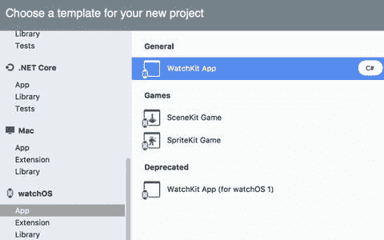
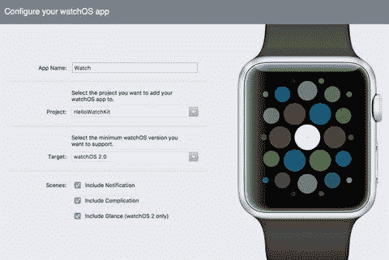
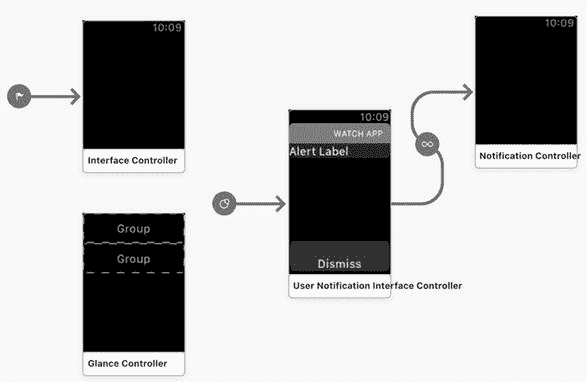

# watchOS

Apple Watch 是一款配备多种传感器、支持健康与活动数据追踪的智能手表。此外，它还包含通信接口，使其成为 iOS 设备的可穿戴终端。无论是骑自行车、参加重要会议，还是站在拥挤的公交车上，这款智能手表都能成为你的最佳伙伴。在这些场景下，你无法掏出手机，但可以借助 Apple Watch 快速查看日程、回复收到的消息，或者瞥一眼地图上的路线导航。

Apple Watch 由专用操作系统 watchOS 控制。该系统有多个版本。第一个版本 watchOS 1 已被弃用，新的解决方案至少应针对 watchOS 2。在撰写本章时，`Visual Studio for Mac` 和 `Xamarin.iOS` 支持 watchOS 2 及以上版本。

你可以使用专用 SDK 为 watchOS 开发自定义应用。实际上，其开发方式与开发 iOS 应用非常相似。不过，watchOS 和 iOS 之间存在一个区别：watch 应用包含两个 bundle。第一个是实际的 watch 应用，包含用户界面。另一个是 watch 或 `WatchKit` 扩展，用于实现控制用户界面的逻辑。因此，大多数情况下，你会修改 watch 应用的 storyboard，并通过修改代表与 UI 关联的控制器的类定义来实现逻辑。这是通过 `WatchKit` 框架完成的，该框架是一组帮助你控制 watchOS 应用的类。

在本章中，我将从头开始引导你完成这个过程。我们将首先创建项目，然后分析其结构，学习 watchOS 应用中最重要的特性。

## 创建项目

每个 watchOS 应用都有一个关联的 iOS 应用。因此，为了实现第一个 watchOS 解决方案，我首先使用 `Single View App` iOS 项目模板创建父应用 `HelloWatchKit`。我将目标版本设置为 iOS 11.0。接着，我使用 `WatchKit App` 项目模板创建实际的 watchOS 应用。后者在 watchOS 分组下可用（图 8-1）。选择模板后，我按下 `Next` 按钮，这会激活另一个窗口，与 iOS 类似，你可以在此配置新的 watchOS 应用。

图 8-1.

创建 watchOS 应用的项目模板列表

如图 8-2 所示，配置 watchOS 应用需要指定以下属性：

图 8-2.

配置 watchOS 应用，使其与 `HelloWatchKit` iOS 父应用关联

*   `Project` —— 指示父 iOS 项目。这里，我将其设置为 `HelloWatchKit`。
*   `App Name` —— 我将其设置为 `Watch`。输入 watch 应用名称时，请记住它前面会加上父 iOS 应用的名称。例如，对于 `HelloWatchKit`，watchOS 项目将被命名为 `HelloWatchKit.Watch` 和 `HelloWatchKit.WatchExtension`。正如我们很快会看到的，前者定义了 watch 应用的用户界面，而后者包含相关的逻辑。
*   `Target` —— 你的应用支持的最低 watchOS 版本。我将其设置为 watchOS 2.0，这是官方可用的最低 watchOS 版本。
*   `Scenes` —— watchOS 应用的场景列表。这里，我勾选了所有可能的场景，将在本章后面讨论它们。

创建项目后，你会看到整个解决方案包含三个项目，如下所示：

*   `HelloWatchKit` —— 父 iOS 应用。这是你的 watchOS 应用唯一能与之通信的应用。此项目引用了 `HelloWatchKit.Watch`。
*   `HelloWatchKit.Watch` —— 包含 watchOS 应用 storyboard 的 bundle，并引用了 `HelloWatchKit.WatchExtension`。
*   `HelloWatchKit.WatchExtension` —— 存储逻辑（应用代码）和资源的 bundle。

既然我们已经了解了 iOS 应用的结构，让我们简要分析一下最后两个 bundle。

## Watch 应用 Bundle

快速查看 `HelloWatchKit.Watch` 会发现其结构由三个文件组成。有两个属性列表（`Info` 和 `Entitlements`）以及 `Interface.storyboard`。在 iOS 设计器中打开后者，你会看到它包含四个场景。与 iOS 类似，这些场景代表带有内容的视图。场景数量取决于我们在图 8-2 中配置的内容。因此，除了初始场景，我们还有通知和一览场景。

在 iOS 设计器中（图 8-3），你可以通过从工具箱中拖拽控件来直观地设计每个场景。请注意，可用控件的列表与我们开发 iOS 应用时看到的不同。工具箱现在包含针对 Apple Watch 物理限制定制的控件。

在 watchOS 应用中，与视图关联的控制器被定义为接口控制器，而不是 iOS 中的视图控制器。每个场景都有一个关联的接口控制器，它定义在 `HelloWatchKit.WatchExtension` 中，并且正如我们很快将看到的，它派生自 `WatchKit` 中的 `WKInterfaceController` 类。`WKInterfaceController` 是所有接口控制器的基类。此类是 iOS 应用中 `UIViewController` 的 watch 对应物。然而，与 `UIViewController` 不同，`WKInterfaceController` 不直接管理任何视图。相反，它从远程（来自不同的 bundle）与 `Watch` bundle 中定义的 storyboard 进行交互并控制其行为。

图 8-3.

watchOS 应用的默认 storyboard

## Watch 扩展

watch 扩展 bundle 在 `HelloWatchKit.WatchExtension` 内部实现。如果你在 Solution 面板中展开此项目，会很快看到它包含多个实现接口控制器的文件。此文件集包括以下项目：

*   `InterfaceController.cs` —— 此文件存储 `InterfaceController` 类的定义。后者实现了与 `HelloWatchKit.Watch` 应用的默认或初始场景关联的逻辑。因此，`InterfaceController` 类似于我们在开发 iOS 应用时使用的默认 `ViewController`。
*   `NotificationController.cs` —— 包含 `NotificationController` 的定义，用于管理通知。
*   `ComplicationController.cs` —— 存储 `ComplicationController` 的定义，该控制器用于定义直接显示在表盘上的小型视觉元素（复杂功能）。
*   `GlanceController.cs` —— 包含 `GlanceController` 类的定义，用于控制一览场景。

还有另一个重要文件 `ExtensionDelegate.cs`。它存储了 `ExtensionDelegate` 类的定义，该类在某种程度上类似于 iOS 应用使用的 `AppDelegate` 类。稍后我将告诉你，在为 watchOS 开发应用时，如何利用上述这些类。

