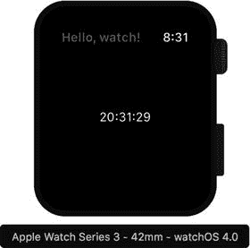
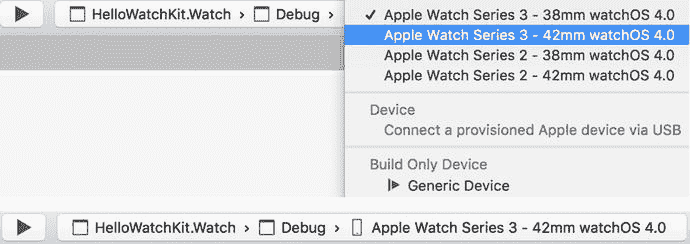
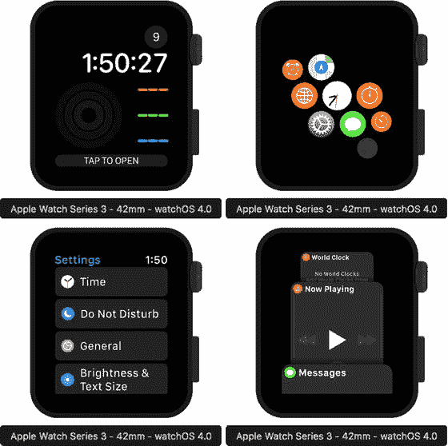
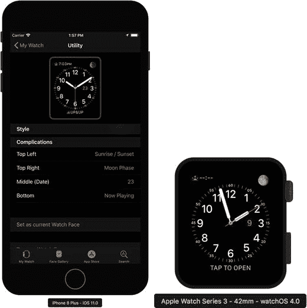

# 你好，手表！

现在，我们使用 `Watch` 和 `Watch Extension` 包来实现一个自定义计时器，如图 8-4 所示。为此，我首先打开 `Watch` 应用包项目，并通过添加一个标签来修改第一个场景。然后，我将标签名称设置为 `LabelTime`，并通过在“水平”和“垂直对齐”下拉列表中选择“居中”选项，使其在水平和垂直方向上都保持居中。这些选项位于“视图”组下。



图 8-4. watchOS 应用的视图

随后，我进入 `WatchExtension` 包并编辑 `InterfaceController.cs`。我首先导入 `System.Timers` 命名空间，然后扩展 `InterfaceController` 类的定义，以便在标签中显示当前时间。因此，我将重复获取当前系统时间并显示在标签中。要实现这样的功能，通常会使用 `System.Timers.Timer` 类。它实现了一种机制，允许你按指定的时间间隔执行一个方法。通过设置 `Timer` 类实例的 `Interval` 属性来指定时间间隔。完成此操作并启动计时器（`Start` 方法）后，它将触发一个 `Elapsed` 事件。要执行自定义逻辑，你所需要做的就是处理该事件。由于此事件是在 UI 线程上调用的，因此在从 `Timer.Elapsed` 事件处理程序中访问视觉控件时，无需担心线程安全问题，正如第 3 章所讨论的。

在代码清单 8-1 中，我展示了一个私有字段和三个私有方法，用于实现数字手表。第一个函数 `ConfigureTimer` 用于创建 `Timer` 类的实例，该实例存储在 `timer` 字段中。这里，`Timer` 类用于以一秒的间隔重复执行 `DisplayCurrentTime` 方法。该方法读取并格式化当前时间，然后使用 `SetText` 方法将其显示在标签中。在代码清单 8-1 中，我还包含了一个用于启动和停止计时器的方法（`UpdateTimer`）。

```
private Timer timer;
private void ConfigureTimer()
{
if(timer == null)
{
timer = new Timer();
timer.Elapsed += (sender, e) =>
{
DisplayCurrentTime();
};
timer.Interval = 1000;
}
}
private void DisplayCurrentTime()
{
var time = String.Format("{0:HH:mm:ss}", DateTime.Now);
LabelTime.SetText(time);
}
private void UpdateTimer(bool start = true)
{
if(start)
{
DisplayCurrentTime();
timer.Start();
}
else
{
timer.Stop();
}
}
```

代码清单 8-1. 使用计时器显示当前时间

然后，我在 `InterfaceController` 的视图事件处理程序中使用 `ConfigureTimer` 和 `UpdateTimer` 方法。默认情况下，实现了三个这样的方法：`Awake`、`WillActivate` 和 `DidDeactivate`。它们重写了 `WKInterfaceController` 中对应方法的基类实现，并且与 iOS 类似，对应于视图的生命周期。第一个方法 `Awake` 在初始化接口控制器后不久由运行时调用。因此，你可以使用此方法来自定义初始化过程。所以，`Awake` 方法是创建和配置计时器的好地方。因此，如代码清单 8-2 所示，我在此处调用了 `ConfigureTimer` 方法。此外，我还在此处使用了 `SetTitle` 方法，该方法会更改视图标题中显示的字符串（见图 8-4）。

```
public override void Awake(NSObject context)
{
base.Awake(context);
SetTitle("你好，手表！");
ConfigureTimer();
Console.WriteLine("{0} awake with context", this);
}
```

代码清单 8-2. 配置计时器

设置好计时器后，我可以分别在接口控制器即将变为活动状态或非活动状态时启动和停止它（代码清单 8-3）。任何在接口控制器处于非活动状态时尝试更新它的操作都会被运行时忽略。

```
public override void WillActivate()
{
UpdateTimer();
Console.WriteLine("{0} will activate", this);
}
public override void DidDeactivate()
{
UpdateTimer(false);
Console.WriteLine("{0} did deactivate", this);
}
```

代码清单 8-3. 启动和停止计时器

现在，你可以在其中一个模拟器中运行手表应用。如图 8-5 所示，使用 Visual Studio 中的“调试目标”下拉列表来选择模拟器。这里，我使用的是 Apple Watch Series 3 – 42 mm watchOS 4.0。另请注意，你有三种可能的选项来执行 `HelloWatchKit.Watch` 应用。根据此选择，将使用不同的接口控制器来初始化应用。可能的运行选项包括默认项（`HelloWatchKit.Watch`）、快速查看项（`HelloWatchKit.Watch – Glance`）和通知项（`HelloWatchKit.Watch – Notification`）。现在，选择默认项并运行应用。将启动两个模拟器。第一个 iOS 模拟器运行以执行父级 iOS 应用。第二个模拟配对的 Apple Watch 并执行前面图 8-4 中显示的 watchOS 应用。请注意，根据你选择的 Apple Watch 模拟器，将使用不同的 iOS 模拟器。每个 Watch 模拟器仅与一个 iPhone 模拟器配对。你可以在 Xcode 中通过转到任何模拟器的硬件菜单中的“硬件”➤“设备”➤“管理设备”选项来配置此配对。



图 8-5. 选择 Apple Watch 模拟器

## Watch 模拟器

在实现并运行第一个 watchOS 应用之后，是时候停下来学习如何控制 Apple Watch 模拟器了，以便我们可以测试各种应用功能。Apple Watch 模拟器的控制方式与 iPhone 模拟器大致相同。具体来说，当你打开模拟器时，它将显示图 8-6 左上角所示的屏幕。那就是表盘。你可以通过向左或向右滑动来更改此表盘。进入表盘后，你可以点击其中一个复杂功能（显示在屏幕顶部或底部的小图标）。您还可以通过按 SHIFT+COMMAND+H 进入主屏幕。主屏幕如图 8-6 右上角所示，包含一系列代表应用的圆形图标。上面的那个与我们创建的 `HelloWatchKit.Watch` 应用相关联。因此，当你点击它时，此应用将变为活动状态。您可以使用主屏幕运行任何其他应用，例如设置（见图 8-6 的左下部分）。要在应用之间切换，您可以使用 Dock（图 8-6 的右下部分），您可以在模拟器中通过按 SHIFT+COMMAND+B 或按下 Apple Watch 模拟器的侧边按钮来激活它。显示 Dock 后，您可以选择要激活的应用（通过向左或向右滑动），或通过向上滑动然后按下“移除”图标来关闭它。真正的 Apple Watch 还配备有数字表冠，用于在不同选项之间滚动。要在模拟器中模拟使用数字表冠，您可以使用鼠标滚轮或在触摸板上执行相应的手势。



图 8-6. Apple Watch 模拟器的一系列屏幕截图

您还可以从配对的 iPhone 个性化 Apple Watch。为此，您需要在父设备上使用 Apple Watch 应用。图 8-7 展示了如何使用 Apple Watch 应用更改表盘的示例。



图 8-7. 从关联的 iPhone 配置手表


