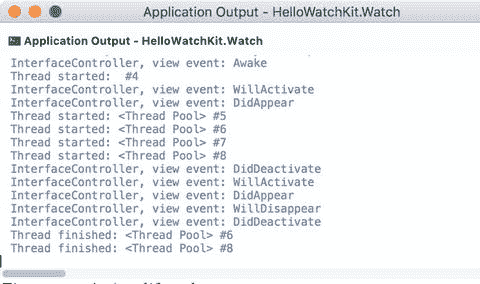

# 视图生命周期

熟悉了 Apple Watch 模拟器和应用程序结构之后，让我们进一步探究视图（或界面）控制器的生命周期。如前所述，这个生命周期伴随着几个事件，你可以通过适当的视图事件处理程序来自定义这些事件。这些处理程序定义在 `WKInterfaceController` 类中，因此要实现自定义逻辑，你需要在派生类中重写它们。为了举例说明，我通过导入 `System.Diagnostics` 命名空间并实现清单 8-4 中的 `DisplayInfo` 方法来修改 `InterfaceController`。然后，我在五个视图事件处理程序（清单 8-5）中调用此方法：`Awake`、`WillActivate`、`DidDeactivate`、`DidAppear` 和 `WillDisappear`。

```
private void DisplayInfo(string eventName)
{
Debug.WriteLine($"{this.Class.Name}, view event: {eventName}");
}
清单 8-4.
显示视图事件的名称
```

```
public override void Awake(NSObject context)
{
base.Awake(context);
SetTitle("Hello, watch!");
ConfigureTimer();
DisplayInfo("Awake");
}
public override void WillActivate()
{
UpdateTimer();
DisplayInfo("WillActivate");
}
public override void DidDeactivate()
{
UpdateTimer(false);
DisplayInfo("DidDeactivate");
}
public override void DidAppear()
{
DisplayInfo("DidAppear");
}
public override void WillDisappear()
{
DisplayInfo("WillDisappear");
}
清单 8-5.
跟踪视图生命周期
```

为了查看上述事件处理程序在视图生命周期中何时被调用，我重新运行了 `HelloWatchKit.Watch` 应用程序并打开了应用程序输出（图 8-8）。当应用程序启动时，运行时按顺序调用以下视图事件处理程序：`Awake`、`WillActivate` 和 `DidAppear`。这意味着界面控制器首先被初始化和配置，然后视图被激活并显示在智能手表的屏幕上。随后，我返回主屏幕。结果是，应用程序被停用，其视图消失。这关联到五个事件：`DidDeactivate`、`WillActivate`、`DidAppear`、`WillDisappear` 和 `DidDeactivate`。我们看到，在应用程序被停用后不久，它又短暂地变为活跃并可见（触发了 `WillActivate` 和 `DidAppear` 视图事件）。这只在 watchOS 3.0 及以上版本中执行，是为了捕获当前应用程序状态的快照。watchOS 捕获应用程序快照以便在 Dock 中显示。快照拍摄完成后，应用程序的视图变为不可见（`WillDisappear`），并且应用程序被停用（`DidDeactivate`）。



**图 8-8.** 视图生命周期

