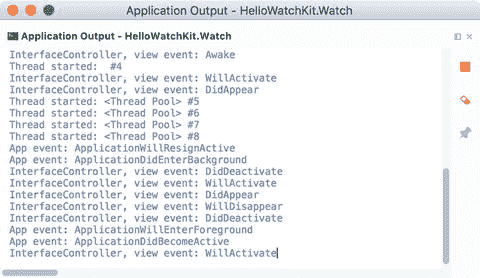

# 应用程序生命周期

现在你已经知道如何处理视图事件处理程序了。因此，我们可以学习如何实现处理 watchOS 应用程序生命周期的自定义逻辑。为此，你需要继承 `WKExtensionDelegate` 类。在 `HelloWatchKit.WatchExtension` 应用程序中，我们已经有了一个 `ExtensionDelegate.cs` 文件，其中包含一个从 `WKExtensionDelegate` 派生的类的定义。这个类 `ExtensionDelegate` 的作用类似于 iOS 应用程序中的 `AppDelegate`（`UIApplicationDelegate` 的子类）。更具体地说，你可以使用 `ExtensionDelegate` 通过关联的事件来处理应用程序执行状态的变化。为了展示这些事件的执行顺序，我修改了 `ExtensionDelegate.cs` 文件，首先导入 `System.Diagnostics` 命名空间，然后通过清单 8-6 中的两个私有方法来补充 `ExtensionDelegate` 类的定义。第一个方法 `DisplayInfo` 用于将事件名称写入应用程序输出。第二个方法 `IsEventSupported` 用于检查 watchOS 版本。这是我用来确保特定事件处理程序可用的辅助方法。

```
private void DisplayInfo(string eventName)
{
Debug.WriteLine($"App event: {eventName}");
}
private bool IsEventSupported()
{
return WKInterfaceDevice.CurrentDevice.CheckSystemVersion(3, 0);
}
清单 8-6.
将事件名称输出到应用程序输出并检查 watchOS 版本
```

然后，我使用上述方法实现了五个应用程序事件处理程序，如清单 8-7 所示。请注意，我在其中两个事件处理程序（`ApplicationWillEnterForeground` 和 `ApplicationDidEnterBackground`）中检查了 watchOS 版本，因为它们仅在 watchOS 3.0 或更高版本中可用。否则，对于这两个事件处理程序，`DisplayInfo` 将不会被调用。

```
public override void ApplicationDidFinishLaunching()
{
DisplayInfo("ApplicationDidFinishLaunching");
}
public override void ApplicationDidBecomeActive()
{
DisplayInfo("ApplicationDidBecomeActive");
}
public override void ApplicationWillResignActive()
{
DisplayInfo("ApplicationWillResignActive");
}
public override void ApplicationWillEnterForeground()
{
if (IsEventSupported())
{
DisplayInfo("ApplicationWillEnterForeground");
}
}
public override void ApplicationDidEnterBackground()
{
if (IsEventSupported())
{
DisplayInfo("ApplicationDidEnterBackground");
}
}
清单 8-7.
跟踪应用程序生命周期
```

我现在重新运行应用程序并打开“应用程序输出”面板，以查看上述事件处理程序在运行时何时被调用。如图 8-9 所示，该输出除了描述视图事件处理程序的字符串外，还包含关于应用程序视图生命周期的条目。我们可以看到，两个应用程序事件 `ApplicationDidFinishLaunching` 和 `ApplicationDidBecomeActive` 在界面控制器初始化（`Awake` 视图事件处理程序）之后被触发。然后，界面控制器被激活并显示。

随后，我返回主屏幕。结果是，手表应用程序变为非活跃状态并被置于后台。这分别伴随着两个应用程序事件 `ApplicationWillResignActive` 和 `ApplicationDidEnterBackground`。在这些应用程序事件之后，会触发五个我们已经分析过的视图事件。现在让我们看看如果我们从主屏幕重新激活应用程序会发生什么。这将导致 watchOS 触发另外两个应用程序事件：`ApplicationWillEnterForeground` 和 `ApplicationDidBecomeActive`。至此，你已经了解了应用程序和视图事件的确切顺序，可以利用它们编写自定义逻辑，来处理应用程序和界面控制器的各种状态。



**图 8-9.** HelloWatchKit.Watch 应用程序的应用程序输出，展示了运行时触发视图和应用程序事件的顺序


