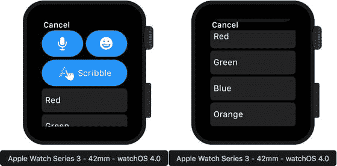
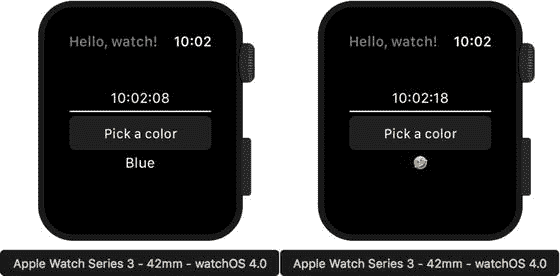

# 文本输入

从手表应用收集用户输入比从 iOS 应用更具挑战性，因为手表的屏幕小得多，且用户通常希望快速交互。因此，WatchKit 提供了专用的文本输入控制器，用于在 watchOS 上收集用户输入。如图 8-10 所示，该控制器以模态窗口的形式出现，包含一个预定义的建议值列表。此外，根据控制器配置的不同，你可以收集用户输入的**表情符号**、语音指令或手写内容。



图 8-10. 文本输入控制器的外观示例

```
partial void ButtonInput_Activated()
{
var colors = new string[]
{
"Red", "Green", "Blue", "Orange", "Purple"
};
PresentTextInputController(colors,
WKTextInputMode.AllowEmoji, DisplayUserResponse);
}
```

代码清单 8-8. 使用 `TextInputController` 收集用户输入

为了演示如何使用文本输入控制器，我修改了 `HelloWatchKit.Watch` 应用下定义的第一个场景。具体来说，我添加了一个分隔线、一个按钮和一个标签。我将它们的水平和垂直对齐方式设置为居中。然后，我将按钮和标签的名称分别改为 `ButtonInput` 和 `LabelAnswer`。最后，我双击该按钮。这会创建一个默认的事件处理程序 `ButtonInput_Activated`，我按代码清单 8-8 所示定义它。在 `ButtonInput_Activated` 事件处理程序中，我首先创建一个字符串数组，作为文本输入控制器中的预定义输入或建议列表。然后，我通过调用 `PresentTextInputController` 方法向用户展示该控制器，该方法在 `WKInterfaceController` 类中实现，并接受三个参数：

* `suggestions` – 一个字符串数组，包含显示在模态窗口中的预定义项。
* `inputMode` – 指定输入类型，由 `WKTextInputMode` 枚举中声明的值之一描述：
  * `AllowEmojiAnimated` 和 `AllowEmoji` – 分别表示允许动态或静态表情符号。
  * `Plain` – 表示不允许使用表情符号。
* `completion` – 用户关闭控制器后调用的一个操作。

在代码清单 8-8 中，我允许静态表情符号，并使用 `DisplayUserResponse` 操作作为完成处理程序。如代码清单 8-9 所示，`DisplayUserResponse` 方法显示从文本输入控制器检索到的第一个项目，并将其显示在名称为 `LabelAnswer` 的标签中。文本输入控制器返回用户所选项目的集合，该集合作为 `NSArray` 对象的实例提供，然后传递给完成处理程序。

```
private void DisplayUserResponse(NSArray result)
{
var answer = "No answer";
if (result != null)
{
if (result.Count > 0)
{
answer = result.GetItem(0).ToString();
}
}
LabelAnswer.SetText(answer);
}
```

代码清单 8-9. 展示用户选择的项目

重新运行应用后，你可以按下按钮激活文本输入控制器。它的外观将如图 8-10 之前所示。尝试点击其中一个建议值（颜色）或表情符号。你会看到文本输入控制器被关闭，并且所选值显示在底部标签中（图 8-11）。



图 8-11. 显示通过文本输入控制器收集到的用户输入

