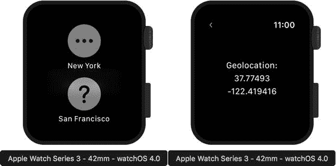
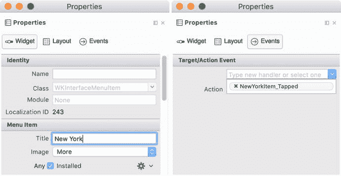
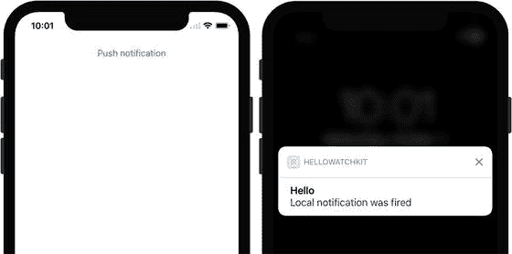
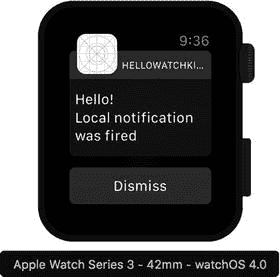
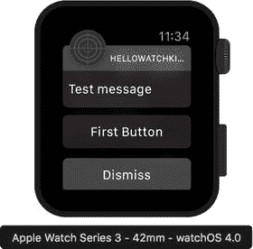
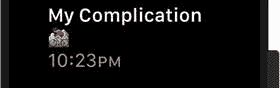
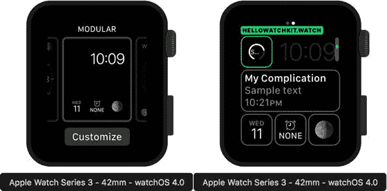

# 强制触摸与导航

Apple Watch 配备了**强制触摸**传感器，可以检测你按压屏幕的力度。强制触摸也被定义为一种额外的手势。你可以使用它来扩展应用与用户交互的方式。在本节中，我们将学习如何使用强制触摸来激活一个包含城市名称列表的菜单。点击菜单项后，将显示另一个界面控制器。该控制器将显示所选城市的地理位置（图 8-12）。



图 8-12. 强制触摸手势激活菜单，其中包含一个城市列表。当你点击某个项目时，会显示另一个视图。该视图显示所选城市的**地理坐标**。

为了实现此功能，我打开 `Interface.storyboard`，从工具箱中向代表默认场景的界面控制器添加一个菜单。该菜单出现在文档大纲面板中界面控制器项目之下。我点击该条目，然后在属性面板中将菜单项数量从 1 改为 2。这样就创建了两个菜单项。为了配置它们，我使用属性面板，在菜单项组下设置标题和图像属性如下（图 8-13）：



图 8-13. 显示第一个菜单项配置的属性面板

* 第一个菜单项：**New York** 和 **More**
* 第二个菜单项：**San Francisco** 和 **Maybe**

然后，我为每个菜单项声明操作事件，当用户点击每个菜单项时将调用这些事件。为此，我使用属性面板的事件选项卡，在事件处理方法名称字段中输入方法名并按回车键（参见图 8-13 右侧部分）。Visual Studio 随后会询问我选择代码中的位置来插入事件处理程序的空定义。我将这些事件处理程序的名称分别设置为 `NewYorkItem_Tapped` 和 `SanFranciscoItem_Tapped`。在定义这些事件处理程序之前，我回到 iOS 设计器，向故事板中添加新的界面控制器。使用该控制器的属性面板，我将它的类和标识符改为 `CityGeolocationController`。然后，我为这个界面控制器的视图补充三个标签。我将这些标签垂直和水平居中，并按图 8-12 所示堆叠它们。接着，我将第一个标签的 `Text` 属性设置为 `Geolocation:`，并将另外两个标签的名称分别更新为 `LabelLat` 和 `LabelLng`。

鉴于 UI 现已就绪并配置完成，我可以实现逻辑了。我首先向 `HelloWatchKit.WatchExtension` 项目添加一个新文件 `LocationHelper.cs`。在这个新文件中，我导入 `CoreLocation` 命名空间，然后定义一个静态类 `LocationHelper` 和一个自定义枚举 `City`，如代码清单 8-10 所示。

```
public static class LocationHelper
{
public static CLLocation GetLocationForCity(City city)
{
CLLocation result = null;
switch(city)
{
case City.NewYork:
result = new CLLocation(40.7127837, -74.0059413);
break;
case City.SanFrancisco:
default:
result = new CLLocation(37.77493, -122.419416);
break;
}
return result;
}
}
public enum City
{
NewYork, SanFrancisco
}
```

代码清单 8-10. `LocationHelper` 类和自定义枚举 `City` 的定义

`LocationHelper` 实现了一个静态方法 `GetLocationForCity`，该方法接受一个名为 `city` 且类型为 `City` 的参数。`City` 是定义了 `NewYork` 和 `SanFrancisco` 元素的枚举。根据 `city` 参数的不同，`GetLocationForCity` 将返回 `CoreLocation.CLLocation` 类的一个实例，该实例存储了纽约或旧金山的地理坐标。我是从 Google 地理编码 API 获取这些地理坐标的。


#### 修改类定义

接下来，我打开`InterfaceController.cs`文件，修改`InterfaceController`类的定义。首先，我添加了`DisplayCityGeolocationController`方法，如清单 8-11 所示。该方法从`LocationHelper`获取地理坐标，然后将其传递给`CityGeolocationController`，后者通过`PushController`方法进行初始化和呈现。该方法接受两个参数，如下所示：

-   `name` – 指定要显示的界面控制器的名称
-   `context` – 可选参数，用于向目标界面控制器传递对象

在这里，我将名称设置为`CityGeolocationController`，并将从`LocationHelper`获取的`CCLocation`类的实例作为上下文传递。

```
private void DisplayCityGeolocationController(City city)
{
var location = LocationHelper.GetLocationForCity(city);
PushController("CityGeolocationController", location);
}
Listing 8-11. Presenting the CityGeolocationController with Geocordinates to Be Displayed
```

然后，我使用`DisplayCityGeolocationController`方法来实现与菜单项关联的事件处理程序，如清单 8-12 所示。因此，新的界面控制器将根据用户的选择获得不同的地理坐标。

```
partial void NewYorkItem_Tapped()
{
DisplayCityGeolocationController(City.NewYork);
}
partial void SanFranciscoItem_Tapped()
{
DisplayCityGeolocationController(City.SanFrancisco);
}
Listing 8-12. A Context Is Passed to the CityGeolocationController
```

最后，我需要呈现地理坐标。为此，我修改了`CityGeolocationController.cs`文件，首先导入`CoreLocation`命名空间，然后修改`CityGeolocationController`类的定义（清单 8-13）。我在该控制器的默认定义中补充了一个私有字段`location`、两个视图事件处理程序（`Awake`和`WillActivate`）以及一个私有方法`GetLocation`。后者用于从传递给界面控制器的上下文中获取`CLLocation`类的实例，并将结果对象存储在`location`字段中。为了访问上下文，我使用了`Awake`视图事件处理程序，并在其中调用`GetLocation`方法。随后，当界面控制器的视图即将呈现给用户时，我更改标签中显示的文本，使其呈现所选城市的纬度和经度。

要测试应用，请在 Apple Watch 模拟器中运行它。然后，将触摸压力改为深按（`COMMAND+SHIFT+2`）并按住模拟器屏幕片刻。这将启用先前在图 8-12 中显示的菜单。现在，将触摸压力改为浅按（`COMMAND+SHIFT+1`）并点击其中一个项目。将呈现相应的地理坐标（图 8-12 的右侧部分）。

你现在可以轻松扩展此示例，并为`CityGeolocationController`的视图添加一个`Map`控件。给定地理坐标，你只需像我在第 3 章和第 7 章中展示的那样设置地图中心和区域即可。

```
public partial class CityGeolocationController : WKInterfaceController
{
private CLLocation location;
public CityGeolocationController(IntPtr handle) : base(handle)
{
}
public override void Awake(NSObject context)
{
base.Awake(context);
GetLocation(context);
}
public override void WillActivate()
{
LabelLat.SetText(location.Coordinate.Latitude.ToString());
LabelLng.SetText(location.Coordinate.Longitude.ToString());
}
private void GetLocation(NSObject context)
{
location = context as CLLocation;
if (location == null)
{
location = LocationHelper.GetLocationForCity(
City.SanFrancisco);
}
}
}
Listing 8-13. Presenting Latitude and Longitude
```

## 通知控制器

通知实现了一种在应用未运行时向用户呈现新信息的机制。通常，远程通知是从云中运行的专用推送通知服务发送到移动或可穿戴终端设备的。通知也可以本地发送。在本节中，我们将学习如何在父 iOS 应用中创建本地通知。当 iPhone 锁定时，此通知将自动路由到 watchOS 应用。从 iOS 10 开始，Apple 引入了一种新的通知触发机制，该机制基于`UserNotifications` API。用于触发本地通知的旧 API（适用于 iOS 8 和 iOS 9）在`UILocalNotification`类中实现。在本节中，我将使用`UserNotifications` API。

要使用此 API 触发本地通知，我使用 HelloWatchKit iOS 项目。首先，我打开故事板设计器，修改与默认视图控制器关联的视图，添加一个按钮。我打开此按钮的 Properties 面板，将按钮的标题设置为`Push notification`，名称设置为`ButtonLocalNotification`（图 8-14）。之后，我打开 Events 选项卡为`TouchUpInside`事件创建处理程序。最后，我根据清单 8-14 定义此事件处理程序。此代码要求我导入`UserNotifications`命名空间。

  
Figure 8-14. A UI of the HelloWatchKit iOS app and local notification in the iPhone X simulator

```
partial void ButtonLocalNotification_TouchUpInside(UIButton sender)
{
// Notification content
var notificationContent = new UNMutableNotificationContent()
{
Title = "Hello",
Body = "Local notification was fired",
};
// Notification will be fired after 10 seconds
var notificationTrigger = UNTimeIntervalNotificationTrigger.
CreateTrigger(10, false);
// Notification request
var notificationRequest = UNNotificationRequest.FromIdentifier(
Guid.NewGuid().ToString(), notificationContent, notificationTrigger);
UNUserNotificationCenter.Current.AddNotificationRequest(
notificationRequest, null);
}
Listing 8-14. Pushing a Local Notification
```

如清单 8-14 所示，要创建本地通知，你需要使用`UNMutableNotificationContent`类。在这里，我使用默认构造函数实例化此类，然后使用`UNMutableNotificationContent`类的相应属性设置通知的标题和正文。随后，我使用`UNTimeIntervalNotificationTrigger`请求 iOS 在十秒后触发通知。最后，我使用`UNUserNotificationCenter`类将通知添加到用户通知中心。

要允许你的应用发送本地通知，你还需要获取用户权限。为此，我打开 HelloWatchKit 的`AppDelegate.cs`文件，然后导入`UserNotifications`命名空间，并按照清单 8-15 所示修改`FinishedLaunching`事件处理程序。

你现在可以在任何 iPhone 模拟器中运行 HelloWatchKit 应用。该应用将显示一个警报，请求发送通知的权限。接受此警报，然后按下`Push notification`按钮并锁定 iPhone 屏幕。要锁定模拟器，我在键盘上按下`COMMAND+L`。片刻之后，将呈现一个本地通知（图 8-14）。

```
public override bool FinishedLaunching(UIApplication application,
NSDictionary launchOptions)
{
UNUserNotificationCenter.Current.RequestAuthorization(
UNAuthorizationOptions.Alert, (approved, error) => {
});
return true;
}
Listing 8-15. Displaying a Notification in the watchOS App
```


为了在 watchOS 模拟器上测试通知，运行 `HelloWatchKit.Watch` 应用。随后，转到 iPhone 模拟器，在那里打开 `HelloWatchKit` 应用。应用执行后，点击“推送通知”按钮，然后锁定 iPhone 屏幕，以确保本地通知将被路由到 Apple Watch。在 iOS 应用中点击按钮后大约十秒钟，通知将出现（图 8-15）。



图 8-15. watchOS 应用接收到的本地通知

请注意，你也可以启动应用，使其在启动时显示一个通知控制器。要这样做，在调试目标下拉列表中选择相应的项；例如，`HelloWatchKit.Watch – Notification`。你将很快看到图 8-16 所示的结果。如果你现在从 `HelloWatchKit.Watch` 包中打开 `Interface.storyboard`，你将看到通知控制器的视图并未反映在模拟器上看到的内容。这是因为本地通知的视觉外观由 `HelloWatchKit.Watch` 应用的 `PushNotificationPayload.json` 文件中声明的负载决定。



图 8-16. 默认通知控制器

## ClockKit 和复杂功能控制器

`ClockKit` 是一组类和方法，用于创建复杂功能。这些是出现在表盘上的视觉元素。复杂功能在某种程度上类似于通知，但以一种比通知更不具侵入性的方式，让用户访问应用提供的重要数据。要创建复杂功能，需要使用复杂功能控制器，该控制器已添加到 Watch 扩展包中。该控制器的定义存储在 `ComplicationController.cs` 文件中。打开此文件，你会看到 `ComplicationController` 类派生自 `CLKComplicationDataSource`。后者来自 `ClockKit` 框架，并且是实现复杂功能的关键要素。具体来说，你在派生类中重写 `CLKComplicationDataSource` 中的方法，以控制复杂功能的外观。你至少需要实现以下方法：

*   `GetPlaceholderTemplate` – 为你的复杂功能提供一个视觉模板。`ClockKit` 使用此方法的结果在用户配置期间显示复杂功能的示例外观。你通常会使用伪造数据来创建此类模板，以使用户了解复杂功能的外观。此方法仅适用于 watchOS 2。
*   `GetLocalizableSampleTemplate` – 功能与 `GetPlaceholderTemplate` 类似，区别在于 `ClockKit` 使用它来获取可本地化（依赖于语言）的复杂功能模板。此方法仅适用于 watchOS 3 或更高版本。
*   `GetCurrentTimelineEntry` – `ClockKit` 使用此方法获取复杂功能的实际数据。
*   `GetSupportedTimeTravelDirections` – 通知 `ClockKit` 你的应用是否可以为复杂功能提供未来或过去的数据条目。

因为 `ClockKit` 会调用上述方法，所以你需要通过回调将数据返回给该框架。也就是说，这些方法中的每一个都接受两个参数。第一个参数 `complication` 是 `CLKComplication` 类的一个实例，是复杂功能的抽象表示。另一个参数 `handler` 是你调用的操作（回调），用于传递复杂功能的数据。你通常使用 `CLKComplication` 类的实例，通过读取其 `Family` 属性来推断复杂功能的类型。根据此类型，你执行自定义逻辑，并最终调用 `handler`，在其中为 `ClockKit` 传递数据。让我们看看这在实践中是如何工作的。为此，我通过清单 8-16 中所示的方法，扩展了来自 `HelloWatchKit.WatchExtension` 应用的 `ComplicationController` 类的定义。

```csharp
private CLKComplicationTemplate CreateComplicationTemplate(
CLKComplicationFamily complicationFamily, string complicationText)
{
CLKComplicationTemplate template = null;
switch (complicationFamily)
{
case CLKComplicationFamily.ModularSmall:
template = new CLKComplicationTemplateModularSmallRingText()
{
TextProvider = CLKSimpleTextProvider.FromText(complicationText),
FillFraction = 0.75f,
RingStyle = CLKComplicationRingStyle.Open
};
break;
case CLKComplicationFamily.ModularLarge:
template = new CLKComplicationTemplateModularLargeStandardBody()
{
HeaderTextProvider = CLKSimpleTextProvider.
FromText("My Complication"),
Body1TextProvider = CLKSimpleTextProvider.
FromText(complicationText),
Body2TextProvider = CLKTimeTextProvider.
FromDate(NSDate.Now)
};
break;
}
return template;
}
```
清单 8-16. 创建复杂功能模板


### 排版后的文档

第一个方法`CreateComplicationTemplate`用于通过两个独立的模板创建两个复杂功能——一个用于模块化小尺寸，一个用于模块化大尺寸。因此，`CreateComplicationTemplate`接受两个参数。第一个参数`complicationFamily`指定复杂功能类型，并接受`CLKComplicationFamily`枚举中定义的值之一。第二个参数`complicationText`保存要在复杂功能中显示的值。

`CreateComplicationTemplate`仅支持两种复杂功能：模块化小尺寸和模块化大尺寸。为了创建第一个，我使用了`CLKComplicationTemplateModularSmallRingText`。这实现了一种复杂功能的视觉样式，其中文本被进度环包围。你可以使用`CLKComplicationTemplateModularSmallRingText`类实例的以下属性来控制此模板的外观：

- `TextProvider` – 指定要显示的文本
- `FillFraction` – 确定填充环的百分比
- `RingStyle` – 指示环的样式，可以是打开的或闭合的

在清单 8-16 中，我将填充分数设置为 75%，环样式设置为打开。因此，清单 8-16 中的代码将生成图 8-17 所示的模块化小尺寸复杂功能。


图 8-17. 表盘上显示模块化小尺寸复杂功能的片段

为了创建模块化大尺寸复杂功能，我使用了`CLKComplicationTemplateModularLargeStandardBody`类。它可以由以下四个属性参数化：

- `HeaderTextProvider` – 指定在复杂功能标题中显示的文本
- `Body1TextProvider` – 用于配置第一行正文文本（紧靠标题下方）中显示的文本
- `Body2TextProvider` – 指定可选的第二行正文文本
- `HeaderImageProvider` – 指示在标题左侧显示的可选图像

`CreateComplicationTemplate`方法使用了前三个属性。标题显示固定字符串`My Complication`，而第一行和第二行分别描绘从`complicationText`参数获取的值和当前时间。图 8-18 展示了此类复杂功能的示例。



图 8-18. 一个模块化大尺寸复杂功能

模板准备就绪后，我现在通过另一个方法`CreateComplicationEntry`来扩展`ComplicationController`的定义（清单 8-17）。它使用先前实现的`CreateComplicationTemplate`来创建包含当前日期的时间线条目。

```
private CLKComplicationTimelineEntry CreateComplicationEntry(
CLKComplicationFamily complicationFamily, string complicationText)
{
var template = CreateComplicationTemplate(
complicationFamily, complicationText);
if (template != null)
{
return CLKComplicationTimelineEntry.Create(NSDate.Now, template);
}
else
{
return null;
}
}
Listing 8-17.
Creating a Complication Entry
```

我现在使用上述方法来实现`ClockKit`所需的功能。我从`GetPlaceholderTemplate`和`GetLocalizableSampleTemplate`开始（清单 8-18）。在这两个方法中，我首先调用`CreateComplicationTemplate`方法。然后，将其结果（一个`CLKComplicationTemplate`类的实例）通过调用回调（一个操作处理器）传递给`ClockKit`。这符合我之前讨论的与`ClockKit`通信的一般方案。

```
public override void GetPlaceholderTemplate(CLKComplication complication,
Action handler)
{
var template = CreateComplicationTemplate(
complication.Family, "Sample text");
handler(template);
}
public override void GetLocalizableSampleTemplate(CLKComplication complication,
Action handler)
{
var template = CreateComplicationTemplate(
complication.Family, "Sample text");
handler(template);
}
Listing 8-18.
Providing Complication Templates to the ClockKit
```

上述方法准备就绪后，我现在重写`GetCurrentTimelineEntry`和`GetSupportedTimeTravelDirections`方法，如清单 8-19 所示。我禁用了对时间旅行方向的支持，因为我仅为当前日期提供复杂功能。在`GetCurrentTimelineEntry`方法中，我使用了`ComplicationHelper`类，稍后将对此进行讨论。

```
public override void GetCurrentTimelineEntry(CLKComplication complication,
Action handler)
{
var timelineEntry = CreateComplicationEntry(complication.Family,
ComplicationHelper.Answer);
handler(timelineEntry);
}
public override void GetSupportedTimeTravelDirections(
CLKComplication complication,
Action handler)
{
handler(CLKComplicationTimeTravelDirections.None);
}
Listing 8-19.
Providing a Current Timeline Entry and Supported Time-Travel Directions
```

根据`ClockKit`文档，每个应用程序的复杂功能使用都有预算限制，以保护系统资源。当你的应用程序达到限制时，`ClockKit`将调用`RequestedUpdateBudgetExhausted`。我重写了此方法，如清单 8-20 所示，以便在应用程序输出中显示有关预算耗尽的信息。请注意，此方法要求你导入`System.Diagnostics`命名空间。

```
public override void RequestedUpdateBudgetExhausted()
{
Debug.WriteLine("RequestedUpdateBudgetExhausted");
base.RequestedUpdateBudgetExhausted();
}
Listing 8-20.
Handling Exhaustion of the Complication Update Budget
```

我的手表扩展包与`ClockKit`之间的通信已准备就绪。因此，我现在需要实现一个将强制复杂功能更新的逻辑。为此，我使用了`ClockKit`中的另一个类`CLKComplicationServer`。此类的实例代表复杂功能服务器，它管理复杂功能，并且特别可用于按需更新它们。为了在`HelloWatchKit.WatchExtension`中实现复杂功能更新，我添加了一个`ComplicationHelper.cs`文件，在其中导入`ClockKit`命名空间，然后定义`ComplicationHelper`类，如清单 8-21 所示。

```
public static class ComplicationHelper
{
public static string Answer { get; set; } = string.Empty;
public static void UpdateComplications()
{
var server = CLKComplicationServer.SharedInstance;
foreach (var complication in server.ActiveComplications)
{
server.ReloadTimeline(complication);
}
}
}
Listing 8-21.
A Definition of the ComplicationHelper
```


要访问复杂功能服务器，需要使用`CLKComplicationServer`类的静态属性`SharedInstance`。然后，要获取实际显示在表盘上的活跃复杂功能集合，需要读取`ActiveComplications`属性。该集合中的每个元素都是`CLKComplication`类的一个实例，并允许直接访问该复杂功能。具体来说，可以通过将相应对象传递给`CLKComplicationServer`类实例的`ReloadTimeline`方法（参见清单 8-21 中的`UpdateComplications`方法）来强制更新该复杂功能。`ComplicationHelper`也有一个静态属性`Answer`，我使用它来将数据从界面控制器传递给复杂功能控制器。为了完成实现，我需要获取复杂功能的数据。为此，我修改了`DisplayUserResponse`方法（清单 8-9），如清单 8-22 所示。即，我将使用文本输入控制器获取的值存储在`ComplicationHelper.Answer`属性中，然后使用`ComplicationHelper.UpdateComplications`方法强制更新所有活跃的复杂功能。

```
private void DisplayUserResponse(NSArray result)
{
    var answer = "No answer";
    if (result != null)
    {
        if (result.Count > 0)
        {
            answer = result.GetItem(0).ToString();
        }
    }
    LabelAnswer.SetText(answer);
    ComplicationHelper.Answer = answer;
    ComplicationHelper.UpdateComplications();
}
Listing 8-22.
更新复杂功能
```

要测试上述示例，需要退出 iPhone 和 Watch 模拟器，然后重新运行应用。之后，转到表盘，将触摸压力设置为深按，然后轻点手表屏幕。这会激活可以调整表盘的模式。滑动到模块表面（图 8-18 的左侧部分），然后将触摸压力恢复为浅按后点击“自定义”按钮。进入自定义模式后，滑动到第二个屏幕，然后使用绿色矩形在复杂功能之间切换。转到左上角显示的复杂功能。接着，需要将鼠标光标放在数字表冠上，然后滚动鼠标或触摸板，直到看到`HelloWatchKit.Watch`复杂功能。对其下方的较大复杂功能执行相同操作（图 8-19 的右侧部分）。完成后，按下数字表冠按钮。现在可以返回应用，并从文本输入控制器中选择任意项目，以便在主屏幕上看到更新后的复杂功能。



图 8-19.

配置复杂功能

## 快速查看控制器

`HelloWatchKit.WatchExtension`包的最后一个元素是快速查看控制器，用于向用户呈现静态信息。默认的快速查看控制器是在应用创建期间由 Visual Studio 生成的。当用户轻点与快速查看控制器关联的视图时，相应的应用会被激活。由于 watchOS 3 及更高版本中不可用快速查看，因此无法使用默认模拟器进行测试。所以，我只会展示如何检测应用是否从快速查看激活。如果是，界面控制器的标题将更改为相应的值。为了实现此功能，我向`HelloWatchKit.WatchExtension`应用添加了另一个文件`GlanceHelper.cs`，并在其中定义了清单 8-23 中所示的静态类。该类只有一个属性`Key`，用于标识在快速查看和界面控制器之间传递的值。

```
public static class GlanceHelper
{
    public static NSString Key { get; } = new NSString("GlanceKey");
}
Listing 8-23.
用于处理快速查看激活的辅助类
```

为了展示如何将数据从快速查看传递给界面控制器以指示它是通过快速查看激活的，我首先实现了`GlanceController`的`WillActivate`视图事件处理程序，如清单 8-24 所示。我创建了`NSDictionary`对象，实现键值对的集合。在本例中，字典只包含一个元素，键为`GlanceKey`，值为`Glance-activated`。然后，我将此字典与`appIdentifier`一起传递给`UpdateUserActivity`方法。此方法用于将快速查看状态传递给实际应用。

```
public override void WillActivate()
{
    var appIdentifier = NSBundle.MainBundle.BundleIdentifier;
    using (var nsDictionary = new NSDictionary
        (GlanceHelper.Key, "Glance-activated"))
    {
        UpdateUserActivity(appIdentifier, nsDictionary, null);
    }
}
Listing 8-24.
从快速查看控制器激活时，将数据传递给应用
```

然后，要获取快速查看状态，需要在初始界面控制器中实现`HandleUserActivity`。清单 8-25 展示了如何在`HelloWatchKit.WatchExtension`的`InterfaceController`类中检索键`GlanceKey`的值的示例。

```
public override void HandleUserActivity(NSDictionary userActivity)
{
    if (userActivity != null)
    {
        if (userActivity.ContainsKey(GlanceHelper.Key))
        {
            SetTitle(userActivity.ValueForKey(GlanceHelper.Key).ToString());
        }
    }
}
Listing 8-25.
接收从快速查看控制器传递的数据
```

## 总结

在本章中，我们学习了如何为智能手表实现应用。我们涵盖了广泛的主题，从项目创建、使用手表模拟器、处理视图和应用事件，到使用专用控制器收集用户输入、创建力度触摸菜单、在界面控制器之间导航，以及通知、快速查看和复杂功能。这组教程使您能够独立地为 watchOS 编写完整的应用。在下一章中，我们将使用 tvOS 应用。

