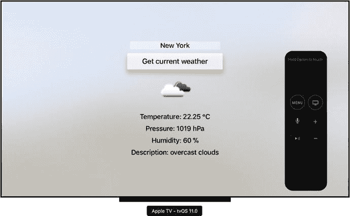

# 9. tvOS

电视是日常生活中又一个被电子产品和软件彻底改造的部分。像 Apple TV 这样的设备能将您的显示器变成一个智能设备，其用途远不止观看电视节目。您无需担心错过最喜欢的电视节目。相反，您才是掌控者，决定观看的时间和内容。此外，有了专门的应用程序和游戏，您的电视变得更加智能。本章将展示如何为 Apple TV 构建此类自定义应用。具体来说，我将告诉您如何创建图 9-1 所示的完整 tvOS 应用。此应用将利用 OpenWeatherMap API 来显示您在文本字段中键入的城市名称的当前天气状况。

图 9-1.

适用于 Apple TV 的自定义天气应用

