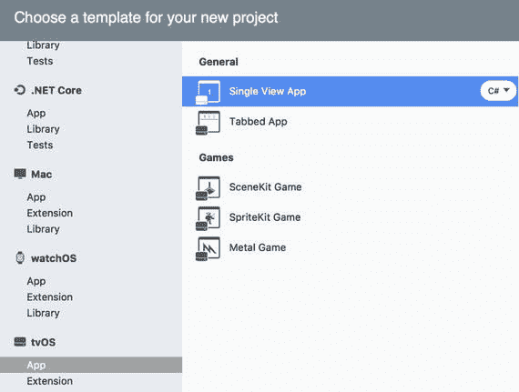
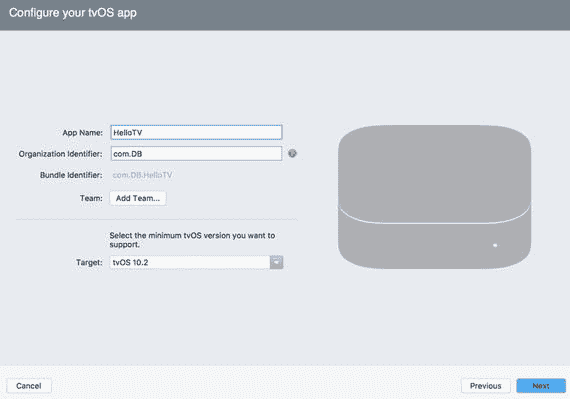

# 创建项目

我首先创建一个名为 `HelloTV` 的新 tvOS 项目。为此，我使用了 Visual Studio 新建项目对话框的 tvOS 选项卡中的新单视图应用（图 9-2）。

图 9-2. 创建 tvOS 项目

随后，Visual Studio 会显示另一个屏幕，您可以在其中配置您的 tvOS 应用。基本上，您所执行的操作与为 iOS 和 watchOS 应用所做的非常相似。即，指定应用名称、组织标识符、团队和目标。在这里，我按图 9-3 所示配置了 `HelloTV` 应用，然后进入下一步，确认我的项目位置。

项目创建完成后，您很快会发现 `HelloTV` 应用的结构与 iOS 项目的组织方式相似。`HelloTV` 应用的入口点在 `Program` 类（`Main.cs` 文件）的静态 `Main` 方法中实现。此方法的默认实现使用 `AppDelegate` 类在运行时启动和管理 tvOS 应用的生命周期。`AppDelegate` 派生自 `UIApplicationDelegate`，与所有 iOS 应用中使用的完全相同。因此，处理 tvOS 应用相关事件的方式与在 iOS 应用中相同。基于此原因，具体的示例将省略。

图 9-3. 项目配置

