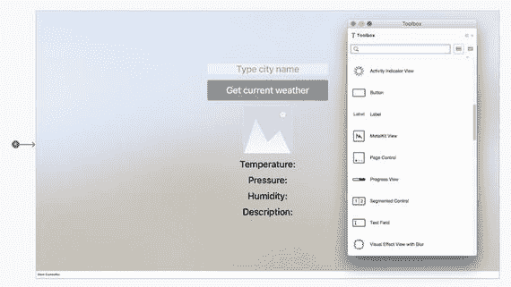

# 用户界面

为了设计 `HelloTV` 应用的 UI，我打开解决方案资源管理器并双击 `Main.storyboard` 文件。这将打开 iOS 设计器，我在此修改默认视图控制器的场景。具体来说，我从工具箱拖拽了以下控件：一个文本字段、一个按钮、一个图像视图和四个标签。如图 9-4 所示，我将所有控件垂直堆叠，然后使用属性面板按如下方式配置每个控件：

- **文本字段**：
    - 名称：`TextFieldCityName`
    - 宽度：500 像素
    - 对齐方式：居中
    - 字体：标题
    - 文本：输入城市名称
- **按钮**：
    - 名称：`ButtonGetCurrentWeather`
    - 宽度：500 像素
    - 对齐方式：居中
    - 字体：标题
    - 标题：获取当前天气
- **图像视图**：
    - 名称：`ImageViewWeatherIcon`
    - 宽度和高度：200 像素
- **第一个标签**：
    - 名称：`LabelTemperature`
    - 文本：温度：
- **第二个标签**：
    - 名称：`LabelPressure`
    - 文本：气压：
- **第三个标签**：
    - 名称：`LabelHumidity`
    - 文本：湿度：
- **第四个标签**：
    - 名称：`LabelDescription`
    - 文本：描述：

此外，我将所有标签的宽度、字体和对齐方式分别设置为 1920 像素、标题和居中。

图 9-4. 设计 tvOS 应用的用户界面

