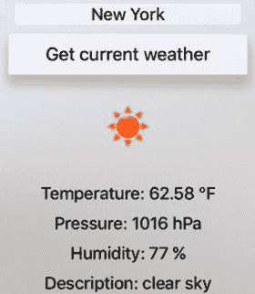

# 温度单位

为了在 `ViewController` 类中指定单位，我声明了一个私有字段 `temperatureUnit`。其默认值设置为 `TemperatureUnit.Metric`。因此，当你运行应用时，它将以摄氏度显示温度。要获取不同温标下的温度读数，你需要更改 `temperatureUnit` 字段的值。例如，如果你将其更改为 `TemperatureUnit.Imperial`，你将得到与图 9-6 中所示类似的结果。

图 9-6. 使用英制单位显示天气状况（与图 9-1 对比）

