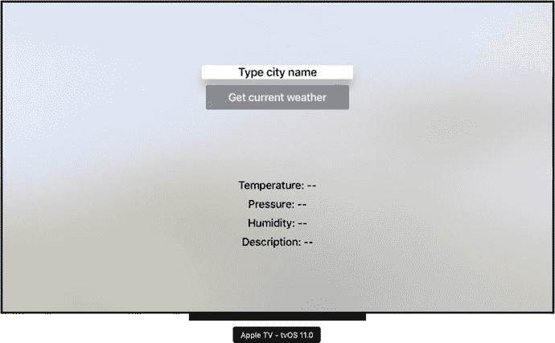
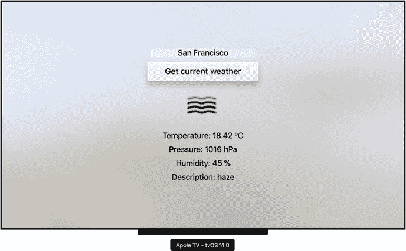
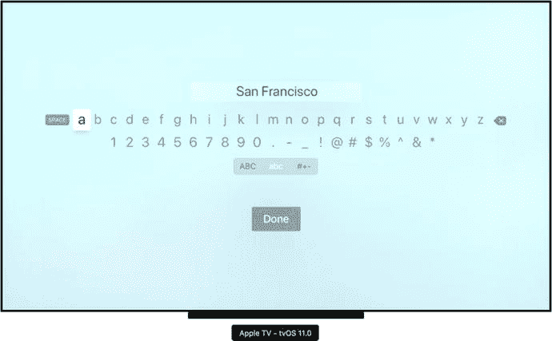

# 在模拟器中测试应用

要测试 HelloTV 应用，你可以使用模拟器。启动应用的方式与之前章节类似。只需使用 Target/Debug 面板将应用设置为 HelloTV，选择 Apple TV tvOS 11.0 模拟器，然后运行应用。稍等片刻，你将看到应用在模拟器中运行（图 9-7）。该应用会显示一个文本字段、一个按钮以及四个带有替代符号的标签。你还会注意到，无法直接使用鼠标或触摸板点击或轻触任何视觉控件。相反，要控制模拟器，你需要使用 Apple TV 遥控器或用于开发的 Mac 键盘。

图 9-7. HelloTV 应用在 tvOS 模拟器中启动后的默认视图

若要启用这两种选项，请使用模拟器的 Hardware 菜单。前往 Hardware ➤ Show Apple TV Remote 以激活遥控器，或确保以下选项——Hardware ➤ Keyboard ➤ Connect Hardware Keyboard——已开启（以便使用键盘）。一旦启用了遥控器，你可以使用其触控板在模拟器屏幕内移动光标。要轻触任何控件，请按住 ALT/OPTION 键然后点击虚拟控制器的触控板。如果你想使用键盘，则可以使用箭头键在控件之间导航。使用 Enter 键执行操作，使用 ESC 键从菜单返回或关闭窗口。你会看到，当你在视觉项目之间导航时，它们会变为高亮显示。

现在，无论你选择哪种方法，请轻触文本字段。这会激活一个窗口，你可以在其中输入城市名称（图 9-8）。用城市名称替换默认值，然后按 Done 按钮确认你的选择。返回 HelloTV 应用的主视图后，按下 Get current weather 按钮。应用将显示从 OpenWeatherMap API 获取的值，如图 9-9 所示。

图 9-9. 使用 HelloTV 应用获取的旧金山当前天气

图 9-8. 用于在文本字段中输入文本的默认 tvOS 屏幕

