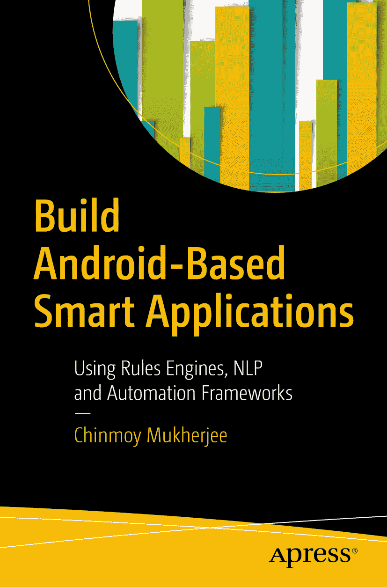

 钦莫伊·穆克吉 著 使用规则引擎、自然语言处理与自动化框架构建基于安卓的智能应用

本书作者引用的任何源代码或其他补充资料，读者均可通过本书在产品页面（位于 [www.apress.com/978-1-4842-3326-9](http://www.apress.com/978-1-4842-3326-9)）上的 `GitHub` 链接获取。如需更详细信息，请访问 [`www.apress.com/source-code`](http://www.apress.com/source-code)。ISBN 978-1-4842-3326-9 电子版 ISBN 978-1-4842-3327-6 [`doi.org/10.1007/978-1-4842-3327-6`](https://doi.org/10.1007/978-1-4842-3327-6) 美国国会图书馆控制号：2017963550 © 钦莫伊·穆克吉 2018 版权所有。出版商保留所有权利，包括整体或部分材料的翻译、重印、插图重用、朗诵、广播、微缩胶片复制或任何其他物理形式，以及电子改编、计算机软件，或任何现有或未来开发的类似或不同方法的信息存储与检索传输。本书中可能出现商标名称、标识和图像。我们未在每次出现商标名称、标识或图像时使用商标符号，而是仅以编辑方式使用这些名称、标识和图像，以维护商标所有者的权益，无意侵犯商标权。本出版物中使用的商品名、商标、服务标记及类似术语，即使未明确标识，也不应被视为对其是否受专有权利保护的立场表达。尽管本书中的建议和信息在出版时被认为是真实准确的，但作者、编辑及出版商对可能存在的任何错误或遗漏不承担法律责任。出版商不对本书所含材料提供任何明示或暗示的担保。本书采用无酸纸印刷，由施普林格科学与商业媒体纽约公司（地址：纽约州纽约市春街 233 号 6 楼，邮编 10013，电话：1-800-SPRINGER，传真：(201) 348-4505，电子邮件：`orders-ny@springer-sbm.com`，网址：www.springeronline.com）向全球图书贸易发行。Apress Media, LLC 是一家加利福尼亚有限责任公司，其唯一成员（所有者）为 Springer Science + Business Media Finance Inc（SSBM Finance Inc），后者为特拉华州公司。

## 引言

本书描述了如何使用规则引擎、代码自动化框架和自然语言处理（`NLP`）等前沿技术构建智能应用。

**注意：** 智能应用是嵌入了智能的应用。这种智能可以随时更新。

本书提供了将九个规则引擎（`CLIPS`、`JRuleEngine`、`DTrules`、`Zilonis`、`Termware`、`Roolie`、`OpenRules`、`JxBRE` 和 `JEOPS`）移植到移动平台的分步指南。随后描述了如何使用每个规则引擎构建智能应用，并提供了示例代码片段，以便读者能立即开始编写自己的智能应用。本书还讨论了其他流行规则引擎（`Drools`、`JLisa`、`Take`、`Jess` 和 `OpenRules`）的移植问题。

本书将指导读者如何根据需求规格自动生成可运行的智能应用。

最后，本书将向读者展示如何使用 `NLP` 框架 `Stanford POS`（词性标注器）从非结构化知识中生成智能应用。

## 致谢

对所引用的规则引擎网站上的示例进行了必要的修改，并提供了修改后的代码片段。感谢阿布舍克·钱德（剑桥大学计算机科学学士）在作者钦莫伊·穆克吉指导下开发了 `AutoQuiz` 原型。

