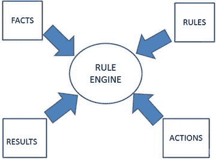
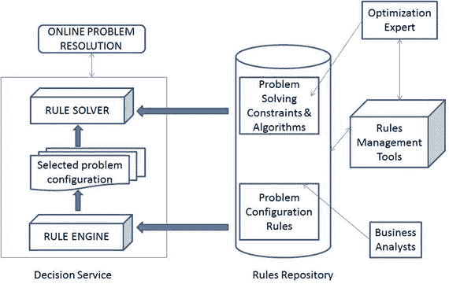

# 第一部分：规则引擎

## 1. 哪种规则引擎最适合构建智能应用？

现在，让我们基于敏捷性、可扩展性和易用性来评估规则引擎，并确定哪种最适合开发智能应用。我们首先来定义什么是规则引擎。

规则引擎有助于将智能嵌入到应用程序中。这种智能可以即时更新。读者应该了解可编程计算器。规则引擎可以被视为此类计算器的高级版本。可以从 Source Forge 下载 `CLIPS`[24]。

```
java -jar CLIPSJNI.jar
CLIPS> (+ 3 4)

CLIPS> (defglobal ?*x* = 3)
CLIPS> ?*x*

CLIPS> red
red
CLIPS> (bind ?a 5)

CLIPS> (+ ?a 3)

CLIPS> (reset)
CLIPS> ?a
[EVALUATN1] Variable a is unbound
FALSE
CLIPS>
```

示例代码取自 [23]。有多种用 Java 编写的规则引擎，它们在功能和概念上差异很大。2011 年，业务规则引擎的收入超过了 4.6 亿美元 [1]。到 2015 年，移动应用市场的总规模将达到 250 亿美元 [2]。根据 Gartner 的说法，开发情境感知型移动应用是主要趋势之一 [3]。

移动应用正变得越来越复杂。这为移动平台上的规则引擎创造了发展空间。规则引擎有助于将业务逻辑与应用逻辑分离。目前，已知可在移动平台上运行的规则引擎并不多。我们已在 Android 上移植并评估了九种规则引擎：`CLIPS`、`OpenRules`、`JXBRE`、`JEOPS`、`Roolie`、`Termware`、`JRuleEngine`、`Zilonis` 和 `DTRules`。本章提供了每种规则引擎的详细描述、分步移植指南以及可用的示例代码。我们还讨论了在尝试移植其他流行规则引擎（如 `Drools`、`JLisa`、`Take` 和 `Jess`）时遇到的问题。我们在 Android 环境中基于许可协议、开发语言、规则语法、推理方法、多线程支持、可扩展性等对规则引擎进行了比较 [4]。如果你正尝试在移动项目中使用规则引擎，本章可以为你节省超过四个员工周的工作量。


### 什么是规则引擎？

规则引擎是一种在运行时生产环境中执行一条或多条规则的软件，每个规则引擎都有其专有的规则存储格式和不同特性。如今，规则引擎被应用于金融、医疗、零售、制造等领域。

规则引擎日益流行的原因如下：

- 业务逻辑与应用程序分离
- 规则可与应用程序代码分开管理
- 领域专家易于编写规则

规则引擎让应用程序更具灵活性。使用规则引擎可以更快地发布应用程序。其他优势还包括规则易理解、工具集成、速度快、可扩展性以及声明式编程。

Android 已成为第一大移动平台（图 1-1）[5]。随着对上下文感知型智能应用需求的增长，规则引擎必将被集成到越来越多的 Android 应用中。

本章的主要贡献是对 Android 平台上的九个规则引擎进行了评估。本章详细描述了每个规则引擎，并提供了每个引擎的摘要。从许可证、语言、规则、推理、多线程支持、可扩展性等多个方面对九个规则引擎进行了评估和比较。本章最后推荐了最适合 Android 平台的规则引擎。


图 1-1

智能手机销量

#### CLIPS

`CLIPS` [6] 是一个用 C 语言编写的规则引擎。由于它速度快且免费，因此是使用最广泛的规则引擎。

它可移植性强，可以轻松与使用 `C`、`Java`、`FORTRAN` 和 `ADA` 编写的软件集成。使用 `CLIPS` 规则可以表示各种复杂的知识。该软件属于公共领域，成为业界的选择。以下是该规则引擎的摘要（图 1-2）。

- 许可证类型：公共领域
- 语言：`C`
- 是否可在 Android 上运行：是
- 规则语法：类 Lisp
- 内存占用：0.83 MB
- 推理方法：`Rete` [22]
- 支持多线程：否
- 易于扩展规则引擎：是，平均运行时间为 17.4 毫秒



图 1-2

CLIPS 规则引擎

#### JRuleEngine

`JRuleEngine` [7] 是一个基于 Java 的规则引擎，采用前向链接算法，并按照 `JSR 94` 规范设计。规则在 `XML` 文件中定义。

规则有两种类型。一种是有状态规则会话，它会记住事实的状态，并且可以重复查询。另一种是无状态规则会话，性能良好，但不会记住事实的状态。

该规则引擎使用一组输入对象并生成一组输出对象。以下是该规则引擎的摘要：

- 许可证类型：开源，`LGPL`
- 语言：`Java`
- 是否可在 Android 上运行：是
- 规则语法：条件-动作模式
- 内存占用：0.062660217 MB
- 推理方法：前向链接算法
- 支持多线程：是
- 易于扩展规则引擎：是，平均运行时间为 0.24163 秒

#### DTrules

`DTrules` [8] 是一个基于 Java 的高性能规则引擎。

规则采用决策表的形式，提供了一种以表格形式描述逻辑的简单方法。支持不平衡决策表，从而减少了构建决策表所需的工作量。`DTRules` 可以轻松集成到 Java 应用程序中。

它支持领域特定语言（`DSL`）。内存占用小。以下是该规则引擎的摘要：

- 许可证类型：开源（Apache 2.0 开源许可证）
- 语言：`Java`
- 是否可在 Android 上运行：是
- 规则语法：决策表
- 内存占用：0.540092468 MB
- 推理方法：使用结构化数据集和一组决策表来实现策略规则
- 支持多线程：是
- 易于扩展规则引擎：否

#### Zilonis

`Zilonis` [9] 是一个多线程规则引擎。它基于前向链接 `Rete` 算法的变体。其规则表示语言类似于 `LISP`。它还为基于 Java 的应用程序提供了一个脚本环境。

以下是该规则引擎的摘要：

- 许可证类型：`GPL`
- 语言：`Java`
- 是否可在 Android 上运行：是
- 规则语法：类似于 `Lisp`
- 内存占用：0.683494568 MB
- 推理方法：前向链接 `Rete` 算法的变体
- 支持多线程：是
- 易于在云端扩展规则引擎：是，平均运行时间为 0.65863 秒

#### Termware

`Termware` [9] 是一个规则处理框架，可以轻松嵌入到 Java 应用程序中。它拥有一个基于带动作的项系统概念的形式化语义模型。它在应用程序中提供了极大的灵活性，可高度适应多变的环境、易于重新设计和组件复用。以下是该规则引擎的摘要：

- 许可证类型：其他
- 语言：`Java`
- 是否可在 Android 上运行：是
- 规则语法：专有
- 内存占用：0.195205688 MB
- 推理方法：一个对象，多种模式匹配方法
- 支持多线程：是
- 易于扩展规则引擎：是，平均运行时间为 11.3892 秒

#### Roolie

`Roolie` [11] 是一个极其简单的 Java 规则引擎。它是一个非 `JSR 94` 规则引擎，专为使用 Java 创建的规则而设计。基本规则写在单独的 Java 文件中，并通过 `XML` 文件链接在一起以创建更复杂的规则。以下是该规则引擎的摘要：

- 许可证类型：开源 `LGPL`
- 语言：`Java`
- 是否可在 Android 上运行：是
- 规则语法：`XML`
- 内存占用：0.594 MB (608 KB)
- 推理方法：专有
- 支持多线程：否
- 易于扩展规则引擎：是，平均运行时间为 2.87 秒

#### OpenRules

`OpenRules` [12] 是一个业务决策管理系统（`BDMS`），提供基于规则的应用程序开发。它通过简单的 Java `OpenRules` API 或标准的 `JSR-94` 接口工作。它用于创建决策支持系统，可在应用程序中创建、执行和维护业务规则。规则以决策表的形式在 Excel 文件中指定，这消除了用户的学习成本，因为只需要熟悉 MS Excel 即可。它允许在运行时更改 Excel 表中的业务规则/逻辑，而无需重新部署。它支持并行性，使其能够在多线程环境中工作。图 1-3 描绘了 `OpenRules` 的工作流程。



图 1-3

OpenRules 规则引擎

以下是该规则引擎的摘要：

- 许可证类型：开源（`GPL`）和商业（非 `GPL`）均有
- 语言：`Java`
- 是否可在 Android 上运行：是
- 规则语法：Excel 文件中的决策表
- 内存占用：2 MB
- 推理方法：专有
- 支持多线程：是
- 易于扩展规则引擎：否

#### JxBRE

`JxBRE` [13] 是一个轻量级的基于 Java 的业务规则引擎（`BRE`）。规则写在 `XML` 文件中，同时包含基于规则执行定义应用程序流程的逻辑。它既是前向链接的数据驱动推理引擎，也是 `XML` 驱动的流程控制引擎。以下是该规则引擎的摘要：

- 许可证类型：`GPL`
- 语言：`Java`
- 是否可在 Android 上运行：是
- 规则语法：`XML`
- 内存占用：1.44 MB (1474 KB)
- 推理方法：专有
- 支持多线程：否
- 易于扩展规则引擎：是，平均运行时间为 2.57 秒


#### JEOPS

JEOPS [14] 是一个基于 Java 的规则引擎，用于将前向链接的生产规则嵌入到 Java 应用程序中。它为应用程序提供了人工智能能力。

JEOPS 的生产规则可以写在文本文件（.rules 文件）中。与知识库的交互通过四种方法执行：`Tell(object)`、`Flush()`、`Retract(object)` 和 `Modified(object)`。由于在规则定义中使用了 Java 表达式，Java 程序员学习 JEOPS 所需的时间被最小化。以下是该规则引擎的概要：

* 许可证类型：开源 LGPL
* 语言：Java
* 可在 Android 上运行：是
* 规则语法：任何文本编辑器中的“条件-动作”模式
* 内存占用：0.03 MB（31.5 KB）
* 推理方法：RETE
* 支持多线程：否
* 规则引擎易于扩展：是，平均运行时间为 120 毫秒

