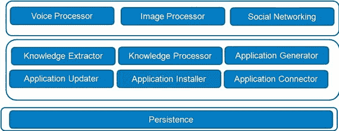
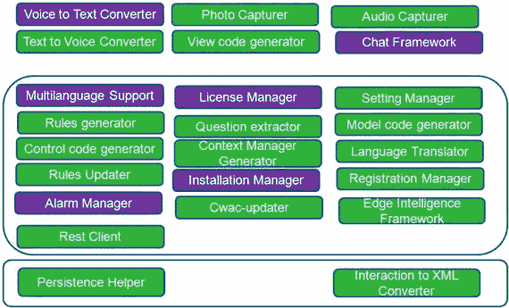

# 7. SmartAppGen 的架构

我们为 SmartAppGen 设计了一个包含高层架构和底层架构的三层架构。见图 7-1。

图 7-1

SmartAppGen 高层架构

一个复杂的知识应用需要支持社交网络、图像和语音处理、无线升级能力以及持久化管理功能。因此，SmartAppGen 必须能够生成此类功能。

基于应用工作流，我们为 SmartAppGen 设计了一个底层架构。

图 7-2 描述了 SmartAppGen 在表示层、应用层和数据层中的所有组件。

图 7-2

底层架构

现在让我们详细描述每个组件。

### 模型代码生成器

此框架用于生成代表知识/指南模型的代码（例如 `GuidelineData.java`）。

### 视图代码生成器

此框架用于生成知识/指南的用户界面代码（例如 `Guidelinescreen.java`）。

### 控制器代码生成器

此框架用于生成知识指南的控制器代码（例如 `Mainactivity.java`）。

### 问题提取器

此模块提取指南类型（决策型/信息型）、问题、答案类型和答案值，并自动构建 `question.xml`。

### 上下文管理器生成器

此框架生成与知识应用相对应的上下文管理器。

### 规则生成器

此框架将数字化指南转换为规则。对于每条指南，会生成一组规则文件。在 `DTRules` 规则引擎中，决策在 Excel 工作表中表示。`Excel2XML` 将决策转换为可由规则引擎处理的 XML 文件。在 `CLIPS` 中，可以根据注册信息和问题轻松生成规则头文件。开发者只需编写规则的其余部分即可。

### 语言翻译器

此框架为将应用文本翻译成多种语言提供支持。

### 持久化助手

此框架有助于将应用数据持久化到本地数据库。

### 交互到 XML 转换器

此框架将用户交互（例如模型）转换为 XML。

### 规则升级器

此框架将有助于通过无线方式升级规则。

### Cwac-updater

此开源框架 [1] 可用于通过无线方式升级 Android 应用。

### 语音转文本转换器

此框架将用户的语音转换为文本。

### 文本转语音转换器

此框架将帮助将文本转换为语音，并帮助应用通过语音与用户交互。

### 照片捕获器

这是一个用于捕获照片的通用框架。

### 音频捕获器

这是一个用于捕获音频（用于录音或任何其他目的）的通用框架。

### 聊天框架

此框架支持聊天功能。

### 边缘智能框架

此框架需要建立在规则引擎之上，并帮助应用轻松地与规则引擎通信。

### REST 客户端

此框架将帮助应用使用任何符合 `JAX-RS` 规范的服务器公开的 RESTful Web 服务。

### 安装管理器

此框架确保根据用户的配置文件将适当的组件和附件打包到可安装的文件中。

