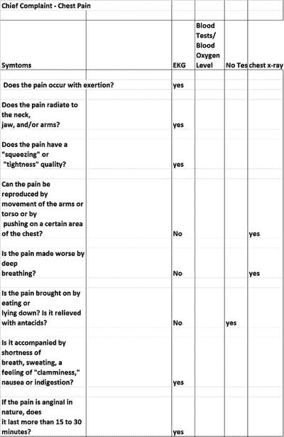
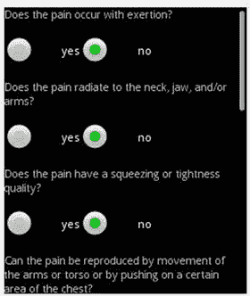
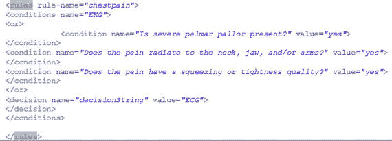
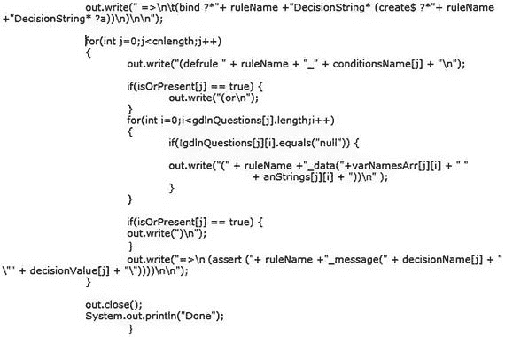
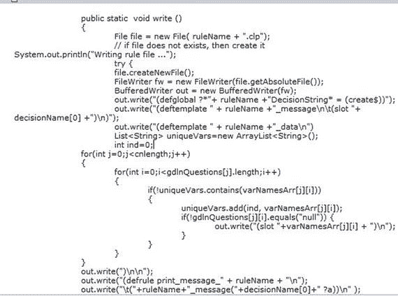
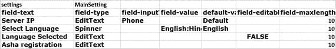
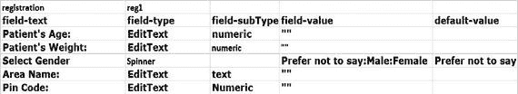
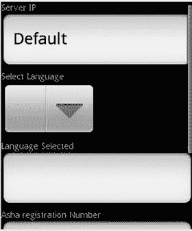
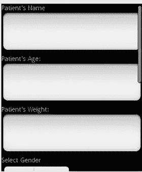
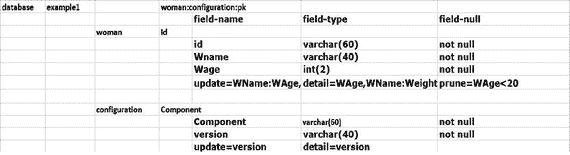

# 8. 从知识生成知识应用的示例

图 8-1 展示的知识可用于根据患者的症状推导出患者需要接受的一系列医学检查。



图 8-1

Excel 工作表中的知识

根据图 8-1 中所示的 Excel 工作表，生成相应的 Android 布局和 `CLIPS` 规则文件。

### 与知识对应的 Android 布局

为完整起见，此处提供 Android 布局 XML。

```
----snipped----------------------------------------------------
```

图 8-2 描绘了与上述布局代码对应的 Android 屏幕。



图 8-2

生成的 Android 屏幕

使用以下方法自动生成 XML 文件，结果如下：



使用该 XML，自动生成一个 `CLIPS` 规则。生成 `CLIPS` 规则的代码片段如下：





### 与知识对应的 CLIPS 规则文件

建议读者阅读 `CLIPS` 基本编程指南，以更好地掌握 `CLIPS` 规则语法 [23]。

```
(defglobal ?*Chief_Complaint__Chest_Pain_DecisionString* = (create$))
(deftemplate Chief_Complaint__Chest_Pain_message
(slot decisionString)
)
(deftemplate Chief_Complaint__Chest_Pain_data
(slot pain_exertion)
(slot pain_radiate_neck_jaw_arms)
(slot pain_squeezing_tightness_quality)
(slot it_accompanied_shortness_breath_sweating_feeling_clamminess_nausea_indigestion)
(slot If_pain_anginal_nature_it_last_more_than_15_30_minutes)
(slot Can_pain_be_reproduced_movement_arms_torso_pushing_certain_area_chest)
(slot pain_made_worse_deep_breathing)
(slot pain_brought_eating_lying_down_it_relieved_antacids)
)
(defrule print_message_Chief_Complaint__Chest_Pain
(Chief_Complaint__Chest_Pain_message(decisionString ?a))
=>
(bind ?*Chief_Complaint__Chest_Pain_DecisionString* (create$ ?*Chief_Complaint__Chest_Pain_DecisionString* ?a))
)
(defrule Chief_Complaint__Chest_Pain_EKG
(or
(Chief_Complaint__Chest_Pain_data(pain_exertion yes))
(Chief_Complaint__Chest_Pain_data(pain_radiate_neck_jaw_arms yes))
(Chief_Complaint__Chest_Pain_data(pain_squeezing_tightness_quality yes))
(Chief_Complaint__Chest_Pain_data(it_accompanied_shortness_breath_sweating_feeling_clamminess_nausea_indigestion yes))
(Chief_Complaint__Chest_Pain_data(If_pain_anginal_nature_it_last_more_than_15_30_minutes yes))
)
=>
(assert (Chief_Complaint__Chest_Pain_message(decisionString "EKG")))
)
(defrule Chief_Complaint__Chest_Pain_No_Test
(Chief_Complaint__Chest_Pain_data(pain_exertion no))
(Chief_Complaint__Chest_Pain_data(pain_radiate_neck_jaw_arms no))
(Chief_Complaint__Chest_Pain_data(pain_squeezing_tightness_quality no))
(Chief_Complaint__Chest_Pain_data(Can_pain_be_reproduced_movement_arms_torso_pushing_certain_area_chest no))
(Chief_Complaint__Chest_Pain_data(pain_made_worse_deep_breathing no))
(Chief_Complaint__Chest_Pain_data(pain_brought_eating_lying_down_it_relieved_antacids yes))
(Chief_Complaint__Chest_Pain_data(it_accompanied_shortness_breath_sweating_feeling_clamminess_nausea_indigestion no))
(Chief_Complaint__Chest_Pain_data(If_pain_anginal_nature_it_last_more_than_15_30_minutes no))
=>
(assert (Chief_Complaint__Chest_Pain_message(decisionString "No Test")))
)
(defrule Chief_Complaint__Chest_Pain_chest_x-ray
(or
(Chief_Complaint__Chest_Pain_data(Can_pain_be_reproduced_movement_arms_torso_pushing_certain_area_chest yes))
(Chief_Complaint__Chest_Pain_data(pain_made_worse_deep_breathing yes))
)
=>
(assert (Chief_Complaint__Chest_Pain_message(decisionString "chest x-ray")))
)
```


### 知识应用的处理流程

当用户在知识应用中选择“胸痛”指南时，系统会呈现一系列问题（图 8-2）。用户回答这些问题时，上下文管理器会构建一个 CLIPS `assert` 字符串，并将其断言到规则引擎中。生成的 CLIPS 规则文件在应用启动时已加载到规则引擎中。规则引擎会根据规则文件和用户输入得出结果。随后，上下文管理器从规则引擎中读取结果，并将其发送至主活动界面进行显示。

### 知识应用支持功能的生成

根据注册和设置文件（图 8-3 与 8-4）中的信息，`SmartAppGen` 会自动为应用生成相应的 Android 布局和活动文件。



图 8-4 知识管理应用设置



图 8-3 用户注册信息

图 8-5 和 8-6 展示了生成的应用。



图 8-6 生成的设置界面



图 8-5 生成的注册界面

### 生成数据库辅助类

`SmartAppGen` 还能自动生成数据库辅助类。该类用于持久化应用信息。数据库设置如图 8-7 所示。



图 8-7 知识应用数据库设置

以下是生成的数据库辅助类的代码片段：

```
public class example1_DataHelper {
private static final String DATABASE_NAME = "example1";
private static final int DATABASE_VERSION = 4;
private static final String TABLE_REG1 = "reg1";
private Context context;
private SQLiteDatabase db;
public example1_DataHelper(Context context) {
this.context = context;
OpenHelper openHelper = new OpenHelper(this.context);
this.db = openHelper.getWritableDatabase();
}
public long insert_reg1(String values)
{
long returnValue = 1;
String executeString = "insert into " + TABLE_REG1 + " values(" + values +");";
Log.d("insert",executeString);
try {
db.execSQL(executeString);
}
catch(SQLiteException e) {
Log.e("Database error while inserting",e.toString());
returnValue = 0;
}
return returnValue;
}
public long update_reg1(String pk, String Age, String Weight, String Gender, String Area, String Pincode)
{
long returnValue = 1;
String executeString = "update " + TABLE_REG1 + " set "+ "Age = '" + Age + "'," + "Weight = '" + Weight + "'," + "Gender = '" + Gender + "'," + "Area = '" + Area + "'," + "Pincode = '" + Pincode + "'"  + " where Id = '" + pk + "' ;";
Log.d("update",executeString);
try {
db.execSQL(executeString);
}
catch(SQLiteException e) {
Log.e("Database error while updating",e.toString());
returnValue = 0;
}
return returnValue;
}
public String getName_reg1(String pk)
{
String str = "";
Cursor cursor = this.db.query (TABLE_REG1, new String[] {"Name"}, "Id" + "="+"?", new String[]{pk}, null, null, "ID desc");
if (cursor.moveToFirst())
{
str = cursor.getString(0);
}
if (cursor != null && !cursor.isClosed()) {
cursor.close();
}
return str;
}
public void deleteAll_reg1()
{
this.db.delete(TABLE_REG1, null, null);
}
public List selectAll_reg1()
{
Listlist = new ArrayList();
Cursor cursor = this.db.query (TABLE_REG1, new String[] { "Id" }, null, null, null, null, "ID desc");
if (cursor.moveToFirst()) {
do {
list.add(cursor.getString(0));
} while (cursor.moveToNext());
}
if (cursor != null && !cursor.isClosed()) {
cursor.close();
}
return list;
}
public void prune(String tableName, String condition)
{
String sql="delete from "+ tableName + " where " + condition;
db.rawQuery(sql, null).moveToFirst();
}
public void pruneAll(String[] tableName, String[] condition)
{
for(int i=0;i<tableName.length;i++){
prune(tableName[i],condition[i]);
}
}
private static class OpenHelper extends SQLiteOpenHelper {
OpenHelper(Context context) {
super(context, DATABASE_NAME, null, DATABASE_VERSION);
}@Override
public void onCreate(SQLiteDatabase db) {
try {
String execStr;
execStr = "CREATE TABLE " + TABLE_REG1 + " (Id varchar(60) not null, Name varchar(60) not null, Age int(3) not null, Weight int(3) not null, Gender varchar(60) not null, Area varchar(60) not null, Pincode int(6) not null, PRIMARY KEY (Id) )";
Log.d("example1_DataHelper \n",execStr);
db.execSQL(execStr);
}catch(SQLiteException e) {
Log.e("Database error",e.toString());
}
}
@Override
public void onUpgrade(SQLiteDatabase db, int oldVersion, int newVersion) {
Log.w("Example", "Upgrading database, this will drop tables and recreate.");
db.execSQL("DROP TABLE IF EXISTS " + TABLE_REG1);
onCreate(db);
}
}
}
```

### 如何使用 SmartAppGen

创建一个新的 Android 项目，提供主 Android 布局文件、主活动 Java 文件、`AndroidManifest.xml`、包含知识的 Excel 表/文本文件，以及应用配置作为运行时参数传递给 `SmartAppGen` 并运行。所有生成的代码以及作为 `SmartAppGen` 一部分开发的可复用框架都会被复制到 Android 项目中。只需刷新项目，执行清理构建并运行，您的知识应用即可部署。

### SmartAppGen 的优势

以下优势显而易见：

* `SmartAppGen` 加速框架可将任何知识应用的开发时间显著缩短 30% 至 50%。
* 通用框架（音频捕获器、文本转语音、照片捕获器、上传管理器、规则更新器等）可在任何 Android 项目中复用。

