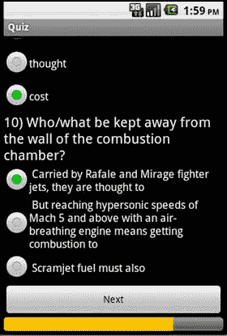

# 9. AutoQuiz：从非结构化知识自动生成测验

在本章中，我们将展示如何利用自然语言处理（NLP）技术，从知识中自动构建测验应用。NLP 提供了一种处理、理解并推导人类语言含义的方法。苹果的 SIRI、谷歌的 Home、亚马逊的 Echo 以及微软的 Cortana 都是 NLP 系统的几个例子。

为了验证用户对培训内容的学习效果，用户需要参加与培训材料相对应的测试，并且分数需达到公司或机构设定的阈值。

此类测试中最耗时的环节之一就是问题的生成。问题通常需要由该领域的专家手动构建。此外，根据问题的性质和用户数量，答案验证也同样耗时。

`AutoQuiz` 通过自动化生成问题来解决这一难题。我们从培训材料中提取知识，然后通过向用户呈现测验来验证其学习效果。

`AutoQuiz` 接受基于文本的培训材料作为输入，这在大多数情况下是可行的，因为文本可以轻松从 PPT、PDF、Word 文档等各类文件中提取，并输入到 `AutoQuiz` 知识管理系统中。

`AutoQuiz` 系统包含两个组件：问题生成器以及用于显示测验和用户分数的知识应用。


### 题目生成器

该程序接收一个包含文本内容的 `.txt` 文件，并输出一个包含题目、答案、选项等内容的 XML 文件。启动程序后，用户输入文章的**文件名**（如果不在当前目录，需包含路径名）。程序使用 Stanford NER（命名实体识别）标注器来标记以下类别的词语：时间、地点、组织、人物、货币、百分比和日期。

随后，程序使用开源的 Stanford POS（词性）标注器 [16] v.3.2.0。它采用 Penn Treebank 标记集 API [20] 根据词语的词性进行标注。使用此 API 运行经过训练的标注器需要占用 60–200 MB 内存，相比其他标注器（如 `OpenNLP` [17]）要低得多，后者使用默认训练器运行时约需占 3–4 GB 内存。然而，`OpenNLP` 还提供了其他工具，例如句子分割和命名实体提取，这些功能虽然 Stanford POS 标注器不支持，但对我们的应用却很有用。词语标记完成后，被标记的词语会存储到一个文本文件中，程序会解析该文件中的每个句子，并将其转换为以下四种不同类型的题目：

*   **关键词题：** 这类题是“填空”题，没有选项，正确答案是句子中的某个关键词。这个关键词是由 POS 标注器识别出的专有名词。一般来说，专有名词是很好的关键词，因为它们通常是句子的主语。未来的扩展方向是利用 `OpenNLP` 工具来检测句子的核心词，并将其作为关键词。
*   **名词题：** 这是另一种“填空”题，通过 POS 标注器识别出名词，但会为答案提供选项。选项来自其他句子中的名词。这类题目的质量关键在于题目与选项的语义合理性与相关性。我们计划为选项提供属性，并在选择选项时，扫描所有答案的池子，寻找具有相同属性的选项。例如：输入句子：“一位工程师正试图开发轻量级、‘吸气式’的高超音速飞行器，这种飞行器能像火箭一样高速飞行，同时从大气中获取氧气。” 名词：工程师 属性：职业 我们使用 `WordNet` [18] 来寻找它在职业层级树中的同类词，例如：科学家、电工、技术专家等。
*   **探究式问题（第一类）：** 这类问题带有探究性质。例如：输入句子：“杰克是那个开车的人。” 问题：“谁是那个开车的人？” 这类问题会寻找第三人称、过去时态的动词。这是因为大多数描述性文章都使用第三人称过去的句子。此外，答案必须包含一个专有名词，以避免像“它躺在桌子上”这样琐碎的情况。如果没有这个规则，答案就会是“它”，这并非一个有意义的问题。可以使用命名实体识别软件（例如 Stanford 命名实体识别器 [21] 或 `OpenNLP` 工具 [17]）来细化“谁/什么”这类问题，将其细化为“谁”、“什么”（甚至“何时”、“多少钱”等）。
*   **探究式问题（第二类）：** 这类问题与第一类探究式问题类似。区别在于疑问词不是放在句子开头，而是放在句子末尾。例如：输入句子：“杰克是那个开车的人。” 问题：“杰克是那个开什么的人？” 类似地，可以使用命名实体识别器来细化问题的措辞。

这些问题会按照以下格式存储在 XML 文件中：

```
question
RadioButton/Text
answer
option1:option2...
```

该 XML 文件存储于第二个项目——安卓应用项目中。具体位置由用户在第一个项目中输入。该字段使用凯撒密码的一种简单变体进行加密：在 ASCII 表中，所有字符都按某个索引值进行移位。这样，如果用户试图从已安装的应用程序中提取文件，答案就不会直接可见。

### 测验应用

该应用读取 XML 文件，并为每个文件创建一个独立的测验。用户可以设定每页的题目数量。进度条会指示测验已完成的比例。测验结束时，用户会得到该次测验的分数。图 9-1 至 9-3 的截图将帮助你更好地理解应用的运行流程。


图 9-3

测验分数



图 9-2

测验题目


图 9-1

AutoQuiz 应用

### AutoQuiz 的优点

我们可以轻松地观察到 AutoQuiz 系统的以下优点：

*   基于培训/演示材料自动生成测验，节省了手动准备测验的数小时工作量
*   自动验证测验答案，再次节省了手动验证答案的数小时工作量
*   使培训/演示更加高效，因为参加培训的人必须回答 AutoQuiz 生成的题目，他们及其经理可以立即知道分数
*   衡量培训师和培训材料的有效性

### 已知问题

对于 AutoQuiz 系统，我们仍需解决以下问题：

*   在“填空”和“名词”题中，选项有时可能不具合理性，使得应试者即使不理解文章内容也能轻松答对。我们计划通过为选项池中的词语标记属性来解决此问题。
*   如果两类探究式问题只使用“谁/什么”，会变得过于单调和机械。目前使用这些词是因为 AutoQuiz 无法识别句子中的主语。
*   句子焦点：当前的原型系统无法识别句子的主语，从而无法生成更有意义的问题。例如：输入句子：“只有那个小偷偷戴黑帽子。” 这里的焦点是“小偷”，而不是帽子的颜色。合适的问题：“谁戴了黑帽子？” 不太合适的问题：“那个小偷戴了什么颜色的帽子？”
*   知识提取：当前的原型系统仅能浅层提取知识，而无法深入。它们没有使用规则来存储知识，因此无法用于进行推理。例如：输入：“乔是约翰的兄弟。约翰是杰克的兄弟。” 可能的推理结果：“乔是杰克的兄弟。”

在下一节中，我们将提出这些问题的可能解决方案。


