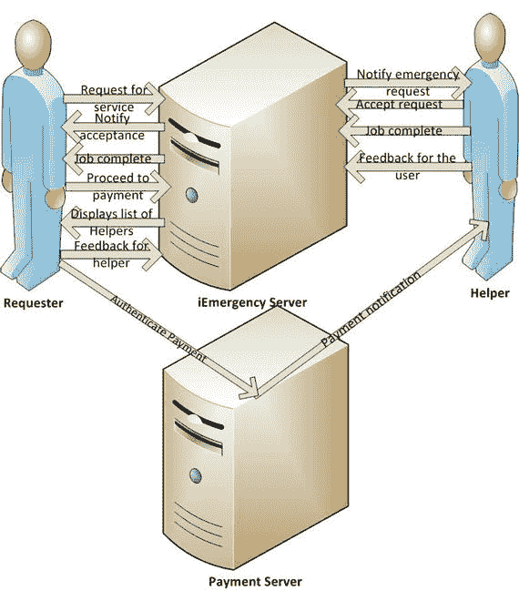
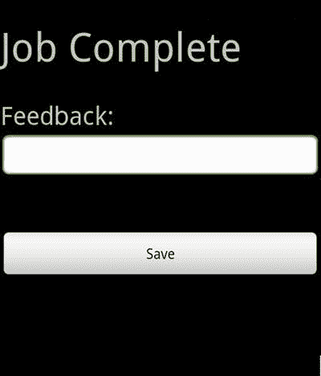
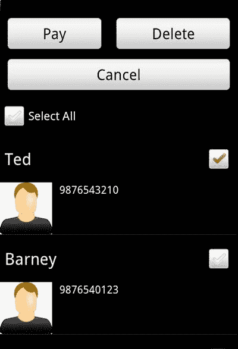
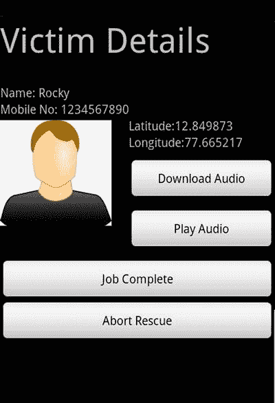
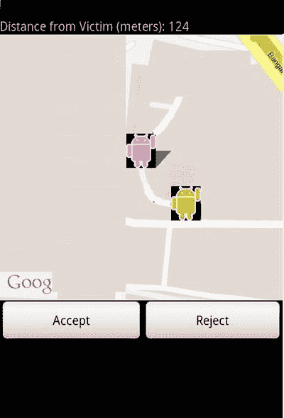
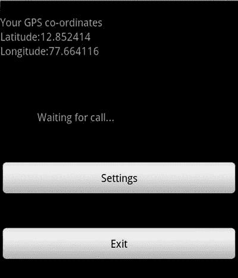
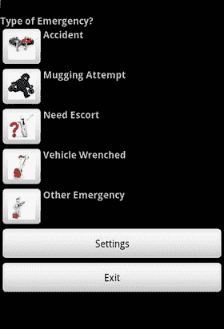

# iEmergency

在大多数发展中国家，如果一个人遇到紧急情况——例如被抢劫、被殴打、被骚扰、在陌生地方迷路、遭遇事故、需要安全指南等——几乎都难以及时获得帮助。一个人处于紧急情况的时间越长，失去生命或财产的可能性就越大。在印度这样的国家，警察与民众的比例为 125:100000，而且在高峰时段道路严重拥堵。因此，大多数情况下警方无法快速到达犯罪现场。警方通常需要两个多小时才能到达犯罪现场！此外，据观察，普通民众要么不感兴趣，要么过于害怕，担心遭到罪犯攻击，而不愿向有需要的人提供紧急帮助。这给受害者造成了重大的身体、情感和经济损失，甚至可能导致死亡。

拟议的系统`iEmergency`旨在通过一个注册的紧急救援提供者网络，向受害者提供现场紧急帮助。受害者可以使用智能手机发起紧急求助请求。移动网络利用基于位置的服务找到附近的紧急救援提供者并通知他们。紧急救援提供者前往受害者处并提供所需援助。在帮助完成并令受害者满意后，将从受害者账户中扣除固定金额，并分发给那些回应请求并在规定时间内提供现场帮助的紧急救援提供者。

### 方法

当一个人面临紧急情况时，他或她可以使用智能手机中安装的应用程序发起紧急帮助请求。请求者需要选择所需的紧急援助类型。紧急情况的详细信息以及请求者的位置（例如，`GPS`/`GPRS`）会上传到`iEmergency`服务器。人们可以根据自身能力选择和注册各种类型的紧急服务。例如，住在高速公路附近的人可以注册为事故救援服务提供者，退休的军人或警察可以注册为轻微犯罪预防服务提供者，热心社会服务的人可以注册为医院陪护人员等。服务器会识别请求者位置指定半径内可用的、符合其所需帮助类型的紧急救援人员。服务器根据人员面临的紧急情况类型确定所需的紧急救援人员数量，并将紧急情况和请求者的详细信息（姓名、位置和照片）发送给紧急救援人员。紧急救援人员会收到类似“`<姓名>`先生/女士（`<手机号码>`）在`<地点>`遇到`<类型>`紧急情况”的消息。紧急救援人员可以在地图上查看请求者的当前位置。紧急救援人员可以接受或拒绝服务请求。

如果紧急救援人员接受了请求，他或她可以检索与请求者相关的音频/视频文件，并收集更多关于其位置和紧急情况类型的信息。请求者端应用程序具有上传音频或视频文件的功能。他或她可以录制紧急消息并将音频上传到服务器，以便救援人员可以下载。紧急救援人员会尽量靠近请求者的位置，并大声呼喊其姓名或使用手机拨打电话联系他。服务器会定期接收可用紧急救援人员的位置信息，以便在发生任何紧急事件时，服务器知道他们的位置。

### 系统架构

拟议系统的架构及高层工作流程如图 10-1 所示。该系统由`请求者`和`帮助者`应用程序以及一个中央服务器组成。请求者通过启动其智能手机上安装的`请求者`应用程序来发送紧急服务请求。该应用程序向服务器发送请求，要求派遣帮助者到现场。服务器将紧急情况通知附近的帮助者。帮助者到达现场，为请求者提供所需服务。然后请求者向帮助者支付费用。服务器会回复已接受请求的帮助者列表。请求者从列表中识别出实际前来提供帮助的帮助者，并向这些帮助者支付费用（图 10-6）。支付服务器对请求者进行身份验证，并向帮助者发送付款。

`帮助者`应用程序会扫描来自附近请求者的请求。服务器检索帮助者附近等待帮助人员的详细信息，并将这些详细信息作为响应发送。`帮助者`应用程序在地图上显示请求者和帮助者。帮助者可以接受或拒绝请求。帮助者为请求者提供帮助，并在收到付款通知后，标记任务完成并提供反馈（图 10-7）。

**图 10-1**

iEmergency 系统架构

### 系统实现

该系统由`请求者`（`iRescue`）和`帮助者`（`iRescuer`）两个 Android 应用程序（分别供请求者和帮助者使用）以及一个中央服务器组成。任何个人都可以在门户网站上注册成为请求者和/或帮助者。注册时，个人必须提供详细信息，例如将用于服务的手机号码、近期照片、电子邮件地址，以及上传身份证和地址证明的副本。提交的信息将通过自动验证（手机号码和电子邮件地址）或手动验证（地址）的方式核实，以确保帮助者是真实可信的个人。手动验证帮助者时，可能会寻求执法部门的帮助。

#### 请求者应用程序 iRescue

该应用程序安装在请求者的手机上。当请求者遇到紧急情况时，启动该应用程序，输入 PIN 码，并录制语音以提供所遇紧急情况的更多细节。紧急情况的详细信息及相关的音频或任何媒体文件将通过 HTTP `POST` 请求上传到中央服务器。此外，当服务器发现与请求者关联的帮助者已到达可听距离范围内时，应用程序会开始大声蜂鸣。当帮助者找到请求者并提供所需的紧急服务后，应用程序检索已接受请求的帮助者列表并将其显示给请求者。列表中会显示帮助者的照片、姓名和手机号码。请求者可以从列表中选择一个或多个帮助者，并验证付款。也可以为帮助者留下反馈。对帮助者的反馈会上传到服务器。

#### 帮助者应用程序 iRescuer

该应用程序安装在帮助者的手机上。通过使用基于位置的服务（LBS），它定期将帮助者的位置信息发送到服务器。它检索最近等待接收紧急帮助的请求者的详细信息。它将帮助者和请求者显示在地图上。同时还会显示请求者当前与帮助者的距离。帮助者可以接受或拒绝请求。如果请求被拒绝，服务器会更新该帮助者的记录。如果帮助者决定接受请求，则会显示需要帮助人员的更多详细信息（姓名、手机号码和照片）。帮助者还可以下载与请求者关联的任何音频，并播放以获取关于紧急情况的更多信息。

一旦帮助者到达请求者处，提供了紧急服务并收到付款，他/她会在应用程序中将任务标记为完成，并就请求者提供反馈。

#### 用户界面

`iRescue` 和 `iRescuer` 应用程序的一些主屏幕如图 10-2 至 10-7 所示，这些屏幕展示了 `iEmergency` 系统支持的各类紧急情况。例如，图 10-5 显示了一张地图，上面同时标出了帮助者和受害者。图 10-6 显示了请求者的照片，而图 10-7 则显示了实际提供服务的帮助者的照片和详细信息。

**图 10-7**

iRescuer 任务完成

**图 10-6**

iRescue 付款

**图 10-5**

iRescuer 受害者详情

**图 10-4**

iRescuer 接受/拒绝

**图 10-3**

iRescuer 等待中

**图 10-2**

iRescue 紧急情况类型

#### iEmergency 服务器

`iEmergency` 服务器构建于 Apache XAMPP 平台之上。它由一个 Apache 服务器和一个 MySQL 服务器组成。服务器通过 HTTP `POST` 和 HTTP `GET` 接收来自帮助者和请求者的各种请求，并向 `iRescue` 和 `iRescuer` 应用程序发送 HTTP 响应。它维护着已注册请求者和帮助者的各种详细信息。服务器将附近受害者的详细信息发送给 `iRescuer` 应用程序。它还存储请求者的音频详细信息，并允许帮助者下载该音频。此外，服务器上还会记录请求者和帮助者之间交易的反馈。

