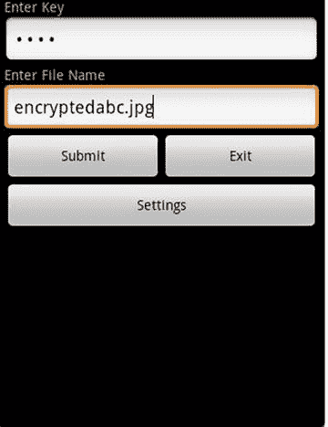
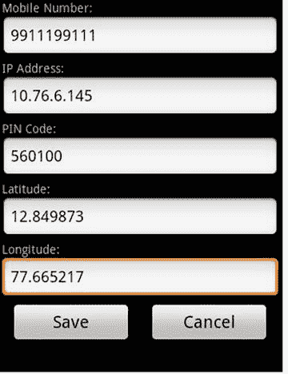
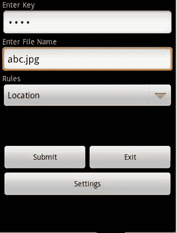
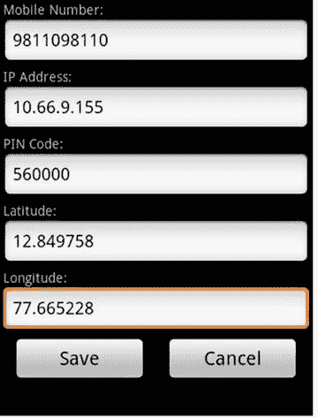
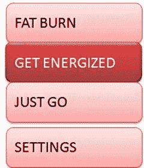

# 第三部分
用于解决实际问题的 Android 应用程序

## 11. 作业

本章包含多个作业，旨在测试你对前一章所学内容的理解。

### iEncrypt 和 iDecrypt

设计两个 Android 应用程序——例如，`iEncrypt` 和 `iDecrypt`。`iEncrypt` 将接受一个密码和要加密的图像文件，以及加密时要添加上下文的类型/规则。

以下截图（图 11-1 至 11-5）将帮助你理解应用程序的需求。

**图 11-5**

iDecrypt 解密后的内容

**图 11-4**

iDecrypt 输入

**图 11-3**

iDecrypt 设置

**图 11-2**

iEncrypt 输入

**图 11-1**

iEncrypt 设置

### iFitness

很多时候，用户在锻炼时（例如在跑步机上跑步），要么跑得太慢，要么跑得太快，导致锻炼效果不佳甚至对身体有害。

开发一款 Android 应用，帮助用户衡量其健身计划的有效性。让用户佩戴一条腕带（图 11-6），该腕带可通过蓝牙将步数、速度、心率等生命体征参数传输到 Android 应用。按照图 11-7 所示配置运动模式。

图 11-7 iFitness 主屏幕

图 11-6 Zephyr 腕带

在设置中，为每个类别配置速度的上下限阈值。例如，“燃脂”速度可在 10 到 20 公里/小时之间。同时，定义何为“高于正常”的心率阈值。除此之外，根据用户的速度和所选运动模式提供建议。此外，如果用户的心率超过设定的上限阈值，则建议用户立即停止锻炼。

### iPocket

手机扒窃在发展中国家是一个巨大的威胁，甚至在西班牙、意大利和法国等发达国家也深受其害。每年有数百万部手机因扒窃而丢失。我们如何才能实时检测到手机被扒窃？

当有人扒窃手机时，加速度计的数据模式与用户从口袋中拿出手机接打电话时的模式显著不同。开发一个 Android 服务来监控加速度计模式。通过每次手机被拿起时收集 10 到 12 个数据点，并将加速度计数据与正常情况以及扒窃情况下的数据点进行比较，来识别扒窃模式。

### iFall

老年人经常跌倒，这种情况可能发生在他们独自在家时；跌倒后他们甚至可能失去意识。Android 应用能否检测到此类紧急情况并通知相关的紧急联系人？

当一个人跌倒时，分别收集手机放在口袋里和拿在手中两种情况下的 10 到 12 组加速度计读数。在手机中运行一个服务来检查此类加速度计模式。当检测到类似模式时，唤醒 iFall Android 应用并询问用户：“你还好吗？” 如果用户回答“是”，应用退出；否则，应用会尝试再次获取用户响应。如果未收到任何响应，应用会向预配置的手机号码发送一条包含位置、时间详情以及类似“用户似乎已跌倒，过去 X 分钟无响应”信息的短信。必须通过 iFall 应用的设置来配置这些手机号码。

### iPrescribe

患者经常忘记按时服药。而且，一旦症状缓解，患者往往会完全停止服药，导致无法完全康复，并可能再次生病。

将处方及用药计划输入到 iPrescribe 应用中。提醒用户，例如：“现在是晚上 9 点，请服用 1 片 crocin 药片，并在晚上 9 点 05 分服用 1 茶匙 zedex 糖浆。”在可配置的分钟后，应用会询问患者：“您是否按处方服药了？”患者可以回答“是”或“否”；如果患者回答“否”，iPrescribe 会询问他们未服药的原因，然后记录该原因，并将其与处方计划一起存储。

在计划结束时，数据可以上传到中央服务器进行分析，以研究所开药物的有效性。iPrescribe 还应该能够根据患者遵循处方计划的严格程度，为其计算出一个健康疏忽指数。

思考一下，处方是否可以自动输入到 iPrescribe Android 应用中。

### iSafety

在发展中国家，近年来针对儿童（在上学/回家途中）的犯罪显著增加。当孩子和家人在视线之外时，我们如何确保他们的安全？

开发一个安全区域应用，并将其安装在孩子的手机上。配置安全区域，例如学校、家等。如果孩子离开安全区域的时间超过了可配置的分钟数，则开始定期发送包含该人 GPS 位置详情的短信。接收短信和位置详情的人可以在地图上绘制这些位置，并确定进一步的行动方案。

在本章中，我们学习了如何利用 Android 应用和后端服务器来设计和开发一个完整的系统，以解决现实生活中的问题。同时，我们也希望读者在阅读了这些问题之后，能够产生新的 Android 项目创意。
