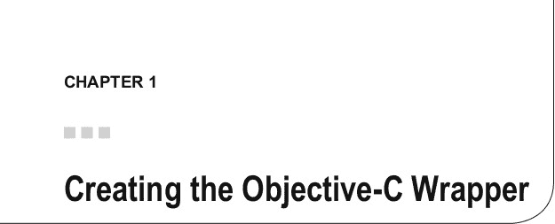
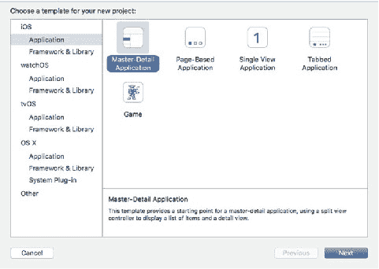
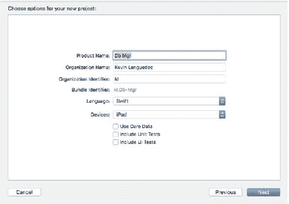

# 排版后内容

你是否知道 SQLite 曾作为 W3C 早期 HTML5 规范中 Web DB 规范的基础，但在 2010 年的最终候选版本中被移除？这项技术广泛应用于大多数计算平台，包括移动设备和嵌入式系统。苹果在 OSX 和 iOS 的多个应用中都使用了 SQLite。对于数据驱动的 iOS 应用来说，SQLite 是合乎逻辑的选择。如果你希望使用关系型数据库，还有其他选择，如 InterBase 或 BerkeleyDB；或者你也可以选择 NoSQL 路线，选用 Couchbase 或 Realm 等。不过，SQLite 提供了坚实的基础和强大的行业支持，我认为如果你正在规划一个生产级的数据驱动 iOS 应用，这至关重要。

随着 Swift 的推出，苹果为数百万 iOS 开发者带来了一款现代、设计精良的编程语言，它与 Python、Ruby、Scala、Groovy 等语言一脉相承。使用这门语言开发非常有趣。它也比 Objective-C 简洁得多，我有机会在一个 iOS 项目中使用该语言，并发现 Swift 是一种非常出色的轻量级语言。

由于本书第一版完全使用 Objective-C 编写，只有一个章节涉及 Swift 1 的测试版，我认为是时候使用 Swift 3 和 iOS 10 重写这本书了。我想探索这门新语言提供的机遇，利用 SQLite 作为后端构建数据驱动的应用。我还想展示如何轻松地在 Swift 中创建桥接，以对接 SQLite 的 C API（或任何 C/C++ API），从而通过 Swift 利用众多经过时间考验的成熟库以及新的库。

与前版设计保持一致，《使用 Swift 和 SQLite 构建 iOS 数据库应用》将引导你完成创建桥接、开发 SQLite 数据库以及执行标准 CRUD 操作的步骤，这些操作体现了存储和检索数据的数据库核心功能。我还希望探索如何用自定义函数扩展 SQLite，并使用 Swift 将它们关联起来，同时研究多数据库和备份 API。

本书应用代码采用 Swift 3 编写。我希望你觉得这本书实用且有益。

在 Swift 中为 C 库创建封装非常容易，因为这门语言设计用于与 Objective-C、C 以及 C++ 互操作。尽管本章重点介绍如何结合 Swift 使用 SQLite C API，但你也可以轻松地反向操作，从这些语言中调用 Swift。本章展示了如何为 SQLite C API 创建一个 Objective-C 封装，然后通过 Swift 与之对接。这种方法可以复制到其他 C 库中。

在本章中，我将向你展示如何执行以下操作：

- 创建一个 Swift 项目
- 将 SQLite 3 C API 库添加到项目中
- 创建一个桥接头文件以对接 C API
- 配置 Swift 编译器
- 创建一个 DAO 类来处理查询的执行

## 开始之前

在讲解桥接之前，我认为有必要提及本书以及 iOS 应用开发所需的一般工具。在撰写本书时，所有 iOS 代码均通过 Xcode 8.0 生成。我还使用了 Swift 3。

如果你计划为本书或在生产环境中开发 Swift iOS 应用，你唯一的选择是 OSX 上的 Xcode。有人可能会说 Swift 也可以在 Linux 上编译和运行。虽然这是事实，但 Xcode 不能，而你需要 Xcode 来开发 iOS、TVoS 和 OSX 应用。你还需要一个 Apple 开发者账号。对于本书的开发，你可以使用免费版本，但若要配置和部署应用，你需要一个 Apple 开发者许可，可通过 Apple 开发者网站获取。

我还将在第 2 章、第 5 章和第 10 章中使用 Firefox 的 SQLite Manager 创建 SQLite 数据库；除此之外，所有开发工作（包括创建 SQLite 数据库）都将在 Xcode 中完成。

Xcode 可以通过 OSX App Store 免费安装，该商店只能在 MAC OSX 上访问。虽然你可以通过 Apple Store 购买 OSX 副本，并将其安装在虚拟机上，但 OSX App Store 只能在真实的 OSX 机器上运行。

安装 Xcode 非常简单。一旦你在 App Store 中选择它，它就会自动安装在你的 OSX 机器上。安装 Xcode 时，SDK（用于 Swift/Objective-C）也会随之安装。你可以通过 Xcode 安装更多工具。在 Xcode 菜单下，选择“偏好设置”，然后选择“组件”。

## 第 1 章：创建 Objective-C 封装

SQLite 库已包含在 iOS SDK 中，这也是我将在本书中使用的版本。你可以从 SQLite 网站下载并安装 SQLite，该网站提供了额外的 API，例如 JSON 扩展，但这超出了本书的范围。你也可以下载并使用已作为 SQLite C API 封装创建的 Swift SQLite 框架。然而，我不会在本书中使用它们，因为我发现 C API 本身非常易于使用。

除了 Xcode 和一台 Apple OSX 电脑，你只需要 Firefox 的 SQLite Manager，它可以从 Mozilla 下载并安装。SQLite Manager 是通过 Firefox 的附加组件市场安装的。

让我们开始吧。

## 创建 Swift iOS 项目

要在 iOS Swift 应用中使用 SQLite 3，你需要一个桥接头文件来对接 SQLite C API。事实上，此接口适用于 Swift 与 Objective-C、C 或 C++ 之间的所有接口。

从启动台打开 Xcode 并创建一个新项目。对于本项目，我们将构建一个 SQLite 数据库管理器应用，该应用允许开发者连接到 SQLite 数据库。该应用还将提供添加或修改表、视图、索引和触发器的功能。最后，用户还能够从数据库中插入、更新和选择数据。

要构建此应用，请从 iOS 应用标题下的模板列表中选择“主从 iOS”模板。将 iPad 应用命名为 `SQLite Mgr` 并创建它。图 1-1 显示了 iOS 应用标题下的“主从”模板示例。选择模板后，进入下一页填写应用详细信息。该模板为构建 iPad 应用提供了一个出色的经典布局，并充分利用了额外的屏幕空间。模板左侧默认有一个作为索引的视图，不过你可以用其他视图替换 `UITableView`。右侧视图提供了一个广阔的窗口，用于显示输入表单或其他应用详细信息，包括网页、表格或其他视图控制器。

**图 1-1.** 主从 iOS 应用模板

对于这个参考应用，我们将使用模板中包含的一些默认设计元素，即 `MasterViewController` 中的 `UITableView`。对于 `DetailViewController`，我们将开发一个新的 UI 布局。

图 1-2 展示了命名和设置基本应用结构所需的信息。组织名称将用于整个项目和文档，例如版权声明。组织标识符用于创建 App Store 的 Bundle ID 的一部分，以及用于在 iTunes Connect 中标识应用等。

**图 1-2.** 输入应用名称及其他必需信息

### 创建数据库管理器项目结构

