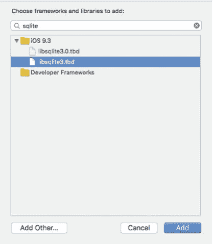
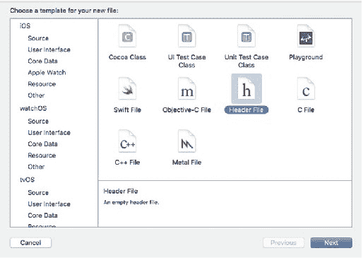
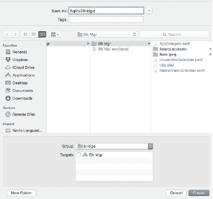
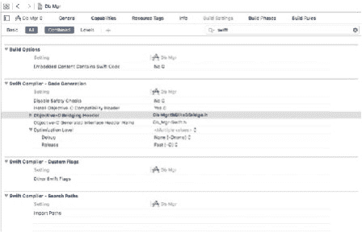
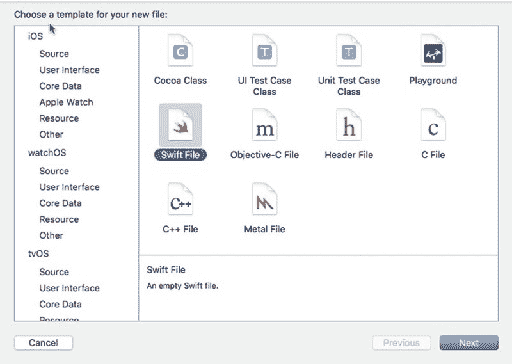
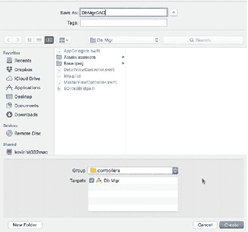
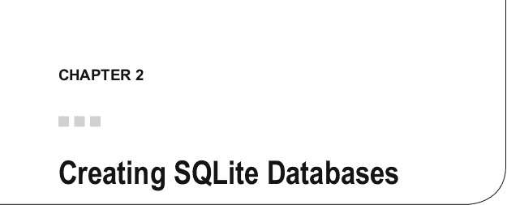
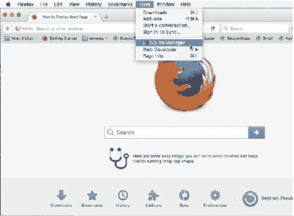

# Swift 应用项目结构

Swift 应用的项目结构与 Xcode 中 Objective-C 项目的结构完全相同。就个人偏好而言，我喜欢将应用对象按逻辑分组进行组织。因此，我们将创建`"views"`、`"models"`、`"controllers"`这组目录，以及`"libs"`、`"bridge"`和`"utils"`等目录。前三组用于归类与 MVC 设计模式相关的文件。后两组将用于存放 SQLite 3 库以及一些不适用于其他分组的辅助类，这些类将用于我们的应用。

要向项目添加文件，请右键点击组标题，使用上下文菜单选择`Add New File`命令，该命令将插入我们将在该标题下创建的新文件。你也可以通过 Xcode 的菜单添加新文件，并在弹出的对话框中为文件命名，同时选择希望文件创建所在的组。

### 添加 SQLite 3 库

像平常一样，通过`Linked Libraries and Frameworks`将 SQLite 3 库添加到项目中。在导航器中选择项目根节点，滚动到主窗口`Project Properties`页面的`General`选项卡中的`Linked Libraries and Frameworks`处。

**第 1 章 ■ 创建 Objective-C 包装器**

图 1-3 展示了用于向 Xcode 项目添加库的`Search`对话框示例。点击`"+"`符号打开`Search`窗口，输入`"Sqlite3"`。你会得到两个结果：其中一个选择是库本身，另一个是库的链接。选择`libsqlite3.tbd`文件，点击`Add`按钮将库添加到项目中。



在项目浏览器（导航器）中，将 SQLite3 库拖拽到`"libs"`组中。在接下来的章节中，我将向你展示如何创建桥接文件并配置 Swift 编译器。

**第 1 章 ■ 创建 Objective-C 包装器**

## 创建桥接文件

桥接文件是一个接口文件，用于配置对 C、C++ 或 Objective-C 库的访问，并配置 Swift 编译器在编译代码时查找并使用这些库。由于 SQLite 库是用 C 语言编写的，我们需要一个桥接文件才能从 Swift 中访问 C 的 API。

### 创建桥接头文件

从 Xcode 的`File`菜单中，选择`File > New File`。在模板选择页面，选择`Header File`模板，点击`Next`按钮进入下一页，我们可以在该页面为文件命名（图 1-4）。



在这个例子中，我将把它命名为`SQLite3Bridge.h`，但你可以自由命名；Xcode 会自动在文件名后添加头文件扩展名（`.h`）。如果你之前已经按照指示创建了项目分组，请选择`"bridge"`组，然后点击`Create`按钮创建文件并将其添加到项目中（图 1-5）。一旦头文件被添加到项目，它就会在 Xcode 编辑器中打开。

**第 1 章 ■ 创建 Objective-C 包装器**



在接下来的 C 头文件代码中，你会注意到模板已经添加了一些指令和常量供我们定义头文件。为了创建 SQLite3 桥接文件，我将添加一个`import`语句以及 SQLite3 头文件名来引用 SQLite3 库，如代码片段所示。保存文件。

```
//
// SQlite3Bridge.h
// Db Mgr
//
// Created by Kevin Languedoc on 2016-05-20.
// Copyright © 2016 Kevin Languedoc. All rights reserved. //
#ifndef SQlite3Bridge_h
#define SQlite3Bridge_h

#endif /* SQlite3Bridge_h */

// 添加此代码以导入 sqlite3 头文件。上面的代码由模板提供。
#import <sqlite3.h>
```

**第 1 章 ■ 创建 Objective-C 包装器**

### 配置 Swift 编译器

下一步是让 Swift 编译器知道桥接文件的位置。这就是创建桥接文件所需的全部工作了。


打开`Build Settings`页面，方法是：在导航面板中选择项目根节点。在搜索框中输入`"swift"`，定位到`Swift Compiler - Code Generation`编译器区域。在`Objective-C Bridge Header`字段中，添加子目录，该目录名称由项目名后跟桥接头文件名组成（图 1-6）。



**图 1-6.** `Build Settings`页面上的`Swift`编译器设置

### 创建 Swift 包装函数

有了桥接文件后，我们就可以进入本章的最后一步：创建 DAO 类 `DbMgrDAO` 的基础。这个类是 `NSObject` 类的子类。你可以通过两种模板之一来创建这个类。使用`Cocoa Touch`模板会添加正确的类签名，但你需要将导入语句从`UIKit`改为`Foundation`；否则会报错。不过，使用这个模板，你可以选择子类和语言。另一种方式是使用`Swift`模板，这也是我将采用的，因为该模板会创建一个最简文件。

使用`Swift`模板（图 1-7），我们需要添加类定义，因为模板在我们将文件命名并添加到项目中的`"controllers"`组之后，只添加了`import Foundation`语句。该类将被命名为`DbMgrDAO`。

**第一章 ■ 创建 Objective-C 包装器**



**图 1-7.** 选择`Swift`模板

### 添加 `DbMgrDAO` 类

`DbMgrDAO` 类将提供两个视图控制器与`SQLite`数据库（或数据库们，如果你选择在应用中创建多个数据库的话）之间的大部分交互。

从 Xcode 的`File`菜单中，选择`iOS`标题下的`Swift File`模板。使用`Next`按钮进入下一页。在下一页，将文件命名为`DbMgrDAO`（如果你不添加扩展名，Xcode 会自动添加`.swift`扩展名），然后点击`Create`按钮（图 1-8）。同样，如果你在项目结构中添加了分组，你可以在这里选择一个。在创建文件之前，我会选择`"controllers"`分组。

**第一章 ■ 创建 Objective-C 包装器**



**图 1-8.** 将 `DbMgrDAO` 文件添加到项目

```
//
// DbMgrDAO.swift
// Db Mgr
//
// Created by Kevin Languedoc on 2016-05-24.
// Copyright © 2016 Kevin Languedoc. All rights reserved. //
import Foundation

public class DbMgrDAO:NSObject{

}
```

### 创建 `init()` 函数

最后，我将添加两个基本函数。第一个是`init`函数。这个函数用于初始化一个`DbMgrDAO`对象，并可用于设置该对象，例如建立`SQLite`数据库连接和打开数据库，我将在下一章中展示。

**第一章 ■ 创建 Objective-C 包装器**

```
import Foundation

public class DbMgrDAO:NSObject{

    override init() {
        //code here
    }

}
```

### 创建 SQLite 执行函数

最后，我将添加`executeQuery`函数，该函数将用于执行插入、更新和删除等查询。对于返回记录的选择操作，我将在后面章节中创建另一个函数，因为在这个示例应用中不需要它。

```
//
// DbMgrDAO.swift
// Db Mgr
//
// Created by Kevin Languedoc on 2016-05-24.
// Copyright © 2016 Kevin Languedoc. All rights reserved. //
import Foundation

public class DbMgrDAO:NSObject{

    override init() {
        //code here
    }

    func executeQuery(query:String?){

    }

}
```

函数签名包含一个用于查询的字符串数据类型参数。目前就是这样。

## 总结

本章首先展示了进行 iOS 应用开发（特别是针对 SQLite）所需的工具。然后，我们重点创建了`Objective-C`桥接文件，它允许`Swift`与`SQLite C API`进行通信。这是苹果官方针对使用`C/C++` API 进行`Swift`开发的标准流程。

这个桥接文件是我们在后续章节中构建和探索的每个应用的基石，也是使用`Swift`操作`SQLite`所需的主要粘合剂。


### 创建 SQLite 数据库

下一章将向你展示如何使用 Firefox 和 SQLite Manager 插件开发 SQLite 数据库。数据库创建完成后，我们将开发 `Db Mgr` 应用，将数据库添加到项目中，并将其复制到 `Document` 目录，因为这是 iOS 应用沙盒（文件系统）中主要的可写入目录。



SQLite 在创建数据库方面非常灵活。你可以选择包含文件扩展名，也可以不包含，因为真正需要做的只是向 `sqlite3_open` 函数传递文件名和路径，数据库就会被创建并打开——尽管它不会包含任何结构。与 MSSQL 等其他关系型数据库不同，SQLite 数据库是自包含且可移植的。一个 SQLite 数据库文件可以在所有支持的平台上无需任何修改即可运行，当然也包括 iOS。SQLite 数据库并非设计用于运行服务器。

在本章中，我将继续基于上一章的内容，展示如何使用 SQLite Manager 等数据库工具在 Firefox 中创建 SQLite 数据库，并将其添加到项目中。在下一章中，我将向你传授在运行时创建数据库的知识，包括添加必要的结构。

你还可以使用命令行创建数据库，例如终端（OSX、Linux）或 Windows 命令提示符。

本章涵盖以下主题：

1. 创建 SQLite 数据库并将其添加到项目
2. 添加表和列
3. 添加视图
4. 添加触发器
5. 添加索引

> **注意：** 虽然你可以在所有支持的平台上使用 Firefox 中的 SQLite Manager 来开发 SQLite 数据库，但你需要将数据库文件导出到 OSX 才能包含在你的 iOS/Swift 项目中。即使 Swift 和 SQLite 在 Linux 上受支持，你仍然需要 Xcode 来配置你的应用并将其部署到 `iTunesConnect`。本章乃至本书的重点，是向你展示如何使用 Swift 3 和 SQLite 数据库开发 iOS 应用（iPhone/iPad）。我假设你正在 OSX El Capitan 上使用 Xcode 8，以及 iOS SDK 和 SQLite Manager 中包含的 SQLite 3。

## 创建数据库并将其添加到项目

在本章的第一部分，我将重点介绍如何使用 Firefox 中的 SQLite Manager 插件开发 SQLite 数据库，然后将完成的数据库导入到 iOS Swift iPad 应用中供后续使用。有一些用于 SQLite 的开源和商业数据库编辑器。我选择使用 Firefox 中的 SQLite Manager，因为它是免费的（在所有支持的平台上）且轻量级。它是一个 Firefox 插件，可以通过 Firefox 的插件界面安装。

© Kevin Languedoc 2016 [11]
K. Languedoc，《使用 Swift 和 SQLite 构建 iOS 数据库应用》，DOI 10.1007/978-1-4842-2232-4_2
第 2 章 ■ 创建 SQLite 数据库

本章的第二部分将专注于通过正在运行的 iOS 应用创建数据库。我将扩展本书中正在创建的 iPad 应用，以制作自己的数据库管理器应用。这包括在 `Db Mgr` 应用中创建一个 SQLite 数据库，该应用将在下一章中构建。

### 启动 SQLite Manager

一旦通过插件库安装了 SQLite Manager，你就可以从 Firefox 的 `工具` 菜单中启动它。图 2-1 显示了 Firefox `工具` 菜单中的 SQLite Manager 菜单项。



**图 2-1.** Firefox 中的 SQLite Manager 菜单

### SQLite Manager 菜单

除了各种菜单选项外，SQLite Manager 还有一个快速访问菜单，列出了你可以在 SQLite 数据库上执行的主要操作。在每个菜单选项下，你可以创建、删除、重命名和修改列出的数据库元素。在 `数据库` 菜单下，除了创建、修改、索引、重新索引、附加和分离数据库外，你还可以压缩数据库和创建内存数据库。该应用还提供分析数据库的选项。

图 2-2 展示了 SQLite Manager 工具栏的视觉效果。你可以选择创建新的数据库、表和视图。你也可以打开现有的数据库。


