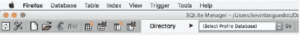
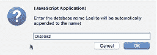
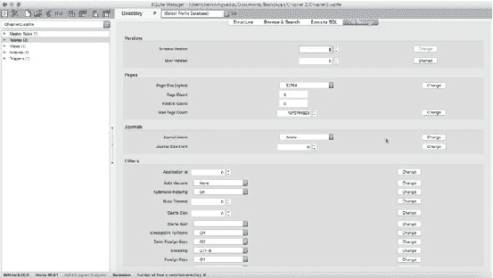
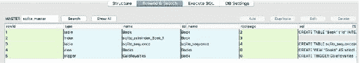
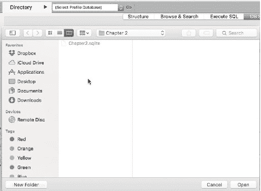
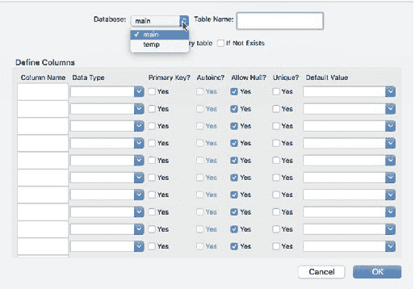
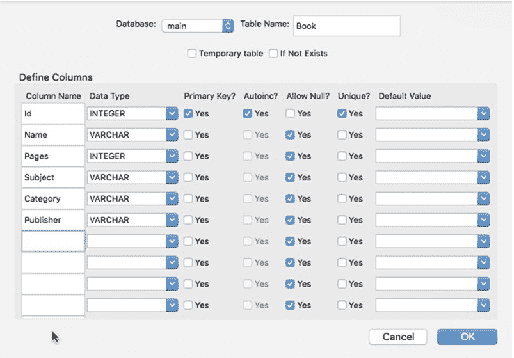
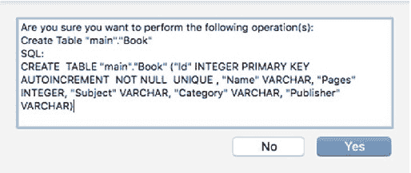
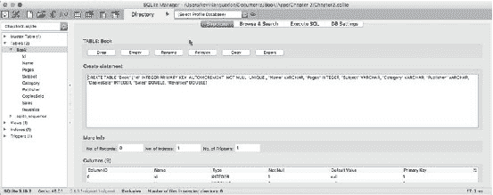

# 第 2 章：创建 SQLite 数据库



**图 2-2.** SQLite Manager 工具栏

为了本示例的演示目的，我将创建一个数据库，然后添加表、视图、一个触发器以及索引。数据库创建完成后，我会将其添加到 `Db Mgr` 项目中。

`Directory`（目录）选择器允许你将当前目录从 `Profile` 目录（即 Firefox 用于存储其使用的各种数据库的目录）更改为我们将存放数据库的目录。

### 创建数据库

你可以通过菜单栏中的新建文档图标，或者选择 **Database**（数据库）菜单项下的 **New Database**（新建数据库）选项来创建数据库。在本例中，我将数据库命名为 `Chapter 2`。默认情况下，会使用 `.sqlite` 扩展名；不过，你可以在设置中（十字螺丝刀/扳手图标）更改此行为。图 2-3 显示了让你提供 SQLite 数据库名称的对话框。



**图 2-3.** 命名 SQLite 数据库

`SQLite Manager` 为你提供了许多调整和分析数据库的选项。例如，在数据库打开后，切换到 **Db Settings**（数据库设置）选项卡，你可以设置一系列不同的参数来微调数据库（图 2-4）。在本例中我将接受默认设置，但我建议你探索 `SQLite Manager` 的这些众多功能以及通过 SQLite API 可用的不同设置。



**图 2-4.** SQLite Manager 设置选项卡

我想简单谈谈几个有趣且有用的概念：位于 **Master Table**（主表）节点下的 `sqlite_master` 表、`sqlite_sequence` 表，以及 **Main**（主）数据库与 **Temp**（临时）数据库或其他数据库之间的区别。

## `sqlite_master` 表

`sqlite_master` 表包含了用于创建数据库模式的所有查询；例如，当你添加或修改表、视图或触发器时。该表还包含了每个数据库模式元素的名称和类型。在本章后续内容中，我们将利用这个表来填充下一章 `MasterViewController` 中 `TableView` 的数据源。该表的模式类似于下面的代码片段。当你向数据库添加第一个表时，SQLite 会为你创建这个表。这仅是一个表示：

```sql
CREATE TABLE sqlite_master (
    type TEXT,
    name TEXT,
    tbl_name TEXT,
    rootpage INTEGER,
    sql TEXT
);
```

你也可以在选中 `sqlite_master` 表的情况下，选择 **Browse & Search**（浏览与搜索）选项卡来浏览该表。你还可以通过对该表执行 `SELECT` 查询来浏览表中的信息或任何其他表，如下面图 2-5 之后的代码片段所示。



**图 2-5.** `sqlite_master` 浏览与搜索窗口

## `sqlite_sequence` 表

`sqlite_sequence` 表维护着给定表中最大的 `ROWINDEX`（行索引）。它与列的 `AUTOINCREMENT`（自动增量）属性配合使用。当我创建数据库中的表时，我将使用 `AUTOINCREMENT` 作为主键。如果表是空的，那么最大的 `ROWID` 将是 1，随着记录添加到表中，该值会依次递增。

我想谈的最后一个特性是 **Main**（主）数据库。在 SQLite 中，你可以将多个数据库附加到同一个连接或数据库文件。当你创建一个新的数据库文件或连接时，SQLite 会自动向该文件添加一个数据库并将其命名为 `Main`。你可以选择在同一个连接中创建额外的数据库，单独命名这些数据库，并使用 `ATTACH` 命令将它们连接在一起。同样，你可以使用 `DETACH` 命令移除这些辅助数据库。

图 2-6 显示了 **Directory**（目录）菜单项的截图。**Directory** 菜单是定位 SQLite 数据库及其主目录的另一种有用方式。你可以通过选择 **“Default User Directory”**（默认用户目录）选项来定位磁盘上的数据库文件。如果你使用的是 OS X，这将打开一个访达窗口；如果你使用的是 Windows，则会打开一个文件资源管理器窗口。



**图 2-6.** SQLite Manager 目录菜单

有了基本的数据库之后，我将进入下一步，创建表和列。

## 添加表和列

在 SQLite 中创建表和列非常简单。你可以选择使用新建表图标，或者从 **Table**（表）菜单中选择 **Create Table**（创建表）选项。我提供了一个 `SQLite Manager` 中 **Create Table**（创建表）界面的截图（图 2-7）。当你输入表定义时，它仅会捕获构建 `Create Table` 查询所需的信息。



**图 2-7.** `SQLite Manager` 的创建表界面

你会注意到界面顶部附近用于选择数据库的下拉菜单。你可以在已经选定的 `main` 和 `temp` 之间进行选择。如果你附加了其他数据库，它们也会出现在这里。

如果你有开发数据库应用程序的经验，你会发现这些字段大多不言自明。有一个用于输入表名的字段。你可以通过 **“Temporary table”**（临时表）选项选择创建临时表。你应该始终选择 **“if not exists”**（如果不存在）选项，这样在运行应用程序时就不会意外覆盖数据库表及其内容。该选项会添加到查询中，数据库引擎会在创建表之前检查该表是否已存在。

图 2-7 演示了如何定义表的列。你可以提供列名、数据类型（下拉菜单包含了 SQL 语言支持的数据类型），以及该列是否作为主键。你可以通过启用 **“Autoinc”**（自动增量）选项让列自动递增。请注意，此选项仅在你选择为该列启用主键时才可用。当然，你可以通过选择 **“Yes”**（是）选项来禁止空值。这对于主键字段尤其重要。**“Unique”**（唯一）选项可确保不会通过 `INSERT` 或 `UPDATE` 引入重复数据。最后，你可以根据所选数据类型设置默认值。

表定义完成后，点击 **OK**（确定）按钮，将出现一个确认框，显示将要执行以创建表的确切查询。这是学习 SQLite 支持的 SQL 查询需要使用的正确语法的绝佳方式。

对于我的示例数据库，我将创建一个表来存储一些关于图书的基本信息，例如书名、作者、页数、售价、版税和出版商。图 2-8 提供了该表的基本信息。紧随表结构之后的截图提供了用于在数据库中创建表的实际查询字符串的详细信息（图 2-9）。如果你不确定正确的语法，或者像我有时一样懒惰而不想编写代码，你可以轻松地在另一个 iOS 应用程序中复制+粘贴这些内容。



**图 2-8.** 创建表定义



**图 2-9.** 创建表查询

在 `SQLite Manager` 中，你可以通过选择表名并展开左侧窗格中的节点，然后选择右侧窗格顶部的 **Structure**（结构）选项卡来浏览表结构（图 2-10）。除了浏览表结构，你还可以执行一些操作，例如删除表或重新索引表。



**图 2-10.** 浏览数据库结构

请注意截图中，在 **Indexes**（索引）节点下自动添加了一个索引。这个索引是因为我在 `Book` 表中指定了主键而自动创建的。SQLite 还添加了我之前提到的 `sqlite_sequence` 表，用于维护最新的 `ROWID` 句柄。虽然 SQLite 为我们创建了索引，但我还是会向你展示创建自己索引所需的 SQLite 查询语法。

## 添加索引


