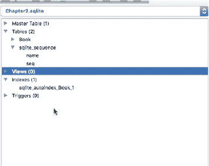
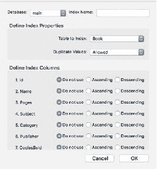
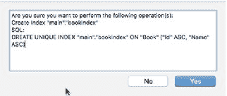
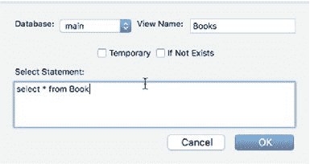
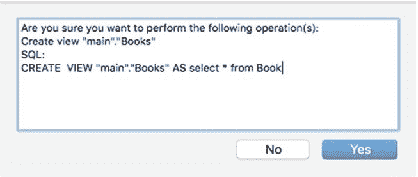
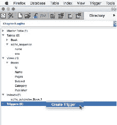
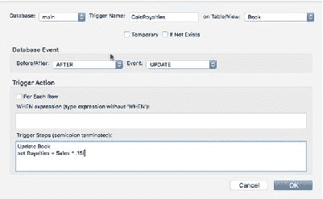
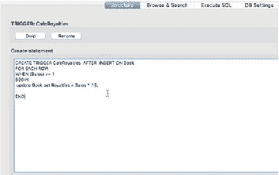

# 在 SQLite 数据库中

在 SQLite 数据库中，与其他所有关系型数据库一样，表通过索引来帮助快速定位记录。在 SQLite 中创建索引非常直接，尤其是使用 SQLite Manager 时。图 2-11 展示了 SQLite Manager 中 `Chapter.sqlite` 的模式，其中包含一个索引 `sqlite_autoindex_book_1`。当在创建表时为某一列配置了 `autoincrement` 属性时，该索引会自动创建。



*图 2-11. SQLite Manager 中的索引*

## 创建索引

要创建索引，请从 SQLite Manager 的 `Index` 菜单中选择 `Create Index` 命令。界面窗口提供了在 SQLite 中构建 `Index` 查询所需的必要字段。你需要提供目标表的名称。在图 2-12 中，`Book` 表已被预选，因为它是数据库中除 `sqlite_sequence` 表之外的唯一一张表。在 `Define Index Columns` 部分，该部分显示了所选表的可用列，你可以定义索引需要哪些列。点击 `OK` 生成如图 2-13 所示的查询。



*图 2-12. SQLite Manager 中的创建索引界面*



*图 2-13. 创建索引查询*

现在表上已经有了索引，我将在将完成的数据库添加到 iOS 项目之前，继续添加一个视图和一个触发器。

### 添加视图

视图提供了基于对表内容执行 `SELECT` 语句的列表。根据你的需要，视图可以呈现表中的所有数据或数据的子集。如果你将自己限制在整个表内容的子集中，那么在访问大数据集时，视图可以提供更好的性能。

SQLite Manager 中的 `View` 菜单除了创建视图外，还提供了可以对视图执行的若干操作。例如，你可以选择修改、删除或重命名视图。现在，从 `View` 菜单中选择 `Create View` 命令。然而，对于修改或更改视图，实际上你将执行的是 `drop view`/`create view` 操作。在 SQLite 中，你只能真正地修改表。图 2-14 展示了 `Create View` 界面。在下面的截图中，你可以看到添加视图名称和目标数据库的位置。你还可以指示它是否为临时视图，或者 SQLite 是否应检查该视图是否已存在。`Select Statement` 字段允许你定义通过视图查看的记录子集。



*图 2-14. 创建视图查询界面*

图 2-15 提供了将用于生成视图的查询确认信息。在此示例中，我选择了所有记录，但我也可以通过相应地修改 `SELECT` 查询来轻松创建内容的子集。点击 `OK` 按钮，SQLite 数据库引擎将提供最终的 `CREATE VIEW` SQL 查询字符串来创建视图。



*图 2-15. 创建视图查询确认*

视图是访问一张或多张表中记录子集的便捷工具，因为你可以添加一个 `JOIN` 甚至一个内联的 `SELECT` 语句来构建更复杂的 `SELECT` 语句。

## 添加触发器

触发器是我将数据库添加到 iOS 项目之前演示的最后一个数据库元素。触发器在插入、更新或删除记录后作用于表中的数据。这些数据库程序对于执行特定操作或在需要维护审计追踪时生成日志非常有用。

可以像其他所有数据库模式元素一样，从 SQLite Manager 的 `Trigger` 菜单或通过右击 `Trigger` 节点从上下文菜单创建触发器，如图 2-16 所示。



*图 2-16. 创建触发器上下文菜单*

`Trigger` 界面窗口提供了定义触发器所需的必要字段（图 2-17）。你需要指定名称和目标表或视图。你还需要指示触发器是在创建记录之前、之后还是替代创建记录时启动，以及触发器响应哪个数据库事件，例如 `UPDATE`、`INSERT` 或 `DELETE`。



*图 2-17. 创建触发器界面*

接下来，你需要编写要对记录执行的查询。在此示例中，我希望触发器计算作者将从书籍销售中获得的版税。我已经提供了示例触发器 `CalcRoyalties` 的代码片段（图 2-18）。

```sql
CREATE TRIGGER CalcRoyalties AFTER INSERT ON Book
FOR EACH ROW
WHEN (Sales) >= 1
BEGIN
  update Book set Royalties = Sales * .15;
END
```



*图 2-18. 创建触发器查询*

一旦触发器查询符合你的要求，你可以通过点击 `OK` 按钮将触发器添加到数据库。像往常一样，SQLite Manager 会在实际将触发器添加到数据库之前确认 `CREATE TRIGGER` 操作。

## 创建 iOS 项目

为了完成本章关于使用数据库工具开发 SQLite 数据库的部分，我将创建一个 iOS 项目。当你将数据库添加到 iOS 项目时，它会被插入到 `Resources` 目录中。`Resources` 目录也是项目的根目录。此目录是只读的，你无法更改这些文件权限。

如果你尝试在此位置向数据库写入数据，你不会收到任何错误，但你的 `INSERT` 或 `UPDATE` 查询将会失败。要使你的数据库可写，你需要将其移动到 `Document` 目录。我将在后续章节中向你展示如何操作。

在 Xcode 中，创建一个新的 iOS 项目。对于本章，我正在创建一个数据库编辑器，因此我需要一个 Master-Detail 模板。我将项目命名为 `DbMgr`，作为 Database Manager 的缩写。语言当然是 Swift，目标设备是 iPad。接受其他默认设置，但确保"Core Data"未被选中。

## 将数据库添加到项目

将数据库添加到项目很简单。从 Xcode 的 `File` 菜单中选择 `Add Files to "Db Mgr..."` 命令。一个 Finder 窗口将会打开，请求数据库文件的位置。如果你不记得将数据库文件保存在哪里，你可以返回 SQLite Manager 并使用 `Directory ➤ Select Default Directory` 来定位 SQLite 数据库文件所在的目录。

选择该文件并点击 `Add` 按钮。默认情况下，该文件会被添加到选定的目录或组（如果你选择了组的话）。你可以将数据库文件拖放到资源管理器中的任何位置。然而，正如我之前提到的，SQLite 数据库文件在此位置是只读的。你需要将该文件复制或移动到 `Documents` 目录以确保其可写。

对于此示例，我将在 `AppDelegate` 应用的 `didFinishLaunchWithOptions` 方法中添加代码，以将数据库文件复制到 `Documents` 目录。代码如下所示：

```swift
func application(application: UIApplication, didFinishLaunchingWithOptions launchOptions: [NSObject: AnyObject]?) -> Bool {

    //....为简洁起见，省略部分代码 ....

    var srcPath:URL
    var destPath:URL

    let dirManager = FileManager.default()
    let projectBundle = Bundle.main()

    do {
        let resourcePath = projectBundle.pathForResource("Chapter2", ofType: "sqlite")
        let documentURL = try dirManager.urlForDirectory(FileManager.SearchPathDirectory.documentDirectory, 
                                                         in: FileManager.SearchPathDomainMask.userDomainMask, 
                                                         appropriateFor: nil, 
                                                         create: true)
        srcPath = URL(fileURLWithPath: resourcePath!)
        destPath = documentURL.appendingPathComponent("Chapter2.sqlite")

        if !dirManager.fileExists(atPath: destPath.path!) {
            try dirManager.copyItem(at: srcPath, to: destPath)
        }
    } catch let err as NSError {
        print("Error: \(err.domain)")
    }
}
```


这段代码将在每次应用启动时运行，并检查文件是否位于 Documents 目录中。如果文件不存在，则将其复制过去。理想情况下，代码应检查包中的文件是否比 Documents 目录中的版本更新，并相应地进行更新。

有多种方式处理此问题，例如在 UI 中添加一个按钮，该按钮提供选择文件并将其复制到 Documents 目录的语法。或者，你也可以在应用启动后加载的主 `ViewController` 的 `viewDidLoad` 方法中使用同样的代码。

