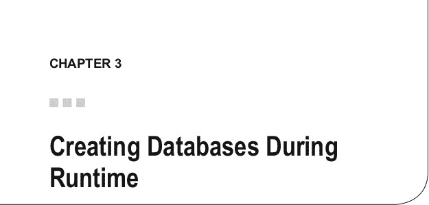
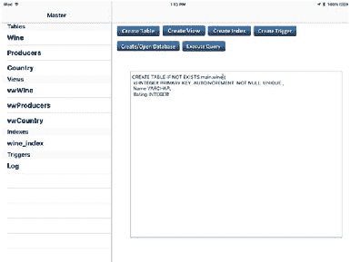
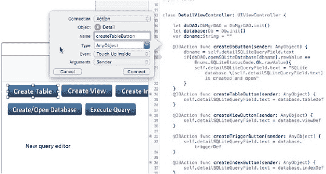
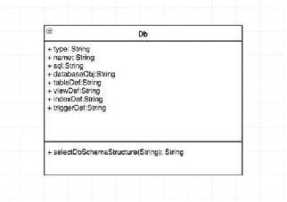

# 第 2 章：创建 SQLite 数据库

### 总结

本章关于创建 SQLite 数据库并将其添加到 iOS 项目的内容到此结束。下一章将重点介绍在运行时创建 SQLite 数据库。我将继续为 `DbMgr` iPad 应用添加功能。



SQLite 的一大特色是能够在应用运行时创建数据库。你可以根据需要快速添加或修改数据库。

在接下来的章节中，我将添加一个数据模型、一个用于执行各种数据库命令和显示数据库架构的 UI，以及处理这些操作的视图控制器。该应用将能够创建数据库，并添加表、列、索引、视图和触发器。

## 构建 DB Mgr 应用

我将继续使用上一章中的同一个 iPad 项目进行构建，以便在应用加载到内存后能够提供创建数据库所需的功能。这个应用可能不会赢得任何设计奖项，但它能起到巩固 SQLite 中关于如何构建数据库的一些关键特性的作用。

从宏观层面来看，该应用的设计思路是使用 `detailViewController` 作为主界面。`MasterViewController` 将保留并显示应用中的数据库及其架构元素。`DetailViewController` 将包含用于创建和打开数据库，以及创建表、视图、索引和触发器的按钮。`ViewController` 还将提供执行查询的操作。

一个数据访问类将负责处理数据模型（包括 SQLite 数据库和自定义类型）与 `ViewControllers` 之间的通信。

## 应用 UI

在本节中，我将添加 `UIButton` 并将其连接到指定的视图控制器。然后，我将添加 `detailSQLiteQueryField`。

### 添加按钮

使用 Interface Builder（简称 IB）添加按钮并将其连接到指定的视图控制器是一项简单的任务。要添加按钮，请打开应用中的主故事板文件（`Main.storyboard`）并定位到细节场景。

从右下角的组件面板中，拖放 `UIButton`，并沿顶部对齐。图 3-1 显示了带有按钮和 `detailSQLiteQueryField` 的应用。这些按钮使用了 `.gif` 图片。我已将这些图片全部添加到项目的 Assets 组下。如果你需要添加或更改某些图片，可以通过使用“添加文件”上下文菜单或 Xcode 中的“文件”菜单来完成。

© Kevin Languedoc 2016 [25]

K. Languedoc, *使用 Swift 和 SQLite 构建 iOS 数据库应用*, DOI 10.1007/978-1-4842-2232-4_3



**图 3-1.** Db Mgr 用户界面

要配置按钮的图片，请执行以下操作：
- 在细节场景中选择该按钮。
- 在属性检查器中，找到“图片”字段。
- 使用文件选择器按钮选择一张图片。

当所有按钮都添加并配置完毕后，我们需要在 `DetailViewController` 中为这些按钮创建 `@IBAction`。要创建连接，请在已打开的 `Main.storyboard` 文件中打开助理编辑器，然后从 `UIButton` 拖出一个连接至已打开的 `DetailViewController`。释放鼠标按钮时，会出现一个弹出窗口（图 3-2），通过该窗口你可以执行以下操作：
- 添加 IBAction 连接名称。
- 选择连接类型。


• 点击 **Connect** 以创建 IBAction 函数并建立连接（深色圆点）。  
• 对所有按钮重复此过程，并按如下方式命名：

- `createTableButton`
- `createDbButton`
- `createViewButton`
- `createIndexButton`
- `createTrigger`
- `executeQueryButton`

## 第三章 ■ 运行时创建数据库



*图 3-2. 创建 IBAction 按钮*

我们将在后续讨论 `DetailViewController` 时添加处理逻辑。

### 添加 `detailSQLiteQueryField`

`detailSQLiteQueryField` 是一个 **UITextArea** 组件，也可以从 Xcode 的组件面板中获得。它用于编辑数据库结构的 SQL 查询，并显示用于创建现有数据库模式的 SQL 查询。

您还可以通过输入带 `.sqlite` 扩展名的数据库名称，并点击“创建/打开数据库”按钮来创建 SQLite 数据库。查询确认消息和错误消息也会显示在此字段中。

为了与 `DetailViewController` 和 `DbMgrDAO` 控制器交互，我们需要像处理按钮一样，在控制器中添加一个 `IBOutlet` 连接。

在故事板中选中 `detailSQLiteQueryField` 后，执行以下操作：  
• 打开助理编辑器。  
• 拖放一个连接。  
• 将出口命名为 `detailSQLiteQueryField`。  
• 确保连接类型为 `IBOutlet`，然后点击 **Connect**。

## 创建数据模型

模型包含 `Db` Swift 类，该类封装在 `Db.swift` 文件中。该类的设计与 `sqlite_master` 表中的字段相同，即 `type`、`name` 和 `sql`。还定义了一些常量来保存查询模板，这些模板将被修改以构建数据库。图 3-3 提供了 `Db` 类的快照。



*图 3-3. Db 数据模型*

模板可以包含在 SQLite 数据库中，这将改进应用程序的设计，但为了保持应用程序概念简单，我将它们添加为常量。稍后我将使用这些模板创建一个葡萄酒数据库，并在接下来的几章中展示如何创建 CRUD 查询。

这些模板是编写查询以创建数据库模式的基本示例。例如，您可以使用 `INSERT` 语句而不是 `CREATE TABLE` 语句来创建表。您也可以使用 `CREATE TABLE` 与 `SELECT` 语句，基于 `SELECT` 查询定义来创建表。与其他 SQL 系统一样，表也可以是临时的（temp）。

使用 Swift 文件模板创建 `Db.swift` 文件后，添加类定义，以公共访问标识符开头，后跟 `class` 关键字和类名。从下面的代码清单可以看出，`Db` 类类似于数据模型，并且您可以看到创建表模板 `tableDef` 的赋值。还有用于视图、索引和触发器的 SQL 模板，都赋值给了各自的常量。

```
import Foundation

public class Db {

    // 这些属性将填充 MasterViewController 的数组
    var type: String = ""
    var name: String = ""
    var sql: String = ""
    var databaseObj: String = ""

    // 查询模板
    let tableDef: String = "CREATE TABLE IF NOT EXISTS main.tablename ( \n " +
        "Id INTEGER PRIMARY KEY AUTOINCREMENT NOT NULL UNIQUE ,\n " +
        "colVarchar VARCHAR, \n " +
        "colInt INTEGER, \n " +
        "colDouble DOUBLE, \n " +
        "colBool BOOL, \n " +
        "colFloat FLOAT, \n " +
        "colReal REAL, \n " +
        "colChar CHAR, \n " +
        "colBlob BLOB, \n " +
        "colDateTime DATETIME, \n " +
        "colNumeric NUMERIC, \n " +
        "colRealStrict REAL check(typeof('colRealStrict') = 'real'), \n " +
        "colIntStrict INTEGER check(typeof('colIntStrict') = 'integer'), \n " +
        "colTextStrict TEXT check(typeof('colTextStrict') = 'text') \n "

    let viewDef: String = "CREATE VIEW IF NOT EXISTS " +
        " viewname AS SELECT * FROM main.tablename " +
        " or CREATE VIEW viewname AS SELECT columns FROM main.tablename where column equals value"
```


```swift
" or CREATE temp (or temporary) VIEW viewname AS SELECT columns FROM " +
" main.tablename "

let indexDef: String = "CREATE UNIQUE INDEX IF NOT EXISTS main.indexname " +
    " ON TABLE tablename (Column defintion) WHERE where clause"

let triggerDef: String = "CREATE TRIGGER triggername AFTER INSERT ON main.table" +
    "FOR EACH ROW " +
    "WHEN (columnnmae) some condition " +
    "BEGIN " +
    "  update Book set Royalties = Sales * .15; " +
    "END"
```

`Db` 类的下一部分包含各种方法。`selectDbSchemaStructure` 方法返回数据库中特定元素或所有元素的架构。`selectDbSchemaListByType` 方法根据通过 `typeName` 字符串参数指定的类型，返回元素名称的列表。此方法用于为 `MasterViewController` 中的 `UITableView` 的数据源构建数组列表。这些查询是简单直接的、兼容 SQL 的查询字符串。它们稍后将在 `executeQuery` 方法中使用。

```swift
init() {

}

func selectDbSchemaStructure(_ objectName: String) -> String {
    var def: String = ""
    if (!objectName.isEmpty) {
        def = "SELECT type, name, tbl_name, " +
            "sql FROM main.sqlite_master WHERE name='\(objectName)';"
    } else {
        def = "SELECT type, name, tbl_name, sql FROM main.sqlite_master ;"
    }
    return def
}

func selectDbSchemaListByType(_ typeName: String) -> String {
    var def: String = ""
    if (!typeName.isEmpty) {
        def = "SELECT name FROM main.sqlite_master WHERE type='\(typeName)';"
    }
    return def
}
```

## 第 3 章：运行时创建数据库

`Enums` 类是一个小型辅助类，用于生成各种函数（包括 SQLite 和 Swift）将用作枚举的 SQLite 返回码。该类的完整代码如下所示：

```swift
import Foundation

public class Enums {
    enum SQLiteStatusCode : Int32 {
        case ok = 0
        case error = 1
        case internalLogicError = 2
        case accessPermissionDenied = 3
        case abort = 4
        case busy = 5
        case noMemory = 7
        case readOnly = 8
        case interrupt = 9
        case iOError = 10
        case corrupt = 11
        case notFound = 12
        case full = 13
        case cantOpen = 14
        case protocol = 15
        case empty = 16
        case schema = 17
        case tooBig = 18
        case constraint = 19
        case mismatch = 20
        case misuse = 21
        case noLFS = 22
        case authDeniedUTH = 23
        case format = 24
        case range = 25
        case notADatabase = 26
        case row = 100
        case done = 101
    }
}
```

## 创建控制器

在本节中，我将创建三个控制器：`DbMgrDAO`（应用的主要工作者）、`MasterView`（检索并显示数据库列表及其对应的架构）和 `DetailView`（应用的工作区域）。我们现在来看一下。

## 第 3 章：运行时创建数据库

### `DbMgrDAO` 控制器

该 Swift 类负责处理数据库操作，根据需要创建数据库、表、视图、索引和触发器。该类还会从打开的 SQLite 数据库中获取将在 `MasterViewController` 中显示的记录。查询执行操作也由该类处理。

`DbMgrDAO` 是标准 `NSObject` 的子类，`NSObject` 是 Foundation 框架中的一个基础类。要创建该子类，请右键单击控制器组，然后从上下文菜单中选择“新建文件”。在可用文件模板的 iOS 源标题下，选择 Swift 文件模板。您也可以使用 CocoaTouch 模板来创建该类，该模板会提供一个输入页面，您可以在其中选择子类来源的可用类列表。但是，使用此方法，模板会在类文件的顶部添加 `Import UIKit` 框架，而 `NSObject` 类位于 Foundation 框架中，因此您需要更改此项；否则，您将收到错误提示。

通过使用 Swift 文件模板，Foundation 框架将通过 `import` 语句添加，但在您提供文件名并将文件添加到项目后，该模板几乎不会执行其他操作。在此示例中，我自然将文件命名为 `DbMgrDAO`。文件创建后，它将自动加载到编辑器中。

要设置该类，您需要在 `import` 指令下方添加类定义语句。您可能会注意到，我同时添加了 UIKit 框架和 Foundation 框架。该类稍后将使用此框架中的类与 `DetailViewController` 进行交互。不过，您现在添加它。

直接在 `import` 语句下方，添加 `public class DbMgrDao:NSObject` 类定义语句，后跟一个大括号。当您按下 Enter 键时，Xcode 编辑器会自动为您添加闭合大括号。

```swift
import Foundation
import UIKit

public class DbMgrDAO:NSObject {

}
```

紧接在类定义之后，我将添加一些属性变量。`db` 变量的数据类型为 `COpaquePointer`。此数据类型是 C 语言不透明指针的包装器，用于未知数据类型。SQLite 在其整个 API 中都使用指针。`dbPath` 变量是 `NSURL` 数据类型，将用于保存已打开存储数据库的路径。要将查询传递给 SQLite 数据库引擎，您需要一个预编译语句，该语句同样使用 `COpaquePointer` 设置，并命名为 `sqlStatement`。

```swift
var db: CopaquePointer?=nil
var dbPath: URL = URL()
var sqlStatement: CopaquePointer?=nil
var dbErr: UnsafeMutablePointer<UnsafeMutablePointer<Int8>>?= nil
var errmsg: String = ""

override init() {
    //此处编写代码
}
```

### `populateIndexView` 函数

在 `init` 函数之后，我定义了 `populateIndexView` 函数。第一个参数定义为 `AnyObject`，实际上是 `DetailViewController`。第二个参数是一个 SELECT 查询，将用于填充 `MasterViewController` 中的 `TableView`。该函数将返回一个字符串数组。我可以用自定义类型属性替换它，但这种设计对于我在本应用中的演示需求来说效果很好，尤其是因为我只是从 `sqlite_master` 表返回一个数据库架构名称列表。

定义返回数组变量后，我创建一个 `DetailViewController` 变量，并通过使用 `isKindOfClass` 方法，为其分配来自 `DetailViewController` 的实际 `DetailViewController` 对象。

接下来，我检查数据库是否仍处于打开状态，并在必要时将其打开。否则，我分别将 `preparedStatement` 和 `query` 以及 `sqlStatement` 和 `query` 发送给数据库引擎执行。请注意，Swift 字符串是如何使用 `String` 类的 `cStringUsingEncoding(NSUTF8StringEncoding)` 方法转换为 SQLite 所需的 `char` 数据类型的。如果抛出任何错误，我会通过将 `sqlite3.errmsg(db)` 传递给 `fromCString` 来将其赋值给我的 `errmsg` 变量。

SQLite 中的预编译语句是使用 `sqlite3_prepare_v2` 函数创建的。检索完所有结果后，您需要调用接受 `preparedStatement` 作为参数的 `sqlite3_finalize` 函数。执行 `sqlite3_prepare_v2` 函数后，如果返回的状态码 `Enums.SQLiteStatusCode`（您需要获取其 Swift 枚举的 `rawValue`）等于 `OK` 或 `0`，则可以使用 `sqlite3_step` 函数逐步遍历结果集，如下面的代码所示。您可以通过检查返回码（应为 `0` 或 `OK`）来循环这些值。对于此应用，我为每次迭代创建一个 `Db` 类的实例，并将其 `name` 属性赋值为查询中返回的 `name` 列的值。将 C 字符串转换为 Swift 字符串需要一些巧妙的方法。

要检索列值，您需要使用对应类型的 `preparedStatement` 列方法之一。由于我稍后将创建的数据库中的 `name` 列具有 `varchar` 数据类型，因此我需要使用 `sqlite3_column_text` 方法。此方法返回 C 语言的 unsigned char，我们需要使用带有 `Int8` 原始类型（即 char）的 `unsafePointer` 对其进行强制转换。然后，使用我们之前看到的 `cString` 方法将该值转换为 Swift 字符串。


