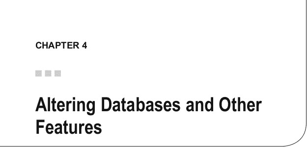
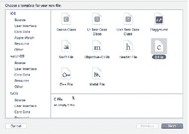
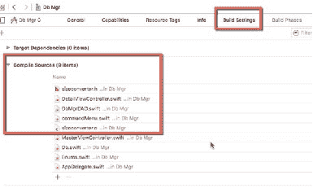

# 外键（Producer_id）引用 producer(id)

5. 点击 **执行查询** 按钮创建表。您应该会收到一条  
“查询成功”的确认信息。

6. 对 `wine` 表重复相同的过程。以下是需要使用的查询语句：

```sql
CREATE TABLE IF NOT EXISTS main.producer (
    Id INTEGER PRIMARY KEY AUTOINCREMENT NOT NULL UNIQUE,
    Name VARCHAR,
    Country VARCHAR,
    Region VARCHAR
)
```

同样，您应该会收到“查询成功”的确认信息。两个表创建好后，剩下的就是用于显示结果的视图。下一节将提供视图的详细信息。

### 添加视图

由于这是一个非常简单的数据库和应用程序，我将只创建一个视图，该视图通过连接（join）从每个表中选取列。代码如下：

```sql
CREATE VIEW IF NOT EXISTS wines AS
SELECT w.name, w.rating, w.type, p.producer, p.country, p.region
FROM main.wine w
INNER JOIN main.producer p ON w.id = p.id
```

SQLite 支持三种类型的连接。您可以使用上面所示的连接方式，也可以使用 `USING (columns array)` 子句来构建数据选择与关系定义的谓词：

- `INNER JOIN`
- `CROSS JOIN`
- `OUTER JOIN`

## 小结

本章至此完成了关于在运行时创建数据库的内容。我们探讨了如何设计和构建一个能够执行 SQLite 查询以创建表、视图、索引和触发器的数据库管理器应用。我们还研究了如何使用该数据库管理器应用创建包含两个表和一个视图的数据库。

在下一章中，我将为`Db Mgr`应用添加修改和删除数据库元素的功能。

---



SQLite 没有用于修改数据库的广泛 API。不过，它仍然提供了一些用于修改表的函数，并且我们仍可以修改视图、触发器和索引以及函数。

本章将重点演示 SQLite 的修改能力，以及使用平台的其他工具修改数据库，包括以下内容：

- 修改表
- 修改视图
- 修改索引
- 修改触发器
- 重新索引表
- 删除表
- 删除视图
- 删除索引
- 删除触发器

在本章的这一部分，我将添加修改数据库的功能，并探讨 SQLite 的其他独特特性，例如：

- 排序规则序列
- JSON 扩展
- SQLite 函数
- 创建自定义 SQLite 函数
- Pragma 表达式
- SQLite 限制
- SQLite 数据库损坏问题

© Kevin Languedoc 2016 [45]  
K. Languedoc, *Build iOS Database Apps with Swift and SQLite*, DOI 10.1007/978-1-4842-2232-4_4

## 修改表

有三种方法可用于修改 SQLite 表。您可以使用 `RENAME` 命令重命名表，使用 `ALTER` 命令添加列，以及使用 `REINDEX` 命令重新索引。虽然没有专门修改列的函数或命令，但修改列仍然是可行的。

您还需要注意如何处理外键和索引。您不能直接使用内置函数或命令来修改它们，但修改仍然是可行的。让我们从如何重命名表开始。

### 重命名表

重命名表是一个非常简单的任务，您只需在 `ALTER TABLE` SQLite 命令中发出 `RENAME` 子句即可。但是，有几个注意事项必须遵守。首先，您不能将表从一个数据库移动或复制到另一个数据库，无论是在同一文件内还是另一个数据库文件中。虽然我们将在后面的章节中更深入地探讨此功能，但 SQLite 允许在单个数据库文件中包含多个数据库。其次，如果您定义了外键约束，则需要先禁用它们。

带有引用的外键将在重命名后随之重命名，无论是在被修改的表中还是在被引用的表中。但是，任何引用了已重命名表的索引、视图和/或触发器都必须手动修改。

#### 简单的表重命名


### 重命名表

除约束外，重命名表只需要以下操作，例如：`ALTER TABLE main.producer RENAME TO main.wineries`

#### 复杂表重命名

当然，如果表上存在约束、索引，或者有引用该表的触发器（trigger）和视图（view），则应遵循以下步骤进行修改。

对 `sqlite_master` 表执行 `SELECT` 查询，以获取用于创建索引、视图和触发器的查询副本。可以使用类似以下的查询：

```sql
SELECT sql FROM main.sqlite_master
```

此查询将返回数据库中每种类型元素的所有 SQL 语句。建议将查询结果保存到文件或另一个数据库中，以便后续修改和重新创建这些元素时作为参考。也可以仅提取特定元素（如视图或触发器）的 SQL 语句，此时 `SELECT` 查询如下：

```sql
SELECT sql FROM main.sqlite_master WHERE type = 'view' OR type = 'trigger'
```

这类查询会返回与这些数据库对象关联的所有语句。获得这些查询后，可以通过执行以下命令禁用所有约束：

```sql
PRAGMA foreign_keys = OFF
```

随后执行之前的重命名语句。

一旦重命名完成，需要从数据库中删除原有的索引、视图和触发器，然后使用 `CREATE` 函数为每个对象重新创建它们。删除操作只需使用 `DROP` 命令，如下所示：

```sql
DROP VIEW view_name;
DROP TRIGGER trigger_name;
DROP INDEX index_name;
```

最后，使用 `PRAGMA foreign_keys = ON` 命令重新启用外键：

```sql
PRAGMA foreign_keys = ON;
```

这些 SQL 查询序列都可以通过 `Db Mgr` 应用程序中的 `Rename table` 菜单命令执行。最后，应运行 `UPDATE` 查询来更新 `sqlite_master` 表中的表变更：

```sql
UPDATE main.sqlite_master
SET sql = '新的 CREATE TABLE 查询'
WHERE type = 'table'
AND name = '你的表名';
```

> **警告** 如果对 `sqlite_master` 执行更新且更新查询存在语法错误，将损坏 `sqlite_master` 表及整个数据库。最好先在空白数据库或具有与 `sqlite_master` 表类似结构的测试表上测试更新查询，以确保其按预期工作。

在下一节中，我将演示如何向现有表添加列。

### 添加列

向 SQLite 数据库表添加列是修改 SQLite 数据库表的第二种实际方式。我的意思是，`ALTER` 命令仅适用于这两种用例。与重命名一样，添加列功能也有一些需要注意的约束条件；否则，可以使用 `CREATE TABLE` 语句定义新列。

-   新列不能定义为主键。
-   添加的列不能使用以下函数定义日期时间默认值：`CURRENT_TIME`、`CURRENT_DATE`、`CURRENT_TIMESTAMP`。
-   如果列设置为 `NOT NULL`，则必须提供默认值。
-   如果要添加的列将用作外键引用，则必须将列默认值设置为 `NULL`。
-   每个新列必须单独添加。

要向现有表添加列，只需运行一条 SQL 查询语句，例如：

```sql
ALTER TABLE main.table_name
ADD COLUMN column_name datatype DEFAULT default_value;
```

以下是一些实际示例：

```sql
CREATE TABLE main.country(id INTEGER PRIMARY KEY NOT NULL AUTOINCREMENT, name VARCHAR NOT NULL);

ALTER TABLE main.country
ADD COLUMN continent VARCHAR NULL;

ALTER TABLE main.country
ADD COLUMN population INTEGER NULL;
```

一旦使用 `sqlite3_exec` 或 `sqlite3_prepare_v2`、`sqlite3_step` 和 `sqlite3_finalize` 执行查询，修改操作即告完成。

### 重建索引

可以对表进行的第三种修改是重建其索引。可以指定重建单个索引，如果表中有多个索引，也可以重建所有索引。同样，如果使用排序序列（collation sequence）来组织数据库中的数据，可以重建该排序序列，所有与该排序名称关联的索引都会被重建。

重建索引或排序序列使用 `REINDEX` 命令，后面跟模式名或排序名称，如下：

```sql
REINDEX collation_name;
REINDEX main.table_name;
REINDEX main.table_index_name;
```

定期或在加载、重新加载或删除表数据集后重建索引总是有益的。这还能确保移除未使用的空间，优化索引序列，从而保证快速的数据访问。

## 修改视图

SQLite 数据库中的视图无法被修改或更改。只能 `DROP` 视图后重新创建。删除和创建视图可以遵循以下步骤：

```sql
DROP VIEW schema.view_name;
CREATE VIEW schema.view_name AS SELECT * 或 列列表 FROM schema.table_name WHERE where_clause;
```

视图中的列列表和 `WHERE` 子句通常用于限定数据库中存储的数据量。`WHERE` 子句是可选的，但其解析结果为布尔值。

## 修改索引

与视图类似，索引无法被更改或修改。只能 `DROP` 和 `CREATE` 索引。如果表中有多个索引，则需要逐个执行 `DROP` 和 `CREATE` 操作。另外，在删除索引之前，最好从 `sqlite_master` 表中获取用于创建该索引的 SQL `CREATE` 查询副本，因为执行 `DROP` 语句后，该表会自动更新，就像执行 `CREATE` 索引时一样。

可以使用以下步骤来修改索引：

```sql
DROP INDEX schema.index_name;
CREATE [UNIQUE] INDEX [IF NOT EXISTS] schema.index_name ON schema.table_name(column(s)) [WHERE where_clause];
```

`UNIQUE` 和 `IF NOT EXISTS` 以及 `WHERE` 子句都是可选的。由于索引在创建前不存在，这里的 `IF NOT EXISTS` 是多余的。如果使用了 `WHERE` 子句，则该索引称为部分索引（partial index）。另请注意，可以使用表达式代替单个列或列序列进行索引。此外，可以添加 `COLLATE collation_name`，并指定排序顺序 `ASC` 或 `DESC` 来排列索引中的数据。

重要提示：创建或修改索引时，索引中使用的列必须存在于被索引的表中。不能使用其他表中的列。

以下是一个使用表达式创建索引的示例：

```sql
DROP INDEX main.wine_id;
CREATE UNIQUE INDEX main.wine_id ON main.wineries(id + name);
```

使用排序序列时，查询编写类似如下示例：

```sql
DROP INDEX main.wine_id;
CREATE UNIQUE INDEX main.wine_id ON main.wineries(name COLLATE ...);
```

也可以在表达式中使用函数调用，只要返回值是确定性的即可。换句话说，不能使用 `RANDOM()` 等非确定性函数。函数可以是 SQLite API 提供的函数，也可以是自定义函数。稍后将演示函数的使用。例如，可以使用以下语句：

```sql
DROP INDEX main.wine_id;
CREATE INDEX main_wine_id ON main.wineries(COALESCE(name));
```

## 修改触发器


正如我们在别处所见，触发器无法被修改。不过，你可以使用任何允许的 API 语法来`DROP`一个触发器并`CREATE`一个新的。在删除触发器之前，你应该在`sqlite_master`表上运行`SELECT`查询，以获取用于创建原始触发器的现有 SQL 查询。如果你想用新版本的触发器更新`sqlite_master`表，你需要执行一个`UPDATE`。但是，正如我之前警告过的，如果你对`sqlite_master`表执行`UPDATE`，并且你的`UPDATE`语句存在语法错误，你就有损坏该表并破坏数据库的风险。最好始终先在辅助数据库上进行测试。

我通常的做法是，要么对`sqlite_master`表执行`SELECT`来获取`SQL`语句，要么将`SQL`语句的副本保存在文件中，因为`DROP`语句会更新`sqlite_master`表。例如，应使用以下步骤来替换一个现有的触发器：

- 检索`CREATE`语句的副本。
- `DROP`触发器。
- 修改触发器的逻辑。
- `CREATE`新的触发器。
- `CREATE`一个测试数据库。
- 在测试数据库中`UPDATE sqlite_master`表。
- 修复语法问题（如有）。
- 在您的数据库中`UPDATE sqlite_master`表。

以下是一些可以通过 Db Mgr 应用执行的 SQLite 触发器示例：

```
DROP TRIGGER main.trigger_name
CREATE TRIGGER main.trigger_name BEFORE DELETE ON main.table_name FOR EACH ROW WHEN expression is true or false BEGIN delete-statement
```

```
DROP TRIGGER main.trigger_name
CREATE TRIGGER main.trigger_name BEFORE UPDATE of column ON main.table_name FOR EACH ROW WHEN expression is true or false BEGIN update-statement
```

```
DROP TRIGGER main.trigger_name
CREATE TRIGGER main.trigger_name BEFORE INSERT ON main.table_name FOR EACH ROW WHEN expression is true or false BEGIN insert-statement
```

```
DROP TRIGGER main.trigger_name
CREATE TRIGGER main.trigger_name AFTER DELETE ON main.table_name FOR EACH ROW WHEN expression is true or false BEGIN delete-statement
```

```
DROP TRIGGER main.trigger_name
CREATE TRIGGER main.trigger_name AFTER UPDATE of column ON main.table_name FOR EACH ROW WHEN expression is true or false BEGIN update-statement
```

```
DROP TRIGGER main.trigger_name
CREATE TRIGGER main.trigger_name BEFORE INSERT ON main.table_name FOR EACH ROW WHEN expression is true or false BEGIN insert-statement
```

```
DROP TRIGGER main.trigger_name
CREATE TRIGGER main.trigger_name INSTEAD OF DELETE ON main.table_name FOR EACH ROW WHEN expression is true or false BEGIN delete-statement
```

```
DROP TRIGGER main.trigger_name
CREATE TRIGGER main.trigger_name INSTEAD OF UPDATE of column ON main.table_name FOR EACH ROW WHEN expression is true or false BEGIN update-statement
```

```
DROP TRIGGER main.trigger_name
CREATE TRIGGER main.trigger_name INSTEAD OF INSERT ON main.table_name FOR EACH ROW WHEN expression is true or false BEGIN insert-statement
```

如果你只需要一个临时触发器，还可以在`CREATE`和`TRIGGER`关键字之间添加`TEMP`或`TEMPORARY`关键字。这些触发器只在数据库打开期间存在。在 SQLite 中修改触发器实际上就是创建一个新触发器来替换旧的。

## 添加和修改排序规则序列

排序规则序列是关于数据库中数据如何排列或排序的指令。排序规则结构在现实世界中是存在的，例如用于图书馆的编目系统或医疗记录中。

你可以通过使用`CREATE Collation`命令在 SQLite 中创建排序规则序列，该命令通过将序列添加到数据库中来修改数据库。排序规则序列可以在数据库首次创建时添加，也可以之后添加。

SQLite 在内部使用排序规则序列来确定两个值的较大或较小值。SQLite 有三种内置的排序规则序列类型：

- `BINARY`
- `NOCASE`
- `RTRIM`


`BINARY` 排序序列算法使用 `memcmp()` C 函数来比较两个文本值，与字符串编码无关。`memcmp()` 会比较两个字符串的第一个字节区域大小。`BINARY` 排序选项使用比较运算符（`==`、`<`、`>`、`!=`、`IS`、`IS NOT`、`=>`、`<=`）来比较两个值。`N o C a s e`

`NoCase` 排序序列类型通过将 26 个大写 ASCII 字符转换为对应的小写字母来比较两个文本值。请注意，它仅比较 ASCII 字符，因为完整的 UTF 转换会使表难以管理。

`R t r i m`

最后，`RTRIM` 类型与 `BINARY` 相同，区别在于它会先修剪文本值中所有尾随的空格，然后再进行比较。

要使用排序序列，您需要将 `COLLATE` 添加到列定义中；例如：
```
CREATE TABLE Strings(
  Id INTEGER PRIMARY KEY,
  String1, //默认为 binary 排序
  String2 COLLATE BINARY,
  String3 COLLATE NOCASE,
  String4 COLLATE RTRIM
)
```

`sqlite3_create_collation`

当然，您也可以通过实现 `sqlite3_create_collation` 函数来创建自己的排序序列。该函数有三个变体，其逻辑如下所示：
```
int sqlite3_create_collation(
  sqlite3*,
  const char *zName,
  int eTextRep,
  void *pArg,
  int(*xCompare)(void*,int,const void*,int,const void*)
);
```

`sqlite3_create_collation` 有五个参数。第一个参数是指向数据库连接的指针。在 Swift 中，它由 `COpaquePointer` 表示。第二个参数 `const char *zName` 是排序序列模块的名称。第三个参数 `eTextRep` 是字符串回调函数的文本编码，并且必须实现以下类型之一：

- `SQLITE_UTF8`
- `SQLITE_UTF16LE`
- `SQLITE_UTF16BE`
- `SQLITE_UTF16`
- `SQLITE_UTF16_ALIGNED`

下一个参数 `*pArg` 是一个应用程序指针，用于回调函数的第一个参数。最后一个参数是回调函数。`sqlite3_create_collation_v2` 与第一个类似，区别在于它提供了一个 `Destroy` 参数，而 `sqlite3_create_collation16` 提供了创建原生 16 位排序序列的功能。请参见下文：

```
int sqlite3_create_collation_v2(
  sqlite3*,
  const char *zName,
  int eTextRep,
  void *pArg,
  int(*xCompare)(void*,int,const void*,int,const void*),
  void(*xDestroy)(void*)
);
```

```
int sqlite3_create_collation16(
  sqlite3*,
  const void *zName,
  int eTextRep,
  void *pArg,
  int(*xCompare)(void*,int,const void*,int,const void*)
);
```

这三个函数都可以在 SQLite 数据库中添加、修改和删除排序序列。在 Swift 中，这些函数在 `sqlite3.h` 头文件中实现如下：`sqlite3_collation_needed`、`sqlite3_collation_needed16`。它们都接受与 C 版本相同的参数。这些函数是前面函数的简化版本，并且也可以通过标准的 SQLite C API 访问。您需要将这些函数分别定义为 `COpaquePointers`、`UnsafeMutablePointer`、`Int32` 和 `UnsafePointer<Int8>`。对于 16 位版本，最后一个参数将是 16 位的 `UnsafePointer`，而不是 `UnsafePointer<Int8>`。

## SQLite DELETE 语句

从 SQLite 数据库中删除元素是通过 SQL `DROP` 函数实现的。您可以使用 `DROP` 函数删除表、视图、索引和触发器。当您删除表或索引时，`sqlite_master` 表会相应更新。对于视图和触发器，您需要在表上执行一条 `DELETE` 记录。

`DROP` 语句如下所示，可以直接通过 DB Mgr 应用程序使用，方法是输入 `DROP` 函数，后跟要删除的模式元素及其名称。单击“执行”按钮后，该元素将从数据库中移除。删除或丢弃一个表将删除该表中的所有数据。当然，数据库需要先处于打开状态。

### 删除表

```
DROP TABLE schema.table_name
```

### 删除视图

```
DROP VIEW schema.view_name
```

### 删除索引

```
DROP INDEX schema.index_name
```

### 删除触发器

```
DROP TRIGGER schema.trigger_name
```

### 删除排序序列

当您调用 `Destroy` 参数或使用 `sqlite3_close` 函数关闭数据库连接时，自定义排序函数将被删除。

## SQLite 函数

与其他关系型数据库引擎不同，SQLite 不提供创建存储过程（也称为 SPROCS）的 API。但是，除了使用 SQLite 的内置函数外，您还可以定义自己的函数。

SQLite 有几个内置函数，可以分类如下：

- 核心函数
- 聚合函数
- 日期/时间函数
- JSON 函数
- 标准函数

核心函数包括 `abs`、`coalesce`、`ifnull`、`instr`、`glob`、`like` 和 `length`。它们构成了 SQLite 平台的核心功能。顾名思义，聚合函数提供了诸如 `count`、`avg`、`min`、`max`、`total` 和 `sum` 等功能。日期/时间函数允许您获取和操作日期和时间值。这些函数包括 `date`、`time`、`datetime`、`juliandate`、日期修饰符和运算符。例如，您可以按如下方式获取当前日期：

```
SELECT date('now')
```

```
SELECT date('now', 'YYYY-MM-DD')
```

```
SELECT date('now', 'MMM/dd/YYYY', '-1 day')
```

```
SELECT date('now', 'MM-dd-yyyy', '-1month', '+7 days', '+1 year')
```

### JSON 扩展

JSON 函数，官方称为 json1 扩展，是 SQLite 中一个相当新的补充。标准的 API 中不提供这些函数。如果您需要使用它们，则需要手动安装。这些函数在运行时加载。使用 JSON 函数，您可以以 JSON 格式存储和解析数据。该扩展包括此处列出的函数：

- `Json(json)`
- `Json_array`
- `Json_array_length(json)`
- `Json_array_length(json.path)`
- `Json_extract`
- `Json_insert`
- `Json_object`
- `Json_replace`
- `Json_remove`
- `Json_set`
- `Json_type(json)`
- `Json_type(json, path)`
- `Json_valid`
- `Json_group_array`
- `Json_group_object`
- `Json_each`
- `Json_tree`

将 `json` 作为第一个参数的 JSON 函数必须是一个有效的 JSON 对象、数字、字符串或空值。数字和空值被解释为 SQLite 数据类型。`PATH` 参数必须是一个有效的、格式良好的路径值，且以 `$` 开头。

要加载 json1 扩展，您需要使用 `sqlite3_load_extension` 实现可加载接口，该接口可通过桥接在 C API 中使用。您还可以使用 `sqlite3_enable_load_extension`，它可以禁用扩展的加载以防止安全泄漏。请参见下文：

```
sqlite3_load_extension(
  db: COpaquePointer,
  zFile: UnsafePointer<Int8>,
  zProc: UnsafePointer<Int8>,
  pzErrMsg: UnsafeMutablePointer<UnsafeMutablePointer<Int8>>
)
```

```
sqlite3_enable_load_extension(
  db: COpaquePointer,
  onoff: Int32
)
```

必须在数据库打开并运行时调用这些扩展函数，以便根据需要加载扩展。

第一个参数是指向 SQLite 数据库引擎的指针。第二个参数是共享库的文件。对于 json1 扩展，该文件未包含在默认的 `sqlite3.dylib` 库中。第三个参数是扩展的入口点，第四个参数是错误消息的指针：
```
var db: COpaquePointer? = nil
let lib_file: UnsafePointer<Int8>? = nil
let proc: UnsafePointer<Int8>? = nil
let err_json_msg: UnsafeMutablePointer<UnsafeMutablePointer<Int8>>? = nil
func load_extension() -> Void {
  sqlite3_load_extension(db, lib_file, proc, err_json_msg)
}
```


**注意：** iOS 10 中的`sqlite3`动态库不包含`json1`扩展，该扩展引用了`sqlite3.h`文件。你可以尝试通过下载`sqlite3`源代码并从`ext/misc`目录中提取`sqlite3.c`文件来添加它。然后你需要将其添加到你的项目中，但这可能会与 iOS 中现有的`sqlite3`库产生冲突。另一种方法是编译一个新的静态 Objective-C 扩展（`.h`），并从`sqlite3`源代码中将`sqlite3.h`和`sqlite3.c`文件添加到你的项目中。然后，你需要将`sqlite3.h`文件导入到 Objective-C 扩展（头文件）中。接下来，你需要创建一个新的桥接头文件，并将其添加到 Swift 编译器桥接配置中。

我已经创建了一个参考项目，该项目使用了实际代码中的`sqlite3.c`和`sqlite3.h`文件，而不是 Xcode 支持的`sqlite3.dylib`库。

该项目在 GitHub 上（https://github.com/kevlangdo/load_sqlite_json_extension ），并且是实验性的。我没有测试过它，它也不在本书的讨论范围内，但它给出了一个如何在 iOS 项目中加载`json`扩展的示例。

### 使用 Swift 创建函数

除了 API 和扩展附带的 SQLite 函数外，你还可以创建自己的函数并将其附加到数据库中。这些扩展是用 C 语言编写的。

对于下一个 iOS 应用程序项目 Wineries，我将需要一个能够将升转换为盎司以及反向转换的函数。代码必须用 C 语言编写，部分使用 SQLite API 来将值转换为 SQLite 格式或从 SQLite 格式转换回来。

SQLite 的值如下：

```c
SQLITE_API const void *SQLITE_STDCALL sqlite3_value_blob(sqlite3_value*);
SQLITE_API int SQLITE_STDCALL sqlite3_value_bytes(sqlite3_value*);
SQLITE_API int SQLITE_STDCALL sqlite3_value_bytes16(sqlite3_value*);
SQLITE_API double SQLITE_STDCALL sqlite3_value_double(sqlite3_value*);
SQLITE_API int SQLITE_STDCALL sqlite3_value_int(sqlite3_value*);
SQLITE_API sqlite3_int64 SQLITE_STDCALL sqlite3_value_int64(sqlite3_value*);
SQLITE_API const unsigned char *SQLITE_STDCALL sqlite3_value_text(sqlite3_value*);
SQLITE_API const void *SQLITE_STDCALL sqlite3_value_text16(sqlite3_value*);
SQLITE_API const void *SQLITE_STDCALL sqlite3_value_text16le(sqlite3_value*);
SQLITE_API const void *SQLITE_STDCALL sqlite3_value_text16be(sqlite3_value*);
SQLITE_API int SQLITE_STDCALL sqlite3_value_type(sqlite3_value*);
SQLITE_API int SQLITE_STDCALL sqlite3_value_numeric_type(sqlite3_value*);
```

要为 Swift 创建 SQLite 函数，你需要遵循以下步骤：
- 如图 4-1 所示，使用 iOS 类别下的 C 文件模板添加一个 C 文件。对于我的函数，我将其命名为`sizeconverter`，因为它会将体积从升转换为盎司，反之亦然。Xcode 会询问你是否要添加一个头文件；选择是。

**第四章 修改数据库及其他功能**



**图 4-1. C 文件模板**

- 接下来，你需要将 C 逻辑添加到 C 文件中，并将所需的 C 库导入到头文件中。你还可以在头文件中定义函数的签名，我在此示例中就是这样做的。例如，我添加了`#include`指令来包含`sqlite3.h`头文件。
- 然后，你需要使用`#import`语句将 C 文件添加到你的桥接文件中（请参见下面的代码）。
- 如图 4-2 所示，你需要将你的头文件添加到**Build Phases** > **Compile Sources**。



**图 4-2. 构建阶段**

函数（`sizeconverter.c`）的代码，以及头文件和`SQLite3Bridge`的更改如下所示：

**第四章 修改数据库及其他功能**

```objc
//
// SQlite3Bridge.h
// Db Mgr
//
// Created by Kevin Languedoc on 2016-05-20.
// Copyright © 2016 Kevin Languedoc. All rights reserved.
//

#ifndef SQlite3Bridge_h
#define SQlite3Bridge_h

#endif /* SQlite3Bridge_h */

// 添加此代码以导入 sqlite3 头文件。上面的代码由模板提供
#import <sqlite3.h>

#import "sizeconverter.h"
```

**调整 SQLite3Bridge 头文件**

```objc
//
// sizeconverter.h
```


// 数据库管理器

// 创建者：Kevin Languedoc，2016-07-03
// 版权 © 2016 Kevin Languedoc。保留所有权利。

#ifndef sizeconverter_h
#define sizeconverter_h

#include <stdio.h>
#include <sqlite3.h>

static void sizeconverter(sqlite3_context *context, int argc, sqlite3_value **argv);
#endif /* sizeconverter_h */

`sizeconverter` 头文件

```
// sizeconverter.c
// 数据库管理器
//
// 创建者：Kevin Languedoc，2016-07-03
// 版权 © 2016 Kevin Languedoc。保留所有权利。
//

#include "sizeconverter.h"
#include "SQlite3Bridge.h"

static void sizeconverter(sqlite3_context *context, int argc, sqlite3_value **argv) {
    double result = 0.0;
    const char *liter;
    const char *ounce;
    const char *us;
    const char *uk;
    us = "us";
    uk = "uk";
    liter = "l";
    ounce = "o";
    if (argc == 3) {
        double from = sqlite3_value_double(argv[0]); // 原始容积
        const unsigned char *to = sqlite3_value_text(argv[1]); // 升或盎司
        const unsigned char *country = sqlite3_value_text(argv[2]); // 美制或英制
        const double us_uom = 33.8140226; // 1 升 = 33.8140226 美制液量盎司
        const double uk_uom = 35.195079; // 1 升 = 35.195079 英制盎司
        
        if (country == (const unsigned char*)us && to == (const unsigned char*)liter) {
            result = from * us_uom;
        } else if (country == (const unsigned char*)uk && to == (const unsigned char*)liter) {
            result = from * uk_uom;
        } else if (country == (const unsigned char*)us && to == (const unsigned char*)ounce) {
            result = from / us_uom;
        } else if (country == (const unsigned char*)uk && to == (const unsigned char*)ounce) {
            result = from / uk_uom;
        }
    }
    return sqlite3_result_double(context, result);
}
```

这是一个简单的 C 函数，接受三个参数：原始容积、目标计量单位和国家（美国或英国），由于英制和美制盎司对应的升换算值不同，因此需要指定国家。大多数其他国家使用公制。

函数编写并配置完成后，我们只需要在数据库管理器应用中使用它，并将其附加到数据库。

## 在 SQLite 数据库中使用 Swift 调用函数

使用自定义 SQLite 函数需要调用 `sqlite3_create_function()`。第一个参数是 SQLite 数据库指针，类型为 `COpaquePointer`；第二个参数是函数名称，采用 UTF-8 编码字符串；第三个参数是输入参数的数量；第四个参数是该函数首选文本编码类型。在我的示例中，使用的是标准的 UTF-8 编码，但实际上它可以接受任何支持的编码格式。第五个参数是一个任意指针，允许通过 `sqlite3_user_data()` 函数在函数内部进行访问。最后三个参数是实现函数或聚合函数的指针：

```
func createSQLiteFunction()->Enums.SQLiteStatusCode{
    let funcname:String = "sizeconverter"
    return Enums.SQLiteStatusCode(rawValue: sqlite3_create_function(db, funcname.cString(String.Encoding.utf8)!, 3, SQLITE_UTF8, nil, sizeconverter, nil, nil))!
}
```

一旦函数连接成功，你就可以在 `INSERT`、`SELECT` 或 `UPDATE` 查询中的其他地方使用该函数，我们将在本书后续的相应章节中介绍相关内容。

## PRAGMA 语句

PRAGMA 语句是 SQLite 平台的一个独特功能。这些语句用于设置和控制 SQLite 数据库及其环境中的环境变量。

PRAGMA 语句可以像其他查询一样使用，在数据库打开并建立连接后，通过 `sqlite3_prepare_v2()`、`sqlite3_step()` 和 `sqlite3_finalize()` 函数执行。然而，根据 PRAGMA 语句的不同，某些 PRAGMA 会在 `sqlite3_prepare_v2()` 或 `sqlite3_step()` 期间执行，也可能在两个阶段都执行。

例如：

```
let pragma:String = "PRAGMA schema.index_list(table_name)"
if(sqlite3_open(db.path, db) == SQLITE_OK){
```


`If(sqlite3_prepare_v2(db, pragma.cString (String.encoding.utf8)!, -1, &sqlStatement, nil) == Enums.SQLiteStatusCode.ok.rawValue) {`

SQLite 有许多比其他 PRAGMA 语句更常用的 PRAGMA 语句（完整列表见 https://www.sqlite.org/pragma.html）。例如，以下是一些有用的：

- `foreign_key_check`
- `foreign_key_list`
- `integrity_check`
- `automatic_index`
- `busy_timeout`
- `shrink_memory`
- `auto_vacuum`

### `foreign_key_check`

`PRAGMA schema.foreign_key_check;`

`PRAGMA schema.foreign_key_check( table-name );`

`foreign_key_check` PRAGMA 针对数据库或表运行，用于检查任何外键违规。它会为每个违规返回一行，因此你可以使用`sqlite3_step`函数来检索返回值。结果值有四列，如下所示：

- 包含引用的表名。
- 第二个值是发生违规的行索引。
- 第三列是外键引用的表。
- 最后一列是外键名称。

### `foreign_key_list`

`foreign_key_list` PRAGMA 返回数据库中的外键列表。它会为每个外键约束返回一行。

`PRAGMA foreign_key_list( table-name )`

### `integrity_check`

`integrity_check` PRAGMA 对整个数据库进行完整性检查，查找缺失的索引、损坏的记录、顺序错乱的记录、缺失的页面以及 UNIQUE 或 NOT NULL 违规等问题，以及其他验证。结果以单个列的形式返回，描述问题。如果未发现问题，返回的列将仅包含“OK”值。`N` 指要返回的最大错误数量。默认为 100。

`PRAGMA schema.integrity_check;`

`PRAGMA schema.integrity_check( N )`

### `automatic_index`

`automatic_index` PRAGMA 允许开发者查询、设置或清除表上的自动索引。

`PRAGMA automatic_index;`

`PRAGMA automatic_index = boolean;`

### `busy_timeout`

此 PRAGMA 表达式使你能够获取当前超时时间或设置查询执行的忙超时时间。

`PRAGMA busy_timeout;`

`PRAGMA busy_timeout = milliseconds;`

### `shrink_memory`

此 PRAGMA 表达式尽可能释放内存。这对于大型数据库或长时间运行的查询非常有用。这个概念类似于垃圾收集器。

`PRAGMA shrink_memory`

### `auto_vacuum`

此 PRAGMA 从页面文件中移除空余空间，从而释放内存并缩小磁盘占用。

`PRAGMA schema.auto_vacuum;`

`PRAGMA schema.auto_vacuum = 0 | NONE | 1 | FULL | 2 | INCREMENTAL;`

## 损坏 SQLite 数据库

SQLite 是一种极其稳定的技术，非常健壮，但如果不小心，仍然可能导致数据库文件损坏。

例如，如果在连接打开时移动数据库，则存在损坏数据库的风险。由于 SQLite 文件是标准的二进制文件，无法阻止恶意线程或进程对其进行干扰。在应用所在的 iOS 沙盒上下文中，这很困难但并非不可能。

另一个可能的威胁是尝试访问已关闭并重新打开后的相同文件描述符。此外，在数据库打开时尝试备份或恢复数据库可能会损坏文件。

由文件系统管理的文件锁损坏，如果在存在错误锁时尝试访问数据库文件，可能会损坏它。尽管通过 POSIX 以及使用不同的锁定机制或多个应用程序尝试访问同一数据库可能会引发许多其他损坏问题，但 SQLite 数据库在 iOS 上运行的环境在一定程度上保护了它免受损坏。

然而，一种容易损坏数据库的方法是在它打开时重命名它。在移动数据库（例如，从资源包移动到 Documents 目录）时，必须小心确保在尝试操作之前数据库已关闭。


最后，同步问题会导致数据库损坏。如果你将数据库副本放在`Dropbox`、`OneDrive`、`iCloud`或其他云文件存储和共享平台上，并在数据库打开时尝试同步文件，就可能引发此问题，从而导致数据库文件损坏。在执行任何此类操作前，请确保数据库连接已关闭。

## SQLite 的限制

最后要讨论的是限制问题。`SQLite`在其存储设施中存储大量数据时表现良好，但它仍然存在一些限制。`SQLite`面临的许多限制来自操作系统或内存。例如，内存可能被限制为 32 位或 64 位。在`iPhone`上，整个设备仅有 1 GB 的 RAM 可用。然而，在`iPad Pro`上，则有 4 GB 的 RAM。`SQLite`必须在这些较小的内存限制内工作。

另一个限制是总磁盘空间。由于我们处理的是移动设备，可用的磁盘空间是有限的。

还有一些其他限制可以根据应用程序的具体需求在运行时进行调整。Blob 的默认长度由宏`SQLITE_MAX_LENGTH`定义，值为 10 亿字节。不过，你可以使用`DSQLITE_MAX_LENGTH`标志更改此默认值：`-DSQLITE_MAX_LENGTH=123456789`

你还可以更改最大列数、索引数、视图数，或更新和插入子句以及`where`子句项的最大数量，从默认值 2000 更改为最大值 32767。但即使是在服务器上，又有多少数据库能达到这些规模呢？

另一个你可以更改的大小限制是查询的长度。该大小通过`DSQLITE_MAX_LENGTH`宏设置为 1000000。这个值可以增加到 1073741824。至于表，你最多可以拥有 64 个表。如果你能做到，可以尝试一下。

另一个有趣的限制是函数可以拥有的最大参数数量。默认值是 100，但可以使用`SQLITE_MAX_FUNCTION_ARG`宏修改此值。此外，使用连接的复合`SELECT`语句的最大数量是 500。这个值可以使用`SQLITE_MAX_COMPOUND_SELECT`宏更改。你可以在一个文件中附加最多 125 个数据库，而默认值是 10。一个表中理论上的最大行数是 2 ⁶⁴ （18446744073709551616，约 1.8e + 19）。然而，正如文档所述，这个限制永远无法达到，因为一个数据库文件的最大大小可达 164 TB，这远超过任何 iOS 设备的物理限制。

尽管`SQLite`在其架构的其他方面也有限制，但在任何 iOS 设备的范围内，这些限制都永远不会达到。在达到`SQLite`的限制之前，你会先用完物理空间或资源。

## 第 4 章 ■ 修改数据库及其他特性

## 本章小结

本章到此结束。我们探讨了`SQLite` API 中用于修改数据库的不同特性。我们还了解了`PRAGMA`语句和`SQLite`的内置函数。最后，我们构建了一个自定义的 SQLite 函数，并将其添加到`DB Mgr`应用程序的`Winery`数据库中。

接下来的几章将演示如何通过 iPhone 应用程序对`SQLite`数据库执行 CRUD 操作。我们还将学习如何执行搜索。


`SQLite`中的`SQL Insert`语句具有一些有趣的特性，例如能够替换现有记录，就像 Oracle 的`PL/SQL`中的`Upsert`语句一样。表达式参数可以是字面量，也可以是函数的返回值。我们将一起探讨这些有趣的特性。

本章将演示如何将数据插入`SQLite`数据库。我将介绍 API 所有支持的变体，包括：

- 数据绑定函数
- 插入记录
- 插入或替换记录
- 插入或回滚选项
- 插入或忽略选项
- 插入或中止选项
- 插入或失败选项
- 插入 Blob
- 构建一个用于插入记录的 iOS 应用程序

## 数据绑定函数


