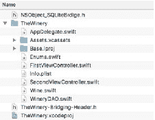
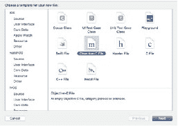
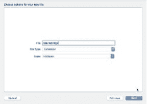
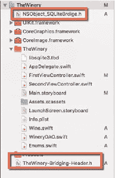
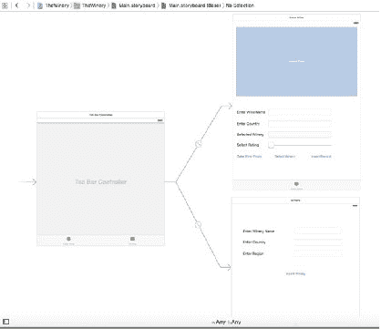
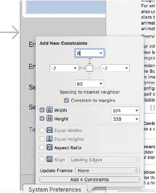
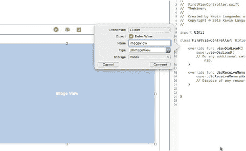

# 第 5 章：插入记录

在本项目范围内，我将直接把`sqlite3`库添加到我的项目中，并手动创建一个桥接文件。

要添加 iOS 支持的 sqlite3 库，请遵循以下步骤：

1.  在**通用设置**（General Settings）标签页中，找到**已链接的框架和库**（Linked Framework and Libraries）部分。
2.  点击“+”按钮，然后在**搜索**（Search）字段中输入`sqlite3`。
3.  选择`libsqlite3.tbd`库。
4.  点击**添加**（Add）按钮，将库添加到你的项目中。
5.  接下来，使用**头文件**（Header File）模板添加一个新的 Objective-C 头文件。
6.  添加一条`#import <sqlite3.h>`语句。
7.  在**构建设置**（Build Settings）下，搜索`Swift`。
8.  在**Objective-C 桥接头文件**（Objective-C Bridge Header）条目下，添加桥接文件的名称，并在前面加上项目文件夹名，除非你将文件放在项目的根目录中（图 5-1）。

 
**图 5-1.** 桥接文件位置

或者，如果你的项目中没有桥接文件，请执行以下操作：

1.  在 **iOS 源代码**（iOS Source）类别下选择 **Objective-C 文件**（Objective-C File）模板（图 5-2）。


**图 5-2.** Objective-C 文件模板

2.  提供一个名称，例如 `SQLiteBridge`（图 5-3）。


**图 5-3.** 名称与文件类型

3.  选择**扩展**（Extension）文件类型，并将类设为 `NSObject`。
4.  点击**下一步**（Next）和**添加**（Add）后，Xcode 将询问你是否要创建一个桥接文件（图 5-4）。


**图 5-4.** 创建桥接文件弹出窗口

5.  当你点击**创建桥接头文件**（Create Bridging Header）按钮时，Xcode 将生成头文件，并自动在**构建设置**（Build Settings）中添加引用（图 5-5）。你可以丢弃 `NSObject_SQLiteBridge.h` 文件，因为它不是必需的。实际的桥接文件是 `TheWinery-Bridging-Header.h`，并且正是这个文件被包含在**Swift 编译器**（Swift Compiler）设置中，用于 Objective-C 头文件映射。


**图 5-5.** Xcode 创建的桥接头文件

## 创建用于插入的 UI 视图

在深入讲解数据模型和控制器之前，我将先构建 UI，并将 `IBOutlet` 和 `IBAction` 添加到 `FirstViewController` 和 `SecondViewController` 中。

在不添加任何其他代码的情况下，你可以直接运行这个应用，并在第一个场景和第二个场景之间测试 Swift。Xcode 通过模板为我们提供了大量的样板代码。

图 5-6 展示了视图控制器和导航控制器的布局，以及我们接下来要添加的组件。


**图 5-6.** Xcode IB 中的酒庄应用 UI

第一个视图控制器将包含以下 UI 组件：

- `UIImageView imageView IBOutlet`
- `UITextField wineNameField IBOutlet`
- `UITextField countryNameField IBOutlet`
- `UISlider wineRating IBAction`
- `UITextField selectWineryField IBOutlet`
- `UIButton InsertRecordAction IBAction`
- `UIButton selectPhoto IBAction`
- `UIButton selectWinery IBAction`
- `UILabel Enter Wine Name`
- `UILabel Enter Country`
- `UILabel Select Winery`

首先，选中 `FirstViewController`，然后从 Xcode 右下角的**组件面板**（Component Pallet）中选择 `ImageViewer`（`UIImageView`），并将其拖放到 IB 画布上。接下来，选择并打开 IB 窗口右下角的**约束**（Constraints）工具，点击顶部和左侧的横梁；同时选中宽度和高度约束（图 5-7）。点击**添加 4 个组件**（Add 4 Components）按钮来设置约束。


**图 5-7.** IB 中 ImageViewer 的约束


继续通过添加标签（`UILabel`）和字段（`UITextField`）来构建布局，如图 5-6 所示。同时添加一个滑块用于设置评分，最后添加三个按钮（`UIButton`）：一个用于拍照，一个用于显示`UIPickerView`（其中包含可能的酒庄列表，该列表需在添加葡萄酒前先填充），另一个用于插入记录。

像之前一样，选择各个组件并设置约束，使其适配目标设备。你需要对`SecondViewController`重复此过程。第二个场景将允许用户向数据库输入新的酒庄。

第二个视图控制器将包含以下元素：

- `UITextField` `EnterWineryField` `IBOutlet`
- `UITextField` `EnterCountryField` `IBOutlet`
- `UITextField` `EnterRegionField` `IBOutlet`
- `UILabel` `Enter Country`
- `UILabel` `Enter Region`

在进入数据模型之前，我们需要为 UI 的`IBOutlet`和`IBAction`元素创建连接。要创建连接，首先选择`FirstViewController`场景并点击身份检查器，这将在 IB 窗口旁打开`FirstViewController`文件（图 5-8）。



图 5-8. 向`FirstViewController`添加`IBOutlet`

选择`imageView`元素，按住 Control 键并将其拖拽到打开的文件中。松开鼠标时，会弹出一个窗口，允许你输入`imageView`元素的名称。点击连接按钮，将创建该属性。

对剩余的`UITextField`重复相同的过程。对于`selectWineryField` `UITextField`，选择属性检查器，并取消选中“只读”字段的“启用”属性。按钮是`IBAction`，因此你需要在连接弹出窗口中执行额外步骤。对于`IBAction`，你需要将连接类型从 outlet 更改为 action。

完成第一个视图控制器的连接后，对第二个视图控制器重复该过程。选择`SecondViewController`并打开对应场景的身份检查器，然后拖放连接。我将在本章后续部分添加逻辑。

**创建数据模型**

创建数据模型需要一系列步骤，这些步骤将在以下各节中概述。

**第 5 章 ■ 插入记录**

**添加酒庄数据库**

搭建好桥梁后，我将添加`Wineries.sqlite`数据库。我将通过`AppDelegate`类中的`didFinishWithOptions`函数创建此数据库。代码随后提供。该模式相当简单，我们在前面的章节中已多次看到此代码。

我通过`FileManager`类的`URLForDirectory`函数，使用`FileManager.SearchPathDirectory.documentDirectory`属性获取文档目录的句柄。然后将`wineries.sqlite`文件名附加到`dbPath`变量，并将此值与指向`sqlite3`数据库引擎的指针一起传递给`sqlite3_open`函数。

每次应用在首次之后运行时，`sqlite3`将简单地打开数据库并建立连接。

```swift
var srcPath:URL = URL.init(fileURLWithPath: "")
var destPath:String = ""
let dirManager = FileManager.default
let projectBundle = Bundle.main
do {
    let resourcePath = projectBundle.path(forResource: "thewinery", ofType: "sqlite")
    let documentURL = try dirManager.urls(for: .documentDirectory, in: .userDomainMask)
    srcPath = URL(fileURLWithPath: resourcePath!)
    destPath = String(describing: documentURL)
    if !dirManager.fileExists(atPath: destPath) {
        try dirManager.copyItem(at: srcPath, to: URL(fileURLWithPath: destPath))
    }
} catch let err as NSError {
    print("Error: \(err.domain)")
}
```

**添加葡萄酒类型**

```swift
import Foundation
class Wine: NSObject {
    var id:Int32 = 0
    var name:String = ""
    var rating:String = ""
    var image:Data = Data()
    var producer:Int32 = 0
    override init(){
    }
}
```

**第 5 章 ■ 插入记录**

**添加酒庄类型**

```swift
import Foundation
public class Wineries:NSObject{
    var id:Int32 = 0
    var name:String = ""
    var country:String = ""
    var region:String = ""
    var volume:Double = 0.0
}
```


```swift
var uom:String = ""

override init(){

}

}
```

## 添加数据库模式

对于模式本身，我将使用一个脚本文件 `wineries.sql`，该文件是通过 iOS 类别下“其他”部分中的“空文件”模板创建的。我添加了以下 SQL 脚本来创建两个表：

• `Wine`
• `Wineries`

```sql
CREATE TABLE IF NOT EXISTS main.wineries(
    id integer primary key autoincrement not null,
    name varchar,
    country varchar,
    region varchar,
    volume float,
    uom varchar
)

CREATE TABLE IF NOT EXISTS main.wine(
    id integer primary key autoincrement not null,
    name varchar,
    rating integer,
    producer_id integer foreign key references wineries(id)
)
```

为了构建用于插入数据的表模式，我将读取文件并使用 `sqlite3_prepare_v2` 函数以及 `sqlite3_step` 和 `sqlite3_finalize` 函数来执行查询。我将在下一节为 `WineryDAO` 控制器类提供执行这些 SQL 脚本的代码。

## 创建控制器

在本节中，我将创建控制器。

### 添加 WineryDAO 类

要创建此类，请从“新建文件”界面中选择 iOS > Source 类别下的 Swift 文件模板。将文件命名为 `WineryDAO` 并将其添加到项目中。在类中，添加 `NSObject` 子类和以下函数：

• `buildSchema`
• `createOrOpenDatabase`
• `insertWineRecord`
• `insertWineryRecord`

类的签名应类似于：

```swift
class WineryDAO: NSObject{}
```

在深入研究此类中的函数之前，我们需要定义一些变量，如下所列。`dbName` 是 SQLite 数据库文件名；`db` 是 SQLite 实例的指针；`sqlStatement` 是 `sqlite3_statement` 实例的指针；`errMsg` 是一个 `UnsafeMutablePointer`，用于捕获 SQLite 抛出的任何操作错误；`sqlite_static` 和 `sqlite_transient` 是 `unsafeBitCast` 指针；`dbPath` 是沙盒中 SQLite 数据库文件的路径；`errStr` 是一个 `String` 变量，用于管理错误消息。

```swift
let dbName:String = "winery.sqlite"
var db:COpaquePointer?=nil
var sqlStatement:COpaquePointer?=nil
var errMsg: UnsafeMutablePointer<UnsafeMutablePointer<Int8>>? = nil
internal let SQLITE_STATIC = unsafeBitCast(0, to:sqlite3_destructor_type.self)
internal let SQLITE_TRANSIENT = unsafeBitCast(-1, to:sqlite3_destructor_type.self)
var dbPath:NSURL = URL()
var errStr:String = ""
```

### `init()` 函数

`init` 函数是 Swift 语言中的标准初始化器。正如您所想象的，它允许程序在创建类的实例并将其加载到内存时设置任何变量。要使用 `init` 函数，您需要重写它。在此类中，我使用 `init` 来确保数据库路径已设置。我本可以也添加 `sqlite3_open` 来实际打开数据库，但我选择将该操作放在其自己的函数中。

还记得我在第 3 章中提到的损坏问题吗？如果您同时多次打开同一个数据库文件（即使用不同的线程），则有损坏数据库的风险。确保没有损坏问题的最安全方法是在每次操作后打开和关闭数据库。另一种方法是使用 `sqlite3_open_v2`，它允许您设置一些附加参数。使用此变体函数，您可以指定数据库将以只读模式还是读/写模式打开，并且可以使用 `SQL_OPEN_FULLMUTEX` 标志以序列化模式打开数据库，这提供了针对文件损坏的最佳保护。另一个多线程选项是 `SQLITE_OPEN_MUTEX`，它也会以多线程模式打开数据库，前提是首次创建数据库时没有设置单线程模式。默认值是 `SQLITE_OPEN_NOMUTIEX`，这是单线程操作。

对于此应用，我将在每次操作时打开和关闭数据库。

```swift
override init() {
    /*
    在 Documents 目录中创建 SQLite Winery.sqlite 数据库
    */
    let dirManager = FileManager.default()
    do {
        let directoryURL = try dirManager.urlForDirectory(FileManager.
```


`FileManager.SearchPathDomainMask.userDomainMask`中的`SearchPathDirectory.documentDirectory`，参数 appropriateFor: nil，create: true)

```swift
dbPath = try! directoryURL.urlByAppendingPathComponent(dbName)
} catch let err as NSError {
    print("Error: \(err.domain)")
}
```

### `buildSchema` 函数

在这款应用中，我想尝试一种不同的方法来构建数据库模式，因此我决定将模式定义添加到一个在应用加载时加载的文件中。此函数从 Resource 目录中获取`.sql`文件，并执行上一节中提供的查询。我使用的是`sqlite3_exec`函数，因为它很好地封装了执行查询所需的不同操作，即`sqlite3_prepare_v2`、`sqlite3_step`和`sqlite3_finalize`。查询执行完毕后，数据库即被关闭。

该函数在应用加载时由`AppDelegate`调用：

```swift
func buildSchema()->Void{
    if let filepath = Bundle.main.pathForResource("wineries", ofType: "sql") {
        do {
            let script = try NSString(contentsOfFile: filepath, usedEncoding: nil) as String
            print(script)
            if sqlite3_open(dbName, &db)==SQLITE_OK {
                if sqlite3_exec(db, script.cString(using: String.Encoding.utf8)!, nil, nil, errMsg) != SQLITE_OK{
                    print(errStr = String (cString: sqlite3_errmsg(db))!)
                }
            }else{
                print("Could not open database " + String(cString.sqlite3_errmsg(db))!)
            }
        } catch let error as NSError {
            print(error.localizedDescription)
        }
    } else {
        print("file not found")
    }
    sqlite3_close(db)
}
```

