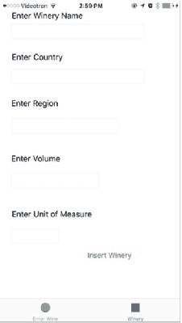
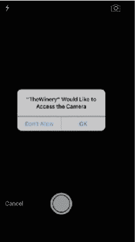
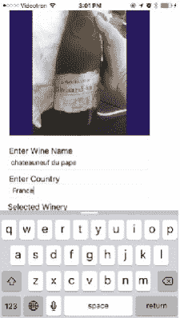

# 函数与视图控制器说明

此函数通过`insertWineryBtn`从`SecondViewController`插入酒庄记录。该函数的模式与插入葡萄酒的函数完全相同，除了绑定列不同，其中包括整数、双精度浮点数以及字符串的绑定值。正如我们之前所见，字符串需要使用`cStringUsingEncoding`属性和`NSUTF8StringEncoding`转换为字符串字符：

```
func insertWineryRecord(_ vintner:Wineries) -> Enums.SQLiteStatusCode {
    let sql:String = "INSERT INTO main.winery VALUES(?, ?, ?, ?, ?)"
    if(sqlite3_open(dbPath.path!, &db)==SQLITE_OK){
        if(sqlite3_prepare_v2(db, sql.cString(using: String.Encoding.utf8)!, -1, &sqlStatement, nil)==SQLITE_OK){
            sqlite3_bind_value(sqlStatement, 1, nil)
            sqlite3_bind_text(sqlStatement, 2, vintner.name.cString(using: String.Encoding.utf8)!, -1, SQLITE_TRANSIENT)
            sqlite3_bind_text(sqlStatement, 3, vintner.country.cString(using: String.Encoding.utf8)!, -1, SQLITE_TRANSIENT)
            sqlite3_bind_text(sqlStatement, 4, vintner.region.cString(using: String.Encoding.utf8)!, -1, SQLITE_TRANSIENT)
            sqlite3_bind_double(sqlStatement, 5, vintner.volume)
            sqlite3_bind_text(sqlStatement, 6, vintner.uom.cString(using: String.Encoding.utf8)!, -1, SQLITE_TRANSIENT)
            sqlite3_step(sqlStatement)
            sqlite3_finalize(sqlStatement)
        }
    }else{
        print(String(cString: sqlite3_errmsg(db))!)
        return Enums.SQLiteStatusCode.error
    }
    sqlite3_close(db)
    return Enums.SQLiteStatusCode.ok
}
```

## `FirstViewController`

所有 iOS UI 都有一个与故事板中场景关联的**视图控制器**。当应用创建时，模板为故事板中的每个场景创建了一个视图控制器。

为了实现`UIImagePickerController`和`UIPickerView`，应用需要实现`UIImagePickerControllerDelegate`、`UIPickerViewDelegate`和`UIPickerViewDataSource`委托和数据源。对于每一个，应用都需要实现一定数量的必需函数，我们稍后会查看这些函数。

从以下代码可以看出，我们实现了一些变量和常量。`imageSelector`变量是`UIImagePickerController`类型，用于呈现`UIImagePicker`，它将使用设备相机作为数据源。`imageData`是一个保存相机图像数据的变量，它是`NSData`类型，在 iOS 平台上处理二进制数据。`dbDAO`是`WineryDAO`的一个实例，应用将使用它与数据库交互。`wine`和`vintner`是表示数据的`Wine`和`Wineries`类的实例。`wineriesArray`是`Wineries`类型的可变数组，此数组是`UIPickerView`的数据源。最后，`IBOutlets`之前已经讨论过，它们是 UI 中的连接。

### 第五章 ■ 插入记录

```
class FirstViewController: UIViewController, UINavigationControllerDelegate, UIImagePickerControllerDelegate, UIPickerViewDelegate, UIPickerViewDataSource {
    var imageSelector: UIImagePickerController!
    var imageData:Data = Data()
    var dbDAO:WineryDAO = WineryDAO()
    var wine: Wine = Wine()
    var wineriesArray = [Wineries]()
    var wineriesPickerView: UIPickerView = UIPickerView()
    var vintnor:Wineries = Wineries()
    @IBOutlet weak var selectWineryField: UITextField!
    @IBOutlet weak var imageView: UIImageView!
    @IBOutlet weak var wineNameField: UITextField!
    @IBOutlet weak var countryNameField: UITextField!
}
```

### 添加拍照功能

正如我们在之前的“创建插入 UI”部分所见，我们需要能够捕获和插入图像（最好是与葡萄酒相关的图像）。我们已经设置了 UI 并添加了`IBActions`，现在需要向`FirstViewController`添加逻辑。

我们首先初始化`imageSelector`对象，将其委托设置为`FirstViewController`，并指定其来源为设备相机。最后，使用`presentViewController`将选取器加载到视图堆栈上：

```
@IBAction func takePhoto(_ sender: AnyObject) {
    imageSelector = UIImagePickerController()
    imageSelector.delegate = self
}
```


`imageSelector.sourceType = .camera`

`present(imageSelector, animated: true, completion: nil)`

`}`

`imagePickerController`函数是图片选择器协议的一部分。它通知代理已选择了一张图片。我们需要调用`dismissViewControllerAnimated`来关闭选择器并返回所选图像，然后将其存储在`imageView.image`属性中：

```
func imagePickerController(_ picker: UIImagePickerController, didFinishPickingMediaWithInfo info: [String : AnyObject]){

    imageSelector.dismiss(animated: true, completion: nil)

    imageView.image = info[UIImagePickerControllerOriginalImage] as? UIImage

    imageData = UIImagePNGRepresentation(imageView.image!)!

}
```

一旦图像存储在`imageView`中，它就会通过`UIImagePNGRepresentation`传递给`imageData`，该函数将`imageView.image`作为参数。图像数据将通过`insertRecordAction`函数传递并存储到数据库中，我们接下来将介绍该函数。

### 添加插入函数

`insertRecordAction`调用`dbDAO`对象，并传入必要的参数以将其插入数据库。该函数使用的大部分数据来自其他函数，并赋值给`Wine`实例类的属性。

```
@IBAction func insertRecordAction(_ sender: AnyObject) {

    dbDAO.insertWineRecord(wine)

}
```

### `viewDidLoad`函数

这个标准的`ViewController`函数在场景加载到视图堆栈后（在本例中，即应用启动时）被调用。该函数提供了一种设置`wineriesPickerView`的途径，包括设置代理并将`wineriesArray`数据源赋值给它。设置完成后，`UIPicker`会作为子视图添加到当前视图控制器中。

```
override func viewDidLoad() {

    super.viewDidLoad()

    //构建数据源
    self.wineriesPickerView.isHidden = true
    self.wineriesPickerView.dataSource = self
    self.wineriesPickerView.delegate = self
    self.wineriesPickerView.frame = CGRect(x:100, y:100, width: 100, height: 162)
    self.wineriesPickerView.backgroundColor = UIColor.black()
    self.wineriesPickerView.layer.borderColor = UIColor.white().cgColor
    self.wineriesPickerView.layer.borderWidth = 1
    self.wineriesArray = dbDAO.selectWineriesList()

    //其他关于数据源和代理的 pickerView 代码
    self.view.addSubview(wineriesPickerView)

}
```

### 添加评分`UISlider`功能

`wineRating`函数管理对`UISlider`的交互。`sender`参数根据用户的选择返回浮点值，然后将该值转换为`Int32`并赋值给`wine.rating`属性：

```
@IBAction func wineRatingSlider(_ sender: AnyObject) {

    let ratingValue:float_t = sender.value
    wine.rating = Int32(ratingValue)

}
```

## `SecondViewController`

第二个视图控制器管理葡萄酒生产商的输入。用户在运行应用时，需要在添加葡萄酒之前先添加酒庄。它比第一个视图控制器简单得多，因为我们只需要处理通过界面定义的五个`UITextField`。我们从`insertWineryBtn`的`IBAction`函数中调用`dbDAO`类的`insertWineryRecord`方法，并传入`UITextField`中的值。我们创建`winery`实例并赋值，然后将该对象作为`insertWineryRecord`方法的唯一参数传递。我们也可以直接传递`UITextField`的值，但后续我需要共享这些值。

```
@IBOutlet weak var wineryNameField: UITextField!
@IBOutlet weak var countryNameField: UITextField!
@IBOutlet weak var regionNameField: UITextField!
@IBOutlet weak var enterVolume: UITextField!
@IBOutlet weak var enterUoM: UITextField!

var dbDAO:WineryDAO = WineryDAO()
var winery:Wineries = Wineries()

@IBAction func insertWineryBtn(_ sender: AnyObject) {

    winery.name = wineryNameField.text!
    winery.country = countryNameField.text!
    winery.region = regionNameField.text!
    winery.volume = Double(enterVolume.text!)!
    winery.uom = enterUoM.text!
    dbDAO.insertWineryRecord(winery)

}

...

}
```


现在只需运行应用并插入一些记录。

## 运行应用

为了结束本章的内容，让我们启动应用。要正确测试本应用及摄像头，你需要将其部署到 iPhone 上。我使用的是 iPhone 6 Plus。要部署到 iPhone，你需要连接手机，在苹果开发者网站上完成配置，然后打开 iPhone 的设置。在"通用"栏目下，找到"设备管理"选项，点击"信任该链接并启用应用以进行开发"。

### 插入记录

最好先从录入酒庄开始，这样在场景一的酒庄选择器中就能有一些可选数据。应用运行后，点击菜单栏中的"酒庄"按钮。

### 录入酒庄

图 5-9 是酒庄场景。输入酒庄名称，然后点击"插入酒庄"按钮。



**图 5-9.** 酒庄场景

### 录入葡萄酒

使用摄像头时，设备会请求访问相机的权限。点击"确定"继续（图 5-10）。



**图 5-10.** 从应用访问相机

当你首次启用相机后，将像往常一样看到相机界面。我拍摄了一张教皇新堡葡萄酒（la fiole du pape）的照片（图 5-11）。点击快门按钮，你可以取消或选择保留照片。如果接受照片，它会显示在 UIImage 查看器中。输入剩余信息，然后点击"插入葡萄酒"按钮。



**图 5-11.** 带图片的葡萄酒信息录入

## 本章小结

本章内容到此结束。我们探索了 SQLite 的 INSERT API，包括 OR 子句。我提供了示例代码来演示如何处理图像、视频和音频文件等二进制数据，并开始构建酒庄应用，该应用将展示 SQLite 中常见的 SQL 增删改查操作。

下一章，我们将继续构建酒庄应用，为其添加 SELECT 操作并测试选择过程。

## SELECT 语句

无论你使用什么平台，`SELECT` 语句都是 SQL 语言的中坚力量，在 SQLite 中也不例外。`SELECT` 语句用于对 SQLite 表或视图执行查询，也用于填充 SQLite 数据库中的视图，这与在其他关系型数据库系统中相同。

本章演示了如何在 Swift 中使用 `SELECT`，通过绑定 SQLite 表中的列数据，并将其赋值给 Swift 数据类型变量。

这些示例展示了如何执行 SELECT 查询来返回文本、数值数据以及音频、图像和视频数据。酒庄应用将改造为使用 `SELECT` 查询，为 `UIPickerView` 显示酒庄列表，并展示数据库中存储的葡萄酒。

在本章中，我们将探讨以下内容：

- `SELECT` 语句语法
- 各种 `SELECT` 使用场景
- 数据类型绑定
- 内层 `SELECT`
- 连接查询
- 内联 `SELECT`
- 为酒庄应用添加 `SELECT` 查询

## 列数据类型

以下是可以用于将 `SELECT` 查询结果赋值给 C 语言变量、Swift 变量或自定义对象属性的数据类型绑定函数列表：

- `sqlite3_column_blob(sqlite3_stmt, int iCol);`
- `sqlite3_column_bytes(sqlite3_stmt, int iCol);`
- `sqlite3_column_bytes16(sqlite3_stmt, int iCol);`
- `sqlite3_column_double(sqlite3_stmt, int iCol);`
- `sqlite3_column_int(sqlite3_stmt, int iCol);`
- `sqlite3_column_int64(sqlite3_stmt, int iCol);`
- `sqlite3_column_text(sqlite3_stmt, int iCol);`
- `sqlite3_column_text16(sqlite3_stmt, int iCol);`
- `sqlite3_column_type(sqlite3_stmt, int iCol);`
- `sqlite3_column_value(sqlite3_stmt, int iCol);`
- `sqlite3_bind_zeroblob(sqlite3_stmt, int, int iCol)`


