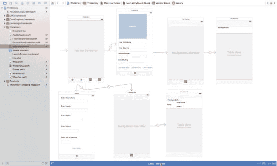
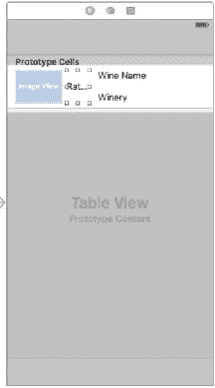
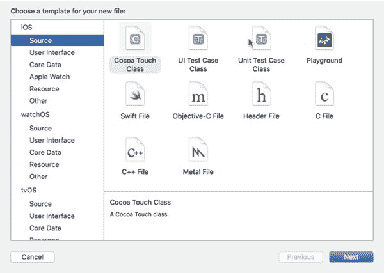
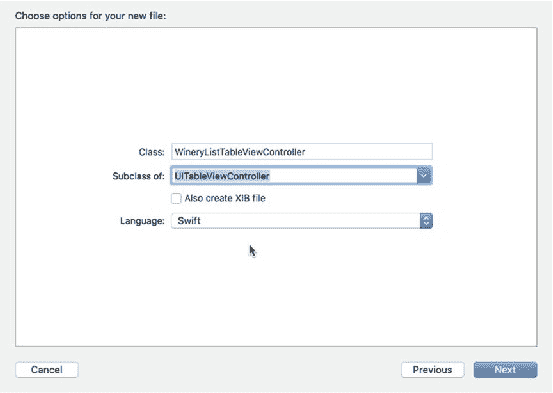
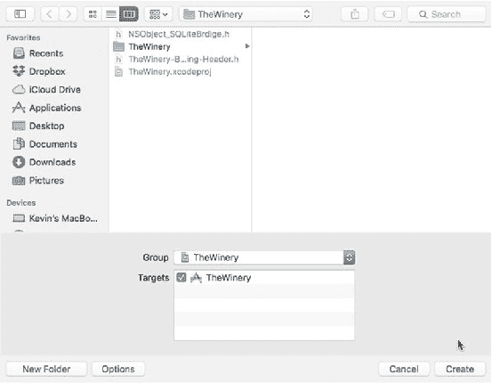

# 第 6 章 ■ 选择记录

```sql
sqlite3_finalize(sqlStatement);
sqlite3_close(db);
```

> **注意** 显然，如果你只是从数据库中检索一个值（就像我们在使用 `WHERE` 子句的例子中看到的那样），你不需要遍历结果集。

### 使用动态 WHERE 子句

下一个用例将演示如何使用 `WHERE` 子句。在 `SELECT` 查询中使用 `WHERE` 子句是 SQL 中的一个强大功能。SQLite 中的 `WHERE` 子句与其他任何数据库平台中的功能并无二致。关键在于如何动态地向 `WHERE` 子句的布尔变量传递值。

基本上，你可以使用两种格式向 `WHERE` 子句的变量传递值。你可以构建一个 `NSString` 字符串，也可以使用字符串格式化器，如下例所示：

```swift
func SelectWhereContactInformation(){

    var contactList = [Person]()

    if(sqlite3_open(dbPath.path!, &db)==SQLITE_OK){

        let sql:String = "Select id, name, address, city, zip,country from contact where name=?";

        if(sqlite3_prepare_v2(db, sql, -1, &sqlStatement, nil) == SQLITE_OK)

        {

            // 为 WHERE 子句输入值，除非你是
            sqlite3_bind_text(sqlStatement, 0, sql, -1, nil);

            // 将表中的每一列绑定到联系人对象的属性名
            while (sqlite3_step(sqlStatement)==SQLITE_ROW) {

                let contact:Person = Person()

                contact.name = String(cString: UnsafePointer<Int8>(sqlite3_column_text(sqlStatement, 0)))!
                contact.address = String(cString: UnsafePointer<Int8>(sqlite3_column_text(sqlStatement, 1)))!
                contact.city = String(cString: UnsafePointer<Int8>(sqlite3_column_text(sqlStatement, 2)))!
                contact.zip = String(cString: UnsafePointer<Int8>(sqlite3_column_text(sqlStatement, 3)))!
                contact.country = String(cString: UnsafePointer<Int8>(sqlite3_column_text(sqlStatement, 4)))!

                contactList.append(contact)
            }
        }
    }

    sqlite3_finalize(sqlStatement);
    sqlite3_close(db);
}
```

在上述代码中，`WHERE` 子句中 `name` 变量的值从 `sqlite3_bind_text` 的值更新而来，该值替换了 `sql: String` 变量中的 "?" 占位符。然后，你通过将 `sql` 查询字符串转换为 UTF-8 格式，将这个字符串传递给 `sqlite3_prepare_v2` 方法，具体如下：`sql.cString (using: String.Encoding.utf8)!`

## 使用子查询执行 SELECT

接下来我想向你展示的例子是如何使用子查询执行 `SELECT`。实际上，子查询是一个 `SELECT` 查询的结果集，你是对这个结果集执行 `SELECT` 查询，而不是对整个表进行查询。

考虑这个基本示例，它展示了子查询的基本语法：

```sql
SELECT id, name, sales, sales_quota, region FROM Sales WHERE id IN
(SELECT id FROM Sales WHERE closed_deals > 10000000)
```

从 Swift 的角度来看，这与普通查询没有区别，你可以像前面的示例一样传递 `WHERE` 表达式的值。然而，将其格式化为 `String` 变量赋值，看起来会是这样：

```swift
let intValue:Int = 1000000
let subquery:String = "SELECT id, name, sales, sales_quota, region FROM Sales WHERE id " +
"IN (SELECT id FROM Sales WHERE closed_deals > \(intValue)"
```

或者你也可以像前面示例中看到的那样绑定值：

```swift
let intValue:Int = 1000000
let subquery:String = "SELECT id, name, sales, sales_quota, region FROM Sales WHERE id " +
"IN (SELECT id FROM Sales WHERE closed_deals > ?"
// sqlite3_prepare_v2 代码
sqlite3_bind_int(sqlStatement, 0, Int32(intValue))
```


### 使用子查询的注意事项

在使用子查询时，有几点规则需要牢记。首先，子查询在`SELECT`子句中只能有一列，除非主`SELECT`中的多列与子查询中的对应列相匹配。其次，子查询必须用括号括起来。第三，子查询中不能包含`ORDER BY`子句，但可以在主`SELECT`中使用`ORDER BY`。第四，返回多行的子查询必须使用多值运算符，如`IN`。最后，`BETWEEN`子句只能在子查询中使用。

---

### 使用连接执行`SELECT`操作

连接是 SQL（更准确地说是关系型数据库）中的一项基本操作，因为我们基于表之间的关系从不同表中查找数据。SQLite 实现连接的方式与其他 SQL 衍生版本类似。在本节中，我们将探讨标准的连接模式或子句。

#### 使用内连接（`INNER JOIN`）

最常见的连接是内连接（`inner join`）。内连接使用匹配键（主键-外键）在两个表之间建立关系。该键不必同名，但必须具有相同的数据类型：

```sql
SELECT c.id, c.name, r.hotel, r.checkin, r.checkout 
FROM customer AS C 
JOIN reservations AS r ON c.id = r.custid
```

你也可以使用`WHERE`子句实现相同的结果：

```sql
SELECT c.id, c.name, r.hotel, r.checkin, r.checkout 
FROM customer AS C 
JOIN reservations AS r WHERE c.id = r.custid
```

#### 使用交叉连接（`CROSS JOIN`）

自然连接（`NATURAL JOIN`）与内连接类似，区别在于自然连接会假设并期望在每个连接表中找到相同的列名，并匹配任意找到的同名列（名称和数据类型均相同）：

```sql
SELECT c.id, c.name, r.hotel, r.checkin, r.checkout 
FROM customer AS C 
NATURAL JOIN reservations AS r
```

#### 使用外连接（`OUTER JOIN`）

使用左外连接（`left outer join`）时，会返回左表（即`FROM`关键字后紧跟的表）中的所有记录，即使右表中没有匹配的记录：

```sql
SELECT c.customerid, c.name, v.visits 
FROM customer AS C 
LEFT JOIN visits AS v ON c.id = v.custid
```

---

### 选择并显示图像

以下示例演示了如何选择图像等二进制数据，并将该二进制数据转换为可在`UIImageView`中显示的`UIImage`数据类型：

```swift
func selectImages(_ filename: String) -> Array<UIImage> {
    var imageArr = [UIImage]()
    if !(sqlite3_open(dbPath.path!, &db) == SQLITE_OK) {
        print("An error has occurred.")
        return imageArr
    } else {
        let sql: String = "SELECT id, filename, image FROM images WHERE filename=?"
        if sqlite3_prepare(db, sql, -1, &sqlStatement, nil) != SQLITE_OK {
            print("Problem with prepared statement")
        } else {
            // WHERE 参数值
            sqlite3_bind_text(sqlStatement, 1, filename, -1, SQLITE_TRANSIENT)
            while sqlite3_step(sqlStatement) == SQLITE_ROW {
                let contact: Person = Person()
                let raw: UnsafePointer = sqlite3_column_blob(sqlStatement, 3)
                let rawLen: Int32 = sqlite3_column_bytes(sqlStatement, 3)
                let data: Data = Data(bytes: raw, count: Int(rawLen))
                // 将二进制数据转换为 UIImage
                contact.avatar = UIImage(data: data)!
                imageArr.append(contact.avatar)
            }
        }
    }
    return imageArr
}
```

---

### 选择并播放音频记录

```swift
func selectAudioWithPlayback(_ selectedFile: String) -> Data {
    var audio: Data = Data()
    let sql: String = "SELECT audioData FROM audios WHERE fileName= \(selectedFile)"
    if sqlite3_open(dbPath.path!, &db) == SQLITE_OK {
        if sqlite3_prepare_v2(db, sql, -1, &sqlStatement, nil) == SQLITE_OK {
            while sqlite3_step(sqlStatement) == SQLITE_ROW {
                let raw: UnsafePointer = sqlite3_column_blob(sqlStatement, 3)
                let rawLen: Int32 = sqlite3_column_bytes(sqlStatement, 3)
                audio = Data(bytes: raw, count: Int(rawLen))
            }
        }
        sqlite3_finalize(sqlStatement)
        sqlite3_close(db)
        return audio
    }
}
```

> **注意**：以下代码仅供演示，不能在此处直接运行。你需要将其放入视图控制器中，并连接到`IBAction`。下方的`self`引用指向该视图控制器。

```swift
func playback(_ selectedAudioFile: NSData) {
    do {
        var audioPlayer = try AVAudioPlayer(data: selectedAudioFile as Data)
        audioPlayer.delegate = self
        audioPlayer.prepareToPlay()
        audioPlayer.play()
    } catch let err as NSError {
        print("Error: \(err.domain)")
    }
}
```

---

### 选择并显示视频记录

选择视频进行播放的流程与图像和音频类似。执行`SELECT`时，使用`BLOB`提取数据，并将二进制数据存储到`NSData`对象中，这些对象可以存储在`NSMutableArray`或`NSDictionary`等容器中。

然而，与图像或音频不同，不能直接将`NSData`对象传递给`MPMoviePlayerController`进行播放。你需要将`NSData`对象转换为视频格式（如`mp4`），方法是将其保存到`Documents`目录下的视频文件中。要将`NSData`保存为`mp4`文件，只需将数据写入扩展名为`.mp4`的文件即可；`NSData`仅是数据的容器，无需进行转换。

或者，你可以将`NSData`存储到`NSString`中，然后将该字符串转换为`NSURL`对象，再使用`initWithContentURL`方法初始化`MPMoviePlayerController`。

---

### 为 Winery App 添加`SELECT`功能

在本节中，我将为 Winery 应用添加`SELECT`功能。该功能包括：在输入葡萄酒时选择酒庄、从数据库中查询并显示葡萄酒列表，以及显示不同酒庄的功能。第三个功能将在后续关于更新记录的章节中增强。让我们从`wineriesPickerView`开始。

#### 添加`SelectWineries`的`UIPicker`

这个小函数用于显示`UIPicker`，以便用户从列表中选择酒庄：

```swift
@IBAction func selectWineryButton(sender: AnyObject) {
    self.wineriesPickerView.isHidden = false
}
```

### `viewDidLoad`函数

这个标准的`ViewController`函数在场景加载到视图栈后执行，或者在当前应用启动时执行。该函数提供了设置`wineriesPickerView`的通道，包括设置代理和分配`wineriesArray`数据源。设置完成后，将`UIPicker`作为子视图添加到当前视图中。

```swift
override func viewDidLoad() {
    super.viewDidLoad()
    // 构建数据源
    self.wineriesPickerView.isHidden = true
    self.wineriesArray = dbDAO.selectWineriesList()
    self.wineriesPickerView.dataSource = self
    self.wineriesPickerView.delegate = self
    self.wineriesPickerView.frame = CGRect(x: 19, y: 243, width: 336, height: 216)
    self.wineriesPickerView.backgroundColor = UIColor.white
    self.wineriesPickerView.layer.borderColor = UIColor.blue.cgColor
    self.wineriesPickerView.layer.borderWidth = 1
    // 其他 pickerView 代码，如 dataSource 和 delegate
    self.view.addSubview(wineriesPickerView)
}
```

#### `UIPickerView`相关函数

以下函数与`UIPickerView`相关。部分函数用于代理，为 UI 组件提供交互功能；其他函数则用于标识列数、标题、数据源，以及确定选中的行。


`numberOfComponentsInPickerView`函数设置`UIPicker`将显示的列数。`pickerView`函数与`numberOfRowsInComponent`参数一起使用，设置`UIPickerView`在其数据源中拥有的行数。通常，此返回值是数据源数组的`count`属性。接下来，`pickerView`函数与`titleForRow`配合使用，显示实际的值列表。`didSelectRow`返回用户选择的项。由于在葡萄酒表中有一个酒庄的外键，我需要通过`vintner.id`值获取酒庄的 ID；这也是数据源中的行 ID。然后，我将`hidden`属性设置为`false`，再次对用户隐藏选择器视图。接下来的两个函数设置行的高度和宽度。最后，`typePickerViewSelected`虽然我在本节中添加了它，但它并非必需函数。相反，它是一个`IBAction`，我定义它以便在用户点击“选择酒庄”按钮时显示`UIPickerView`。

```
func numberOfComponents (_ in pickerView: UIPickerView) -> Int {
    return 1
}

func pickerView(_ pickerView: UIPickerView, numberOfRowsInComponent component: Int) -> Int {
    return wineriesArray.count
}

func pickerView(_ pickerView: UIPickerView, titleForRow row: Int, forComponent component: Int) -> String? {
    vintnor = wineriesArray[row] as Wineries
    let pickernames = vintnor.name
    return pickernames
}

func pickerView(_ pickerView: UIPickerView, didSelectRow row: Int, inComponent component: Int) {
    vintnor = wineriesArray[row] as Wineries
    vintnor.id = Int32(row)
    wineriesPickerView.isHidden = false
}

func pickerView(_ pickerView: UIPickerView, widthForComponent component: Int) -> CGFloat {
    return 300.0
}

func pickerView(_ pickerView: UIPickerView, rowHeightForComponent component: Int) -> CGFloat {
    return 56.0
}

func pickerView(_ pickerView: UIPickerView, didSelectRow row: Int, inComponent component: Int) {
    vintnor = wineriesArray[row] as Wineries
    selectWineryField.text = vintnor.name
    wineriesPickerView.endEditing(true)
    wineriesPickerView.hidden = true
}

func pickerView(_ pickerView: UIPickerView, viewForRow row: Int, forComponent component: Int, reusing view: UIView?) -> UIView {
    let test:UILabel = UILabel()
    let titleData = wineriesArray[row].name
    let myTitle = AttributedString(string: titleData, attributes: [NSFontAttributeName:UIFont(name: "Georgia", size: 15.0)!,NSForegroundColorAttributeName:UIColor.red()])
    test.attributedText = myTitle
    return test
}
```

## `selectWineriesList`函数

此函数将充当`UIPickerView`的数据源，当您在`FirstViewController`中输入“选择酒庄”字段时，该选择器视图会被激活。此函数还将由`UITableViewController`调用，以显示酒庄列表。在打开数据库后（如果尚未打开），`SELECT`查询字符串会被传递给`sqlite3_prepared_v2`函数以及`sqlite3-stmt`指针`sqlStatement`。当存在记录时，即当`sqlite3_step`返回`SQLITE_ROW`时，代码会循环并将返回的值分配给葡萄酒对象的属性。

解绑返回的值需要一些技巧，但只要您知道如何处理返回的数据类型，一切都会顺利进行。`sqlite3_column_int`返回一个`Int32`值。如果需要，您可以通过将`sqlite3_column_int`包装在`Int()`函数中将其转换为`Int`。同样，对于`sqlite3_column_text`，它返回一个`Int8`类型的`UnsafePointer`，您只需将返回的值转换为`Int8`字符，然后通过使用`fromCString`将其转换为`String`，这需要一个`Int8`值。

返回的列是从零开始的，因此`sqlite3`列映射函数中的最后一个参数是您需要返回值的列号。请参见以下内容：

```
func selectWineriesList()->Array<Wineries>{
    var wineryArray = [Wineries]()
    let sql:String = "Select name, country, region, volume, uom from main.winery"
    if(sqlite3_open(dbPath.path!, &db)==SQLITE_OK){
```


好的，作为高级文档工程师和翻译员，我将严格遵循您提供的注意事项和示例格式，将给定的英文文本翻译成中文。


```swift
if(sqlite3_prepare_v2(db, sql, -1, &sqlStatement, nil)==SQLITE_OK){

while(sqlite3_step(sqlStatement)==SQLITE_ROW){

let vintnor:Wineries = Wineries.init()

vintnor.name = String(cString:UnsafePointer<Int8>(sqlite3_column_text(sqlStatement, 0)))!

vintnor.country = String(cString: UnsafePointer<Int8>(sqlite3_column_text(sqlStatement, 1)))!

vintnor.region = String(cString: UnsafePointer<Int8>(sqlite3_column_text(sqlStatement, 2)))!

vintnor.volume = sqlite3_column_double(sqlStatement, 3)

vintnor.uom = String(cString: UnsafePointer<Int8>(sqlite3_column_text(sqlStatement, 4)))!

wineryArray.append(vintnor)

}

}
```

```swift
sqlite3_close(db)

return wineryArray
```

### `selectWineList` 函数

`selectWineList` 函数的作用与之前的函数相同。其一个特殊功能是处理 blob，即存储的图像。为了转换存储的 blob，你需要使用 `NSData`，正如本章前面所述。`NSData` 函数需要以字节形式返回的数据，并且需要知道这些字节的长度。这些值分别存储在 `raw` 和 `rawLen` 变量中。`raw` 变量是一个 `UnsafePointer`，因为这是 `sqlite3_column_blob` 函数的返回类型，而 `rawLen` 是一个 `Int32` 数据类型。然后，你将这两个值传递给 `NSData` 初始化器，该初始化器接着将数据附加到 `wine.image` 属性中。然而，这个值仍然是二进制格式。在本章后面，应用程序会将 `NSData` 转换为 `UIImage`，并显示在 `UIImageView` 中。请参阅以下代码：

```swift
func selectWineList()->Array<Wine>{
    var wineArray = [Wine]()
    let sql:String = "Select name, rating, image, producer from main.wine"

    if(sqlite3_open(dbPath.path!, &db)==SQLITE_OK){
        if(sqlite3_prepare_v2(db, sql.cString(String.Encoding.utf8)!, -1, &sqlStatement, nil)==SQLITE_OK){
            while(sqlite3_step(sqlStatement)==SQLITE_OK){
                let wine:Wine = Wine.init()
                wine.name = String(cString: UnsafePointer<Int8>(sqlite3_column_text(sqlStatement, 1)))!
                wine.rating = sqlite3_column_int(sqlStatement, 2)
                let raw:UnsafePointer = sqlite3_column_blob(sqlStatement, 3);
                let rawLen:Int32 = sqlite3_column_bytes(sqlStatement, 3);
                wine.image = Data(bytes: raw, count: Int(rawLen))
                wine.producer = String(cString: UnsafePointer<Int8>(sqlite3_column_text(sqlStatement, 4)))!
                wineArray.append(wine)
            }
        }
    }
    sqlite3_close(db)
    return wineArray
}
```

### `selectWineryByName` 函数

葡萄酒生产商属性是数据库中的外键，它是一个 `Int32` 值。为了从数据库中获取酒庄名称，以便在 `FirstViewController` 的“所选酒庄”字段中显示，以下函数使用一个包含 `WHERE` 子句的 `SELECT` 语句，通过 ID 来定位记录。我使用 `sqlite3_bind_int` 传递 `WHERE` 子句的值，然后检索返回值，并使用与之前相同的方法将其赋值给 `vintner` 对象的 name 属性。请注意，最后一个参数是 1 而不是 0。这是因为在 `SELECT` 查询中，我请求了两列：ID 和名称。

```swift
func selectWineryByName(name:String)->String{
    let vintnor:Wineries = Wineries.init()
    let sql:String = "Select name from main.winery where name=?"

    if(sqlite3_open(dbPath.path!, &db)==SQLITE_OK){
        if(sqlite3_prepare_v2(db, sql.cString(using: String.Encoding.utf8)!, -1, &sqlStatement, nil)==SQLITE_OK){
            sqlite3_bind_text(sqlStatement, 0, vintner.name.cString(String.Encoding.utf8)!, -1, SQLITE_TRANSIENT)
            if(sqlite3_step(sqlStatement)==SQLITE_OK){
                vintnor.name = String(cString:UnsafePointer<Int8>(sqlite3_column_text(sqlStatement, 1)))!
            }
        }
    }
    sqlite3_close(db)
    return vintnor.name
}
```

## 修改 UI 以显示记录

有了 `SELECT` 查询后，只需将视图控制器添加到 UI 中并将所有内容连接起来即可。该应用程序需要两个 `TableViewControllers` 来显示记录列表。这些需要连接到 `TabBarController`。

图 6-1 直观地展示了为 Winery 应用程序新增的、用于选择和显示功能的设计元素。这些新元素包括：
- 两个表视图控制器
- 两个导航控制器
- 两个 `UITableViewCellControllers`
- 三个用于 WineList 单元原型的 `UILabels` 和五个用于 WineryList 单元原型的 `UILabels`

### 添加 `UITableViewControllers`

我们首先为葡萄酒列表添加 `UITableViewController`，我将其称为“地窖”（Cellar）。选择 `main.storyboard` 将其打开（图 6-1）。从右下角的控件面板中拖拽一个 `UITablewViewController` 到画布上。选中该 `UITableViewController`，然后选择属性检查器，在“Title”字段中输入标题“地窖”。为了将 `TableView` 连接到 `TabBarController`，你首先需要为这个 `TableViewController` 创建一个 `NavigationViewController`。创建 `NavigationViewController` 最简单的方法（除了从控件面板拖拽到画布上之外）是选中它，然后从 Xcode 菜单中选择 **Editor/Embed/Navigation Controller**。



**图 6-1.** 添加了 `TableViewControllers` 的扩展故事板

导航控制器创建后，选中 `TabBarController`，然后拖拽（按住 Control 或 CTRL 键并按下鼠标左键，从 TabBar 拖一条线到导航控制器）一条连接到导航控制器。松开鼠标按钮后，会弹出一个弹出窗口。在这个弹出窗口中，你需要从选项中选择 **ViewControllers**。这将会创建一个与 `TabBarController` 的连接，并会在现有的标签栏上添加一个导航项。你可以通过选中导航控制器并在属性检查器中更改标题值来更改该项的值。我们需要为下一个用于酒庄列表的 `UITableViewController` 重复此过程，该列表也将有一个修改过的 `TableViewCell`。

目前，这个 `UITableViewController` 只需要这么多。我们将在下一节中添加 `TableViewControllers` 和 `TableViewCellController`。

按照上述针对“地窖”的说明创建第二个 `UITableViewController` 后，拖拽两个 `UILabels` 到单元原型上（图 6-2）。如下图中所示，将标签名称分别更改为“葡萄酒”（Wine）和“酒庄”（Winery）。同时，为葡萄酒图像添加一个 `ImageView`。我们将在下一节中添加视图控制器，并创建 `IBOutlets`。



**图 6-2.** 地窖（Cellar）TableView 的单元原型

### 添加导航控制器

最后一步是提供新的 UI 元素与 `SELECT` 函数以及最终的 SQLite 数据库之间的接口。这个接口由 `TableViewControllers` 和一个配置好或连接到相应 UI 元素的 `TableViewCellController` 组成，这些 UI 元素将包含用于显示数据库数据的 `IBOutlets`。

这两个 `TableViewControllers` 的创建方式相同。在 Xcode 的 **File** 菜单中，选择 **New**，然后选择 **File**。在模板选择器中，在 **iOS Source** 类别下选择 **Cocoa Touch Class** 模板（图 6-3）。在下一个屏幕中，在 **Class** 字段中输入 `WineryListTableViewController`。在 **Subclass** 下拉菜单中，选择 `UItableViewController` 类，并保留或选择 **Swift** 语言（图 6-4）。创建类后，Xcode 会将超类的名称附加到类名后面。如图 6-5 所示，点击 **Next** 按钮，在项目中选择位置，然后点击 **Create**。

> **提示：** 你也可以通过在项目导航器中任意位置右键单击并选择 **New File…** 来添加新文件。



**图 6-3.** 选择 Cocoa Touch Class



**图 6-4.** 在 Class 字段中输入 `WineryList`



**图 6-5.** 将文件添加到项目中


