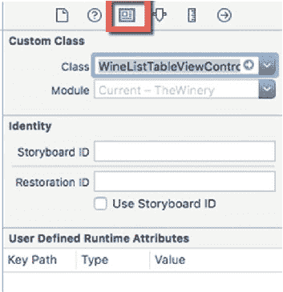
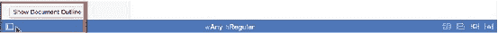

# 第 6 章 ■ 选择记录

**图 6-6.** 连接 TableViewControllers

要选择`TableViewCellController`，请使用 IB 画布左下角的图标展开文档大纲（图 6-7）。选择`TableViewCell`，然后选择标识检查器，并从下拉菜单中选择`WineCellTableViewController`（图 6-8）。

**图 6-7.** 文档大纲选择器

