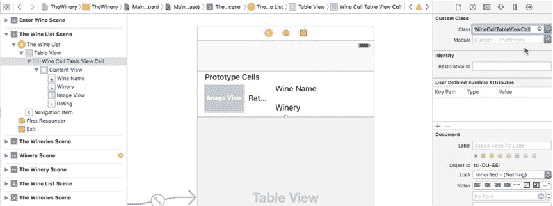
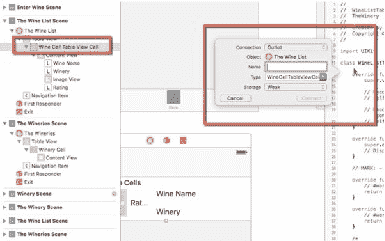

# 第 6 章 ■ 选择记录



**图 6-8.** 连接 TableViewCellController

## 添加 IBOutlets：WineList 控制器

对于`WineList`单元格，展开文档大纲并选择`WineCellTableViewCell`，然后按住 Control 键拖拽连接到助理编辑器（图 6-9）。



**图 6-9.** 创建 WineCell 输出口

接下来，依次选择`ImageView`和`UILabels`，并为每个组件创建`IBOutlets`，分别命名为`wineImgOutlet`、`wineNameOutlet`和`wineryNameOutlet`。

设置好`IBOutlets`后，我们可以添加代码来在场景中显示数据。为了在相应的`UITableViewCell`中显示酒庄信息，我们需要为酒庄名称、国家、地区、容量和计量单位添加`UILabel`。请按照与`WineCellTableViewCell`相同的过程，将它们连接到`WineryCellTableViewCell`。

```
import UIKit

class WineCellTableViewCell: UITableViewCell {

    @IBOutlet weak var wineNameOutlet: UILabel!

    @IBOutlet weak var wineryNameOutlet: UILabel!

    @IBOutlet weak var wineRatingOutlet: UILabel!

    @IBOutlet weak var wineImageOutlet: UIImageView!
}
```

