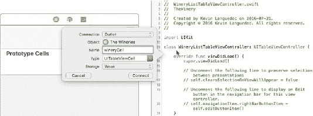

# 第 6 章 ■ 选择记录

同样地，对于`WineryListTableViewController`中的`WineryCell`（图 6-10），添加以下代码：

```
class WineryCellTableViewCell: UITableViewCell {

    @IBOutlet weak var wineryNameOutlet: UILabel!

    @IBOutlet weak var regionOutlet: UILabel!

    @IBOutlet weak var countryOutlet: UILabel!

    @IBOutlet weak var volumeOutlet: UILabel!

    @IBOutlet weak var uomOutlet: UILabel!
}
```



**图 6-10.** WineryCell IBOutlet

### 添加业务逻辑

要从数据库中获取数据并显示在 UI 中，您需要添加一些代码。

#### WineListTableViewController

`WineryListTableViewController`提供了数据库与表格视图单元格控制器之间的接口。对于数据源，我定义了一个葡萄酒数组`wineListArray`。我通过`loadWineList`函数中的`wineDAO`实例对象的`selectWineList`函数来填充该数组。当视图加载时，会通过`UITableViewController`的标准函数`viewDidLoad`调用此函数：

```
var wineListArray = [Wine]()

let wineDAO:WineryDAO = WineryDAO()

func loadWineList(){
    wineListArray = wineDAO.selectWineList()
}
```

