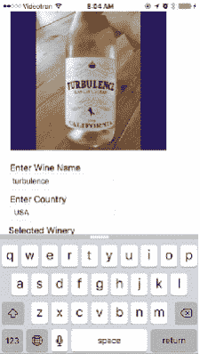
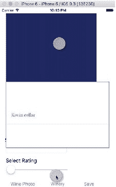
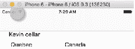

# 第 6 章 ■ 选择记录

```
override func viewDidLoad() {
    super.viewDidLoad()
    loadWineList()
}
```

接下来，您需要告诉控制器表格将有多少个分区，以及数据源将拥有（或显示）多少行。通常，`numberOfSectionsInTableView`返回`1`以表示一个分区。对于行数，您通常返回数组中的元素个数：

```
override func numberOfSections(in tableView: UITableView) -> Int { 
    return 1
}

override func tableView(_ tableView: UITableView, numberOfRowsInSection section: Int) -> Int {
    return wineListArray.count
}
```


要显示表格中的数据，你需要引用之前在`IB`和`WineCellTableViewCell`控制器中设置的单元格。通过将单元格标识符的名称传递给表视图的`dequeueReusableCellIdentifier`属性来实现。然后，将返回值转换为`WineCellTableViewCell`。接着，只需获取数组中的每一行，并将值分配给单元格的`IBOutlets`。对于你在上一个函数中定义的数组中的每一行，此函数会自动调用：

```
override func tableView(_ tableView: UITableView, cellForRowAt indexPath: IndexPath) -> UITableViewCell {
    let cell = tableView.dequeueReusableCell(withIdentifier: "WineCellTableViewCell", for: indexPath) as! WineCellTableViewCell
    // Configure the cell...
    let wine = wineListArray[(indexPath as NSIndexPath).row]
    cell.wineRatingOutlet.text = String(wine.rating)
    cell.wineNameOutlet.text = wine.name
    cell.wineryNameOutlet.text = wine.producer
    cell.wineImageOutlet.image = UIImage.init(data: wine.image as Data)
    return cell
}
```

## `WineryListTableViewController`

要为表格设置数据源，你需要定义一个数组。在示例应用中，我这样写：

```
class WineryListTableViewController: UITableViewController {
    var wineryListArray = [Wineries]()
    let wineDAO: WineryDAO = WineryDAO()
    
    func loadWineList() {
        wineryListArray = wineDAO.selectWineriesList()
    }
    
    override func viewDidLoad() {
        super.viewDidLoad()
        loadWineList()
    }
    
    override func numberOfSections(in tableView: UITableView) -> Int {
        return 1
    }
    
    override func tableView(_ tableView: UITableView, numberOfRowsInSection section: Int) -> Int {
        return wineryListArray.count
    }
}
```

要显示单元格`UILabels`中的各个行，需要设置`cellForRowAt`函数。要引用单元格原型，你需要将`WineryCellTableViewCell`单元格标识符传递给`dequeueReusableCellWithIdentifier`属性，并将表视图单元格转换为`WineryCellTableViewCell`。有了单元格引用后，你需要获取数据源数组中的每一行，并将值分配给单元格中的组件，在我们的例子中，这些组件是之前设置的`IBOutlets`。

```
override func tableView(_ tableView: UITableView, cellForRowAt indexPath: IndexPath) -> UITableViewCell {
    let cell = tableView.dequeueReusableCell(withIdentifier: "WineryCellTableViewCell", for: indexPath) as! WineryCellTableViewCell
    let winery: Wineries = wineryListArray[(indexPath as NSIndexPath).row]
    cell.wineryNameOutlet.text = winery.name
    cell.regionOutlet.text = winery.region
    cell.countryOutlet.text = winery.country
    cell.volumeOutlet.text = String(winery.volume)
    cell.uomOutlet.text = winery.uom
    return cell
}
```

## 运行应用

现在一切都已创建完成，启动应用并连接真实的 iPhone，或者你也可以使用模拟器中的相机（如图 6-11 所示）。



*图 6-11. 照片捕捉*

接下来，选择酒庄和评分，点击保存按钮将其插入数据库记录中（如图 6-12 所示）。

 

*图 6-12. 选择酒庄的`UIPickerView`*

要调用`SELECT`函数并在`UITableViews`中显示数据，请选择标签栏中的`Cellar`或`Vineyard`按钮（如图 6-13 所示）。

 

*图 6-13. 显示记录列表*

## 总结

本章的重点是使用 SQLite`SELECT`语句对 SQLite 数据库进行查询。第一部分是对 API 的概述，并附带了一些示例代码，演示如何在 Swift 中使用`SELECT`。我们还讨论了如何对二进制数据执行`SELECT`查询。

最后，我们将`SELECT`查询的功能添加到`Winery`应用中，以便为`UITableViewControllers`以及`UIPickerView`选择葡萄酒和酒庄。

下一章将探讨 SQLite 中的`UPDATE`语句，我们还会将`UPDATE`功能添加到`Winery`应用中。


